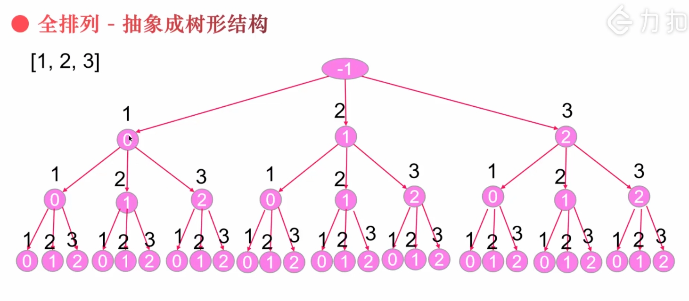

# 回溯

回溯算法实际上一个类似枚举的搜索尝试过程，主要是在搜索尝试过程中寻找问题的解，当发现已不满足求解条件时，就“回溯”返回，尝试别的路径。

用回溯算法解决问题的一般步骤：

- 针对所给问题，定义问题的解空间，它至少包含问题的一个（最优）解。

- 确定易于搜索的解空间结构,使得能用回溯法方便地搜索整个解空间 

- 以深度优先的方式搜索解空间，并且在搜索过程中用剪枝函数避免无效搜索

## 解题思路

做回溯的题，首先要尽量把目标抽象成树，把解题过程转换成如果遍历这个树的过程

如对于例子 `[1,2,3]` ，可以先抽象成以下结构的树，之后再根据具体题意进行解题



回溯是经过修改的深度优先查找方法，过程包括：对一个状态空间树进行深度优先查找，检查每个节点是否满足条件。如果不满足就回溯到该节点的父节点。算法框架(伪代码)如下：

```
result = []
backtrack(路径, 选择列表):
    if 满足结束条件:
        result.add(路径)
        return
    
    for 选择 in 选择列表:
        做选择
        backtrack(路径, 选择列表)
        撤销选择

```

### [46. 全排列](https://leetcode-cn.com/problems/permutations/)

给定一个 没有重复 数字的序列，返回其所有可能的全排列

```
输入: [1,2,3]
输出:
[
  [1,2,3],
  [1,3,2],
  [2,1,3],
  [2,3,1],
  [3,1,2],
  [3,2,1]
]
```

**思路**

以上面的树为例，这个题目就可以转换成，深度且前序遍历该树

如果只是使用深度且前序遍历该树的话，代码如下

```js
  var permute1 = function(nums) {
    let tem = []
    let walk = (n) => {
      if(n === 3){ // 结果条件：到达最后一个节点结束
        return
      }
      for(let i = 0; i<nums.length;i++){
        tem.push(nums[i]) // 前序遍历，所以先保存值
        walk(n+1) // 深度优先，所以递归访问下一个
      }
    }
    walk(0)
    return tem
  };
```

根据题意做些代码改动

```js
/**
 * @param {number[]} nums
 * @return {number[][]}
 */
var permute = function(nums) {
    let result = [] // 遍历完一条路径后，保存这个路径
    let tem = []
    let len = nums.length
    let walk = (n) => {
      if(n === nums.length){ // 结果条件：最后一节点已经结果，出结果
        result.push([...tem])
        return
      }
      for(let i = 0; i<nums.length;i++){
        if(tem.indexOf(nums[i])>-1){  // 一次路径中，如果之前已经存在该值，直接跳过
          continue
        }
        tem.push(nums[i]) // 前序遍历，所以先保存值
        walk() // 深度优先，所以递归访问下一个
        tem.pop() // 回溯，移出最后一个值，表示回到上一层节点
      }
    }
    walk()
    return result
};
```

### [47. 全排列 II](https://leetcode-cn.com/problems/permutations-ii/)

```
给定一个可包含重复数字的序列 nums ，按任意顺序 返回所有不重复的全排列。
示例 1：

输入：nums = [1,1,2]
输出：
[[1,1,2],
 [1,2,1],
 [2,1,1]]
示例 2：

输入：nums = [1,2,3]
输出：[[1,2,3],[1,3,2],[2,1,3],[2,3,1],[3,1,2],[3,2,1]]
```

**思路**

1. 跟上一题不同之处在于现在的 `nums` 存在重复的数，在上一题中我们是使用 `tem.indexOf(nums[i])>-1` 来判断当前这个数是否没有用过，这一题就用不了了，所以得得改用判断当前索引是否有过，这里使用哈希结构来保存当前值的索引是否有用过

    ```js
    /**
     * @param {number[]} nums
     * @return {number[][]}
     */
    var permuteUnique = function(nums) {
        let result = []
        let tem = []
        let map = []
        nums.sort((a, b) => a - b);
        let walk = (n) => {
            if(n === nums.length){
                 result.push([...tem])      
                return
            }
            for(let i = 0; i<nums.length;i++){
                if(map[i]) continue; // 根据索引来判断当前这个数是否有用过
                map[i] = true // 标志当前用过的索引
                tem.push(nums[i])
                walk(n+1)
                tem.pop()
                map[i] = false // 还原当前用过的索引
            }
        }
        walk(0)
        return result
    };
     // permuteUnique([1,1,2]) 输出 [[1,1,2],[1,2,1],[1,1,2],[1,2,1],[2,1,1],[2,1,1]]
    ```

2. 上面解决了数只用一次，但是结果还是会出现重新的队列

```js
/**
 * @param {number[]} nums
 * @return {number[][]}
 */
var permuteUnique = function(nums) {
    let result = []
    let tem = []
    let map = []
    nums.sort((a, b) => a - b);
    let walk = (n) => {
        if(n === nums.length){
             result.push([...tem])      
            return
        }
        for(let i = 0; i<nums.length;i++){
            // 这里有点难理解。。。
            if((nums[i] === nums[i - 1] && map[i - 1]) || map[i]) continue;
            map[i] = true
            tem.push(nums[i])
            walk(n+1)
            tem.pop()
            map[i] = false
        }
    }
    walk(0)
    return result
};
```

通过例子 `[1,1,2]` 来理解 `nums[i] === nums[i - 1] && map[i - 1])` 的意思，首先对应的索引为 `[0,1,2]`

对于索引 `[0,1,2]` 和 `[1,0,2]` 都是表示值 `[1,1,2]`

`nums[i] === nums[i - 1] && map[i - 1])` 这一判断条件则是过滤过 `[0,1,2]`，总是最后一个满足 `[1,2,3]`的索引组合即 `[1,0,2]`

### [78. 子集](https://leetcode-cn.com/problems/subsets/submissions/)

```js
/**
 * @param {number[]} nums
 * @return {number[][]}
 */
var subsets = function(nums) {
     let path = [], res = [];
     let backTrace = (start) => {
        if(path.length > nums.length) return;
        res.push(path.slice()); // 遍历一次就添加一个子集
        for (let i = start; i < nums.length; i++) {
           path.push(nums[i]);
           backTrace(i + 1);
           path.pop()
        }
     }
     backTrace(0);
     return res;
  };
```

### [90. 子集 II](https://leetcode-cn.com/problems/subsets-ii/)

```
给你一个整数数组 nums ，其中可能包含重复元素，请你返回该数组所有可能的子集（幂集）。

解集 不能 包含重复的子集。返回的解集中，子集可以按 任意顺序 排列。

示例 1：

输入：nums = [1,2,2]
输出：[[],[1],[1,2],[1,2,2],[2],[2,2]]
示例 2：

输入：nums = [0]
输出：[[],[0]]
```

**题解**

```js
/**
 * @param {number[]} nums
 * @return {number[][]}
 */
var subsetsWithDup = function(nums) {
    let result = [], tem = []
    let walk = (start) => {
        if(start > nums.length){ 
            return
        }
        result.push([...tem])
        for(let i = start; i<nums.length;i++){
            if(i>start&&nums[i-1]===nums[i]){
                continue
            }
            tem.push(nums[i])
            walk(i+1)
            tem.pop()
        }
    }
    walk(0)
    return result
};
```

重点再于 `if(i>start&&nums[i-1]===nums[i])`

考虑数组 `[1,2,2]`，选择下标`0 1` 和 `0,2`都会得到相同的子集。

也就是说，对于当前选择的数 x，若前面有与其相同的数 y，放弃其中一个的继续遍历

我们可以通过判断这种情况，来避免生成重复的子集。代码实现时，可以先将数组排序；迭代时，若发现没有选择上一个数，且当前数字与上一个数相同，则可以跳过当前生成的子集


https://juejin.cn/post/6887049646988853262#heading-4

https://zhuanlan.zhihu.com/p/54275352