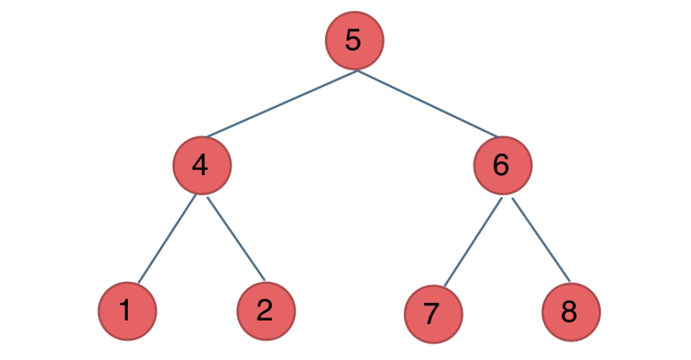
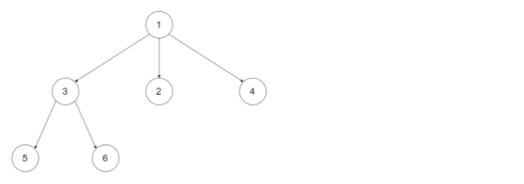
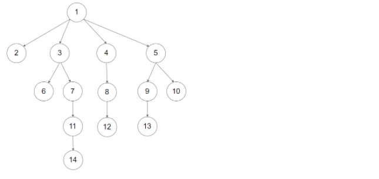

# 二叉树

## 前中后序遍历




以上述中，前中后序遍历顺序如下：

前序遍历（中左右）：5 4 1 2 6 7 8  
中序遍历（左中右）：1 4 2 5 7 6 8  
后序遍历（左右中）：1 2 4 7 8 6 5

### 迭代方式

使用迭代的方式对树进行前序、中序遍历可以使用公式

```js
var preorderTraversal = function(root) {
    let result = []
    let stack = []
    while(root || stack.length){
        while(root){
            result.push(root.val)
            root = root.left
        }
        let pop = stack.pop()
        root = pop.right
    }
    return result
}
```

具体应用到前序、中序遍历时，只是对保存值的位置不一样

#### 前序

```js
// 套公式版
var preorderTraversal = function(root) {
    let result = []
    let stack = []
    while(root || stack.length){
        while(root){
            result.push(root.val)
            stack.push(root)  // 前序时添加值
            root = root.left
        }
        let pop = stack.pop()
        root = pop.right
    }
    return result
}
```

```js
// 不套公式迭代版本
var preorderTraversal = function(root) {
    let result = []
    let stack = root ? [root]: []
    while(stack.length){
        let pop = stack.pop()
        result.push(pop.val)
        pop.right&&stack.push(pop.right)
        pop.left&&stack.push(pop.left)
    }
    return result
}
```

#### 中序

```js
var inorderTraversal = function(root) {
    let stack = []
    let res = []
    while(root || stack.length){
        while(root){
            stack.push(root)
            root = root.left
        }
        let pop = stack.pop()
        res.push(pop.val) // 中序时添加值
        root = pop.right
    }
    return res
};
```


#### 后序

后序也可以使用上面的公式，只是不同有三处  
要注意的事这种遍历方式只是输出的结果看似是后序的，但其实遍历的过程并不符合后序的规则

```js
 var postorderTraversal = function(root) {
     let stack = [], res = []
     while(root||stack.length){
         while(root){
             stack.push(root)
             res.unshift(root.val) // 不同一
             root = root.right  // 不同二
         }
         let pop = stack.pop()
         root = pop.left // 不同三
     }
     return res
};
```

### 递归方式

使用递归方面进行前中后序的遍历比较简单，并且实现都差不多，公式为:

```js
var preorderTraversal = function(root) {
    let result = []
    let walk = (node) => {
        if(!node) return
        walk(node.left)
        walk(node.right)
    }
    walk(root)
    return result
}
```

#### 前序

```js
var preorderTraversal = function(root) {
    let result = []
    let walk = (node) => {
        if(!node) return
        result.push(node.val) // 前序
        walk(node.left)
        walk(node.right)
    }
    walk(root)
    return result
}
```

#### 中序

```js
 var inorderTraversal = function(root) {
    let result = []
    let walk = (node) => {
        if(!node) return
        walk(node.left)
        result.push(node.val) // 中序
        walk(node.right)
    }
    walk(root)
    return result
};
```


#### 后序

```js
 var postorderTraversal = function(root) {
    const res = [];
    let walk = (node) => {
        if(!node) return
        node.left&&walk(node.left)
        node.right&&walk(node.right)
        res.push(node.val) // 后序
    }
    walk(root)
    return res;
};
```

## 深度优先遍历和广州度优先遍历

**深度优先遍历**

深度优先遍历DFS就是树的先序遍历
假设初始状态是图中所有顶点均未被访问，则从某个顶点v出发，首先访问该顶点然后依次从它的各个未被访问的邻接点出发深度优先搜索遍历图，直至图中所有和v有路径相通的顶点都被访问到。若此时尚有其他顶点未被访问到，则另选一个未被访问的顶点作起始点，重复上述过程，直至图中所有顶点都被访问到为止。

深度遍历一：

```js
    var deepTraversal1 = (note, nodeList = []) => {
        if(node) {
            nodeList.push(node)
        }
        const child = node.children
        child.forEach(item => {
            deepTraversal1(item, nodeList)
        })
        return nodeList
    }
```

深度遍历二：

```js
let deepTraversal2 = (node) => {
    let nodes = []
    if (node !== null) {
      nodes.push(node)
      let children = node.children
      for (let i = 0; i < children.length; i++) {
        nodes = nodes.concat(deepTraversal2(children[i]))
      }
    }
    return nodes
  }
```

非递归的非深度遍历三：

```js
 var deepTraversal1 = (node) => {
        let nodeList = []
        let stack = []
        if(node) {
            stack.push(node)
        }
        while (node.length){
            let curNode = node.pop()
            nodeList.push(curNode)
            let child =  nodeList.children
            // 考虑到往curNode添加节点时，是优先添加节点的节点，所以这里倒着循环
            for(let i = child.length - 1; i >= 0; i--) {
                stack.push(child[i])
            }
        }
        return nodeList
    }
```

**广度优先遍历**

广度优先遍历 BFS
从图中某顶点v出发，在访问了v之后依次访问v的各个未曾访问过的邻接点，然后分别从这些邻接点出发依次访问它们的邻接点，并使得“先被访问的顶点的邻接点先于后被访问的顶点的邻接点被访问，直至图中所有已被访问的顶点的邻接点都被访问到。 如果此时图中尚有顶点未被访问，则需要另选一个未曾被访问过的顶点作为新的起始点，重复上述过程，直至图中所有顶点都被访问到为止。

执行方式：

```js
let widthTraversal2 = (node) => {
  let nodes = []
  let stack = []
  if (node) {
    stack.push(node)
    while (stack.length) {
      let item = stack.shift()
      let children = item.children
      nodes.push(item)
      for (let i = 0; i < children.length; i++) {
        stack.push(children[i])
      }
    }
  }
  return nodes
}
```

## 其它算法题

### [589. N 叉树的前序遍历](https://leetcode-cn.com/problems/n-ary-tree-preorder-traversal/)


给定一个 N 叉树，返回其节点值的 前序遍历 。  
N 叉树 在输入中按层序遍历进行序列化表示，每组子节点由空值 null 分隔（请参见示例）。

进阶：  
递归法很简单，你可以使用迭代法完成此题吗?

示例 1：



```
输入：root = [1,null,3,2,4,null,5,6]
输出：[1,3,5,6,2,4]
```

示例 2：



```
输入：root = [1,null,2,3,4,5,null,null,6,7,null,8,null,9,10,null,null,11,null,12,null,13,null,null,14]
输出：[1,2,3,6,7,11,14,4,8,12,5,9,13,10]

```

**解**

```js
/**
 * // Definition for a Node.
 * function Node(val, children) {
 *    this.val = val;
 *    this.children = children;
 * };
 */

/**
 * @param {Node} root
 * @return {number[]}
 */
var preorder = function(root) {
    if(!root) return []
    let stack = [root]
    let res = []
    while(stack.length){
        let pop = stack.pop()
        res.push(pop.val)
        let children = pop.children||[]
        for(let i = children.length-1; i>=0;i--){
            stack.push(children[i])
        }
    }
    return res
};
```

### [543. 二叉树的直径](https://leetcode-cn.com/problems/diameter-of-binary-tree/)

```
给定一棵二叉树，你需要计算它的直径长度。一棵二叉树的直径长度是任意两个结点路径长度中的最大值。这条路径可能穿过也可能不穿过根结点。

 

示例 :
给定二叉树

          1
         / \
        2   3
       / \     
      4   5    
返回 3, 它的长度是路径 [4,2,1,3] 或者 [5,2,1,3]。
```

**解**

```js
var diameterOfBinaryTree = function(root) {
    // 根节点自身的路径长度
    let ans = 1;
    function depth(rootNode) {
        if (!rootNode) {
            return 0;
        }
        let L = depth(rootNode.left);
        let R = depth(rootNode.right);
        ans = Math.max(ans, L + R + 1);
        return Math.max(L, R) + 1;
    }
    depth(root);
    // 由于depth函数中已经默认加上数节点的自身根节点路径了，故此处需减1
    return ans - 1;
};
```