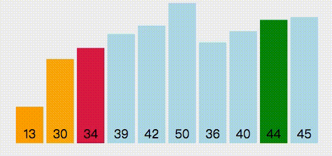
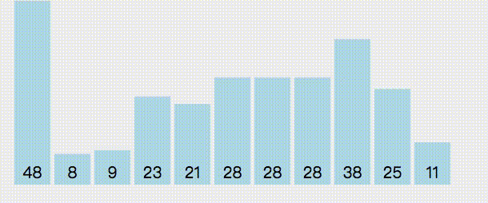
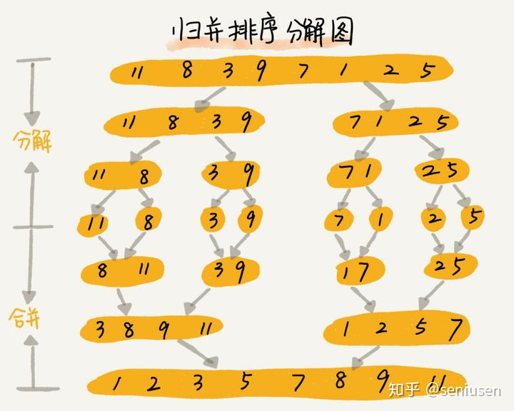

# 简单排序

捋捋基本排序算法

## 选择排序

思路：

1. 第一次循环，第一个位置开始，找出最小元素的位置，然后与第一个位置进行交换

2. 第二次循环，第二个位置开始，在剩余的元素中打出最小元素的元素，然后与第二个位置进行交换

3. 以此类推，遍历到倒数第二个元素



```js
    let count = 0;
    const arr = [1, 20, 10, 30, 22, 11, 55, 24, 31, 88, 12, 40, 50];
    let a = 0
    for(let i = 0; i< arr.length - 1; i++) {
        a = i
        for(let j = i+1; j<arr.length; j ++) {
            if(arr[j] < arr[a]) {
                a = j
            }
            count++
        }
        const tem = arr[i]
        arr[i] = arr[a]
        arr[a] = tem
    }
    console.log('resultArr', arr, count)
    // [1, 10, 11, 12, 20, 22, 24, 30, 31, 40, 50, 55, 88] 78
```

**复杂度**

- 时间复杂度：平均时间复杂度是O(n^2)，这是一个不稳定的算法，因为每次交换之后，它都改变了后续数组的顺序。

- 空间复杂度：辅助空间是常数，空间复杂度为O(1);

## 快速排序

思路：

1. 选择一个数作为参照数，遍历剩余数据，比参数照小的放在参照数的左边，反之后在右边。

2. 然后用同样的方式递归那两个分出来的数据，直接分出来的数组数量为1时，停止循环


```js
	let count = 0;
	const data =  [1, 20, 10, 30, 22, 11, 55, 24, 31, 88, 12, 40, 50];
	function quickSort(arr) {
		if(arr.length <= 1) {
			return arr
        }
		const flag = arr[0]
		const left = []
		const right = []
		for(let i = 1; i< arr.length; i++) {
			if(arr[i] > flag) {
				right.push(arr[i])
			} else {
				left.push(arr[i])
			}
			count += 1
		}
		return quickSort(left).concat([flag], quickSort(right))
	}
	const result = quickSort(data)
	console.log('resultArr', result, count)
   // [1, 10, 11, 12, 20, 22, 24, 30, 31, 40, 50, 55, 88] 41
```

**复杂度**

- 时间复杂度：平均时间复杂度O(nlogn)，只有在特殊情况下会是O(n^2)，不过这种情况非常少

- 空间复杂度：辅助空间是logn，所以空间复杂度为O(logn)

## 冒泡排序

思路： 从第一个元素开始与下一个元素相比较，如果大于下一个元素，则交换两个元素的位置。如此步骤循环整个元素



```js
    let count = 0
    const arr = [1, 20, 10, 30, 22, 11, 55, 24, 31, 88, 12, 40, 50]
    for(let i = 0; i< arr.length - 1; i++) {
		for(let j = 0; j<arr.length - 1 - i; j ++) {
			if(arr[j] > arr[j+1]) {
				const temp = arr[j]
                arr[j] = arr[j+1]
                arr[j+1] = temp
            }
			count++
        }
    }
    console.log('resultArr', arr, count)
   //  [1, 10, 11, 12, 20, 22, 24, 30, 31, 40, 50, 55, 88] 78
```

使得冒泡排序，共循环了78次

**复杂度**

- 时间复杂度：平均时间复杂度是O(n^2)

- 空间复杂度：由于辅助空间为常数，所以空间复杂度是O(1)

### 优化一

以上代码有个缺点就是，无论是排序的数组原来的数据是乱序还是正序，都会执行78次才能结束，
但实际上，只要有某一次的循环未进行数据交换，那么这组数据其实已经是正序的状态，我们就可以结束排序了

```js
  let count = 0;
  const arr = [1, 20, 10, 30, 22, 11, 55, 24, 31, 88, 12, 40, 50]
    for(let i = 0; i< arr.length - 1; i++) {
		let flag = false
		for(let j = 0; j<arr.length - 1 - i; j ++) {
			if(arr[j] > arr[j+1]) {
				const temp = arr[j]
                arr[j] = arr[j+1]
                arr[j+1] = temp
				flag = true
            }
			count++
        }
        if(!flag) {
			break
        }
    }
    console.log('resultArr', arr, count)
   //  [1, 10, 11, 12, 20, 22, 24, 30, 31, 40, 50, 55, 88] 68
```

循环次数减少了10次，如果本来就是正序的话，循环次数就只有数组的个数

### 优化二

记录最后一次交换的位置，因为之后的数都是可以不用排序的，可以不遍历这些数

```js
    let count = 0;
    let last = arr.length
    for(let i = last - 1; i >= 0; i--) {
        let flag = true;
        for(let j =0; j<i; j++) {
            if(arr[j] > arr[j+1]) {
                const tem = arr[j]
                arr[j] = arr[j+1]
                arr[j+1] = tem
                last = j + 1
                flag = false
            }
            count += 1

        }
        if(flag) {
            break
        }
    }
    console.log('arr', arr, count)
  //  [1, 10, 11, 20, 12, 22, 24, 30, 31, 40, 50, 55, 88] 57
```

## 插入排序

1. 第一次遍历，取第二个元素，那么第1个元素就是已经排好的数组，将这个元素插入到已排好的数组中

2. 第二次遍历，取第三个元素，那么第1个元素到第二个元素就是已经排好的数组，将这个元素插入到已排好的数组中

3. 以此类推，直到最后一个元素插入完成


```js
const arr = [1, 20, 10, 30, 22, 11, 55, 24, 31, 88, 12, 40, 50];
let count = 0;
    for(let i = 0; i < arr.length; i++) {
        let temp = arr[i];
        for (let j = 0; j < i; j++) {
            count += 1
            if (temp < arr[j] && j === 0) {
                arr.splice(i, 1);
                arr.unshift(temp);
                break;
            } else if (temp > arr[j] && temp < arr[j + 1] && j < i - 1) {
                arr.splice(i, 1);
                arr.splice(j + 1, 0, temp);
                break;
            }

        }
    }
    console.log('arr', arr, count)
   // [1, 10, 11, 12, 20, 22, 24, 30, 31, 40, 50, 55, 88] 59
```

**复杂度**

- 时间复杂度：平均算法复杂度为O(n^2)

- 空间复杂度：辅助空间为常数，空间复杂度是O(1)


## 归并排序



思路：

1. 将数组从中间切分为两个数组

2. 切分到最小之后，开始归并操作，即合并两个已排序的数组

3. 递归合并的过程，由于是从小到大合并，所以待合并的两个数组总是已排序的，一直做同样的归并操作就可以

```js
function mergeSort(unsorted) {
  function merge(leftArr, rightArr) {
    const lenL = leftArr.length;
    const lenR = rightArr.length;
    let indexL = 0;
    let indexR = 0;
    const result = [];

    while (indexL < lenL && indexR < lenR) {
      if (leftArr[indexL] < rightArr[indexR]) {
        result.push(leftArr[indexL++]);
      } else {
        result.push(rightArr[indexR++]);
      }
    }

    while (indexL < lenL) {
      result.push(leftArr[indexL++]);
    }

    while (indexR < lenR) {
      result.push(rightArr[indexR++]);
    }

    return result;
  }

  function split(array) {
    const len = array.length;

    if (len <= 1) {
      return array;
    }

    const mid = Math.floor(len / 2);

    const leftArr = array.slice(0, mid);
    const rightArr = array.slice(mid, len);

    return merge( split(leftArr), split(rightArr) );
  }

  return split(unsorted);
}

show(mergeSort);

// ------------------------------------------
// Method: mergeSort
// ------------------------------------------
// before:
// 86,55,0,31,104,6,5,49,89,19,6
// after:
// 0,5,6,6,19,31,49,55,86,89,104
```

**复杂度**

选择排序和冒泡排序的时间复杂度都是 O(n^2)，很少用在实际工程中；归并排序的时间复杂度是 O(nlog(n))，是实际工程中可选的排序方案

## Array.sort

[Array.sort](https://developer.mozilla.org/zh-CN/docs/Web/JavaScript/Reference/Global_Objects/Array/sort) 会将元素类型转换成字符串Unicode码点进行排序。不过他是一个高阶函数，可以接受一个函数做为参数。我们可以通过这函数，来调整数组的升序或降序

`Array.sort` 有一个特点就是默认按字符串排序，粟子：

```js
const arr = [1, 20, 10, 30, 22, 11, 55, 24, 31, 88, 12, 100, 50]
arr.sort(); // [1, 10, 100, 11, 12, 20, 22, 24, 30, 31, 50, 55, 88]
```

从上面的结果可以看到因为默认是按字符串排序，所以排出来的结果有问题的

**带函数参数排序**

`Array.sort` 可以接收一个函数参数，`sort` 将根据这个参数函数的返回值（return）进行排序，以 `compareFunction(a, b)` 为例：

- 如果 `return` 小于 0 ，那么 a 会被排列到 b 之前

- 如果 `return` 大于 0 ，那么 a 会被排列到 b 之后

- 如果 `return` 等于 0 ， a 和 b 的位置不变

```js
var arr = [1, 20, 10, 30, 22, 11, 55, 24, 31, 88, 12, 100, 50];
arr.sort(function(a, b){
	 return -(a - b)
 })
// [1, 10, 11, 12, 20, 22, 24, 30, 31, 50, 55, 88, 100]
```

上面只适用于全是数字的数组，如果数组元素包含字符串就不行了

```js
'a'  - 'b' // NaN
```

**含有字符串数组的处理**

字符串是不能相减但是可以比较大小

```js
var arr =  ['wanna', 'take', 'it', 'back', 'and', 'start', 'again'];
arr.sort(function(a, b){
     return a < b ? -1 : 1  
 })
// ["again", "and", "back", "it", "start", "take", "wanna"]
```

**如果是对象元素，可以使用属性进行排序**

```js
var items = [
  { name: 'Edward', value: 21 },
  { name: 'Sharpe', value: 37 },
  { name: 'And', value: 45 },
  { name: 'The', value: -12 },
  { name: 'Magnetic' },
  { name: 'Zeros', value: 37 }
];

// sort by value
items.sort(function (a, b) {
  return (a.value - b.value)
});

// sort by name
items.sort(function(a, b) {
  var nameA = a.name.toUpperCase(); // ignore upper and lowercase
  var nameB = b.name.toUpperCase(); // ignore upper and lowercase
  if (nameA < nameB) {
    return -1;
  }
  if (nameA > nameB) {
    return 1;
  }

  
// names must be equal

  return 0;
});
```
