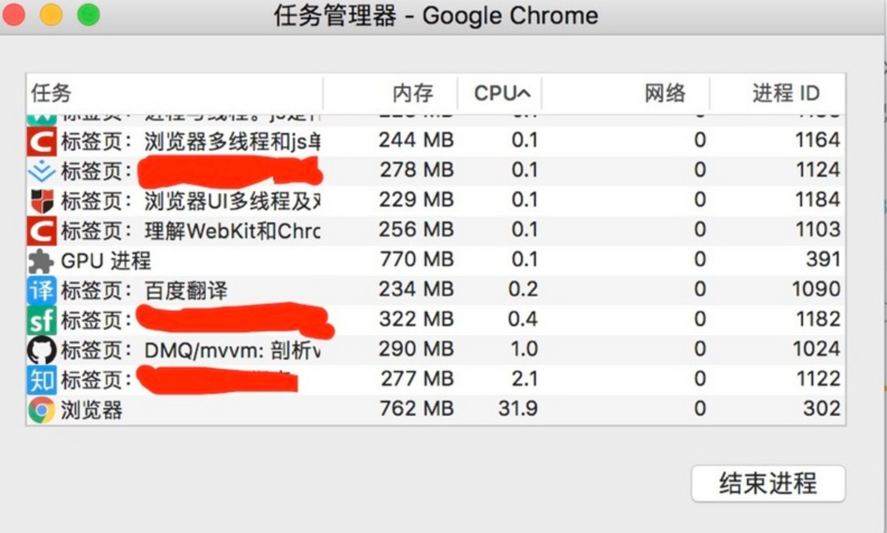
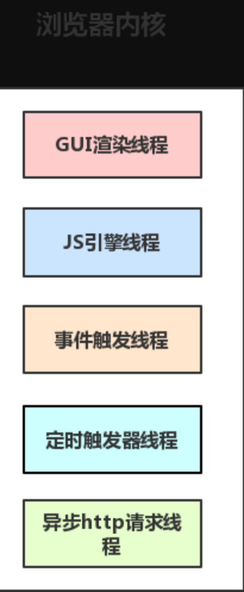

# 浏览器中的进程和线程

在了解浏览器中的进程和线程前先了解一下什么是[进程和线程](../Node/基础/进程和线程.md)

## 浏览器的特点

- 浏览器是多进程的

- 浏览器之所以能够运行，是因为系统给它的进程分配了资源（cpu、内存）

- 简单点理解，每打开一个 Tab 页，就相当于创建了一个独立的浏览器进程。

浏览器是多进程的，有一个主控进程，以及每一个 Tab 页面都会新开一个进程（某些情况下多个 Tab 会合并进程）

如下图：



:::tip
打开 `chrome任务管理器的方法` ：在浏览头部标签页旁边的空白区域，`右键` 就可以弹出有任务管理器的面板.或者 `Chrome的更多工具 -> 任务管理器`
:::

从 `chrome任务管理器` 可以看到浏览器进程可能包括主控进程，插件扩展进程，GPU，tab页（浏览器内核）等等


## 浏览器有哪些进程

浏览器包括进程主要有：

- **Browser进程**：浏览器的主进程（负责协调、主控），只有一个

  - 负责浏览器界面显示，与用户交互。如前进，后退等

  - 负责各个页面的管理，创建和销毁其他进程

  - 将 Renderer 进程得到的内存中的 Bitmap，绘制到用户界面上

  - 网络资源的管理，下载等

- **第三方插件扩展进程**：每种类型的插件对应一个进程，仅当使用该插件时才创建

- **GPU进程**：最多一个，用于处理网页的图形渲染任务

  - CSS动画和过渡：利用GPU加速CSS的动画和过渡效果，使动画更加流畅，不会造成界面卡顿。   
  - WebGL和3D图形：处理WebGL渲染任务，使得网页可以展示复杂的3D图形和动画效果。   
  - 视频解码和播放：部分浏览器利用GPU进行视频内容的解码和播放，特别是高清视频和全屏播放时，使用GPU可以显著提高性能和效率。   
  - 画布（Canvas）渲染：对于Canvas API的2D和WebGL上下文，GPU加速可以提高图形渲染的速度，特别是对于复杂的图像处理和实时图形渲染。   
  - 复杂的布局和滤镜效果：对于复杂的页面布局、滤镜和阴影效果，GPU加速可以提供更快的渲染性能。   
  - 页面合成：浏览器会将页面分成多个层，然后利用GPU来合成这些层，这对于提升滚动、缩放等操作的流畅度非常关键

- **浏览器渲染进程（浏览器内核）（ Renderer 进程，内部是多线程的）**： 可能有多个，默认每个 Tab 页面一个进程，互不影响（有时候会优化，如多个空白 tab 会合并成一个进程）

  控制页面渲染，脚本执行，事件处理等

- **网络进程**

   主要负责页面的网络资源加载，之前是作为一个模块运行在浏览器进程里面的，直至最近才独立出来，成为一个单独的进程
   
**所以，打开一个网页，最少需要四个进程：** 1 个网络进程、1 个浏览器进程、1 个 GPU 进程以及 1 个渲染进程。如果打开的页面有运行插件的话，还需要再加上 1 个插件进程

:::tip
浏览器中打开一个网页相当于新起了一个进程（进程内有自己的多线程）
:::

### 浏览器多进程的优势

相比于单进程浏览器，多进程有如下优点：

- 避免单个 `page crash` 影响整个浏览器

- 避免第三方插件 `crash` 影响整个浏览器

- 多进程充分利用多核优势

- 方便使用沙盒模型隔离插件等进程，提高浏览器稳定性

简单点理解：如果浏览器是单进程，那么某个 Tab 页崩溃了，就影响了整个浏览器，体验有多差；同理如果是单进程，插件崩溃了也会影响整个浏览器

:::tip
当然，开启开进程就意味着内存等资源消耗也会更大，有点空间换时间的意思。
:::

## 渲染进程

作为前端一枚，我们这里重点关注一下 **渲染进程**

可以这样理解，页面的渲染，JS的执行，事件的循环，都在这个进程内进行。

**浏览器的渲染进程是多线程的**，那么接下来看看它都包含了哪些线程（列举一些主要常驻线程）：

- **GUI渲染线程**

  - 负责渲染浏览器界面，解析 HTML，CSS，构建 DOM 树和 RenderObject 树，布局和绘制等。
  
  - 当界面需要重绘（Repaint）或由于某种操作引发回流(reflow)时，该线程就会执行

  - 注意，GUI 渲染线程与 JS 引擎线程是互斥的，当 JS 引擎执行时 GUI 线程会被挂起（相当于被冻结了），GUI 更新会被保存在一个队列中等到 JS 引擎空闲时立即被执行

- **JS引擎线程**

  - 也称为 JS 内核，负责处理 Javascript 脚本程序。（例如V8引擎）

  - JS 引擎线程负责解析 Javascript 脚本，运行代码。

  - JS 引擎一直等待着任务队列中任务的到来，然后加以处理，一个 Tab 页（renderer进程）中无论什么时候都只有一个 JS 线程在运行 JS 程序

  - 同样注意，GUI 渲染线程与 JS 引擎线程是互斥的，所以如果 JS 执行的时间过长，这样就会造成页面的渲染不连贯，导致页面渲染加载阻塞。

- **事件触发线程**

  - 属于浏览器而不是JS引擎，用来控制事件循环；当JS引擎执行代码块如setTimeOut时（也可是来自浏览器内核的其他线程,如鼠标点击、AJAX异步请求等），会将对应任务添加到事件触发线程中；当对应的事件符合触发条件被触发时，该线程会把事件添加到待处理队列的队尾，等待JS引擎的处理

- **定时触发器线程**

  - 传说中的 `setInterval` 与 `setTimeout` 所在线程

  - 浏览器定时计数器并不是由 JavaScript 引擎计数的,（因为JavaScript引擎是单线程的, 如果处于阻塞线程状态就会影响记计时的准确）

  - 因此通过单独线程来计时并触发定时（计时完毕后，添加到事件队列中，等待JS引擎空闲后执行）

  - 注意，W3C 在HTML标准中规定，规定要求setTimeout中低于4ms的时间间隔算为4ms。
  
   **注意：W3C在HTML标准中规定，定时器的定时时间不能小于4ms，如果是小于4ms，则默认为4ms。**

- **异步 `http` 请求线程**
 
  - 在 `XMLHttpRequest` 在连接后是通过浏览器新开一个线程请求

  - 将检测到状态变更时，如果设置有回调函数，异步线程就产生状态变更事件，将这个回调再放入事件队列中。再由 JavaScript 引擎执行。
  
总结如下图：



### GUI渲染线程与JS引擎线程互斥

由于 JavaScript 是可操纵 DOM 的，如果在修改这些元素属性同时渲染界面（即JS线程和UI线程同时运行），那么渲染线程前后获得的元素数据就可能不一致了。

因此为了防止渲染出现不可预期的结果，浏览器设置 GUI 渲染线程与 JS 引擎为互斥的关系，当JS引擎执行时GUI线程会被挂起

GUI更新则会被保存在一个队列中等到 JS 引擎线程空闲时立即被执行。所以，要尽量避免JS执行时间过长，这样就会造成页面的渲染不连贯，导致页面渲染加载阻塞的感觉。

## Browser进程和Renderer进程的通信过程

以浏览器解析 URL 到页面渲染为例：

- Browser 进程收到用户请求，首先需要获取页面内容（譬如通过网络下载资源），随后将该任务通过 RendererHost 接口传递给 Render 进程

- Renderer 进程的 Renderer 接口收到消息，简单解释后，交给渲染线程，然后开始渲染

  - 渲染线程接收请求，加载网页并渲染网页，这其中可能需要 Browser 进程获取资源和需要 GPU 进程来帮助渲染

  - 当然可能会有 JS 线程操作 DOM（这样可能会造成回流并重绘）

- 最后 Render 进程将结果传递给 Browser 进程

- Browser 进程接收到结果并将结果绘制出来

## Q&A

### 什么是异步

- 在主线程外额外开启一个线程去处理任务，所以不会导致主线程的代码阻塞
  
- 不用等待结果的代码

### click是异步的嘛

点击事件本身是同步触发的，但是是当做宏任务处理

### 如何实现浏览器内多个标签页之间的通信

实现多个标签页之间的通信，本质上都是通过中介者模式来实现的。因为标签页之间没有办法直接通信，因此我们可以找一个中介者，让标签页和中介者进行通信，然后让这个中介者来进行消息的转发。通信方法如下：

**1. 使用 `websocket`** 

websocket 协议可以实现服务器推送，所以服务器就可以用来当做这个中介者。标签页通过向服务器发送数据，然后由服务器向其他标签页推送转发

**2. 使用 `ShareWorker`**

`shareWorker` 会在页面存在的生命周期内创建一个唯一的线程，并且开启多个页面也只会使用同一个线程。这个时候共享线程就可以充当中介者的角色。标签页间通过共享一个线程，然后通过这个共享的线程来实现数据的交换

**3. 使用 `localStorage` 的方式**

我们可以在一个标签页对 `localStorage` 的变化事件进行监听，然后当另一个标签页修改数据的时候，我们就可以通过这个监听事件来获取到数据。这个时候 `localStorage` 对象就是充当的中介者的角色

```js
window.addEventListener('storage', function(e) {
 document.querySelector('.my-key').textContent = e.key;
 document.querySelector('.my-old').textContent = e.oldValue;
 document.querySelector('.my-new').textContent = e.newValue;
 document.querySelector('.my-url').textContent = e.url;
 document.querySelector('.my-storage').textContent = e.storageArea;
});
```
  
注意点：

- 在同一个页面内发生的改变不会起作用

— 在相同域名下的其他页面（如一个新标签或 iframe）发生的改变才会起作用

- 在其他域名下的页面不能访问相同的 Storage 对象

