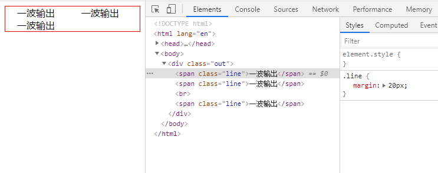
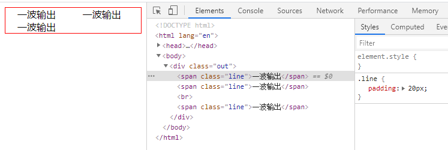
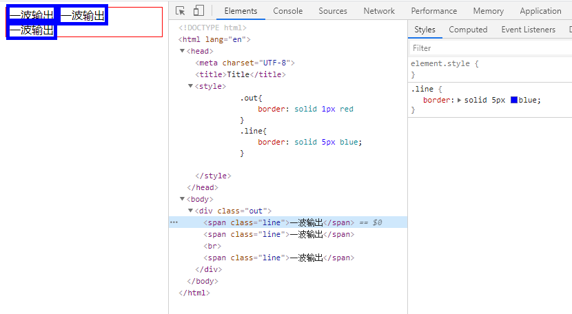

# BFC

一个块格式化上下文（block formatting context） 是Web页面的可视化CSS渲染出的一部分。它是块级盒布局出现的区域，也是浮动层元素进行交互的区域。

它是页面中的一块渲染区域，并且有一套渲染规则，它决定了其子元素将如何定位，以及和其他元素的关系和相互作用

**一个块格式化上下文由以下之一创建：**

- `display: flow-root`

- 内联块 (元素具有 `display: inline-block`)

- 浮动元素 (元素的 `float` 不是 `none`)

- 绝对定位元素 (元素具有 `position` 为 `absolute` 或 `fixed`)

- 具有`overflow` 且值不是 `visible` 的块元素，

- `column-span: all` 应当总是会创建一个新的格式化上下文，即便具有 `column-span: all` 的元素并不被包裹在一个多列容器中。

- 表格标题 (元素具有 `display: table-caption`, HTML表格标题默认属性)

- 表格单元格 (元素具有 `display: table-cell`，HTML表格单元格默认属性)

块格式化上下文对于定位 (参见 float) 与清除浮动 (参见 clear) 很重要。定位和清除浮动的样式规则只适用于处于同一块格式化上下文内的元素。浮动不会影响其它块格式化上下文中元素的布局，并且清除浮动只能清除同一块格式化上下文中在它前面的元素的浮动。

## BFC布局规则特性：

- 在BFC中，盒子从顶端开始垂直地一个接一个地排列

- 子垂直方向的距离由margin决定。属于同一个BFC的两个相邻盒子的margin会发生重叠

- 在BFC中，每一个盒子的左外边缘（margin-left）会触碰到容器的左边缘(border-left)（对于从右到左的格式来说，则触碰到右边缘）。

## BFC的主要用途

- 清除元素内部浮动

  只要把父元素设为BFC就可以清理子元素的浮动了，最常见的用法就是在父元素上设置`overflow: hidden`样式，对于IE6加上 `zoom:1` 就可以了。

- 解决外边距合并问题

  外边距合并的问题

  属于同一个BFC的两个相邻盒子的 `margin` 会发生重叠，那么我们创建不属于同一个 BFC，就不会发生 `margin` 重叠了

- 制作右侧自适应的盒子问题

## BFC总结

BFC就是页面上的一个隔离的独立容器，容器里面的子元素不会影响到外面的元素。因此，有了这个特性我们布局的时候就不会出现意外情况了

## IFC

Inline Formatting Contexts，也就是“内联格式化上下文”。

生成一个IFC的规则：**块级元素中仅包含内联级别元素**

## IFC布局规则

- 子元素水平方向横向排列，并且垂直方向起点为元素顶部。

  这点很好理解，内联元素就是水平排列的

- 子元素只会计算横向样式空间，【`padding`、`border`、`margin`】，垂直方向样式空间不会被计算，【`padding`、`border`、`margin`】

  `margin`：

  
  
  `padding`：
  
  
  
  `border`：
  
  
  
  平时如果不知道这些规则的话，开发遇到时，会觉得莫名其妙

- 在垂直方向上，子元素会以不同形式来对齐（vertical-align）

  [vertical-align-MDN](https://developer.mozilla.org/zh-CN/docs/Web/CSS/vertical-align)
  
- 当 `inline-level boxes` 的总宽度少于包含它们的 `line box` 时，其水平渲染规则由 `text-align` 属性值来决定
  
- IFC中的“line box”一般左右边贴紧其包含块，但 `float` 元素会优先排列。

  这点开发中也用到过，虽然现在已经很久没用 `float` 的属性了
  
- 当一个`inline box` 超过 `line box` 的宽度时，它会被分割成多个 `boxes`，这些 `boxes` 被分布在多个 `line box` 里。如果一个 `inline box` 不能被分割（比如只包含单个字符，或 `word-breaking` 机制被禁用，或该行内框受 `white-space` 属性值为 `nowrap` 或pre的影响），那么这个 `inline box` 将溢出这个 `line box`。

  就是默认情况下文本塞不下时会换行

- 能把在一行上的框都完全包含进去的一个矩形区域，被称为该行的行框（line box）。行框的宽度是由包含块（containing box）和与其中的浮动来决定。

- IFC中的“line box”高度由 CSS 行高计算规则来确定，同个IFC下的多个line box高度可能会不同。

## IFC总结

了解 IFC 的特性可以帮助我们在布局避免踩到一些坑，例如：垂直的 `margin` `padding` 不生效、多个文本元素行高不一致排列混乱等问题

