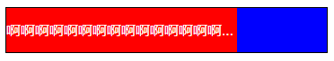
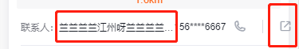

# 样式实现

## 文字环绕图片


```html
<body style="width: 200px; border: solid 1px red;">
    
    已经会了 HTML、CSS、JavaScript？即刻阅读指南开始构建应用！灵活
    不断繁荣的生态系统，可以在一个库和一套完整框架之间自如伸缩。
    高效
    20kB min+gzip 运行大小
    超快虚拟 DOM
    最省心的优化
</body>
```

或

```html
<body style="width: 200px; border: solid 1px red;">
    
    已经会了 HTML、CSS、JavaScript？即刻阅读指南开始构建应用！灵活
    不断繁荣的生态系统，可以在一个库和一套完整框架之间自如伸缩。
    高效
    20kB min+gzip 运行大小
    超快虚拟 DOM
    最省心的优化
</body>
```

- `hspace`: 插入到图像的左侧和右侧的空白像素的值, **废弃属性.使用 CSS 属性 margin 代替**

- `hspace`: 插入到图像的上方和下方的空白像素的数组, **废弃属性.使用 CSS 属性 margin 代替**

- `align`: 图像相对于它周围上下文的对齐,**废弃属性.使用 `float` 和/或 `vertical-align` 这两个 CSS 属性作为代替`**

## 单行超出省略号

```css
white-space: nowrap;
text-overflow: ellipsis;
overflow: hidden;
```

## 多行超出省略号

```css
display: -webkit-box;
-webkit-box-orient: vertical;
-webkit-line-clamp: 3;
overflow: hidden;
```

## background 合并写法

`background: red url('../2.jpg') no-repeat fixed 0 0/ 1000px auto;`

参数从左到右依次是：

- `background-color`

- `background-image`

- `background-repeat`

- `background-attachment` 设置背景图像是否固定或者随着页面的其余部分滚动

  - `scroll`: 默认值，背景图像会随着页面其余部分的滚动而移动

  - `fixed`: 当页面的其余部分滚动时，背景图像不会移动

  - `inherit`: 规定应该从父元素继承` background-attachment` 属性的设置

- `background-position / background-size`

## 一行居中，两行左对齐，三行超出省略号

```css
.out{
    width: 200px;
    border: solid 1px black;
    text-align: center;
}
.inline-blick{
    display: inline-block;
    text-align: left;
}
.in{
    display: -webkit-box;
    -webkit-box-orient: vertical;
    -webkit-line-clamp: 3;
    overflow: hidden;
}
```

```html

<div class="out"> 
    <div class="inline-blick"> 
        <div class="in">
            原则：取大优先，谁设定的宽度值大，则谁生效，如果还有剩余空间，会均分给每列，使每列实际宽度大于设置的宽度
        </div>
    </div>
</div>
```

- 最外层设置 `text-align: center`

- 里层设置为 `display: inline-block;text-align: left;`, 这样在宽度没满前，就是居中对齐了，宽度满后就左对齐了

- 如果还需要实现多行省略号，就在里层再加一个 `div`，添加相关样式

## 如何开启GPU加速

**使用 GPU 渲染元素**

- `transform`

- `opacity`

- `filter`

**强制使用GPU渲染**

```css
.example1 {
  transform: translateZ(0);
}

.example2 {
  transform: rotateZ(360deg);
}
```

## link和@import

- `link` 可以定义RSS、Rel等属性，`@import` 只能用于加载 `css`

  - `rel`: 规定当前文档与被链接文档之间的关系。

- `link` 会同页面一起加载，而 `@import` 要等页面加载完才被加载

- `@import` 要IE5以上才支持

- `link` 可以用js动态加载，而 `@import` 不行

## 去除浮动

-  父元素设置高度或者 `overflow: auto`

- 尾部添加元素并设置 `clear: both`

- 父元素添加伪元素

  ```css
  :after{
   content: '';
   clear: both;
   display: block;
   visibility: hidden; // 非必需，渲染不显示罢了
  }
  ```
  
## 层叠上下文

层叠上下文（stacking context）是HTML中的一个三维概念，一个盒子模型在平面中的布局其实有对应的`x轴`、`y轴`和`z轴`。
平时写样式时，元素都是水平排列或者垂直排列的，即在`x轴`和`y轴`上排列，所以对`z轴`感知不明显。
但是当两个或多个重叠时，就会发现有个元素覆盖在其它元素元素上面

> 如果一个元素含有**层叠上下文**，那么这个元素在`z轴`上就会高人一等，即离屏幕最近。

触发条件

- 根元素(html)本身就属于层叠上下文元素

- 普通元素设置`position != static`，并设有`z-index`

- css3属性：`fiex`

## 盒模型

> CSS合模型常用用的W3C标准盒模型`content-box`和IE盒型`border-box`，还有`padding-box`和`margin-box`（待了解）

一个`html`标签可以理解为一个盒子，一个块盒子由`content`、`padding`、`border`、`margin`组成

- W3C标准盒模型`box-sizing：content-box`

  `width`和`height`等于`content`的宽度和高度

- IE盒模型`box-sizing：border-box`

  `width` = `content`的宽度+padding+border

  `height` = `content`的高度+padding+border

- `padding-box` 

  `// todo`

-`margin-box` 

  `// todo`

## 选择器优先级

`!important` > 行内样式 > `id选择器` > `类选择器` > `tag` > `*` > 继承 > 默认

## flex+文本超出省略号



实现上图效果：蓝色区域固定或者宽度随内容撑开，红色区域占用剩余空间且内容超出来显略号

```html
<div class="flex">
    <div class="item-1 text-ellipsis">
        啊啊啊啊啊啊啊啊啊啊啊啊啊啊啊啊
    </div>
    <div class="item-2"></div>
</div>
```
```css
.flex{
    display: flex;
    border: solid 1px black;
}
.item-1, .item-2{
    color: #fff;
    line-height: 50px;
}
.item-2{
    background: blue;
    width: 100px;
    flex-shrink: 0;
}
.item-1{
    background: red;
}
.text-ellipsis{
    text-overflow: ellipsis;
    overflow: hidden;
    white-space: nowrap;
}
```

**以上相关怪现象**

1. 如果只是使用上面例子并且 '啊啊啊啊啊啊...' 也是直接写上去的，直接在浏览中打开并不会看到省略号效果，但是如果内容变动过能看到效果，例如直接打开调试面板直接修改HTML内容就能看到省略号了，原因不明~，解决方式在该项中添加 `padding` 或者 `margin`属性，如：

```css
.item-1{
    background: red;
    padding: 0 1px;
}
```

2. 如果以上的布局是在另一个 flex 布局中，可能会出现下面这样的问题：



上面例子能出现省略号但是右侧会有超出的怪现象，这是因为名字那块区域使用了 `padding` 或 `margin` 属性，超出的距离就是 `padding` 或 `margin` 的和，解决方式在该项的父级设置 `width: 0`

下面是 DEMO

```html
<div class="flex">
    <div class="flex flex-1">
        <div class="item-1 text-ellipsis">
            啊啊啊啊啊啊啊啊啊啊啊啊啊啊啊啊
        </div>
        <div class="item-2"></div>
    </div>
</div>
```
```css
.flex{
    display: flex;
    border: solid 1px black;
}
.flex-1{
    flex: 1;
}
.item-1, .item-2{
    color: #fff;
    line-height: 50px;
}
.item-2{
    background: blue;
    width: 100px;
    flex-shrink: 0;
}
.item-1{

    background: red;
    padding-right: 20px;
}
.text-ellipsis{
    text-overflow: ellipsis;
    overflow: hidden;
    white-space: nowrap;
}
.item-1-box{
    width: 0; /*这个就是关键属性了*/
}
```

## 分析比较 opacity: 0、visibility: hidden、display: none 优劣和适用场景

- `display: none` - 不占空间，不能点击，会引起回流，子元素不影响

- `visibility: hidden` - 占据空间，不能点击，引起重绘，子元素可设置 visible 进行显示

- `opacity: 0` - 占据空间，可以点击，引起重绘