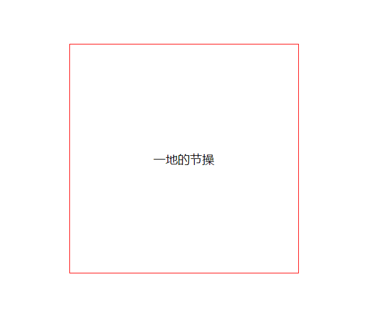
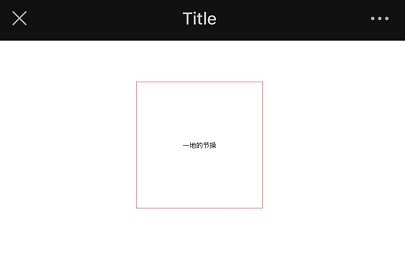
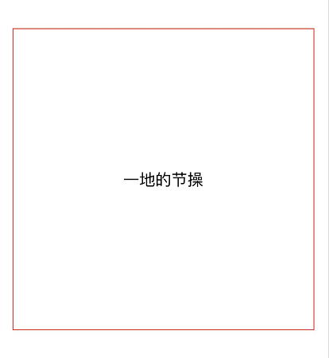
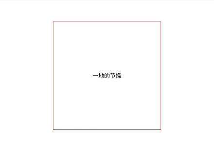

# 1px问题

通过一个粟子来看下什么是 `1px` 问题



上面效果对应的样式：

```css
.box{
  font-size: 20px;
  border: solid 1px red;
  width: 375px;
  height: 375px;
  margin: 10% auto;
  display: flex;
  justify-content: center;
  align-items: center;
}
```

然后用手机看下效果（IPhone X）



发现界面怎么这小？这是因为在移动端，绝大多数情况下 `viewport` 都大于浏览器可视区，以保证 PC 页面在移动浏览器上面的可视性。

这里以 iphone6/7/8 为例：


这里我们会看到，明明屏幕的宽度只有 `375px`，可是 `body` 的宽度却是 `980px`

这就是为什么在手机上看界面效果会明显变小的原因

为了解决这个问题，苹果引入了理想视口的概念，它是对设备来说最理想的布局视口尺寸，所以就有以下代码
         
 ```html
 <meta name="viewport" content="initial-scale=1, maximum-scale=1, minimum-scale=1, user-scalable=no">
 ```



现在可以看到尺寸正常了，但是发现这个边框好像有点粗？ 这就本文要讨论的 **移动端一像素问题**

## 1px问题的原因

开发移动端时会经常看到一个根据 `devicePixelRatio`（设备像素比），简单理解决定了 `1px` 占据多少像素

- `devicePixelRatio=1` 的屏幕下， `1px = 1*1的像素`

- `devicePixelRatio=2` 的屏幕下， `1px = 2*2的像素`

- `devicePixelRatio=3` 的屏幕下， `1px = 3*3的像素`

`1px` 的边框在 `devicePixelRatio=2` 的移动显示屏下会占据 `2*2` 的像素，相当于显示成 `2px`，所以在高清屏（retina）下看着 `1px` 总是感觉变粗了

## 解决方案

**用小数来写px值**

所以为了兼容这些设备的，我们想到的直接方案利用媒体查询，根据不同的 `dpr` 设置不同的 `px值`，比如如果需要有一个 `1px` 的 `border`

```js
.border_1px{
  border-bottom: 1px solid #000;
}
@media only screen and (-webkit-min-device-pixel-ratio:2){
    .border_1px{
       border-bottom: 0.5px solid #000;
    }
}
```

但是上面的 `0.5px` 存在兼容问题，比如在电脑浏览器最低的像素为 `1`，所以 `0.5px` 也是 `1px` ，在有的手机中 `0.5px` 表示为 `0px`

**伪元素 + transform 实现**

使用一个标签或者 `before/after` 代替 `border` 的实现， 在 retina 屏中利用 `transform` 的 `scale` 属性进行缩放

```css
.radius-border{
    position: relative;
}
@media screen and (-webkit-min-device-pixel-ratio: 2){
    .radius-border:before{
        content: "";
        pointer-events: none; /* 防止点击触发 */
        box-sizing: border-box;
        position: absolute;
        width: 200%;
        height: 200%;
        left: 0;
        top: 0;
        border-radius: 8px;
        border:1px solid #999;
        -webkit-transform(scale(0.5));
        -webkit-transform-origin: 0 0;
        transform(scale(0.5));
        transform-origin: 0 0;
    }
}
```

网上还提供类型 `image-border`、使用 `box-shadow` 模拟边框等方便，差不多都是用其它元素代码 `border` 的实现，下面直接给终级解决方案

### viewport+rem

通过设置页面缩放，让 CSS 像素等于真正的物理像素。

例如：当设备像素比为 `3` 时，我们将页面缩放 `1/3` 倍，这时 `1px` 等于一个真正的屏幕像素。

```js
const scale = 1 / window.devicePixelRatio;
const viewport = document.querySelector('meta[name="viewport"]');
if (!viewport) {
    viewport = document.createElement('meta');
    viewport.setAttribute('name', 'viewport');
    window.document.head.appendChild(viewport);
}
viewport.setAttribute('content', 'width=device-width,user-scalable=no,initial-scale=' + scale + ',maximum-scale=' + scale + ',minimum-scale=' + scale);
```

`flexible` 就是采用这种方案。

当然，这样做是要付出代价的，这意味着你页面上所有的布局都要按照物理像素来写。通常我们会使用 `loader` 自动将项目中的 `px` 转换成 `rem` 单位

平时开发移动项目时本人习惯使用 `flexible` + `px2rem-loader` 来处理移动端适配问题



## 总结

`1px` 问题的实际原因是由于不同手机机型的屏幕像素比导致的，使用 `viewport+rem` 就不用担心这个问题啦
