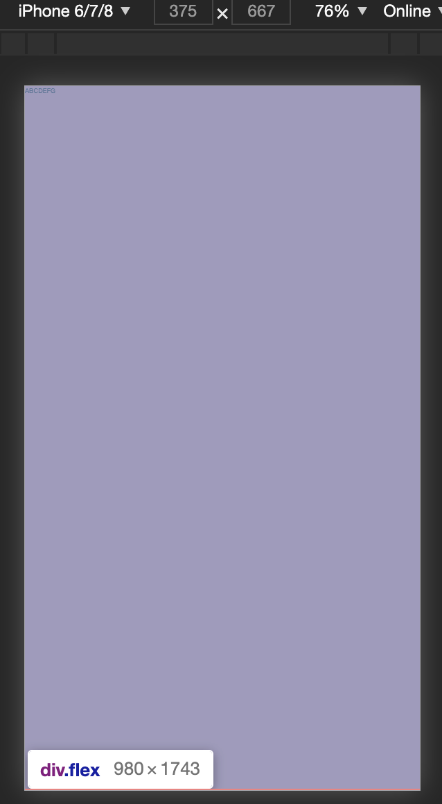

# 移动端适配方案

先理解几个概念

## 视口 viewport

`viewport` 解释为中文就是‘视口’的意思，也就是浏览器中用于显示网页的区域。在 PC 端，其大小也就是浏览器可视区域的大小，所以我们也不会太关注此概念；而在移动端，绝大多数情况下 `viewport` 都大于浏览器可视区，以保证 PC 页面在移动浏览器上面的可视性。

这里以 iphone6/7/8 为例：



这里我们会看到，明明屏幕的宽度只有 `375px`，可是 `body` 的宽度却是 `980px`，那么这个 `980px` 到底是从哪里来的呢？

其实，这里的 `980px` 就是移动端所谓的布局视口了

为了显示出屏幕的真正尺寸，苹果引入了理想视口的概念，它是对设备来说最理想的布局视口尺寸，所以就有以下代码

```html
<meta name ="viewport" content="width=device-width">
```

添加以上代码后，我们重新刷新页面就可以看到屏幕的尺寸变为了 `375 * 667` 与屏幕一致了

然而，这段代码其实也并不完美，在 IE 浏览器中，由于横屏竖屏的切换会对其造成影响，为了解决这个兼容性的问题，最后再加上一句，就有了以下代码：

```html
<meta name='viewport' content='width=device-width,initial-scale=1,user-scale=no' />
```

`initial-scale=1` 的意思是初始缩放的比例是 `1`，使用它的时候，同时也会将布局视口的尺寸设置为缩放后的尺寸。而缩放的尺寸就是基于屏幕的宽度来的

## 设备像素比 dpr

**物理像素（physical pixel）**

手机屏幕上显示的最小单元，该最小单元具有颜色及亮度的属性可供设置，iphone6、7、8 为：`750 * 1334`，iphone6+、7+、8+ 为 `1242 * 2208`

**设备独立像素（density-indenpendent pixel）**

此为逻辑像素，计算机设备中的一个点，css 中设置的像素指的就是该像素。老早在没有 retina 屏之前，设备独立像素与物理像素是相等的。

**设备像素比（device pixel ratio）**

设备像素比(dpr) = 物理像素/设备独立像素。如 iphone 6、7、8 的 `dpr` 为 `2`，那么一个设备独立像素便为 `4` 个物理像素，因此在 css 上设置的 `1px` 在其屏幕上占据的是 `2` 个物理像素，这就是 `1px` 的线条在 retina 屏上变粗的原因

## 移动端适配方案

目前通常使用 `flexible` 配合 `rem` 来做移动端的样式适配

`rem` 是相对于根元素 `html` 的 `font-size` 来做计算得到最终 `px` 值的

```html
html{
    font-size: 100px
}
.app{
    font-size: .5rem // 等于50px
}
```

### 适配原理

为了适配不同屏幕，那么就需要等比例得动态设置我们的尺寸，比如在 `200` 尺寸的屏幕下设置了一个 `15px` 的值，那么当在 `400` 尺寸下时，这个值就需要变成 `30px`

但是动态修改项目中所有的尺寸是不切实际的，所以使用 `rem` 单位时，我们只需要修改 `html` 的 `font-size` 值就可以了

假设设计稿是以 750 为准，我们规定 `html` 的 `font-size` 为 `750/10 = 75(px)`，然后以 `75px` 为基准转换设计搞上的 `px` 单位为 `rem`

最后在线上运行的时候，动态获取屏幕的宽度然后去修改 `html` 的 `font-size` 值，这样就可以达到适配的目的了

目前在实际开发我们通过使用 `webpack` 帮我们动态转换 `px` 单位，这里以 `px2rem-loader` 和 `flexible` 为例

### px2rem-loader

`px2rem-loader` 配置：

```js
{
    test: /\.(css|less)$/,
    use: [
        'css-loader',
        'postcss-loader',
        {
            loader: 'px2rem-loader',
            options: {
                remUnit: 75, // 750的设计稿
                remPrecision: 8, // 保留小数点后几位
            }
        },
        'less-loader'
    ],
},
```

:::tip
使用 `px2rem-loader` 要注意的点是它也会把我们引用第三UI库的样式给转换了，为了避免这种情况，我们可以利用 `include`，`exclude` 排除 `loader`的作用范围
:::

### flexible

**1. 获取当前页面的缩放比例和 `dpr`，如果页面没有 `meta` 标签则添加 `meta` 标签**

```js
    var doc = win.document;
    var docEl = doc.documentElement;
    var metaEl = doc.querySelector('meta[name="viewport"]');
    var flexibleEl = doc.querySelector('meta[name="flexible"]');
    var dpr = 0;
    var scale = 0;
    var tid;
    var flexible = lib.flexible || (lib.flexible = {});
    // 如果页面设置了 meta 将根据已有的meta标签的initial-scale属性的值来设置缩放比例
    if (metaEl) {
        console.warn('将根据已有的meta标签来设置缩放比例');
        var match = metaEl.getAttribute('content').match(/initial\-scale=([\d\.]+)/);
        if (match) {
            scale = parseFloat(match[1]);
            dpr = parseInt(1 / scale);
        }
    } else if (flexibleEl) {
        var content = flexibleEl.getAttribute('content');
        if (content) {
            var initialDpr = content.match(/initial\-dpr=([\d\.]+)/);
            var maximumDpr = content.match(/maximum\-dpr=([\d\.]+)/);
            if (initialDpr) {
                dpr = parseFloat(initialDpr[1]);
                scale = parseFloat((1 / dpr).toFixed(2));
            }
            if (maximumDpr) {
                dpr = parseFloat(maximumDpr[1]);
                scale = parseFloat((1 / dpr).toFixed(2));
            }
        }
    }
    if (!dpr && !scale) {
        var isAndroid = win.navigator.appVersion.match(/android/gi);
        var isIPhone = win.navigator.appVersion.match(/iphone/gi);
        var devicePixelRatio = win.devicePixelRatio;
        if (isIPhone) {
            // iOS下，对于2和3的屏，用2倍的方案，其余的用1倍方案
            if (devicePixelRatio >= 3 && (!dpr || dpr >= 3)) {
                dpr = 3;
            } else if (devicePixelRatio >= 2 && (!dpr || dpr >= 2)){
                dpr = 2;
            } else {
                dpr = 1;
            }
        } else {
            // 其他设备下，仍旧使用1倍的方案
            dpr = 1;
        }
        scale = 1 / dpr;
    }

    docEl.setAttribute('data-dpr', dpr);
    if (!metaEl) { // 如果当前没有设置 meta 标签，则动态添加
        metaEl = doc.createElement('meta');
        metaEl.setAttribute('name', 'viewport');
        metaEl.setAttribute('content', 'initial-scale=' + scale + ', maximum-scale=' + scale + ', minimum-scale=' + scale + ', user-scalable=no');
        if (docEl.firstElementChild) {
            docEl.firstElementChild.appendChild(metaEl);
        } else {
            var wrap = doc.createElement('div');
            wrap.appendChild(metaEl);
            doc.write(wrap.innerHTML);
        }
    }
```


**2.设置 html 的 `font-size`**

```js
 function refreshRem(){
    var width = docEl.getBoundingClientRect().width;
    if (width / dpr > 540) {
        width = 540 * dpr;
    }
    var rem = width / 10;
    docEl.style.fontSize = rem + 'px';
    flexible.rem = win.rem = rem;
}
```

根据 `可视宽度/10` 的值作为根元素 `font-size` 的值

## 总结

移动适配的条件：

1. `meta` 标签设置

2. 使用 `rem` 作为样式单位

3. 动态根据屏幕修改根元素 `html` 的 `font-size` 值 

[深入浅出移动端适配（总结版）](https://juejin.im/post/5d87518f6fb9a06aed715ecf#heading-23)