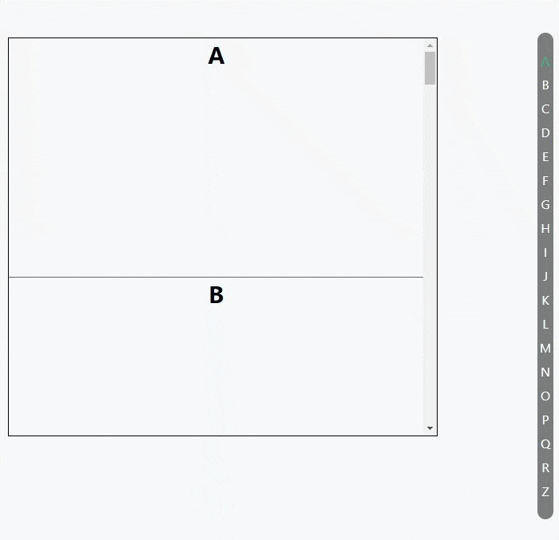

# Intersection Observer API

看下下面的需求场景：

- 图片懒加载——当图片滚动到可见时才进行加载

- 内容无限滚动——也就是用户滚动到接近内容底部时直接加载更多，而无需用户操作翻页，给用户一种网页可以无限滚动的错觉

- 检测广告的曝光情况——为了计算广告收益，需要知道广告元素的曝光情况

- 在用户看见某个区域时执行任务或播放动画

之前为了实现上述功能，需要监听 `scroll` 事件并不断得调用 `Element.getBoundingClientRect()` 方法以获取相关元素的边界信息，这种方式可能会造成性能问题

所以Intersection Observer API提供了一种异步检测目标元素与祖先元素或 viewport 相交情况变化的方法，Intersection Observer API 允许你配置一个回调函数，当以下情况发生时会被调用：

- 每当目标(target)元素与设备视窗或者其他指定元素发生交集的时候执行。设备视窗或者其他元素我们称它为根元素或根(root)

- Observer第一次监听目标元素的时候

## 使用

**创建一个 intersection observer**

```js
let options = {
    root: document.querySelector('#scrollArea'),
    rootMargin: '0px',
    threshold: 1.0
}
let callback =(entries, observer) => {
  entries.forEach(entry => {
    // Each entry describes an intersection change for one observed
    // target element:
    //   entry.boundingClientRect
    //   entry.intersectionRatio
    //   entry.intersectionRect
    //   entry.isIntersecting
    //   entry.rootBounds
    //   entry.target
    //   entry.time
  });
};
let observer = new IntersectionObserver(callback, options);
```

**添加观察元素**

```js
let target = document.querySelector('#listItem');
observer.observe(target);
```

**`options` 配置说明：**

- `root`: 指定根(root)元素，用于检查目标的可见性。必须是目标元素的父级元素。如果未指定或者为null，则默认为浏览器视窗

- `rootMargin`：根(root)元素的外边距。类似于 CSS 中的  `margin` 属性，比如 "10px 20px 30px 40px" (top, right, bottom, left)。可以理解为当观察者接近容器多远时就当做是进入容器区域了

- `threshold`：`target元素` 和 `root元素` 相交程度达到该值的时候触发回调。粟子：

  1. 想要 `target元素` 在 `root元素` 中的可见性超过50%的时候触发回调，可以指定该属性值为0.5

  2. 如果想要 `target元素` 在 `root元素` 的可见程度每多 25% 就执行一次回调，那么你可以指定一个数组`[0, 0.25, 0.5, 0.75, 1]`
  
**`callback` 返回参数说明：**

- entries [IntersectionObserverEntry 对象]：触发回调元素的信息，每个 `IntersectionObserverEntry 对象` 包含以下属性

  - boundingClientRect：目标元素的边界信息，同 `Element.getBoundingClientRect()`
  
  - intersectionRatio：相交程度
  
  - intersectionRect：目标已进入区域的边界信息，相关于目标与 `root元素` 的交集部分的 `boundingClientRect`
  
  - isIntersecting: 目标元素是否进入区域
  
  - rootBounds：`root元素` 的边界信息，同 `root元素.getBoundingClientRect()` 
  
  - target: 当前目标元素
  
  - time：交叉被触发的时间的时间戳
 
- observer：观察者的列表

## 实战例子

使用 `Intersection Observer API` 做的一个滚动索引列表



代码：

```vue
<template>
  <div class="index-num">
    <div v-for="i in list" :key="i" class="item" :class="{'act': act === i}">{{i}}</div>
  </div>
  <div class="scrollBox-box">
    <div class="base" ref="scrollBox">
      <div class="scrollBox" >
        <div v-for="i in list" :key="i" class="item" :alias="i" ref="indexItem">
          {{i}}
        </div>
      </div>
    </div>
  </div>

</template>

<script>
export default {
  name: "IndexList",
  data(){
    return {
      list: ['A', 'B', 'C', 'D', 'E', 'F', 'G', 'H', 'I', 'J', 'K', 'L', 'M', 'N', 'O', 'P', 'Q', 'R', 'Z'],
      act: 'A'
    }
  },
  methods: {
    initInterSectionObserver(){
      console.log('this.$refs.scrollBox', this.$refs.scrollBox)
      if(this.interSectionInstance) return
      let rootDom =this.$refs.scrollBox
      let options = {
        root: rootDom,
        rootMargin: '0px',
        threshold: 0,
      }
      let _this = this
      this.interSectionInstance = new IntersectionObserver(function (entries, observer){
        entries.forEach(entry => {
          console.log('entry', entry)
          if(entry.isIntersecting){
            _this.act = entry.target.getAttribute('alias')
          }
          // Each entry describes an intersection change for one observed
          // target element:
          //   entry.boundingClientRect
          //   entry.intersectionRatio
          //   entry.intersectionRect
          //   entry.isIntersecting
          //   entry.rootBounds
          //   entry.target
          //   entry.time
        });
      }, options);
      (rootDom.querySelectorAll('.item')||[]).forEach(item => {
        this.interSectionInstance.observe(item)
      })

    }
  },
  mounted() {
    this.initInterSectionObserver()
  }
}
</script>

<style scoped lang="scss">
.index-num{
  position: fixed;
  right: 10px;
  top: 50%;
  transform: translateY(-50%);
  background: rgba(0,0,0,0.5);
  width: 20px;
  text-align: center;
  color: #fff;
  padding: 20px 0;
  border-radius: 10px;
  .item{
    line-height: 30px;
  }
  .item.act{
    color: #3eaf7c;
    font-size: 19px;
  }
}

.scrollBox-box{
  width: 80%;
  height: 500px;
  position: relative;
  margin-top: 70px;
  .base{
    //background: red;
    height: 10px;
    z-index: 2;
    width: 100%;
    position: absolute;
  }
}
.scrollBox{
  border: solid 1px #000;
  overflow: auto;
  position: absolute;
  height: 500px;
  width: 100%;
  .item{
    height: 300px;
    font-size: 30px;
    font-weight: bold;
    text-align: center;
    border-bottom: solid 1px #666;
  }
}
</style>
```