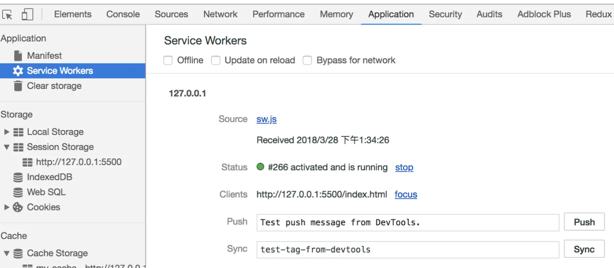
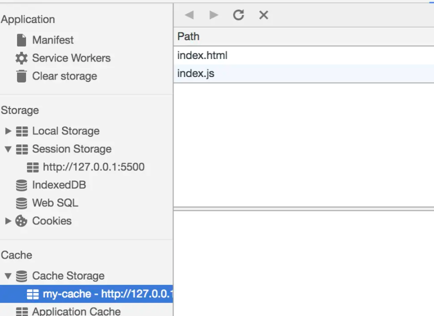

# 各种Worker

- Web Worker

- Share Worker

- Service Worker

## Web Worker

JavaScript 语言采用的是单线程模型，也就是说，所有任务只能在一个线程上完成，一次只能做一件事。前面的任务没做完，后面的任务只能等着。随着电脑计算能力的增强，尤其是多核 CPU 的出现，单线程带来很大的不便，无法充分发挥计算机的计算能力。

Web Worker 的作用，允许在主线程中创建 Worker 线程，将一些任务分配给这个线程运行。在主线程运行的同时，Worker 线程在后台运行，两者互不干扰。

Worker 线程一旦新建成功，就会始终运行，不会被主线程上的活动（比如用户点击按钮、提交表单）打断。这样有利于随时响应主线程的通信。但是，这也造成了 Worker 比较耗费资源，不应该过度使用，而且一旦使用完毕，就应该关闭。

Web Worker 有以下几个使用注意点：

- 同源限制

  分配给 Worker 线程运行的脚本文件，必须与主线程的脚本文件同源

- DOM 限制

   Worker 线程所在的全局对象，与主线程不一样，无法读取主线程所在网页的 DOM 对象，也无法使用`document`、`window`、`parent`这些对象。但是，Worker 线程可以`navigator`对象和`location`对象

- 脚本限制

  Worker 线程不能执行`alert()`方法和`confirm()`方法，但可以使用 `XMLHttpRequest` 对象发出 `AJAX` 请求

- 文件限制

  Worker 线程无法读取本地文件，即不能打开本机的文件系统（file://），它所加载的脚本，必须来自网络

### 基本用法

在浏览器原生提供`Worker()`构造函数，用来供主线程生成 Worker 线程。

```js
var myWorker = new Worker(jsUrl, options)
```

- `jsUrl`: 脚本的网址（必须遵守同源政策），该参数是必需的

- `options`: 配置对象，该对象可选。它的一个作用就是指定 Worker 的名称，用来区分多个 Worker 线程

  ```js
  // 主线程
  var myWorker = new Worker('worker.js', { name : 'myWorker' });
  
  // Worker 线程
  self.name // myWorker
  ```

`Worker()`构造函数返回一个 Worker 线程对象，用来供主线程操作 Worker。Worker 线程对象的属性和方法如下。

- `Worker.onerror`：指定 `error` 事件的监听函数

- `Worker.onmessage`：指定 `message` 事件的监听函数，发送过来的数据在`Event.data`属性中

- `Worker.onmessageerror`：指定 `messageerror` 事件的监听函数。发送的数据无法序列化成字符串时，会触发这个事件。

- `Worker.postMessage()`：向 Worker 线程发送消息

- `Worker.terminate()`：立即终止 Worker 线程

### 例子

创建一个`worker.js`文件

```js
onmessage = function(e) {
    console.log('Worker: Message received from main script', e);
    doWorker()
}
function doWorker(e) {
    if(e.data === 'start') {
        let count = 0
        setInterval(() => {
            console.log('运行中', count)
            postMessage(count++)
        }, 1000)
    } else if(e.data === 'end') {
        close()
    }
}
```

上面定义了`onmessage`方法接收客户端传过来的信息，除了直接定义`onmessage`方法，还可以使用`addEventListener`方法监听传过来的信息

```js
self.addEventListener('message', function (e) {
    console.log('addEventListener: Message received from main script', e);
    doWorker(e)
})
```

效果一样的，他们区别如下：

1. `self.addEventListener`可以定义多个监听事件

2. 定义多个`onmessage`，后面的会覆盖前面的

**在`worker`线程中，`this === self === 当前线程上下文`**

使用`worker.js`

```html
<body>
<button id="start">开始让Worker执行一个任务吧</button>
<div></div>
<button id="end">结束Worker任务</button>
</body>
<script>
    let worker = null
    document.getElementById('start').onclick = function() {
        if (typeof Worker === "undefined") {
            alert('当前浏览器不支持webworker')
        } else {
            worker = new Worker('worker.js')
            worker.postMessage('start');
            worker.onmessage = function (event) {
                document.querySelector('div').innerText=`Worker传过来的信息是：${event.data}`
            }
        }
    }
    document.getElementById('end').onclick = function() {
        if(!worker) return
        worker.postMessage('end');
        worker.terminate();
    }
</script>
```

通过例子可以看到无论在前端脚本中还是`worker`线程，都是使用`postmessage`发送消息，使用`onmessage`接收消息

### 错误监听

主线程可以监听 Worker 是否发生错误。如果发生错误，Worker 会触发主线程的error事件

```js
worker.onerror(function (event) {
  console.log([
    'ERROR: Line ', e.lineno, ' in ', e.filename, ': ', e.message
  ].join(''));
});

// 或者
worker.addEventListener('error', function (event) {
  // ...
});

```

### 关闭 Worker

使用完毕，为了节省系统资源，必须关闭 Worker

- 主线程：`worker.terminate()`

- Worker 线程: `self.close()`

### 传递的数据

前面说过，主线程与 Worker 之间的通信内容，可以是文本，也可以是对象。需要注意的是，这种通信是拷贝关系，即是传值而不是传址，
Worker 对通信内容的修改，不会影响到主线程。事实上，浏览器内部的运行机制是，先将通信内容串行化，然后把串行化后的字符串发给 Worker，
后者再将它还原。

主线程与 Worker 之间也可以交换二进制数据，比如 File、Blob、ArrayBuffer 等类型，也可以在线程之间发送。下面是一个例子。

```js
// 主线程
var uInt8Array = new Uint8Array(new ArrayBuffer(10));
for (var i = 0; i < uInt8Array.length; ++i) {
  uInt8Array[i] = i * 2; // [0, 2, 4, 6, 8,...]
}
worker.postMessage(uInt8Array);

// Worker 线程
self.onmessage = function (e) {
  var uInt8Array = e.data;
  postMessage('Inside worker.js: uInt8Array.toString() = ' + uInt8Array.toString());
  postMessage('Inside worker.js: uInt8Array.byteLength = ' + uInt8Array.byteLength);
};

```

但是，拷贝方式发送二进制数据，会造成性能问题。比如，主线程向 Worker 发送一个 500MB 文件，默认情况下浏览器会生成一个原文件的拷贝。
为了解决这个问题，JavaScript 允许主线程把二进制数据直接转移给子线程，但是一旦转移，主线程就无法再使用这些二进制数据了，
这是为了防止出现多个线程同时修改数据的麻烦局面。这种转移数据的方法，叫做`Transferable Objects`。
这使得主线程可以快速把数据交给 Worker，对于影像处理、声音处理、3D 运算等就非常方便了，不会产生性能负担。

```js
// Transferable Objects 格式
worker.postMessage(arrayBuffer, [arrayBuffer]);

// 例子
var ab = new ArrayBuffer(1);
worker.postMessage(ab, [ab]);
```
### 同页面的 Web Worker

通常情况下，Worker 载入的是一个单独的 JavaScript 脚本文件，但是也可以载入与主线程在同一个网页的代码。

```js
<script id="worker" type="app/worker">
      addEventListener('message', function () {
        postMessage('some message');
      }, false);
</script>
```
上面是一段嵌入网页的脚本，注意必须指定`<script>`标签的`type = app/worker`

然后，读取这一段嵌入页面的脚本，用 Worker 来处理。

```js
var blob = new Blob([document.querySelector('#worker').textContent]);
var url = window.URL.createObjectURL(blob);
var worker = new Worker(url);

worker.onmessage = function (e) {
  // e.data === 'some message'
};

```

在加载这个 Worker 时先将嵌入网页的脚本代码，转成一个二进制对象，然后为这个二进制对象生成 URL，再让 Worker 加载这个 URL。
这样就做到了，主线程和 Worker 的代码都在同一个网页上面

完整例子如下：

```html
<!DOCTYPE html>
<html lang="en">
<head>
    <meta charset="UTF-8">
    <title>Title</title>
</head>
<body>
<button id="start">开始让Worker执行一个任务吧</button>
<div></div>
<button id="end">结束Worker任务</button>
</body>
<script id="worker" type="app/worker">
    function doWorker(e) {
        if(e.data === 'start') {
            let count = 0
            setInterval(() => {
                postMessage(count++)
            }, 1000)
        } else if(e.data === 'end') {
            close()
        }
    }
    self.addEventListener('message', function (e) {
        console.log('addEventListener: Message received from main script', e);
        doWorker(e)
    })
</script>
<script>
    let worker = null
    document.getElementById('start').onclick = function() {
        if (typeof Worker === "undefined") {
            alert('当前浏览器不支持webworker')
        } else {
            var blob = new Blob([document.querySelector('#worker').textContent]);
            var url = window.URL.createObjectURL(blob);
            worker = new Worker(url)
            worker.postMessage('start');
            worker.onmessage = function (event) {
                document.querySelector('div').innerText=`Worker传过来的信息是：${event.data}`
            }
        }
    }
    document.getElementById('end').onclick = function() {
        if(!worker) return
        worker.postMessage('end');
        worker.terminate();
    }
</script>
</html>
```

## ShareWorker

SharedWorker 接口代表一种特定类型的 worker，可以从几个浏览上下文中访问，例如几个窗口、iframe 或其他 worker，使用 ShareWorker 可以让我们多个页面同时控制一个脚本，这个脚本运行在独立的进程中，我们可以借用 ShareWorker 实现页面之间的通信和数据共享

**使用的页面和 worker.js 必需是同源的**

### 使用

```js
// worker.js
var clients = [];
onconnect = function(e) {
    var port = e.ports[0];
    clients.push(port);
    port.addEventListener('message', function(e) {
        for (var i = 0; i < clients.length; i++) {
            var eElement = clients[i];
            eElement.postMessage(e.data)
        }
    });
    port.start();
}
```

```html
<!--page1.html-->
<!DOCTYPE html>
<html lang="en">

<head>
    <meta charset="UTF-8">
    <meta name="viewport" content="width=device-width, initial-scale=1.0">
    <meta http-equiv="X-UA-Compatible" content="ie=edge">
    <title>Document</title>
</head>
<button>发送</button>
<div></div>
<body>
<script>
    let testData = 0
    // 这段代码是必须的，打开页面后注册SharedWorker，显示指定worker.port.start()方法建立与worker间的连接
    if (typeof Worker === "undefined") {
        alert('当前浏览器不支持webworker')
    } else {
        let worker = new SharedWorker('worker.js?type=1')
        worker.port.addEventListener('message', (e) => {
            console.log('来自worker的数据：', e.data)
            document.querySelector('div').innerText = e.data
        }, false)
        worker.port.start()
        window.worker = worker
    }
    // 获取和发送消息都是调用postMessage方法，我这里约定的是传递'get'表示获取数据。
    document.querySelector('button').onclick = function() {
        window.worker.port.postMessage(testData++)
    }
</script>
</body>

</html>
```

```html
<!--page2.html-->
<!DOCTYPE html>
<html lang="en">

<head>
    <meta charset="UTF-8">
    <meta name="viewport" content="width=device-width, initial-scale=1.0">
    <meta http-equiv="X-UA-Compatible" content="ie=edge">
    <title>Document</title>
</head>
<button>发送</button>
<div></div>
<body>
<script>
    let testData = 10000
    // 这段代码是必须的，打开页面后注册SharedWorker，显示指定worker.port.start()方法建立与worker间的连接
    if (typeof Worker === "undefined") {
        alert('当前浏览器不支持webworker')
    } else {
        let worker = new SharedWorker('worker.js?type=1')
        worker.port.addEventListener('message', (e) => {
            console.log('来自worker的数据：', e.data)
            document.querySelector('div').innerText = e.data
        }, false)
        worker.port.start()
        window.worker = worker
    }
    // 获取和发送消息都是调用postMessage方法，我这里约定的是传递'get'表示获取数据。
    document.querySelector('button').onclick = function() {
        window.worker.port.postMessage(testData--)
    }
</script>
</body>

</html>
```

无论哪个页面触发了发送按钮，两个页面都将收到通信


## Service Worker

Service Worker 是运行在浏览器背后的独立线程，一般可以用来实现缓存功能。使用 Service Worker的话，传输协议必须为 HTTPS。因为 Service Worker 中涉及到请求拦截，所以必须使用 HTTPS 协议来保障安全

Service Worker 实现缓存功能一般分为三个步骤：首先需要先注册 Service Worker，然后监听到 install 事件以后就可以缓存需要的文件，那么在下次用户访问的时候就可以通过拦截请求的方式查询是否存在缓存，存在缓存的话就可以直接读取缓存文件，否则就去请求数据。以下是这个步骤的实现:

```js
// index.js
if (navigator.serviceWorker) {
  navigator.serviceWorker
    .register('sw.js')
    .then(function(registration) {
      console.log('service worker 注册成功')
    })
    .catch(function(err) {
      console.log('servcie worker 注册失败')
    })
}
// sw.js
// 监听 `install` 事件，回调中缓存所需文件
self.addEventListener('install', e => {
  e.waitUntil(
    caches.open('my-cache').then(function(cache) {
      return cache.addAll(['./index.html', './index.js'])
    })
  )
})
// 拦截所有请求事件
// 如果缓存中已经有请求的数据就直接用缓存，否则去请求数据
self.addEventListener('fetch', e => {
  e.respondWith(
    caches.match(e.request).then(function(response) {
      if (response) {
        return response
      }
      console.log('fetch source')
    })
  )
})

```

打开页面，可以在开发者工具中的 Application 看到 Service Worker 已经启动了：



在 Cache 中也可以发现所需的文件已被缓存：

