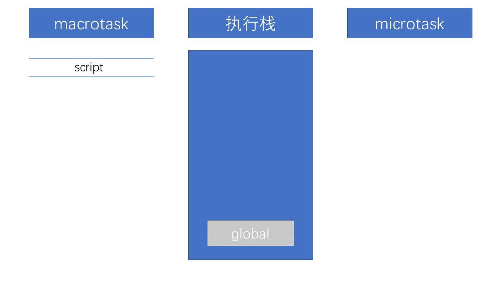
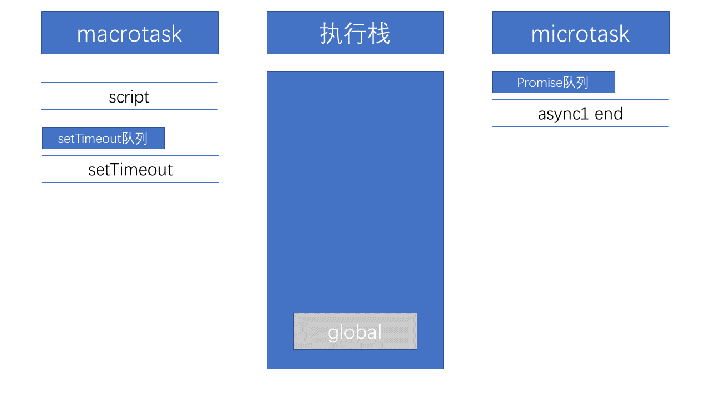
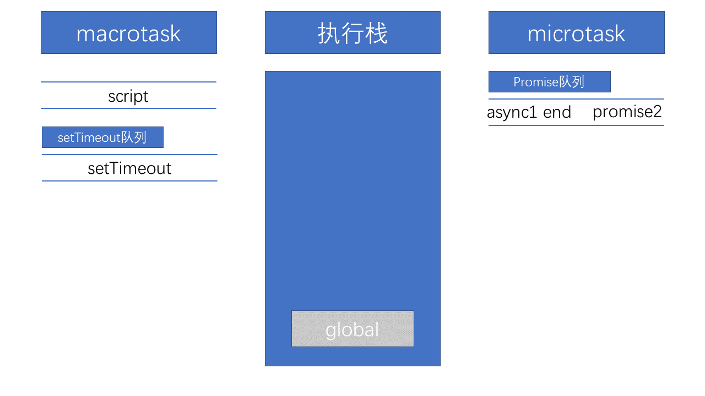

# JS执行机制

JS是单线程的但是依靠宿主环境浏览器又可支持异步执行代码，同步代码与异步代码通过事件循环机制有条不紊的执行，执行每一段代码都会创建一个上下文环境，这个上下文环境中包含了定义的变量，可访问的作用域链，`this`指针，对于正在执行的代码会将当前上下文推入到执行栈中，执行完之后再从栈中推出后再继续执行栈中剩余的代码。

先从执行上下文开始，执行上下文包含三大要素：

- 变量对象

- 作用域

- `this`

## 执行上下文

**执行上下文** 就是一段 JavaScript 代码的执行环境，在一段 JS 脚本执行之前，要先解析代码（所以说 JS 是解释执行的脚本语言），解析的时候会先创建一个执行上下文环境，先把代码中即将执行的变量、函数声明都拿出来。变量先暂时赋值为`undefined`，函数则先声明好可使用。这一步做完了，然后再开始正式执行程序。

有三种类型的代码会创建一新的执行上下文

- 运行代码主体的全局上下文，也就是说它是为那些存在于JavaScript 函数之外的任何代码而创建的。

- 运行函数内代码的局部上下文，每个函数会在执行代码的时候创建自己的执行上下文，即局部上下文

- 使用 `eval()` 函数也会创建一个新的执行上下文

每一个上下文在本质上都是一种作用域层级。每个代码段开始执行的时候都会创建一个新的上下文栈来运行它，并且在代码退出的时候销毁掉

### 执行上下文的生命周期

执行上下文的生命周期包括三个阶段：创建阶段 -> 执行阶段 -> 回收阶段

**创建阶段**

当函数被调用，但未执行任何其内部代码之前，会做以下三件事：

1. 创建变量对象：提升函数声明和变量声明,如果是函数还需要初始化参数`arguments`

2. 创建作用域链（Scope Chain）：在上下文的创建阶段，作用域链是在变量对象之后创建的。作用域链用于解析变量。当被要求解析变量时，JavaScript 始终从代码嵌套的最内层开始，如果最内层没有找到变量，就会跳转到上一层父作用域中查找，直到找到该变量。

3. 确定this指向：包括多种情况，下文会详细说明

**执行阶段**

执行变量赋值、代码执行

**回收阶段**

执行上下文出栈等待虚拟机回收执行上下文

活动的执行上下文在逻辑上组成一个堆栈。堆栈底部永远都是全局上下文(global context)，而顶部就是当前(活动的)执行上下文。堆栈在EC类型进入和退出上下文的时候被修改（推入或弹出）

例如，我们可以定义执行上下文堆栈是一个数组：

```js
ECStack = []
```

每次进入`function` (即使`function`被递归调用或作为构造函数) 的时候或者内置的`eval`函数工作的时候，这个堆栈都会被压入

**全局代码**

这种类型的代码是在"程序"级处理的：例如加载外部的js文件或者本地`<script></script>`标签内的代码。全局代码不包括任何`function`体内的代码

在初始化（程序启动）阶段，ECStack是这样的：

```js
ECStack = [
  globalContext
];
```

**函数代码**

当进入`funtion`函数代码(所有类型的`funtions)`的时候，`ECStack`被压入新元素。需要注意的是，具体的函数代码不包括内部函数(inner functions)代码。如下所示，我们使函数自己调自己的方式递归一次：

```js
(function  foo(bar) {
  if (bar) {
    return;
  }
  foo(true);
})();
```

那么，`ECStack`以如下方式被改变：

```js
// 第一次foo的激活调用
ECStack = [
  <foo> functionContext
  globalContext
];
 
// foo的递归激活调用
ECStack = [
  <foo> functionContext – recursively
  <foo> functionContext
  globalContext
];
```

每次`return`的时候，当前执行上下文也就从`ECStack`弹出,一个抛出的异常如果没被截获的话也有可能从一个或多个执行上下文退出。相关代码执行完以后，`ECStack`只会包含全局上下文(global context)，一直到整个应用程序结束


```js
let outputElem = document.getElementById("output");

let userLanguages = {
  "Mike": "en",
  "Teresa": "es"
};

function greetUser(user) {
  function localGreeting(user) {
    let greeting;
    let language = userLanguages[user];
    
    switch(language) {
      case "es":
        greeting = `¡Hola, ${user}!`;
        break;
      case "en":
      default:
        greeting = `Hello, ${user}!`;
        break;
    }
    return greeting;
  }
  outputElem.innerHTML += localGreeting(user) + "<br>\r";
}

greetUser("Mike");
greetUser("Teresa");
greetUser("Veronica");
```

- 程序开始运行时，全局上下文就会被创建好

  - 当执行到 `greetUser("Mike")` 的时候会为 `greetUser()` 函数创建一个它的上下文。这个执行上下文会被推入执行上下文栈中

    - 当 `greetUser()` 调用 `localGreeting()`的时候会为该方法创建一个新的上下文

    - 当`localGreeting()`函数执行完之后就会将它的上下文从执行栈中弹出并销毁。程序会从栈中获取下一个上下文并恢复执行, 也就是从 `greetUser()` 剩下的部分开始执行

  - 当`greetUser()` 执行完毕后，其上下文也从执行栈中弹出并销毁

  - 之后执行`greetUser("Teresa")`和`greetUser("Veronica")`方法的时候，也是同上面的步骤

- 主程序退出，全局执行上下文从执行栈中弹出。此时栈中所有的上下文都已经弹出，程序执行完毕

**递归函数及其上下文**

关于递归函数——即多次调用自身的函数，需要特别注意：每次递归调用自身都会创建一个新的上下文。这使得 JavaScript 运行时能够追踪递归的层级以及从递归中得到的返回值，但这也意味着每次递归都会消耗内存来创建新的上下文

## 变量对象

变量对象(缩写为VO)是一个与执行上下文相关的特殊对象(抽象概念)，它存储着当前上下文中的以下内容：

- 变量 (var, 变量声明);

- 函数声明 (FunctionDeclaration, 缩写为FD);

- 函数的形参

以下是使用JS对象的形式来表示一个上下文中的VO

```js
activeExecutionContext = {
  VO: {
    // 上下文数据（var, FD, function arguments)
  }
};
```

假设现在有以下代码：

```js
var a = 10;
 
function test(x) {
  var b = 20;
};
 
test(30)
```

对应的变量对象是:

```js
// 全局上下文的变量对象
VO(globalContext) = {
  a: 10,
  test: <reference to function>
};
 
// test函数上下文的变量对象
VO(test functionContext) = {
  x: 30,
  b: 20
};
```

只有全局上下文的变量对象允许通过`VO`的属性名称来间接访问(因为在全局上下文里，全局对象自身就是变量对象，稍后会详细介绍)，在其它上下文中是不能直接访问`VO`对象的，因为它只是内部机制的一个实现

### 不同上下文中的变量对象

执行上下文可分全局上下文和局部上下文（函数上下文），在不同类型的上下文中，变量对象是有差异的

**全局上下文中的变量对象**

全局对象(Global object) 是在进入任何执行上下文之前就已经创建了的对象

这个对象只存在一份，它的属性在程序中任何地方都可以访问，全局对象的生命周期终止于程序退出那一刻

全局对象初始创建阶段将`Math`、`String`、`Date`、`parseInt`等作为自身属性，初始化之后也可以用额外创建的其它对象作为属性（这个属性也可以指向到全局对象自身）。例如在 DOM 中，全局对象的`window`属性就可以引用全局对象自身

```js
global = {
  Math: <...>,
  String: <...>
  ...
  ...
  window: global //引用自身
};
```

回到全局上下文中的变量对象——在这里，变量对象就是全局对象自己：

```js
VO(globalContext) === global;
```

基于这个原理，在全局上下文中声明的对象，我们才可以间接通过全局对象的属性来访问它

```js
var a = new String('test');
 
alert(a); // 直接访问，在VO(globalContext)里找到："test"
 
alert(window['a']); // 间接通过global访问：global === VO(globalContext): "test"
alert(a === this.a); // true
 
var aKey = 'a';
alert(window[aKey]); // 间接通过动态属性名称访问："test"
```

**函数上下文中的变量对象**

在函数执行上下文中，`VO` 是不能直接访问的，此时由活动对象(activation object,缩写为`AO`)扮演`VO`的角色

```js
VO(functionContext) === AO
```

活动对象是在进入函数上下文时刻被创建的，它通过函数的`arguments`属性初始化。`arguments`属性的值是`Arguments`对象：

```js
AO = {
  arguments: <ArgO>
};
```

Arguments对象是活动对象的一个属性，它包括如下属性：

- `callee` — 指向当前函数的引用

- `length` — 真正传递的参数个数

- `properties-indexes` (字符串类型的整数) 属性的值就是函数的参数值(按参数列表从左到右排列)

### 变量对象的初始化&&变量提升

在处理执行上下文的时候基本有两个阶段

1. 进入执行上下文

2. 执行代码

变量对象的修改变化与这两个阶段紧密相关

**进入执行上下文阶段**

当进入执行上下文(代码执行之前)时，VO里已经包含了下列属性

- 函数的所有形参(如果我们是在函数执行上下文中)

  [参数名]:[参数值], 如果没有传递对应参数的话，那么由名称和undefined值组成的一种变量对象的属性也将被创建  

- 所有函数声明(FunctionDeclaration, FD)

  [参数名]:[参数值], 如果变量对象已经存在相同名称的属性，则完全替换这个属性  

- 所有变量声明(var, VariableDeclaration)

  [参数名]:[参数值], 如果变量名称跟已经声明的形式参数或函数相同，则变量声明不会干扰已经存在的这类属性

让我们看一个例子：

```js
function test(a, b) {
  var c = 10;
  function d() {}
  var e = function _e() {};
  (function x() {});
}
 
test(10); // call
```

当进入带有参数`10`的`test函数`上下文时，`AO`表现为如下：

```js
AO(test) = {
  a: 10,
  b: undefined,
  c: undefined,
  d: <reference to FunctionDeclaration "d">
  e: undefined
}
```

`AO`里并不包含`函数x`。这是因为`x` 是一个函数表达式(FunctionExpression, 缩写为 FE) 而不是函数声明，**函数表达式不会影响`VO`**。 不管怎样，函数`_e` 同样也是函数表达式，但是就像我们下面将看到的那样，因为它分配给了变量 `e`，所以它可以通过名称`e`来访问。 函数声明FunctionDeclaration与函数表达式FunctionExpression 的不同

这之后，将进入处理上下文代码的第二个阶段 — 执行代码。

**执行代码**

这个周期内，`AO/VO`已经拥有了属性(不过，并不是所有的属性都有值，大部分属性的值还是系统默认的初始值`undefined` )

还是前面那个例子, AO/VO在代码解释期间被修改如下：

```js
AO['c'] = 10;
AO['e'] = <reference to FunctionExpression "_e">
```

再次注意，因为`FunctionExpression` `_e`保存到了已声明的变量`e`上，所以它仍然存在于内存中。而`FunctionExpression` `x`却不存在于`AO/VO`中，也就是说如果我们想尝试调用 `x` 函数，不管在函数定义之前还是之后，都会出现一个错误`x is not defined`，未保存的函数表达式只有在它自己的定义或递归中才能被调用

另一个经典例子：

```js
alert(x); // function
 
var x = 10;
alert(x); // 10
 
x = 20;
 
function x() {};
 
alert(x); // 20

```

为什么第一个`alert(x)` 的返回值是`function`，而且它还是在`x` 声明之前访问的`x` 的？为什么不是`10`或`20`呢？因为，根据规范**函数声明是在进入上下文时填入的** ,同一周期，在进入上下文的时候还有一个变量声明`x`，那么正如我们在上一个阶段所说，**变量声明在顺序上跟在函数声明和形式参数声明之后，而且在这个进入上下文阶段，变量声明不会干扰VO中已经存在的同名函数声明或形式参数声明**，因此，在进入上下文时，VO的结构如下：

```js
VO = {};
 
VO['x'] = <reference to FunctionDeclaration "x">
 
// 找到var x = 10;
// 如果function "x"没有已经声明的话
// 这时候"x"的值应该是undefined
// 但是这个case里变量声明没有影响同名的function的值
 
VO['x'] = <the value is not disturbed, still function>
```

紧接着，在执行代码阶段，VO做如下修改：

```js
VO['x'] = 10;
VO['x'] = 20;
```

再来一个例子：

```js
if (true) {
  var a = 1;
} else {
  var b = 2;
}
 
alert(a); // 1
alert(b); // undefined,不是b没有声明，而是b的值是undefined
```

在下面的例子里我们可以再次看到，变量是在进入上下文阶段放入`VO`中的。(因为，虽然`else`部分代码永远不会执行，但是不管怎样，变量`b`仍然存在于VO中)

### 变量提升

上文也提到了，**变量提升是发生在进入执行上文阶段**，需要注意的点有两个：

1. 如果存在函数声明，则这个变量名的初始值就是这个函数，无论在函数声明之前是否有同名的`var`变量或者是同名的参数

2. 对于`var`声明的变量，不会覆盖这个变量之前的同名变量，如果没有同名的变量会隐式声明一个值为`undefined`的同名变量

```js
function fn(name){
    console.log(name) // "function name(){console.log()}"
    function name(){}
    function name(){console.log()}
    var name = 110
    console.log(name) // 110
}
fn('lanjz')

// -----------------
function fn(){
    console.log(name) // "undefined"
    var name = 110
}
fn()

// ---------------
function fn(name){
    console.log(name) // "lanjz"
    var name = 110
}
fn('lanjz')
```

### 关于变量

通常，各类文章和JavaScript相关的书籍都声称：“不管是使用var关键字(在全局上下文)还是不使用var关键字(在任何地方)，都可以声明一个变量”。请记住，这是错误的概念：

**任何时候，变量只能通过使用var关键字才能声明。**

赋值语句：`a = 10;`,这仅仅是给全局对象创建了一个新属性(但它不是变量),“不是变量”并不是说它不能被改变，而是指它不符合ECMAScript规范中的变量概念

它之所以能成为全局对象的属性，完全是因为`VO(globalContext) === global`

让我们通过下面的实例看看具体的区别吧：

```js
alert(a); // undefined
alert(b); // "b" 没有声明
 
b = 10;
var a = 20;
```

所有根源仍然是VO和进入上下文阶段和代码执行阶段：

进入上下文阶段：

```js
VO = {
  a: undefined
};
```

我们可以看到，因为“b”不是一个变量，所以在这个阶段根本就没有“b”，“b”将只在代码执行阶段才会出现(但是在我们这个例子里，还没有到那就已经出错了)。

让我们改变一下例子代码：

```js
alert(a); // undefined, 这个大家都知道，
 
b = 10;
alert(b); // 10, 代码执行阶段创建
 
var a = 20;
alert(a); // 20, 代码执行阶段修改
```

关于变量，还有一个重要的知识点。变量相对于简单属性来说，变量有一个特性`(attribute)：{DontDelete}`,这个特性的含义就是不能用`delete`操作符直接删除变量属性

```js
a = 10;
alert(window.a); // 10
 
alert(delete a); // true
 
alert(window.a); // undefined
 
var b = 20;
alert(window.b); // 20
 
alert(delete b); // false
 
alert(window.b); // still 20
```

但是这个规则在有个上下文里不起走样，那就是`eval`上下文，变量没有`{DontDelete}`特性

```js
eval('var a = 10;');
alert(window.a); // 10
 
alert(delete a); // true
 
alert(window.a); // undefined
```

> [深入理解JavaScript系列（12）：变量对象（Variable Object）](https://www.cnblogs.com/tomxu/archive/2012/01/16/2309728.html)


## 作用域

当要执行主代码或者函数的时候，会为其创建执行上下文，每个上下文中有自己的变量对象：对于全局上下文，它是全局变量对象自身；对于函数，它是活动对象

```js
var x = 10;
 
function foo() { 
  var y = 20; 
  function bar() {
    alert(x + y);
  } 
  return bar; 
}
 
foo()(); // 30
```

上面的变量对象有：全局变量对象`VO(global)`，`foo`函数活动对象`AO(foo)`，`bar`函数活动对象`AO(bar)`

作用域链正是内部上下文所有变量对象（包括父变量对象）的列表。此链用来变量查询。即在上面的例子中，`bar`上下文的作用域链包括`AO(bar)`、`AO(foo)`和`VO(global)`

当查找变量的时候，会先从当前上下文的**变量对象**中查找，如果没有找到，就会从父级执行上下文的**变量对象**中查找，一直找到全局上下文的**变量对象**，也就是全局对象。这样由多个执行上下文的变量对象构成的链表就叫做**作用域链**

作用域链在上下文初始阶段创建的，包含活动对象和这个函数内部的`[[scope]]`属性。下面我们将更详细的讨论一个函数的`[[scope]]`属性

```js
activeExecutionContext = {
    VO: {...}, // or AO
    this: thisValue,
    Scope: [ // Scope chain
      // 所有变量对象的列表
      // for identifiers lookup
    ]
};
```

上面代码上的其`scope`定义如下:

```js
Scope = AO + [[Scope]]
```

上面的`[[scope]]`是所有父变量对象的层级链，处于当前函数上下文之上，在函数创建时存于其中

下面通过具体的函数声明到执行来进一步了解`Scope`

### 函数生命周期和Scope

函数调用的上下文生命周期分为创建和激活阶段（调用时）

**函数创建**

```js
var x = 10;
 
function foo() {
  var y = 20;
  alert(x + y);
}
 
foo(); // 30
```

当调用`foo()`时，创建上下文时会为其创建`AO`对象，作用域和`this`,这时先不讨论`this`，那么此时`foo`的`AO`如下：

```js
fooContext.AO = {
  y: undefined， // undefined
  [[Scope]]： [
    globalContext.VO // === Global
  ]
};
```

父作用域`[[Scope]]`的值：

```js
foo.[[Scope]] = [
  globalContext.VO // === Global
];
```

那么整个作用域`scope`就为：`Scope = AO|VO + [[Scope]]`

**函数激活**

当函数激活时，寻找变量时就会从作用中查找，先从当前`AO`中查找，如果没有话再从父作用域`[[Scope]]`中查找，直到最顶端

我们用一个稍微复杂的例子描述上面讲到的这些

```js
var x = 10;
 
function foo() {
  var y = 20;
 
  function bar() {
    var z = 30;
    alert(x +  y + z);
  }
 
  bar();
}
 
foo(); // 60
```

分析一下上面例子的变量/活动对象，函数的的[[scope]]属性以及上下文的作用域链：

首先全局上下文的变量对象是：

```js
globalContext.VO === Global = {
  x: 10
  foo: <reference to function>
};

```

在`foo`创建时，`foo`的[[scope]]属性是：

```js
foo.[[Scope]] = [
  globalContext.VO
]
```

在`foo`激活时（进入上下文），`foo`上下文的活动对象是：

```js
fooContext.AO = {
  y: 20,
  bar: <reference to function>
}
```

`foo`上下文的作用域链为：

```js
fooContext.Scope = fooContext.AO + foo.[[Scope]] // i.e.:
 
fooContext.Scope = [
  fooContext.AO,
  globalContext.VO
];
```

内部函数`bar`创建时，其`[[scope]]`为：

```js
bar.[[Scope]] = [
  fooContext.AO,
  globalContext.VO
];
```

在`bar`激活时，`bar`上下文的活动对象为：

```js
barContext.AO = {
  z: 30
}
```

`bar`上下文的作用域链为：

```js
barContext.Scope = barContext.AO + bar.[[Scope]] // i.e.:
 
barContext.Scope = [
  barContext.AO,
  fooContext.AO,
  globalContext.VO
]
```

对`x`、`y`、`z`的标识符解析如下：

```js
- barContext.AO // not found
-- fooContext.AO // not found
-- globalContext.VO // found - 10

- "y"
-- barContext.AO // not found
-- fooContext.AO // found - 20

- "z"
-- barContext.AO // found - 30
```

### 作用域特征

`[[scope]]`是所有父变量对象的层级链，处于当前函数上下文之上，在函数创建时存于其中。

注意这重要的一点－－**`[[scope]]`在函数创建时被存储－－静态（不变的），永远永远，直至函数销毁**。即：函数可以永不调用，但`[[scope]]`属性已经写入，并存储在函数对象中

```js
var x = 10;
 
function foo() {
  alert(x);
}
 
(function () {
  var x = 20;
  foo(); // 10, but not 20
})();
```

函数创建时定义的词法作用域－－变量解析为`10`，而不是`30`

**通过构造函数创建的函数的[[scope]]**

在上面的例子中，我们看到，在函数创建时获得函数的[[scope]]属性，通过该属性访问到所有父上下文的变量。但是，这个规则有一个重要的例外，它涉及到通过函数构造函数创建的函数

```js
var x = 10;
 
function foo() {
 
  var y = 20;
 
  function barFD() { // 函数声明
    alert(x);
    alert(y);
  }
 
  var barFE = function () { // 函数表达式
    alert(x);
    alert(y);
  };
 
  var barFn = Function('alert(x); alert(y);');
 
  barFD(); // 10, 20
  barFE(); // 10, 20
  barFn(); // 10, "y" is not defined
 
}
 
foo();
```

我们看到，通过函数构造函数（Function constructor）创建的函数`bar`，是不能访问变量`y`的。但这并不意味着函数`barFn`没有[[scope]]属性（否则它不能访问到变量`x`）。问题在于通过函构造函数创建的函数的`[[scope]]`属性总是唯一的全局对象。考虑到这一点，如通过这种函数创建除全局之外的最上层的上下文闭包是不可能的

**二维作用域链查找**

在作用域链中查找最重要的一点是变量对象的属性（如果有的话）须考虑其中－－源于ECMAScript 的原型特性，如果一个属性在对象中没有直接找到，查询将在原型链中继续。即常说的二维链查找。（1）作用域链环节；（2）每个作用域链－－深入到原型链环节。如果在`Object.prototype`中定义了属性，我们能看到这种效果

```js
function foo() {
  alert(x);
}
 
Object.prototype.x = 10;
 
foo(); // 10
```

活动对象没有原型，我们可以在下面的例子中看到

```js
function foo() {
 
  var x = 20;
 
  function bar() {
    alert(x);
  }
 
  bar();
}
 
Object.prototype.x = 10;
 
foo(); // 20

```

上面例子中如果函数`bar`上下文的AO有一个原型，那么`x`将在`Object.prototype` 中被解析,那么将输出`10`

### 代码执行时对作用域链的影响

在ECMAScript 中，在代码执行阶段有两个声明能修改作用域链。这就是`with`声明和`catch`语句。它们添加到作用域链的最前端，对象须在这些声明中出现的标识符中查找。如果发生其中的一个，作用域链简要的作如下修改：

```js
var foo = {x: 10, y: 20};
 
with (foo) {
  alert(x); // 10
  alert(y); // 20
}

```

作用域链修改成这样：

```js
Scope = foo + AO|VO + [[Scope]]
```

```js
var x = 10, y = 10;
 
with ({x: 20}) {
 
  var x = 30, y = 30;
 
  alert(x); // 30
  alert(y); // 30
}
 
alert(x); // 10
alert(y); // 30
```

在进入上下文时发生了什么？标识符`x`和`y`已被添加到变量对象中。此外，在代码运行阶段作如下修改：

1. x = 10, y = 10;

2. 对象`{x:20}`添加到作用域的前端

3. 在`with`内部，遇到了`var`声明，当然什么也没创建，因为在进入上下文时，所有变量已被解析添加

4. 在第二步中，仅修改变量`x`，实际上对象中的`x`现在被解析，并添加到作用域链的最前端，`x`为`20`，变为`30`

5. 同样也有变量对象`y`的修改，被解析后其值也相应的由`10`变为`30`

6. 此外，在`with`声明完成后，它的特定对象从作用域链中移除（已改变的变量`x－－30`也从那个对象中移除），即作用域链的结构恢复到`with`得到加强以前的状态

7. 在最后两个`alert`中，当前变量对象的`x`保持同一，`y`的值现在等于`30`，在`with`声明运行中已发生改变。

同样，`catch`语句的异常参数变得可以访问，它创建了只有一个属性的新对象－－异常参数名。图示看起来像这样：

```js
try {
  ...
} catch (ex) {
  alert(ex);
}
```

作用域链修改为：

```js
var catchObject = {
  ex: <exception object>
};
 
Scope = catchObject + AO|VO + [[Scope]]
```

在`catch`语句完成运行之后，作用域链恢复到以前的状态

### 闭包

函数可以作为参数传递给其他函数使用 (在这种情况下，函数被称为“funargs”——“functional arguments”)。接收`funargs`的函数被称之为 高阶函数(`higher-order functions`) 。其他函数的运行时也会返回函数，这些返回的函数被称为 `function valued` 函数 (有 `functional value` 的函数)

**闭包的作用域问题：**

当一个函数从其他函数返回到外部的时候，当函数被激活时，上下文的作用域链表现为激活对象与[[Scope]]属性的组合

```js
Scope chain = Activation object + [[Scope]]
作用域链 = 活动对象 + [[Scope]]
```

EMCAScript使用静态作用域，即作用域是在函数创建产生，且不会被改变

```js
function foo() {
  var x = 10;
  return function bar() {
    console.log(x);
  };
}
 
// "foo"返回的也是一个function
// 并且这个返回的function可以随意使用内部的变量x
 
var returnedFunction = foo();
 
// 全局变量 "x"
var x = 20;
 
// 支持返回的function
returnedFunction(); // 结果是10而不是20
```

```js
// 全局变量 "x"
var x = 10;
 
// 全局function
function foo() {
  console.log(x);
}
 
(function (funArg) {
 
  // 局部变量 "x"
  var x = 20;
 
  // 这不会有歧义
  // 因为我们使用"foo"函数的[[Scope]]里保存的全局变量"x",
  // 并不是caller作用域的"x"
 
  funArg(); // 10, 而不是20
 
})(foo); // 将foo作为一个"funarg"传递下去
```

还有一个很重要的点，几个函数可能含有相同的父级作用域（这是一个很普遍的情况，例如有好几个内部或者全局的函数）。在这种情况下，在`[[Scope]]`中存在的变量是会共享的。一个闭包中变量的变化，也会影响另一个闭包的

```js
function baz() {
  var x = 1;
  return {
    foo: function foo() { return ++x; },
    bar: function bar() { return --x; }
  };
}
 
var closures = baz();
 
console.log(
  closures.foo(), // 2
  closures.bar()  // 1
);
```

在某个循环中创建多个函数时，上图会引发一个困惑。如果在创建的函数中使用循环变量(如”k”)，那么所有的函数都使用同样的循环变量，导致一些程序员经常会得不到预期值。现在清楚为什么会产生如此问题了——因为所有函数共享同一个`[[Scope]]`，其中循环变量为最后一次赋值

```js
var data = [];
 
for (var k = 0; k < 3; k++) {
  data[k] = function () {
    alert(k);
  };
}
 
data[0](); // 3, but not 0
data[1](); // 3, but not 1
data[2](); // 3, but not 2
```

有一些用以解决这类问题的技术。其中一种技巧是在作用域链中提供一个额外的对象，比如增加一个函数：

```js
var data = [];
 
for (var k = 0; k < 3; k++) {
  data[k] = (function (x) {
    return function () {
      alert(x);
    };
  })(k); // 将k当做参数传递进去
}
 
// 结果正确
data[0](); // 0
data[1](); // 1
data[2](); // 2
```

## this

**`this`是执行上下文中的一个属性而不是某个变量对象的属性**

```js
activeExecutionContext = {
  VO: {...},
  this: thisValue
};
```

`this`与上下文中可执行代码的类型有直接关系，`this`值在进入上下文时确定，并且在上下文运行期间永久不变

### 全局代码中的this

在全局代码中，`this`始终是全局对象本身，这样就有可能间接的引用到它了

### 函数代码中的this

函数代码中的`this`不是静态绑定到一个函数，因为`this`是进入上下文中的确定的，

```js
var foo = {x: 10};
var bar = {
  x: 20,
  test: function () {
    alert(this === bar);
    alert(this.x); 
    // this = foo; // 错误，任何时候不能改变this的值
  }
};
 
// 在进入上下文的时候
// this被当成bar对象
 
bar.test(); // true, 20
 
foo.test = bar.test;
 
foo.test(); // false, 10
```

**this指向**

在通常的函数调用中，`this`是由激活上下文代码的调用者来提供的，即调用函数的父上下文(parent context )。**`this`取决于调用函数的方式**

```js
var foo = {
  bar: function () {
    alert(this);
    alert(this === foo);
  }
};
 
foo.bar(); // foo, true
 
var exampleFunc = foo.bar;
 
alert(exampleFunc === foo.bar); // true
 
// 再一次，同一个function的不同的调用表达式，this是不同的
 
exampleFunc(); // global, false

```

即使是正常的全局函数也会被调用方式的不同形式激活，这些不同的调用方式导致`this`值也不同。

```js
function foo() {
  alert(this);
}
 
foo(); // global
 
alert(foo === foo.prototype.constructor); // true
 
// 但是同一个function的不同的调用表达式，this是不同的
 
foo.prototype.constructor(); // foo.prototype
```

 一个函数上下文中确定`this`值的通用规则如下:

 一个函数上下文中，`this`由调用者提供，由调用函数的方式来决定。如果调用括号`()`的左边是引用类型的值，`this`将设为引用类型值的所属对象，在其他情况下（与引用类型不同的任何其它属性），这个值为全局

 ```js
var foo = {
  bar: function () {
    alert(this);
  }
};
 
foo.bar(); //  foo
(foo.bar)(); // foo
 
(foo.bar = foo.bar)(); // window
(false || foo.bar)(); // window
(foo.bar, foo.bar)(); // window
 ```

1. 第一个例子很明显———明显的引用类型，结果`this`指向`foo`

2. 在第二个例子中，括号中仍是一个引用类型。所以`this`值还是指向`foo`

3. 第三个例子中，括号中的赋值运算符执行之后返回的结果是函数对象（但不是引用类型），这意味着`this`指向全局

4. 第四个和第五个也是一样——逗号运算符和逻辑运算符（OR）失去了引用而得到了函数,`this`指向全局

**`this`指向总结**：

- `this`总是指向直接调用它的对象，如果没有对象调用则指向全局`window`

- 对于构造函数来说（`new`命令），`this`指向的是构造函数实例对象

- `this`是不能通过`=`运算符直接修改的，但可以使用`call`，`apply`，`bind`可以改变函数`this`指向

- 对于箭头函数来说，`this`继承箭头函数外层的函数，如果没有外层函数则指向全局`window`


## 事件循环

事件循环负责不断得收集事件任务（包括用户事件以及其他非用户事件等），然后对任务进行排队并在合适的时候执行这些事件回调

在一次循环中始终以一个宏任务开始（如果有的话），待执行上下文栈为空时将执行微任务队列中的任务，待任务队列中的任务清空后，将进入渲染进程，经历渲染步骤之后，一个事件循环结束，然后继续下一次循环

`macrotask->microtast->渲染->macrotask->microtast->渲染->...`

### 任务源

事件循环收集到的事件任务分两种，放入宏任务列中的是宏任务，放入到微任务队列当中是微任务

**属于宏任务（macrotask）的任务源有：**

- `script`标签内的代码

- 整体代码

- `setTimeout`，`setInterval`，`setImmediate`（服务端 API）

- `I/O`（服务端 API）

- 可拓展至 Web API

  - DOM 操作

  - 网络任务

  - Ajax 请求

  - `history traversal`

  - `history.back()`

  - 用户交互

  - 其中包括常见 `DOM2`（addEventListener）和 `DOM0`（onHandle）级事件监听回调函数。如 `click` 事件回调函数等

  事件需要冒泡到 document 对象之后并且事件回调执行完成后，才算该宏任务执行完成

- UI `rendering`

**属于微任务（microtask）的任务源有**

- `process.nextTick`（Node.js）

- `Promise` 原型方法（即 `then`、`catch`、`finally`）中被调用的回调函数

- 使用`queueMicrotask()`方法创建方法

  ```js
  queueMicrotask(fn1)
  function fn1(){} // fn1将会放在微任务队列中
  ```

- `MutationObserver`（一个可以监听DOM结构变化的接口）

- 用于监听节点是否发生变化

- `Object.observe`(已废弃)

特别注明：在 ECMAScript 中称 `microtask` 为 `jobs`

**宏任务 vs 微任务**

- 事件循环首次执行的就是宏任务，且一个宠任务结束到下一个宏任务执行前会做两个事情

  - 如果微任务队列有任务，则执行队列中的微任务

  - 如果微任务队列中没有任务或者所有微任务执行完成，则进行DOM渲染

  - 然后执行下一个宏任务

- 当执行微任务队列中的任务时，只有微任务队列执行完了才退中微任务的执行，包括中途有微任务加入。换句话说，微任务可以添加新的微任务到队列中，并在下一个任务开始执行之前且当前事件循环结束之前执行完所有的微任务

示例：

```js
// script
// 1
console.log('I am from script beginning')

// 2
setTimeout(() => {
  // 该匿名函数称为匿名函数a
  console.log('I am from setTimeout')
}, 1000)

// 3
const ins = new Promise((resolve, reject) => {
  console.log('I am from internal part')
  resolve()
})

// 4
ins
  .then(() => console.log('I am from 1st ins.then()'))
  .then(() => console.log('I am from 2nd ins.then()'))

// 5
console.log('I am from script bottom')
```

以上整个代码段即是宏任务，它的任务源是 `script` 

1. 整个代码段 `script` 进入执行上下文栈（亦称调用栈），执行 1 处代码调用 `console.log` 函数，该函数进入调用栈，之前 `script` 执行上下文执行暂停（冻结），转交执行权给 `console.log`。`console.log`成为当前执行栈中的活动执行上下文（running execution context）。`console.log` 执行完成立即弹出调用栈，`script` 恢复执行

2. `setTimeout` 是一个任务分发器，该函数本身会立即执行，延迟执行的是其中传入的参数（匿名函数 `a`）。`script` 暂停执行，内部建立一个 1 秒计时器。`script` 恢复执行接下来的代码。1 秒后，再将匿名函数 `a` 插入宏任务队列（根据宏任务队列是否有之前加入的宏任务，可能不会立即执行）

3. 声明变量 `ins`，并初始化为 `Promise` 实例。需要注意的`Promise` 内部代码是同步的意味着会在本轮事件循环立即执行。那么此时， `script` 冻结，开始执行 `console.log`，`console.log`执行结束后弹出调用栈，`resolve()` 进入调用栈，将 `Promise` 状态 `resolved`，并之后弹出调用栈，此时恢复 `script` 执行

    因为上面完成了 `resolved` ，将调用 `ins` 的 `then `方法，将第一个 `then` 中回调添加到 微任务队列，继续执行，将第二个 `then` 中回调添加到 微任务队列

4. 恢复 `script` 执行后将`console.log('I am from script bottom')`压入栈，执行完后弹出,继续恢复 `script` 执行

5. `script` 宏任务执行完成，弹出执行上下文栈。此时，微任务队列中有两个 `then` 加入的回调函数等待执行。另外，若距 2 超过 1 秒钟，那么宏任务队列中有一个匿名函数 `a` 等待执行，否则，此时宏任务队列为空

6. 在当前宏任务执行完成并弹出调用栈后，开始清空因宏任务执行而产生的微任务队列。首先执行 `console.log('I am from 1st ins.then()')`，之后执行`console.log('I am from 2nd ins.then()')`

8. 微任务队列清空后，开始调用下一宏任务（即进入下一个事件循环）或等待下一宏任务加入任务队列。此时，在 2 中如果计时超过 1 秒后，将匿名函数 `a` 加入至宏任务队列，此时，因之前宏任务 `script` 执行完成而清空，那么将匿名函数 `a` 加入调用栈执行，输出 `I am from setTimeout`

输出结果：

```js
I am from script beginning
I am from internal part
I am from script bottom
I am from 1st ins.then()
I am from 2nd ins.then()
I am from setTimeout
```

示例总结：

1. 在一个代码段（或理解为一个模块）中，所有的代码都是基于一个 `script` 宏任务进行的

2. 在当前宏任务执行完成后，必须要清空因执行宏任务而产生的微任务队列

3. 只有当前微任务队列清空后，才会调用下一个宏任务队列中的任务。即进入下一个事件循环

4. `new Promise` 时，`Promise` 参数中的匿名函数是立即执行的。被添加进微任务队列的是 `then` 中的回调函数

5. `setTimeout` 是作为任务分发器的存在，他自身执行会创建一个计时器，只有待计时器结束后，才会将 `setTimeout` 中的第一参数函数添加至宏任务队列。换一种方式理解，`setTimeout` 中的函数一定不是在当前事件循环中被调用


## Q&A

**为什么 `setTimeout`，HTTP请求，事件等是可以异步的**

JS是单线程的，但是浏览器是多进程，多线程的，这些异步任务其实是交由给这浏览器其它线程处理的

- 定时触发器线程： 处理定时计数器，`setTimeout`或`setInterval`

- 事件触发线程: 一个事件被触发时该线程会把事件添加到待处理队列的队尾，等待JS引擎的处理

- `http`请求线程: 在`XMLHttpRequest`在连接后是通过浏览器新开一个线程请求

**await后是宏任务还是微任务**

于因为`async await` 本身就是`promise+generator`的语法糖。所以`await`后面的代码是`microtask`

```javascript
async function async1() {
	console.log('async1 start');
	await async2();
	console.log('async1 end');
}
```

等价于

```javascript
async function async1() {
	console.log('async1 start');
	Promise.resolve(async2()).then(() => {
                console.log('async1 end');
        })
}
```

**写出这段代码输出顺序**

```js
//请写出输出内容
async function async1() {
    console.log('async1 start');
    await async2();
    console.log('async1 end');
}
async function async2() {
	console.log('async2');
}

console.log('script start');

setTimeout(function() {
    console.log('setTimeout');
}, 0)

async1();

new Promise(function(resolve) {
    console.log('promise1');
    resolve();
}).then(function() {
    console.log('promise2');
});
console.log('script end');

// script start
// async1 start
// async2
// promise1
// script end
// async1 end
// promise2
// setTimeout
```

过程解析：

以上就本道题涉及到的所有相关知识点了，下面我们再回到这道题来一步一步看看怎么回事儿。

首先，事件循环从宏任务(macrotask)队列开始，这个时候，宏任务队列中，只有一个script(整体代码)任务；当遇到任务源(task source)时，则会先分发任务到对应的任务队列中去。所以，上面例子的第一步执行如下图所示：



然后我们看到首先定义了两个`async`函数，接着往下看，然后遇到了 `console` 语句，直接输出 `script start`。输出之后，`script` 任务继续往下执行，遇到 `setTimeout`，其作为一个宏任务源，则会先将其任务分发到对应的队列中：


`script` 任务继续往下执行，执行了`async1()`函数，前面讲过`async`函数中在`await`之前的代码是立即执行的，所以会立即输出`async1 start`

遇到了`await`时，会将`await`后面的表达式执行一遍，所以就紧接着输出`async2`，然后将`await`后面的代码也就是`console.log('async1 end')`加入到`microtask`中的`Promise`队列中，接着跳出`async1`函数来执行后面的代码。



`script`任务继续往下执行，遇到`Promise`实例。由于`Promise`中的函数是立即执行的，而后续的 `.then` 则会被分发到 `microtask` 的 `Promise `队列中去。所以会先输出 `promise1`，然后执行 `resolve`，将 `promise2` 分配到对应队列。



`script`任务继续往下执行，最后只有一句输出了 `script end`，至此，全局任务就执行完毕了。

根据上述，每次执行完一个宏任务之后，会去检查是否存在 `Microtasks`；如果有，则执行 `Microtasks` 直至清空 `Microtask Queue`。

因而在`script`任务执行完毕之后，开始查找清空微任务队列。此时，微任务中， `Promise` 队列有的两个任务`async1 end`和`promise2`，因此按先后顺序输出 `async1 end`，`promise2`。当所有的 `Microtasks` 执行完毕之后，表示第一轮的循环就结束了。

变式一：

```javascript
async function async1() {
    console.log('async1 start');
    await async2();
    console.log('async1 end');
}
async function async2() {
    //async2做出如下更改：
    new Promise(function(resolve) {
    console.log('promise1');
    resolve();
}).then(function() {
    console.log('promise2');
    });
}
console.log('script start');

setTimeout(function() {
    console.log('setTimeout');
}, 0)
async1();

new Promise(function(resolve) {
    console.log('promise3');
    resolve();
}).then(function() {
    console.log('promise4');
});

console.log('script end');

// script start
// async1 start
// promise1
// promise3
// script end
// promise2
// async1 end
// promise4
// setTimeout
```

变式二

```javascript
async function async1() {
    console.log('async1 start');
    await async2();
    //更改如下：
    setTimeout(function() {
        console.log('setTimeout1')
    },0)
}
async function async2() {
    //更改如下：
	setTimeout(function() {
		console.log('setTimeout2')
	},0)
}
new Promise(function(resolve) {
    console.log('promise2');
    setTimeout(() => {
    	 resolve();
    }, 10)
    console.log('promise2 resolve2')
}).then(function() {
    console.log('promise3');
});
console.log('script start');

setTimeout(function() {
    console.log('setTimeout3');
}, 0)
async1();

new Promise(function(resolve, reject) {
    console.log('promise1');
    reject();
    console.log('promise1 resolve')
}).then(function() {
    console.log('promise2');
}).catch(function(){
	 console.log('reject2');
});
console.log('script end');

// promise2
// promise2 resolve2
// script start
// async1 start
// promise1
// promise1 resolve
// script end
// reject2
// setTimeout3
// setTimeout2
// setTimeout1
// promise3
```

**下面两段代码执行的结果一样，但是两段代码究竟有哪些不同呢？**

```js
var scope = "global scope";
function checkscope(){
    var scope = "local scope";
    function f(){
        return scope;
    }
    return f();
}
checkscope();

var scope = "global scope";
function checkscope(){
    var scope = "local scope";
    function f(){
        return scope;
    }
    return f;
}
checkscope()();
```

答案就是执行上下文栈的变化不一样

第一段代码：

```js
ECStack.push(<checkscope> functionContext);
ECStack.push(<f> functionContext);
ECStack.pop();
ECStack.pop();

```

第一段代码：

```js
ECStack.push(<checkscope> functionContext);
ECStack.pop();
ECStack.push(<f> functionContext);
ECStack.pop();
```

**判断代码执行结果**

```js
function foo() {
    console.log(a); // ncaught ReferenceError: a is not defined
    a = 1;
}

foo(); // ???

function bar() {
    a = 1;
    console.log(a); // 1
}
bar(); 
```

> [解析 event loops](https://set.sh/post/180308-event-loop)

> [HTMl event-loop相关文档](https://html.spec.whatwg.org/multipage/webappapis.html#event-loop)