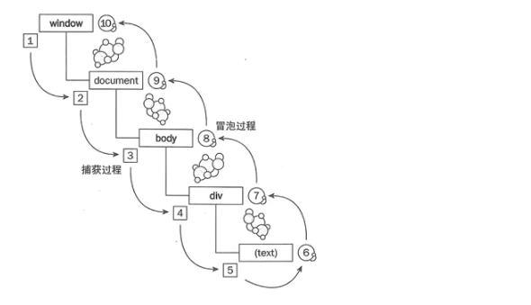

# 事件

DOM 事件标准描述了事件传播的 3 个阶段：

1. 捕获阶段（Capturing phase）—— 事件（从 Window）向下走近元素。

2. 目标阶段（Target phase）—— 事件到达目标元素。

3. 冒泡阶段（Bubbling phase）—— 事件从元素上开始冒泡。



粟子

```html
<!DOCTYPE html>
<html lang="en">
<head>
  <meta charset="UTF-8">
  <title>Title</title>
  <style>
    div{
      padding: 50px;
      background: #3eaf7c;
      text-align: center;
    }
    span{
      display: inline-block;
      width: 100px;
      height: 50px;
      background: #4a67de;
    }
  </style>
</head>
<body>
  <div>
    <span></span>
  </div>
</body>
<script>
  for(let elem of document.querySelectorAll('*')) {
    elem.addEventListener("click", e => console.log(`Bubbling: ${elem.tagName}`));
  }
</script>
</html>
```


当我们点击元素 `span`时，控制台输出：

```
Bubbling: SPAN
Bubbling: DIV
Bubbling: BODY
Bubbling: HTML
```

发现显示的结果从里到外，也就是冒泡阶段，因为默认情况下事件处理的触发就是在冒泡阶段

为了查看捕获事件效果的，我们改下事件绑定的方式

```js
elem.addEventListener("click", e => console.log(`Bubbling: ${elem.tagName}`), true);
```

此时我们再次点击元素 `span` 时，控制台输出：

```
Capturing: HTML
Capturing: BODY
Capturing: DIV
Capturing: SPAN
```

也可以将冒泡和捕获一起输出

```js
elem.addEventListener("click", e => console.log(`Capturing: ${elem.tagName}`), true);
elem.addEventListener("click", e => console.log(`Bubbling: ${elem.tagName}`))
```

此时打印结果为：

```
Capturing: HTML
Capturing: BODY
Capturing: DIV
Capturing: SPAN
Bubbling: SPAN
Bubbling: DIV
Bubbling: BODY
Bubbling: HTML
```

## 阻止冒泡的捕获

**e.stopPropagation()**： 阻止捕获和冒泡阶段中当前事件的进一步传播。但是，它不能防止任何默认行为的发生； 例如，对链接的点击仍会被处理

```js
  function handleDIV(e) {
    console.log('handleDIV')
  }
  function handleSPAN(e) {
    console.log('handleSPAN')
    e.stopPropagation()
  }
  function handleOther(e) {
    console.log('handle', e.currentTarget.tagName)
  }
  for(let elem of document.querySelectorAll('*')) {
    let fn = window['handle'+elem.tagName] ||handleOther
    elem.addEventListener("click", fn);
  }
```

此时点击元素 `span` 时，控制台只会输出：

```
handleSPAN
```

说明阻止了事件在冒泡阶段的传播

```js
  function handleDIV(e) {
    console.log('handleDIV')
  }
  function handleSPAN(e) {
    console.log('handleSPAN')
  }
  function handleOther(e) {
    console.log('handle', e.currentTarget.tagName)
    e.stopPropagation()
  }
  for(let elem of document.querySelectorAll('*')) {
    let fn = window['handle'+elem.tagName] ||handleOther
    elem.addEventListener("click", fn, true);
  }
```

将粟子改成捕获的形式，此时点击元素 `span` 时，控制台只会输出：

```
handle HTML
```

说明阻止了事件在捕获阶段的传播

## 阻止默认行为

**preventDefault()**

如果此事件没有被显式处理，它默认的动作也不应该照常执行。此事件还是继续传播，除非碰到事件侦听器调用 `stopPropagation()` 或 `stopImmediatePropagation()`，才停止传播

```html
<a  href="www.baidu.com">www.baidu.com</a>
<script >
  function handleA(e) {
    console.log('handleA')
    e.preventDefault()
  }
</script>
```

此时点击 `a` 标签，将不会触发跳转行为

## target和currentTarget

- `currentTarget`：表示当前绑定事件事件处理器的所在元素

- `target`：表示触发事件元素

上文提到因为事件存在冒泡和捕获阶段，所以一个元素的绑定事件的触发不一定是当前这个元素

````html
<body>
  <div>
    <span></span>
  </div>
</body>
<script>
  function handleDIV(e) {
    console.log('handleDIV-target', 'target：',  e.target.tagName, 'currentTarget', e.currentTarget.tagName)
  }
  function handleSPAN(e) {
    console.log('handleSPAN-target', 'target：',  e.target.tagName, 'currentTarget', e.currentTarget.tagName)
  }
  function handleOther(e) {
    console.log('handle', e.currentTarget.tagName, 'target：',  e.target.tagName, 'currentTarget', e.currentTarget.tagName)
  }
  for(let elem of document.querySelectorAll('*')) {
    let fn = window['handle'+elem.tagName] ||handleOther
    // elem.addEventListener("click", fn, true);
    elem.addEventListener("click", fn);
  }
</script>
````

点击 `span` 元素时，输出结果为：

```
handleSPAN-target target： SPAN currentTarget SPAN
handleDIV-target target： SPAN currentTarget DIV
handle BODY target： SPAN currentTarget BODY
handle HTML target： SPAN currentTarget HTML
```

因为我们点击的 `span` 元素，所以 `target = span`

