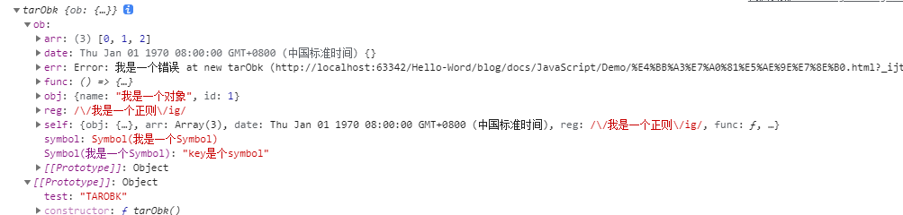
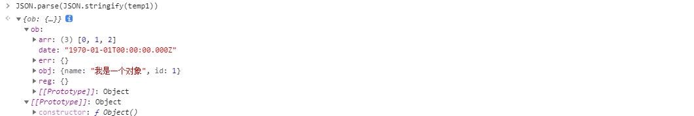

# 吱不吱二

## 如何实现数组的随机排序？

```js
// 随机数排序
function random1(arr) {
  return arr.sort(() => Math.random() - .5);
}

// 随机插入排序
function random2(arr) {
  const cArr = [...arr];
  const newArr = [];
  while (cArr.length) {
    const index = Math.floor(Math.random() * cArr.length);
    newArr.push(cArr[index]);
    cArr.splice(index, 1);
  }
  return newArr;
}

// 洗牌算法，随机交换排序
function random3(arr) {
  const l = arr.length;
  for (let i = 0; i < l; i++) {
    const index = Math.floor(Math.random() * (l - i)) + i;
    const temp = arr[index];
    arr[index] = arr[i];
    arr[i] = temp;
  }
  return arr;
}
```

## 常用铐贝方法的使用场景

对象铐贝常用的方法有三种：

1. 扩展运算符(...)、`Object.assign`

2. `JSON.parse`、`JSON.stringify`

3. 自定义函数实现

使用下面方法构造一个对象

```js
  function tarObk(){
    let sym = Symbol('我是一个Symbol')
    const ob = {
      // number: 123,
      // string: '深铐贝',
      // boolean: true,
      // undefined: undefined,
      // null: null,
      obj: {
        name: '我是一个对象',
        id: 1
      },
      arr: [0, 1, 2],
      func:(() => {
        let i  = 1
        return () => {
          i = i + 1
          console.log('当前i的值：'+ i)
        }

      })(),
      date: new Date(0),
      reg: new RegExp('/我是一个正则/ig'),
      err: new Error('我是一个错误'),
      [sym]: 'key是个symbol',
      symbol: sym
    }
    ob.self = ob
    this.ob = ob
  }
  tarObk.prototype.test = 'TAROBK'
```



### 扩展运算符和object.assign

对于浅铐贝使用扩展运算符和 `object.assign` 完成足够了


优点：可实现正则、错误对象及`key` 为`symbol` 或者值为 `symbol` 类型为值、循环引用的复制

缺点：1.属于浅铐贝，无法深度复制对象、无法复制函数（复制函数应该没啥使用场景吧）； 2.原型对象不会复制

### 使用JSON.parse()、JSON.stringify()



优点：可实现普通对象和数组的深铐贝

缺点：

1. 正则、日期和错误对象会失真
   
2. 会丢失函数、symbol类型为key、symbol类型为值的属性

3. 原型对象不会复制
   
4. 如果出现循环引用的对象也会报错（图中例子已经把循环引用的属性删除了）
   
### 自定义函数实现

```js
  function deepCopy(obj) {
    let typeMap = new WeakSet() // 处理循环引用的问题
    let walk = (tar) => {
      if(typeof tar !== 'object'){ // 如果是基本类型，直接返回
        return tar
      }
      if(typeMap.has(tar)){ // 循环引用的对象
        return tar
      }
      typeMap.add(tar)
      let tem = {} // 默认copy对象，所以初始化一个对象
      let type = Object.prototype.toString.call(tar)
      if(type === '[object Function]'){ // 函数的就不用完成copy了
        return tar
      } else if(type === '[object Array]'){ // 如果是数组的话，初始一个数组
        tem = []
      }
      Object.keys(tar).forEach(key => { // 无法遍历 Symbol 类型
        tem[key] = walk(tar[key])
      })
      let getSymbol = Object.getOwnPropertySymbols(tar)||[] // 对于Symbol 额外做处理
      getSymbol.forEach(item => {
        tem[item] = walk(tar[item])
      })
      return tem
    }
    return walk(obj)
  }
```


个人觉得以上几种铐贝形式已经够用了，对于另外的一些特殊类型的对象，下面再单独处理

### 特殊类型的处理

**复制函数**

```js
if(type === 'Function'){
    return new Function('('+data.toString()+')()') // 自执行函数的语句
}
```

**特殊对象**

获取这个对象的构造函数，重新构建一次该对象

```javascript
  const Constructor = tar.constructor
  if(Constructor === RegExp){
    return new Constructor(tar)
  } else if(Constructor === Date){
    return new Constructor(tar.getTime())
  } else if(Constructor === Error){
    return new Constructor(tar)
  }
```

**原型上的属性**

可以直接暴力点： 

```js
newObj.__proto__ = oldObj.__proto__
// 或
newObj = Object.create(oldObj.__proto__)
```

**拷贝不可枚举的属性（待完善）**

假设要复制的对象如下

```js
  const obj = {test: 1}
  Object.defineProperties(obj, {
    'obj': {
      writable: false,
      enumerable: false,
      configurable: false
    },
    'arr': {
      get() {
        console.log('调用了get')
        return [1,2,3]
      },
      set(val) {
        console.log('调用了set')
      }
    }
  })

```

结合 `Object.getPrototypeOf()` 方法获取原型上的属性

```js
  function deepCopy(target) {
    if(!target || typeof target !== 'object') return target
    let copyObj = Array.isArray(target) ? [] : {}
    // 获取源对象所有属性描述符
    let allDesc = Object.getOwnPropertyDescriptors(obj)
    // 拷贝不可枚举属性,因为 allDesc 的 value 是浅拷贝，所以要放在前面
    copyObj = Object.create(
      Object.getPrototypeOf(copyObj),
      allDesc
    )
    for(let key in target) {
      copyObj[key] = typeof key !== 'object' ? target[key] : deepCopy(target[key], hash)
    }
    return copyObj
  }
```

## 实现深拷贝

**深度优先拷贝函数**

```javascript
   function deepCopy(data) {
		const type = getType(data)
        let obj
        if(type === 'Array' || type === 'Object') {
			obj = type === 'Array' ? [] : {}
			for(let i in data) {
				obj[i] = deepCopy(data[i])
            }
            return obj
        }
        return obj
	}
```

**广度优先拷贝函数**

```javascript
	function broadCopy(data = {}) {
		let el = getType(data) === 'Array' ? [] : {}
		const oldArr = [data]
		const newArr = [el]
		let curOldNode = oldArr.shift()
		let curNewNode = newArr.shift()
		while (curOldNode) {
			for(let i in curOldNode) {
                if(getType(curOldNode[i]) === 'Array' || getType(curOldNode[i]) === 'Object'){
					const inEl = getType(curOldNode[i]) === 'Array' ? [] : {}
					curNewNode[i] = inEl
					oldArr.push(curOldNode[i])
					newArr.push(inEl)
                } else {
					curNewNode[i] = curOldNode[i]
                }
            }
			curOldNode = oldArr.shift()
			curNewNode = newArr.shift()

		}
		return el
	}
```

## 函数和类区别

**声明提升**

函数声明存在变量提升，可以先使用后定义

类声明必须先声明才能使用

```js
const bar = new Bar(); // it's ok
function Bar() {
  this.bar = 42;
}

const foo = new Foo(); // ReferenceError: Foo is not defined
class Foo {
  constructor() {
    this.foo = 42;
  }
}
```

**`class` 声明内部会启用严格模式**

```js
// 引用一个未声明的变量
function Bar() {
  baz = 42; // it's ok
}
const bar = new Bar();

class Foo {
  constructor() {
    fol = 42; // ReferenceError: fol is not defined
  }
}
const foo = new Foo();
```

**`class` 的所有方法（包括静态方法和实例方法）都是不可枚举的**

```js
// 引用一个未声明的变量
function Bar() {
  this.bar = 42;
}
Bar.answer = function() {
  return 42;
};
Bar.prototype.print = function() {
  console.log(this.bar);
};
const barKeys = Object.keys(Bar); // ['answer']
const barProtoKeys = Object.keys(Bar.prototype); // ['print']

class Foo {
  constructor() {
    this.foo = 42;
  }
  static answer() {
    return 42;
  }
  print() {
    console.log(this.foo);
  }
}
const fooKeys = Object.keys(Foo); // []
const fooProtoKeys = Object.keys(Foo.prototype); // []
```

**`class` 的所有方法（包括静态方法和实例方法）都没有原型对象 `prototype`，所以也没有`[[construct]]`，不能使用 `new` 来调用**

```js
function Bar() {
  this.bar = 42;
}
Bar.prototype.print = function() {
  console.log(this.bar);
};

const bar = new Bar();
const barPrint = new bar.print(); // it's ok

class Foo {
  constructor() {
    this.foo = 42;
  }
  print() {
    console.log(this.foo);
  }
}
const foo = new Foo();
const fooPrint = new foo.print(); // TypeError: foo.print is not a constructor
```

**必须使用 `new` 调用 `class`**

```js
function Bar() {
  this.bar = 42;
}
const bar = Bar(); // it's ok

class Foo {
  constructor() {
    this.foo = 42;
  }
}
const foo = Foo(); // TypeError: Class constructor Foo cannot be invoked without 'new'
```

## React 输出

```js
class Example extends React.Component {
  constructor() {
    super();
    this.state = {
      val: 0
    };
  }
  
  componentDidMount() {
    this.setState({val: this.state.val + 1});
    console.log(this.state.val);    // 第 1 次 log

    this.setState({val: this.state.val + 1});
    console.log(this.state.val);    // 第 2 次 log

    setTimeout(() => {
      this.setState({val: this.state.val + 1});
      console.log(this.state.val);  // 第 3 次 log

      this.setState({val: this.state.val + 1});
      console.log(this.state.val);  // 第 4 次 log
    }, 0);
  }

  render() {
    return null;
  }
};
```

1. 第一次和第二次的log都是在React生命周期`componentDidMount`中执行的，此时`isBatchingUpdate`为`true`，所以state不会立即更新，而是加入`dirtyComponents`，所以打印获取的更新前的状态`0`

2. 两个执行前`setState`前`val`的值是都是0，都两次执行都是将`0`变成`1`，React会合并，只执行一次。所以这两个执行后的`val`的值是1

3. `setTimeout`中的代码执行时，`isBatchingUpdate`为`false`，所以能够直接更新，所以接着输出2和3

:::tip
React在处理自身生命周期和事件触发的函数时，`isBatchingUpdate`为`true`
:::

> [壹题](https://github.com/yygmind/blog/issues/43)