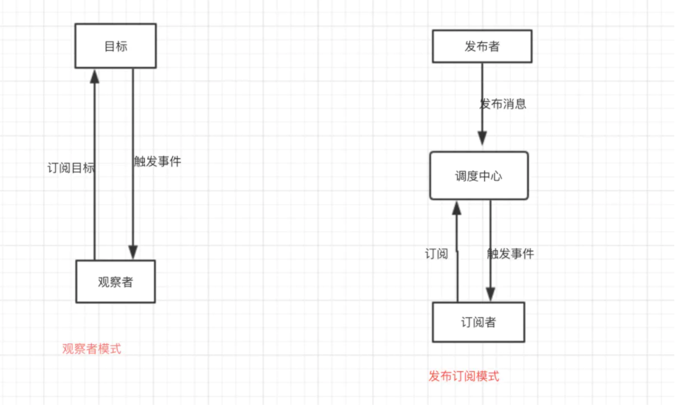

# 设计模式

一个模式就是一个可重用的方案，可应用于在软件设计中的常见问题 - 在我们的例子里 - 就是编写JavaScript的web应用程序。模式的另一种解释就是一个我们如何解决问题的模板

## 单例模式

> 保证一个类仅有一个实例，并且提供一个访问它的全局访问点

在 JavaScript 里，实现单例的方式有很多种，其中最简单的一个方式是使用对象字面量的方法，其字面量里可以包含大量的属性和方法

```js
var mySingleton = {
    property1: "something",
    property2: "something else",
    method1: function () {
        console.log('hello world');
    }
};
```

如果以后要扩展该对象，你可以添加自己的私有成员和方法，然后使用闭包在其内部封装这些变量和函数声明。只暴露你想暴露的 `public` 成员和方法，样例代码如下：

```js
var mySingleton = function () {

    /* 这里声明私有变量和方法 */
    var privateVariable = 'something private';
    function showPrivate() {
        console.log(privateVariable);
    }

    /* 公有变量和方法（可以访问私有变量和方法） */
    return {
        publicMethod: function () {
            showPrivate();
        },
        publicVar: 'the public can see this!'
    };
};

var single = mySingleton();
single.publicMethod();  // 输出 'something private'
console.log(single.publicVar); // 输出 'the public can see this!'
```

上面的代码很不错了，但如果我们想做到只有在使用的时候才初始化，那该如何做呢？为了节约资源的目的，我们可以另外一个构造函数里来初始化这些代码，如下：

```js
var Singleton = (function () {
    var instantiated;
    function init() {
        /*这里定义单例代码*/
        return {
            publicMethod: function () {
                console.log('hello world');
            },
            publicProperty: 'test'
        };
    }

    return {
        getInstance: function () {
            if (!instantiated) {
                instantiated = init();
            }
            return instantiated;
        }
    };
})();

/*调用公有的方法来获取实例:*/
Singleton.getInstance().publicMethod();
```

知道了单例如何实现了，但单例用在什么样的场景比较好呢？其实单例一般是用在系统间各种模式的通信协调上，下面的代码是一个单例的最佳实践：

```js
var SingletonTester = (function () {

    //参数：传递给单例的一个参数集合
    function Singleton(args) {

        //设置args变量为接收的参数或者为空（如果没有提供的话）
        var args = args || {};
        //设置name参数
        this.name = 'SingletonTester';
        //设置pointX的值
        this.pointX = args.pointX || 6; //从接收的参数里获取，或者设置为默认值
        //设置pointY的值
        this.pointY = args.pointY || 10;

    }

    //实例容器
    var instance;

    var _static = {
        name: 'SingletonTester',

        //获取实例的方法
        //返回Singleton的实例
        getInstance: function (args) {
            if (instance === undefined) {
                instance = new Singleton(args);
            }
            return instance;
        }
    };
    return _static;
})();

var singletonTest = SingletonTester.getInstance({ pointX: 5 });
console.log(singletonTest.pointX); // 输出 5 

```

### 其它实现方式

**方法1：**

```js
function Universe() {

    // 判断是否存在实例
    if (typeof Universe.instance === 'object') {
        return Universe.instance;
    }

    // 其它内容
    this.start_time = 0;
    this.bang = "Big";

    // 缓存
    Universe.instance = this;

    // 隐式返回this
}

// 测试
var uni = new Universe();
var uni2 = new Universe();
console.log(uni === uni2); // true
```

**方法2：**

```js
function Universe() {

    // 缓存的实例
    var instance = this;

    // 其它内容
    this.start_time = 0;
    this.bang = "Big";

    // 重写构造函数
    Universe = function () {
        return instance;
    };
}

// 测试
var uni = new Universe();
var uni2 = new Universe();
uni.bang = "123";
console.log(uni === uni2); // true
console.log(uni2.bang); // 123

```

**方法3：**

```js
var Universe;

(function () {

    var instance;

    Universe = function Universe() {

        if (instance) {
            return instance;
        }

        instance = this;

        // 其它内容
        this.start_time = 0;
        this.bang = "Big";
    };
} ());

//测试代码
var a = new Universe();
var b = new Universe();
alert(a === b); // true
a.bang = "123";
alert(b.bang); // 123

```

## 构造函数模式

在 JavaScript 里，构造函数通常是认为用来实现实例的，JavaScript 没有类的概念，但是有特殊的构造函数,你可以告诉 JavaScript 你要创建一个新对象并且新对象的成员声明都是构造函数里定义的。在构造函数内部，this关键字引用的是新创建的对象。基本用法如下：

```js
function Car(model, year, miles) {
    this.model = model;
    this.year = year;
    this.miles = miles;
    this.output= function () {
        return this.model + "走了" + this.miles + "公里";
    };
}

var tom= new Car("大叔", 2009, 20000);
var dudu= new Car("Dudu", 2010, 5000);

console.log(tom.output());
console.log(dudu.output());

```

上面的例子是个非常简单的构造函数模式，但是有点小问题 `output()` 在每次创建对象的时候都需要重新定义，最好的方法是让所有 `Car` 类型的实例都共享这个 `output()` 方法，这样如果有大批量的实例的话，就会节约很多内存

解决这个问题，我们可以使用如下方式：

```js
function Car(model, year, miles) {
    this.model = model;
    this.year = year;
    this.miles = miles;
    this.output= formatCar;
}

function formatCar() {
    return this.model + "走了" + this.miles + "公里";
}
```

### 构造函数与原型

JavaScript 里函数有个原型属性叫 `prototype` ，当调用构造函数创建对象的时候，所有该构造函数原型的属性在新创建对象的实例上都可用。按照这样，多个 `Car` 对象实例可以共享同一个原型，我们再扩展一下上例的代码：

```js
function Car(model, year, miles) {
    this.model = model;
    this.year = year;
    this.miles = miles;
}

/*
注意：这里我们使用了Object.prototype.方法名，而不是Object.prototype
主要是用来避免重写定义原型prototype对象
*/
Car.prototype.output= function () {
    return this.model + "走了" + this.miles + "公里";
};

var tom = new Car("大叔", 2009, 20000);
var dudu = new Car("Dudu", 2010, 5000);

console.log(tom.output());
console.log(dudu.output());
```

这里，`output()` 单实例可以在所有 `Car` 对象实例里共享使用

### 只能用new吗？

上面的例子对函数 `car` 都是用 `new` 来创建对象的，只有这一种方式么？其实还有别的方式，我们列举两种：

```js
function Car(model, year, miles) {
    this.model = model;
    this.year = year;
    this.miles = miles;
    // 自定义一个output输出内容
    this.output = function () {
        return this.model + "走了" + this.miles + "公里";
    }
}

//方法1：作为函数调用
Car("大叔", 2009, 20000);  //添加到window对象上
console.log(window.output());

//方法2：在另外一个对象的作用域内调用
var o = new Object();
Car.call(o, "Dudu", 2010, 5000);
console.log(o.output()); 
```

该代码的方法1有点特殊，如果不使用 `new` 直接调用函数的话，`this` 指向的是全局对象 `window` ，我们来验证一下：

```js
//作为函数调用
var tom = Car("大叔", 2009, 20000);
console.log(typeof tom); // "undefined"
console.log(window.output()); // "大叔走了20000公里"
```

这时候对象tom是undefined，而window.output()会正确输出结果，而如果使用new关键字则没有这个问题，验证如下:

```js
//使用new 关键字
var tom = new Car("大叔", 2009, 20000);
console.log(typeof tom); // "object"
console.log(tom.output()); // "大叔走了20000公里"
```

### 强制使用new

上述的例子展示了不使用 `new` 的问题，那么我们有没有办法让构造函数强制使用 `new` 关键字呢，答案是肯定的，上代码：

```js
function Car(model, year, miles) {
    if (!(this instanceof Car)) {
        return new Car(model, year, miles);
    }
    this.model = model;
    this.year = year;
    this.miles = miles;
    this.output = function () {
        return this.model + "走了" + this.miles + "公里";
    }
}

var tom = new Car("大叔", 2009, 20000);
var dudu = Car("Dudu", 2010, 5000);

console.log(typeof tom); // "object"
console.log(tom.output()); // "大叔走了20000公里"
console.log(typeof dudu); // "object"
console.log(dudu.output()); // "Dudu走了5000公里"
```

### 原始包装函数

JavaScript 里有3中原始包装函数：`number` , `string` , `boolean` ，有时候两种都用：

```js
// 使用原始包装函数
var s = new String("my string");
var n = new Number(101);
var b = new Boolean(true);


// 推荐这种
var s = "my string";
var n = 101;
var b = true;
```

只有在想保留数值状态的时候使用这些包装函数，关于区别可以参考下面的代码：

```js
// 原始string
var greet = "Hello there";
// 使用split()方法分割
greet.split(' ')[0]; // "Hello"
// 给原始类型添加新属性不会报错
greet.smile = true;
// 但无法获取这个值（18章ECMAScript实现里我们讲了为什么）
console.log(typeof greet.smile); // "undefined"

// 原始string
var greet = new String("Hello there");
// 使用split()方法分割
greet.split(' ')[0]; // "Hello"
// 给包装函数类型添加新属性不会报错
greet.smile = true;
// 可以正常访问新属性
console.log(typeof greet.smile); // "boolean"
```

## 建造者模式

建造者模式（Builder）可以将一个复杂对象的构建与其表示相分离，使得同样的构建过程可以创建不同的表示。也就是说如果我们用了建造者模式，那么用户只需要指定需要建造的类型就可以得到所需要的东西，而具体建造的过程和细节不需要知道。建造者模式实际，就是一个指挥者，一个建造者和一个用户。用户调用指挥者，指挥者调用具体建造者工作，建造者建造出具体的东西给用户。

建造者模式我们在代码中经常用到，比如Jquery中的ajax请求：

```js
//1 用户发送一个请求
//2 $.ajax建造者模式（指挥者）
//3 具体实现 （建造者）
$.ajax({
   url:'www.albertyy.com',
   success:function(argument){
      
    }
});
```

## 工厂模式

工厂模式定义一个用于创建对象的接口，这个接口由子类决定实例化哪一个类。该模式使一个类的实例化延迟到了子类。而子类可以重写接口方法以便创建的时候指定自己的对象类型

例子一：

```js
var Car = (function () {
    var Car = function (model, year, miles) {
        this.model = model;
        this.year = year;
        this.miles = miles;
    };
    return function (model, year, miles) {
        return new Car(model, year, miles);
    };
})();

var tom = new Car("Tom", 2009, 20000);
var dudu = new Car("Dudu", 2010, 5000);
```

举个使用例子：假如我们想在网页面里插入一些元素，而这些元素类型不固定，可能是图片，也有可能是连接，甚至可能是文本，根据工厂模式的定义，我们需要定义工厂类和相应的子类，我们先来定义子类的具体实现（也就是子函数）：

```js
var page = page || {};
page.dom = page.dom || {};
//子函数1：处理文本
page.dom.Text = function () {
    this.insert = function (where) {
        var txt = document.createTextNode(this.url);
        where.appendChild(txt);
    };
};

//子函数2：处理链接
page.dom.Link = function () {
    this.insert = function (where) {
        var link = document.createElement('a');
        link.href = this.url;
        link.appendChild(document.createTextNode(this.url));
        where.appendChild(link);
    };
};

//子函数3：处理图片
page.dom.Image = function () {
    this.insert = function (where) {
        var im = document.createElement('img');
        im.src = this.url;
        where.appendChild(im);
    };
};
```

那么我们如何定义工厂处理函数呢？其实很简单：

```js
page.dom.factory = function (type) {
    return new page.dom[type];
}
```

使用方式如下:

```js
var o = page.dom.factory('Link');
o.url = 'http://www.cnblogs.com';
o.insert(document.body);
```

### 总结

以下几种情景下工厂模式特别有用：

- 对象的构建十分复杂

- 需要依赖具体环境创建不同实例

- 需要依赖具体环境创建不同实例

**什么时候不该用工厂模式**

不滥用运用工厂模式，有时候仅仅只是给代码增加了不必要的复杂度，同时使得测试难以运行下去

## 装饰者模式

装饰者提供比继承更有弹性的替代方案。 装饰者用用于包装同接口的对象，不仅允许你向方法添加行为，而且还可以将方法设置成原始对象调用（例如装饰者的构造函数）。

装饰者用于通过重载方法的形式添加新功能，该模式可以在被装饰者前面或者后面加上自己的行为以达到特定的目的

```js
//需要装饰的类（函数）
function Macbook() {
    this.cost = function () {
        return 1000;
    };
}

function Memory(macbook) {
    this.cost = function () {
        return macbook.cost() + 75;
    };
}

function BlurayDrive(macbook) {
    this.cost = function () {
        return macbook.cost() + 300;
    };
}


function Insurance(macbook) {
    this.cost = function () {
        return macbook.cost() + 250;
    };
}


// 用法
var myMacbook = new Insurance(new BlurayDrive(new Memory(new Macbook())));
console.log(myMacbook.cost());
```

下面是另一个实例，当我们在装饰者对象上调用 `performTask` 时，它不仅具有一些装饰者的行为，同时也调用了下层对象的 `performTask` 函数

```js
function ConcreteClass() {
    this.performTask = function () {
        this.preTask();
        console.log('doing something');
        this.postTask();
    };
}

function AbstractDecorator(decorated) {
    this.performTask = function () {
        decorated.performTask();
    };
}

function ConcreteDecoratorClass(decorated) {
    this.base = AbstractDecorator;
    this.base(decorated);

    decorated.preTask = function () {
        console.log('pre-calling..');
    };

    decorated.postTask = function () {
        console.log('post-calling..');
    };

}

var concrete = new ConcreteClass();
var decorator1 = new ConcreteDecoratorClass(concrete);
var decorator2 = new ConcreteDecoratorClass(decorator1);
decorator2.performTask();
```

再来一个彻底的例子：

```js
var tree = {};
tree.decorate = function () {
    console.log('Make sure the tree won\'t fall');
};

tree.getDecorator = function (deco) {
    tree[deco].prototype = this;
    return new tree[deco];
};

tree.RedBalls = function () {
    this.decorate = function () {
        this.RedBalls.prototype.decorate(); // 第7步：先执行原型（这时候是Angel了）的decorate方法
        console.log('Put on some red balls'); // 第8步 再输出 red
        // 将这2步作为RedBalls的decorate方法
    }
};

tree.BlueBalls = function () {
    this.decorate = function () {
        this.BlueBalls.prototype.decorate(); // 第1步：先执行原型的decorate方法，也就是tree.decorate()
        console.log('Add blue balls'); // 第2步 再输出blue
        // 将这2步作为BlueBalls的decorate方法
    }
};

tree.Angel = function () {
    this.decorate = function () {
        this.Angel.prototype.decorate(); // 第4步：先执行原型（这时候是BlueBalls了）的decorate方法
        console.log('An angel on the top'); // 第5步 再输出angel
        // 将这2步作为Angel的decorate方法
    }
};

tree = tree.getDecorator('BlueBalls'); // 第3步：将BlueBalls对象赋给tree，这时候父原型里的getDecorator依然可用
tree = tree.getDecorator('Angel'); // 第6步：将Angel对象赋给tree，这时候父原型的父原型里的getDecorator依然可用
tree = tree.getDecorator('RedBalls'); // 第9步：将RedBalls对象赋给tree

tree.decorate(); // 第10步：执行RedBalls对象的decorate方法
```

### 总结

装饰者模式是为已有功能动态地添加更多功能的一种方式，把每个要装饰的功能放在单独的函数里，然后用该函数包装所要装饰的已有函数对象，因此，当需要执行特殊行为的时候，调用代码就可以根据需要有选择地、按顺序地使用装饰功能来包装对象。优点是把类（函数）的核心职责和装饰功能区分开了。

## 外观模式

外观模式（Facade）为子系统中的一组接口提供了一个一致的界面，此模块定义了一个高层接口，处理环境中的差异化部分

外观模式不仅简化类中的接口，而且对接口与调用者也进行了解耦。外观模式经常被认为开发者必备，它可以将一些复杂操作封装起来，并创建一个简单的接口用于调用。

外观模式经常被用于JavaScript类库里，通过它封装一些接口用于兼容多浏览器，外观模式可以让我们间接调用子系统，从而避免因直接访问子系统而产生不必要的错误。

外观模式的优势是易于使用，而且本身也比较轻量级。但也有缺点 外观模式被开发者连续使用时会产生一定的性能问题，因为在每次调用时都要检测功能的可用性。

下面是一段未优化过的代码，我们使用了外观模式通过检测浏览器特性的方式来创建一个跨浏览器的使用方法。

```js
var addMyEvent = function (el, ev, fn) {
    if (el.addEventListener) {
        el.addEventListener(ev, fn, false);
    } else if (el.attachEvent) {
        el.attachEvent('on' + ev, fn);
    } else {
        el['on' + ev] = fn;
    }
}; 
```
再来一个简单的例子，说白了就是用一个接口封装其它的接口：

```js
var mobileEvent = {
    // ...
    stop: function (e) {
        e.preventDefault();
        e.stopPropagation();
    }
    // ...
};
```

### 总结

那么何时使用外观模式呢？一般来说分三个阶段：

首先，在设计初期，应该要有意识地将不同的两个层分离，比如经典的三层结构，在数据访问层和业务逻辑层、业务逻辑层和表示层之间建立外观 Facade。

其次，在开发阶段，子系统往往因为不断的重构演化而变得越来越复杂，增加外观Facade可以提供一个简单的接口，减少他们之间的依赖。

第三，在维护一个遗留的大型系统时，可能这个系统已经很难维护了，这时候使用外观Facade也是非常合适的，为系统开发一个外观Facade类，为设计粗糙和高度复杂的遗留代码提供比较清晰的接口，让新系统和Facade对象交互，Facade与遗留代码交互所有的复杂工作。

## 迭代器模式

迭代器模式(Iterator)：提供一种方法顺序一个聚合对象中各个元素，而又不暴露该对象内部表示。

迭代器的几个特点是：

- 访问一个聚合对象的内容而无需暴露它的内部表示。

- 为遍历不同的集合结构提供一个统一的接口，从而支持同样的算法在不同的集合结构上进行操作。

- 遍历的同时更改迭代器所在的集合结构可能会导致问题（比如C#的foreach里不允许修改item）

```js
var agg = (function () {
    var index = 0,
    data = [1, 2, 3, 4, 5],
    length = data.length;

    return {
        next: function () {
            var element;
            if (!this.hasNext()) {
                return null;
            }
            element = data[index];
            index = index + 2;
            return element;
        },

        hasNext: function () {
            return index < length;
        },

        rewind: function () {
            index = 0;
        },

        current: function () {
            return data[index];
        }

    };
} ());

```
使用方法和平时C#里的方式是一样的：

```js
// 迭代的结果是：1,3,5
while (agg.hasNext()) {
    console.log(agg.next());
}
```

当然，你也可以通过额外的方法来重置数据，然后再继续其它操作：

```js
// 重置
agg.rewind();
console.log(agg.current()); // 1

```

像数组`map`方法也是一种迭代器方法

## 观察者模式

观察者模式定义了对象间的一种一对多的依赖关系，当一个对象的状态发生改变时，所有依赖于它的对象都将得到通知，并自动更新。观察者模式属于行为型模式，行为型模式关注的是对象之间的通讯，观察者模式就是观察者和被观察者之间的通讯

目标和观察者是基类，**目标提供维护观察者的一系列方法，观察者提供更新接口**。具体观察者和具体目标继承各自的基类，然后具体观察者把自己注册到具体目标里，在具体目标发生变化时候，调度观察者的更新方法

使用观察者模式的好处：

- 支持简单的广播通信，自动通知所有已经订阅过的对象。

- 目标对象与观察者之间的抽象耦合关系能够单独扩展以及重用

- 发布者与订阅者耦合性降低，发布者只管发布一条消息出去，它不关心这条消息如何被订阅者使用，同时，订阅者只监听发布者的事件名，只要发布者的事件名不变，它不管发布者如何改变；

观察者模式的缺点：

1. 创建订阅者需要消耗一定的时间和内存。

2. 虽然可以弱化对象之间的联系，如果过度使用的话，反而使代码不好理解及代码不好维护等等。

在JavaScript中观察者模式常用于事件绑定中

```js
div.onclick = function click (){
   alert ( 'click' )
}
```

我们希望用户点击 `div` 的时候，触发一下 `alert ( 'click' )` ，但是我们并不确定用户什么时候会触发点击事件，所以在 `div` 上订阅执行事件，当用户点击了 `div` ，那么就会执行函数

这里订阅者就是执行函数、订阅了 `div` 的 `click` 事件

```js
// 观察者
class Observer {
    constructor() {

    }
    update(val) {

    }
}
// 观察者列表
class ObserverList {
    constructor() {
        this.observerList = []
    }
    add(observer) {
        return this.observerList.push(observer);
    }
    remove(observer) {
        this.observerList = this.observerList.filter(ob => ob !== observer);
    }
    count() {
        return this.observerList.length;
    }
    get(index) {
        return this.observerList[index];
    }
}
// 目标
class Subject {
    constructor() {
        this.observers = new ObserverList();
    }
    addObserver(observer) {
        this.observers.add(observer);
    }
    removeObserver(observer) {
        this.observers.remove(observer);
    }
    notify(...args) {
        let obCount = this.observers.count();
        for (let index = 0; index < obCount; index++) {
            this.observers.get(i).update(...args);
        }
    }
}
```

## 发布-订阅者模式

发布-订阅者模式是观察者模式的一个别称，但是经过时间的沉淀，似乎他已经强大了起来，已经独立于观察者模式，成为另外一种不同的设计模式

在现在的发布订阅模式中，称为发布者的消息发送者不会将消息直接发送给订阅者，这意味着发布者和订阅者不知道彼此的存在。在发布者和订阅者之间存在第三个组件，称为调度中心或事件通道，它维持着发布者和订阅者之间的联系，过滤所有发布者传入的消息并相应地分发它们给订阅者


```js
 function obs() {
    const obj = {}
    const _this = this
    const listen = function (key, fn) {
      const tmp = obj[key] ? obj[key] : obj[key] = []
      tmp.push(fn)
      console.log(`${key}成功添加订阅消息${fn}`)
    }
    const one = function (key, fn) {
      _this.moveAll(key)
      _this.listen(key, fn)
    }
    const moveAll = function (key) {
      if(obj[key]) {
        obj[key].length = 0
        console.log(`${key}成功取消所有订阅消息`)
      }
    }
    const moveOne = function (key, fn) {
      if(obj[key]) {
        const findIndex = obj[key].findIndex(item => item === fn)
        obj[key].splice(findIndex, 1)
        console.log(`${key}成功取消订阅消息${fn}`)
      }
    }
    const send = function () {
      // 取第一个参数
      const key = Array.prototype.shift.call(arguments)
      const list = obj[key]
      if(list) {
        list.forEach((fn) => {
          fn()
        })
      }
    }
    const get = function () {
      return obj
    }
    return {
      listen,
      one,
      moveOne,
      moveAll,
      send,
      get
    }
  }
  const newObs = obs()
  const role1Fn = function () {
    console.log('我是role1，吃饭')
  }
  const role2Fn = function () {
    console.log('我是role2，游泳')
  }
  const role2Fn2 = function () {
    console.log('我是role2，再来一次游泳')
  }
  newObs.listen('role1', role1Fn) // role1成功添加订阅消息function () {  console.log('我是role1，吃饭') }
  newObs.listen('role2', role2Fn) // role1成功添加订阅消息function () {  console.log('我是role2，游泳') }
  newObs.listen('role2', role2Fn2)// role1成功添加订阅消息function () {  console.log('我是role2，再来一次游泳') }
  console.log('当前订阅：')
  console.log(newObs.get())
  newObs.moveOne('role2', role2Fn2)
  console.log('当然订阅：')
  console.log(newObs.get())
  newObs.send('role2') // 我是role2，游泳, 我是role2，再来一次游泳
```

### 观察者模式和发布订阅模式的区别

观察者模式和发布订阅模式最大的区别就是发布订阅模式有个事件调度中心



从图中可以看出，观察者模式中观察者和目标直接进行交互，而发布订阅模式中统一由调度中心进行处理，订阅者和发布者互不干扰。这样一方面实现了解耦，还有就是可以实现更细粒度的一些控制。比如发布者发布了很多消息，但是不想所有的订阅者都接收到，就可以在调度中心做一些处理，类似于权限控制之类的。还可以做一些节流操作

从例子代码可以看出，观察者模式由具体目标调度，每个被订阅的目标里面都需要有对观察者的处理，会造成代码的冗余。而发布订阅模式则统一由调度中心处理，消除了发布者和订阅者之间的依赖。

[观察者模式与订阅发布模式的区别](https://www.cnblogs.com/onepixel/p/10806891.html)