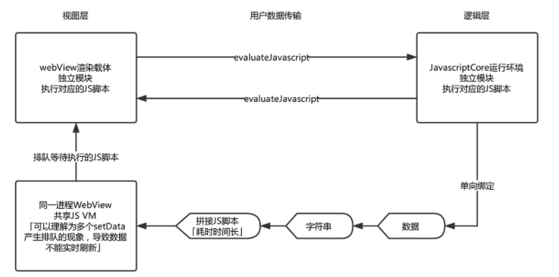
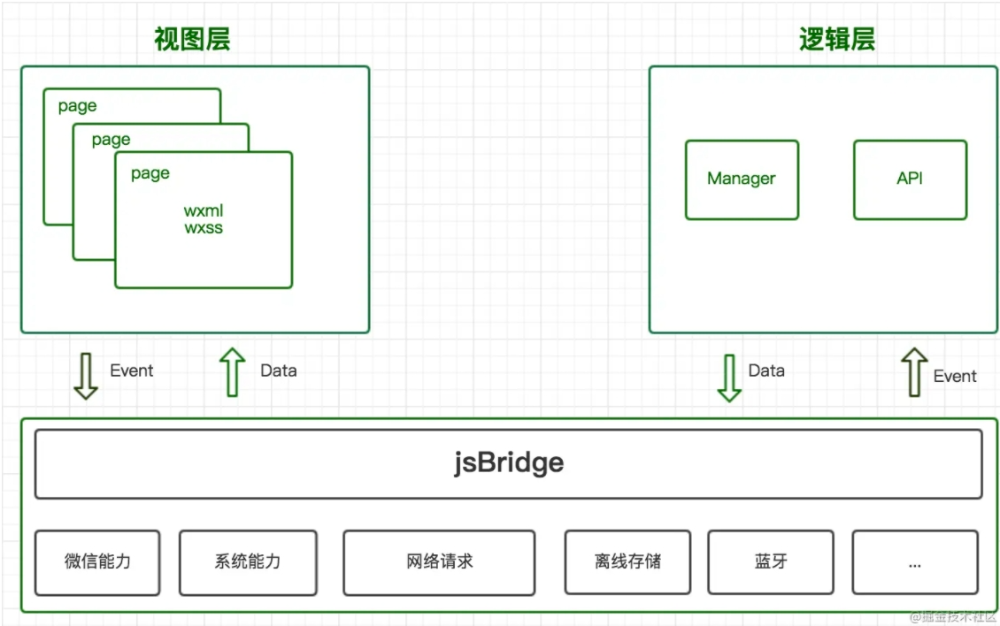

# 微信小程序运行原理

微信小程序介于 web 与 原生app 之间的混合app，具备丰富的调用手机各种功能的接口，同时又具备灵活性，跨平台

## 基本特点

### 小程序与普通网页开发的区别

- 网页开发中，渲染线程JS线程是互斥的，这也是为什么长时间的脚本运行可能会导致页面失去响应，两者可以直接进行通信

- 小程序的逻辑层和渲染层是分开的，分别运行在不同的线程中，所不能直接进行通信。同时借助微信提供的API可以调用原生功能
 
### 小程序目录结构

```
project
├── pages
|   ├── index
|   |   ├── index.json  index 页面配置
|   |   ├── index.js    index 页面逻辑
|   |   ├── index.wxml  index 页面结构
|   |   └── index.wxss  index 页面样式表
|   └── log
|       ├── log.json    log 页面配置
|       ├── log.wxml    log 页面逻辑
|       ├── log.js      log 页面结构
|       └── log.wxss    log 页面样式表
├── app.js              小程序逻辑
├── app.json            小程序公共设置
└── app.wxss            小程序公共样式表
```

### 为什么小程序快

- 安装包缓存

- 分包加载

- 独立渲染线程

- Webview 预加载

- Native组件


### 小程序启动加载

小程序启动会有两种情况，一种是「冷启动」，一种是「热启动」。

- 热启动：假如用户已经打开过某小程序，然后在一定时间内再次打开该小程序，此时无需重新启动，只需将后台态的小程序切换到前台，这个过程就是热启动

- 冷启动：指的是用户首次打开或小程序被微信主动销毁后再次打开的情况，此时小程序需要重新加载启动。

### 更新机制

小程序冷启动时如果发现有新版本，将会异步下载新版本的代码包，并同时用客户端本地的包进行启动，即新版本的小程序需要等下一次冷启动才会应用上。
如果需要马上应用最新版本，可以使用 `wx.getUpdateManager` API 进行处理。

### 运行机制

- 小程序没有重启的概念

- 当小程序进入后台，客户端会维持一段时间的运行状态，超过一定时间后（目前是5分钟）会被微信主动销毁

- 当短时间内（5s）连续收到两次以上收到系统内存告警，会进行小程序的销毁

### 执行环境

微信小程序运行在三端：iOS、Android 和 用于调试的开发者工具

三端的脚本执行环境以及用于渲染非原生组件的环境是各不相同的：

- 在 iOS 上，小程序的 javascript 代码是运行在 JavaScriptCore 中，是由 WKWebView 来渲染的，环境有 iOS8、iOS9、iOS10

- 在 Android 上，小程序的 javascript 代码是通过 X5 JSCore来解析，是由 X5 基于 Mobile Chrome 53/57 内核来渲染的

- 在 开发工具上， 小程序的 javascript 代码是运行在 nwjs 中，是由 Chrome Webview 来渲染的

### 小程序基础库

小程序基础库就同 JS-SDK 类似，为当前应用调起手机系统能力和微信能力，两者的不同点在于：

- 支持的API：小程序基础库对系统能力和微信能力做了更全面的封装，包括网络请求、存储等，而网页版JS-SDK相应的功能直接调用window能力

- 引入方式：小程序基础库直接集成到微信的不同版本中，JS-SDK是以一个js文件的形式被引入项目里；

#### 小程序基础库与微信客户端之间的关系

小程序的能力需要微信客户端来支撑，每一个基础库都只能在对应的客户端版本上运行，高版本的基础库无法兼容低版本的微信客户端

官方的这种说法存在一些问题。现在基础库版本和客户端版本并不是一一对应关系。客户端可以主动升级小程序基础库版本达到灰度上线新版的目的，所以必然存在一个客户端版本对应多个基础库版本的情况

**小程序基础库更新时机**

为了避免新版本的基础库给线上小程序带来未知的影响，微信客户端都是携带 上一个稳定版 的基础库发布的。  
在新版本客户端发布后，我们再通过后台灰度新版本基础库，灰度时长一般为 12 小时，在灰度结束后，用户设备上才会有新版本的基础库

以微信 6.5.8 为例，客户端在发布时携带的是 1.1.1 基础库（6.5.7上已全量的稳定版）发布，在 6.5.8 发布后，我们再通过后台灰度 1.2.0 基础库。

“细思恐极”，如果我们已经完成一台装有 6.5.4 版本微信的Oppo手机对小程序的兼容测试，很有可能过几天这台Oppo手机将小程序基础库更新到新版本导致小程序不可用。建议：了解产品的用户手机微信版本分布，确定回归覆盖范围，完成回归测试。

### 小程序开发特点

小程序存在的问题

- 小程序仍然使用WebView渲染，并非原生渲染
  
- 需要独立开发，不能在非微信环境运行

- 开发者不可以扩展新组件

- WXSS中无法使用本地（图片、字体等）

- WXSS转化成js 而不是css。

- WXSS不支持级联选择器

小程序的优点

- 提前新建 WebView，准备新页面渲染

- 使用 Virtual DOM，进行局部更新

- 全部使用 `https`，确保传输中安全

- 加入 `rpx` 单位，隔离设备尺寸，方便开发

## 小程序架构

这是一个比较通用的小程序架构，目前几家小程序架构设计大致都是这样的


微信小程序的框架包含两部分：

- `App Service逻辑层`：App Service逻辑层(一个)用来逻辑处理、数据请求、接口调用，它们在两个线程里运行，逻辑层使用JSCore运行

- `View层`：View视图层(可能存在多个)用来渲染页面结构， 使用WebView渲染

**逻辑层**

逻辑层就是上图左上角这块，小程序中开发的所有页面JS代码，最后都会打包合并到逻辑层，逻辑层除了执行开发者的业务JS代码外，还需处理小程序框架的内置逻辑，比如App生命周期管理

逻辑层最后运行在JS CORE或V8环境中；JS CORE既不是DOM环境，也不是node环境，所以无法使用 JS 中的 DOM 或 BOM 对象的，你能调用的仅仅是 ECMAScript 标准规范中所给出的方法  
那如果你要发送网络请求怎么办？`window.XMLHttpRequest` 是无法使用的。这时候，网络请求就需要通过原生的网络模块来发送

**视图层**

视图层就是上图右上角这块，用户可见的UI效果、可触发的交互事件在视图层完成

### 通信

视图层和逻辑层通过系统层的 `WeixinJsBridage` 进行通信，逻辑层把数据变化通过 `setData` 通知到视图层，触发视图层页面更新；视图层通过事件触发事件通知到逻辑层进行业务处理，下面我们详细说明他们的细节原理


这张生命周期图非常详尽的描述了一个页面从创建入栈、数据交互、销毁出栈的整个过程。在页面渲染和使用过程中会出现大量的事件，而这些事件会被JsBridge捕获到，并传递给逻辑层处理，主要包括：生命周期事件、UI事件

**生命周期事件**

视图进程在完成阶段性工作后，需要向逻辑层同步其当前状态以便逻辑层做出应对策略。主要包括：`onLoad`、`onReady`、`onShow`、`onHide`、`onUnload`、`onPullDownRefresh`、`onReachBottom`、`onShareAppMessage` 等

**UI事件**

视图层向逻辑层的通信方式  

这类事件绑定在组件上，触发则可以将用户的行为反馈到逻辑层对应的注册函数，如 `bindtap`、`bindinput`、`bindconfirm`、`bindfocus`、`bindsubmit`、`bindchange`、`bindlinechange` 等

**Page.prototype.setData()**

逻辑层向视图层发送数据更新并触发页面渲染的方式

数据的传输实际上是通过两边提供的 `evaluateJavascript` 所实现。即用户传输的数据，需要将其转换为字符串形式传递，同时把转换后的数据内容拼接成一份 JS 脚本，再通过执行 JS 脚本的形式传递到两边独立环境。

`setData` 工作原理图：




而 `evaluateJavascript` 的执行会受很多方面的影响，数据到达视图层并不是实时的。所以我们的 `setData` 函数将数据从逻辑层发送到视图层，是异步的



这张图展示了视图层、逻辑层之间通信方式,以及JsBridge起到纽带的作用。我们可以做以下几点总结：

- 视图层和逻辑层分开在两个线程中运行

- 视图层、逻辑层通过事件完成通信

- JsBridge一方面传递基础功能，另一方面做视图层和逻辑层的数据传递工作

## 架构缺陷与优化手段

小程序这种架构主要有两大好处

1. 不能直接操控 DOM，一定程度保护页面的安全性

2. 最大的好处是新页面加载可以并行，让页面加载更快，即使业务逻辑计算非常繁忙，也不会阻塞渲染和用户在视图层上的交互

但同时也引发了部分性能坑点，主要体现通信性能方面

### 逻辑层/视图层通讯阻塞

小程序的运行环境分为逻辑层和视图层，分别由2个线程管理。数据更新及事件系统只能靠线程间通讯，但跨线程通信的成本极高，特别是需要频繁通信的场景  
比如需要监听页面滚动或者手指滑动事件去做交互功能时，高频率的回调导致通讯成本大幅增加，极有可能导致页面卡顿或抖动。为什么会卡顿，因为通讯太过频繁，视图层响应更新跟不上（无法在16毫秒内完成UI更新）

**优化手段：所以平时应该要尽量少得去调用 `setData`，控制制作频率**

### 数据差量更新

上文了解到逻辑层和视图层的数据传递需要将数据转成字符串再拼接成 JS 脚本，通过执行脚本的形式进行更新通知，所以当数据量过大时会增加脚本的编译执行时间

**优化手段：差量更新、控制数据结构的大小和深度（官方限制data数据量最大为1024K)**

假设有一个 `userinfo` 对象，当更新了姓名字段时，我们可能使用下面代码进行更新

```js
this.setData({
    userinfo: {
    ...this.data.userinfo,
    age: 99  
  }
})
```

如上代码， 会将完整的 `userinfo` 对象通过 `setData` 全部传输过去，而实际上变化的数据只有 `age` 一个属性

开发者在这种场景下，应通过差量计算，仅通过 `setData` 传递变化的数据，如下是一个示例代码:

```js
this.setData({
    'userinfo.age': 99
})
```

这样可实现传递数据量的最小化，提升通讯性能

:::tip
现在一些成熟的小程序三方框架已经自动封装差量数据计算，比如 uni-app 借鉴了 `westore JSON Diff` 库，在调用 `setData` 之前，会先比对历史数据，精确高效计算出有变化的差量数据
:::

### 组件差量更新

微信小程序的视图更新的颗粒度是组件级别的


比如上面的图例，将点赞数发生变化时，在传统模式下会造成整个页面产生的 diff 操作再做视图更新，计算效率极低

**优化手段：将高频更新的区域独立做成组件（例子中的点赞部分），这样 diff 的范围就会控制在组件级别**

## [官方优化建议](https://developers.weixin.qq.com/miniprogram/dev/framework/performance/tips/start.html)

### 启动性能优化

**代码包体积优化**

启动性能优化的核心手段是降低代码包大小，代码包大小直接影响了下载耗时，影响用户启动小程序时的体验。

开发者可以采取以下手段优化代码包大小：

- [分包加载](https://developers.weixin.qq.com/miniprogram/dev/framework/subpackages/basic.html)

- [分包预下载](https://developers.weixin.qq.com/miniprogram/dev/framework/subpackages/preload.html)

- [独立分包](https://developers.weixin.qq.com/miniprogram/dev/framework/subpackages/independent.html)

- [分包导步化](https://developers.weixin.qq.com/miniprogram/dev/framework/subpackages/async.html)

**代码重构和优化**

通过代码重构，降低代码冗余。在使用如 Webpack 等打包工具时，要尽量利用 `tree-shaking` 等特性去除冗余代码，也要注意防止打包时引入不需要的库和依赖

**控制代码包内图片等资源**

避免在代码包中包含或在 WXSS 中使用 base64 内联过多、过大的图片，应尽量采用网络图片。代码包内的图片一般应只包含一些体积较小的图标。音频、视频、字体等其他类型的资源也应尽量避免放到代码包中。

小程序代码包在下载时会使用 ZSTD 算法进行压缩，这些资源文件会占用大量代码包体积，并且通常难以进一步被压缩，对于下载耗时的影响比代码文件大得多

**及时清理没有使用到的代码和资源**
在日常开发的时候，我们可能引入了一些新的库文件，而过了一段时间后，由于各种原因又不再使用这个库了，我们常常会只是去掉了代码里的引用，而忘记删掉这类库文件了。

目前小程序打包是会将工程下所有文件都打入代码包内，也就是说，这些没有被实际使用到的库文件和资源也会被打入到代码包里，从而影响到整体代码包的大小。建议使用微信开发者工具提供的「[代码静态依赖分析](https://developers.weixin.qq.com/miniprogram/dev/devtools/codeanalyse.html)」来分析代码包的文件构成和依赖关系，以此优化代码包大小和内容

**减少启动过程的同步调用**

在小程序启动流程中，会注入开发者代码并顺序同步执行 `App.onLaunch`, `App.onShow`, `Page.onLoad`, `Page.onShow`。在小程序初始化代码（Page，App 定义之外的内容）和启动相关的几个生命周期中，应避免执行复杂的计算逻辑或过度使用 `Sync` 结尾的同步 API，如 `wx.getStorageSync`，`wx.getSystemInfoSync` 等。对于 `getSystemInfo`, `getSystemInfoSync` 的结果应进行缓存，避免重复调用

**[使用按需注入](https://developers.weixin.qq.com/miniprogram/dev/framework/ability/lazyload.html#%E6%8C%89%E9%9C%80%E6%B3%A8%E5%85%A5)**

通常情况下，在小程序启动时，启动页面所在分包和主包（独立分包除外）的所有 JS 代码会全部合并注入，包括其他未访问的页面以及未用到自定义组件，造成很多没有使用的代码注入到小程序运行环境中，影响注入耗时和内存占用。

自基础库版本 2.11.1 起，可以通过开启「按需注入」特性避免无用代码注入，以降低小程序的启动时间和运行时内存

```js
{
  "lazyCodeLoading": "requiredComponents"
}
```

**[使用用时注入](https://developers.weixin.qq.com/miniprogram/dev/framework/ability/lazyload.html#%E7%94%A8%E6%97%B6%E6%B3%A8%E5%85%A5)**

在打开上述「按需注入」特性的前提下，可以通过「用时注入」特性进一步使一部分自定义组件不在启动时注入，而是在真正被渲染时才进行注入，进一步降低小程序的启动和首屏时间

**提前首屏数据请求**

大部分小程序在渲染首页时，需要依赖服务端的接口数据，小程序为开发者提供了提前发起数据请求的能力：

- [数据预拉取](https://developers.weixin.qq.com/miniprogram/dev/framework/ability/pre-fetch.html)：能够在小程序冷启动的时候通过微信后台提前向第三方服务器拉取业务数据，当代码包加载完时可以更快地渲染页面，减少用户等待时间，从而提升小程序的打开速度。

- [周期性更新](https://developers.weixin.qq.com/miniprogram/dev/framework/ability/background-fetch.html)：在用户未打开小程序的情况下，也能从服务器提前拉取数据，当用户打开小程序时可以更快地渲染页面，减少用户等待时间

**骨架屏**

在页面数据未准备好时（如需要通过网络获取），尽量避免展示空白页面，应先通过骨架屏展示页面的大致结构，请求数据返回后在进行页面更新。以提升用户的等待意愿

**缓存请求数据**

小程序提供了 `wx.setStorage`、`wx.getStorage` 等读写本地缓存的能力，数据存储在本地，返回的会比网络请求快。如果开发者基于某些原因无法采用数据预拉取与周期性更新，我们推荐优先从缓存中获取数据来渲染视图，等待网络请求返回后进行更新

**精简首屏数据**

我们推荐开发者延迟请求非关键渲染数据，与视图层渲染无关的数据尽量不要放在 `data` 中，加快页面渲染完成时间

**启用「初始渲染缓存」**

自基础库版本 2.11.1 起，小程序支持[初始渲染缓存](https://developers.weixin.qq.com/miniprogram/dev/framework/view/initial-rendering-cache.html)，可以在非首次启动时，使视图层不需要等待逻辑层初始化完毕，而直接提前将页面初始 `data` 的渲染结果展示给用户，这可以使得页面对用户可见的时间大大提前。

**数据预加载**

> [微信小程序之提高应用速度小技巧](https://segmentfault.com/a/1190000016072570)

原理

小程序在启动时，会直接加载所有页面逻辑代码进内存，即便 page2 可能都不会被使用。在 page1 跳转至 page2 时，page1 的逻辑代码 Javascript 数据也不会从内存中消失。
page2 甚至可以直接访问 page1 中的数据

小程序的这种机制差异正好可以更好的实现预加载。通常情况下，我们习惯将数据拉取写在 onLoad 事件中。但是小程序的 page1 跳转到 page2，到 page2 的 onLoad 是存在一个 300ms ~ 400ms 的延时的。如下图：

在 `pageA` 跳到 `pageB` 的时候，在 `pageB` 使用 `onNavigate` 生命周期来在页面B即将被加载时运行

### 运行时性能优化

#### setData 使用

常见的 `setData` 操作错误

- 频繁的去 `setData`
  
  在我们分析过的一些案例里，部分小程序会非常频繁（毫秒级）的去 `setData`，其导致了两个后果：
  
  - Android 下用户在滑动时会感觉到卡顿，操作反馈延迟严重，因为 JS 线程一直在编译执行渲染，未能及时将用户操作事件传递到逻辑层，逻辑层亦无法及时将操作处理结果及时传递到视图层；

    渲染有出现延时，由于 WebView 的 JS 线程一直处于忙碌状态，逻辑层到页面层的通信耗时上升，视图层收到的数据消息时距离发出时间已经过去了几百毫秒，渲染的结果并不实时；
    
- 每次 `setData` 都传递大量新数据

   由 `setData` 的底层实现可知，我们的数据传输实际是一次 `evaluateJavascript` 脚本过程，当数据量过大时会增加脚本的编译执行时间，占用 WebView JS 线程

- 当页面进入后台态（用户不可见），不应该继续去进行 `setData`，后台态页面的渲染用户是无法感受的，另外后台态页面去 `setData` 也会抢占前台页面的执行。

#### 图片资源

目前图片资源的主要性能问题在于大图片和长列表图片上，这两种情况都有可能导致 iOS 客户端内存占用上升，从而触发系统回收小程序页面

在 iOS 上，小程序的页面是由多个 WKWebView 组成的，在系统内存紧张时，会回收掉一部分 WKWebView。从过去我们分析的案例来看，大图片和长列表图片的使用会引起 WKWebView 的回收。

除了内存问题外，大图片也会造成页面切换的卡顿。我们分析过的案例中，有一部分小程序会在页面中引用大图片，在页面后退切换中会出现掉帧卡顿的情况。

当前我们建议开发者尽量减少使用大图片资源

> [微信小程序运行流程看这篇就够了](https://juejin.im/post/5afd136551882542682e6ad7)  
> [深入解读-微信小程序SDK](https://juejin.cn/post/6844903485691920392#heading-13)  
> [浅谈小程序运行机制](https://developers.weixin.qq.com/community/develop/article/doc/0008a4c4f28f30fe3eb863b2750813)

## 小程序实现Mixin

在小程序中，每个页面都由 `Page(options)` 函数定义，而 `Mixins` 则作用于这个函数当中的 `options` 对象。因此我们实现 `Mixins` 的思路就有了——劫持并改写 `Page` 函数，最后再重新把它释放出来

新建一个 `mixins.js` 文件：

```js
// 保存原生的 Page 函数
const originPage = Page

Page = (options) => {
  const mixins = options.mixins
  // mixins 必须为数组
  if (Array.isArray(mixins)) {
    delete options.mixins
    // mixins 注入并执行相应逻辑
    options = merge(mixins, options)
  }
  // 释放原生 Page 函数
  originPage(options)
}
```

但是混入时需要注意几点：

1. 对于 `data`, `properties`, `options` 这类内置的属性以及自定义的方法，混入的规则是能合并则合并，碰到同属性则以页面的属性为优先

2. 对于生命周期类的函数，页面的生命周期和 `mixin` 的生命周期都应该要执行，不能直接覆盖

所以上例中的 `merge` 方法的实现如下：

```js
// 定义小程序内置的属性/方法
const originProperties = ['data', 'properties', 'options']
const originMethods = ['onLoad', 'onReady', 'onShow', 'onHide', 'onUnload', 'onPullDownRefresh', 'onReachBottom', 'onShareAppMessage', 'onPageScroll', 'onTabItemTap']

function merge (mixins, options) {
  mixins.forEach((mixin) => {
    if (Object.prototype.toString.call(mixin) !== '[object Object]') {
      throw new Error('mixin 类型必须为对象！')
    }
    // 遍历 mixin 里面的所有属性
    for (let [key, value] of Object.entries(mixin)) {
      if (originProperties.includes(key)) {
        // 内置对象属性混入
        options[key] = { ...value, ...options[key] }
      } else if (originMethods.includes(key)) {
        // 内置方法属性混入，优先执行混入的部分
        const originFunc = options[key]
        options[key] = function (...args) {
          value.call(this, ...args)
          return originFunc && originFunc.call(this, ...args)
        }
      } else {
        // 自定义方法混入
        options = { ...mixin, ...options }
      }
    }
  })
  return options
}
```

**Mixins 使用**

1. 在小程序的 app.js 里引入 mixins.js

```js
require('./mixins.js')
```

2. 撰写一个 myMixin.js

```js
module.exports = {
  data: { someData: 'myMixin' },
  onShow () { console.log('Log from mixin!') }
}
```

3. 在 `pages/index/index.js` 中使用

```js
Page({
  mixins: [require('../../myMixin.js')]
})
```

注意这样使用只有 `pages/index/index.js` 页面将混入配置的 `mixins`

如果希望全局所有页面都混入 `mixins`，需要在 `mixins.js` 配置直接混入配置

如： 

```js
const originPage = Page

let globalMinxin = [
  {
    onShow () { console.log('Log from globalMinxin!') }
  }
]
Page = (options) => {
  const mixins = options.mixins
  // mixins 必须为数组
  if (Array.isArray(mixins)) {
    delete options.mixins
    // mixins 注入并执行相应逻辑
    options = merge(globalMinxin, options)
    options = merge(mixins, options)
  }
  // 释放原生 Page 函数
  originPage(options)
}
```

## 小程序异常监控实现方案

小程序 `App()` 生命周期里提供了 `onError` 函数，可以通过在 `onError` 里收集异常信息

```js
App({
  // 监听错误
  onError: function (err) {
    // 上报错误
    console.log('onError', err)
  }
})
```

**函数调用跟踪**

只有错误栈信息排查起来会比较难，因此我们可以记录函数的调用来方便来收集用户的操作路径

实现方法类型上文提到的扩展 App 中钩子类似，我们可以劫持页面上的方法来记录函数的调用

```js
const originPage = Page
Page = (options) => {
  Object.keys(options).forEach((methodName) => {
    typeof options[methodName] === 'function'
      && recordPageFn(options, methodName);
  });
  // 释放原生 Page 函数
  originPage(options)
}

function recordPageFn(page, methodName) {
  const userDefinedMethod = page[methodName];
  page[methodName] = function () {
    const breadcrumb = {
      type: 'function',
      belong: 'Page',
      method: methodName,
      arguments: arguments
    };
    console.log(breadcrumb)
    return userDefinedMethod && userDefinedMethod.apply(this, arguments);
  };
}
```

这就可以页面函数的调用记录了

**上报策略**

考虑到在大型应用中，日志量比较大，我们采取抽样，合并，过滤三个方法减少日志的输出

更多的实现细节参考这个 [xbossdebug](https://github.com/zhengguorong/xbossdebug-wechat) 的实现

> [小程序异常监控收集](https://developers.weixin.qq.com/community/develop/doc/000e46078b015804f6d6c2dc156006)

> [小程序的当下和未来可能 | 崔红保在GMTC 深圳站演讲内容整理](https://juejin.cn/post/6844904046709440519#heading-8)

## 小程序埋点设计

常规的埋点，一般是在页面的生命周期钩子处和触发事件的地方手动添加埋点收集方法，这种方法埋点比较准确但是需要一个一个手动添加埋点且缺少灵活性

所以本文收集一下给小程序埋点的正确方案

### 页面加载的埋点

页面加载的埋点可以使用上文所说的扩展 `Page` 添加 `Mixin` 的方式进行处理

### 元素埋点-冒泡埋点

为了省去给元素一个个添加事件这种烦锁的步骤，可以模仿事件委托的方式进行统一的事件处理

在页面根元素添加事件，当点击页面中的元素的时候就会冒泡到根元素，触发绑定的事件（假设函数名为 `elementTracker`），对于该函数的定义可以使用扩展Page方法进行添加

**扩展Page方法**

```js
// 记录原Page方法
const originPage = Page;
// 重写Page方法
Page = (page) => {
  // 给page对象注入三个方法
  page.elementTracker = function() {}
  page.methodTracker = function() {}
  page.isClickTrackArea = function() {}
  return originPage(page);
};
```

冒泡采集这种方法比较轻量级，无需注入大量代码。但是依赖于冒泡事件，假如原来的业务代码阻止了冒泡，那就获取不了，可靠性比较差

所以从逻辑层下手：在渲染层触发的点击事件都会传递到逻辑层，所以可以从逻辑层入手，对逻辑层的每个函数提供 hook 方法，在 hook 中捕获到用户的点击事件

具体实现：在小程序启动的时候，重构 `Page()` 和 `Component()` 这两个系统对象，遍历对象里面的所有属性，如果属性类型是函数，则进一步判断是否在忽略名单，像监听页面滚动的函数这种是不需要添加 hook 的，最后才是给函数添加 hook

```js
// 保存原生的 Page 函数
// 保存原生的 Component 函数
const originPage = Page
const originComponent = Component
Component = (options) => {
  Object.keys(options.methods).forEach((methodName) => {
    recordPageFn(options.methods, methodName)
  });
  // 释放原生 Page 函数
  originComponent(options)
}
Page = (options) => {
  Object.keys(options).forEach((methodName) => {
    typeof options[methodName] === 'function'
    && recordPageFn(options, methodName);
  });
  // 释放原生 Page 函数
  originPage(options)
}
function recordPageFn(page, methodName) {
  const userDefinedMethod = page[methodName];
  page[methodName] = function () {
    buring.apply(this, [...arguments, userDefinedMethod.name])
    return userDefinedMethod && userDefinedMethod.apply(this, arguments);
  };
}
// 处理收集到信息方法
function buring(){
  console.log('buring', this, arguments, getCurrentPages())
}
```

不过在小程序启动的时候去给页面的函数添加 hook 还不完整，因为有些函数是在运行时添加的，像这种该怎么添加 hook 呢？

- 给Page对象设置 `proxy`，监控 `set` 方法

- 在所有 hook 中监控 Page 属性的数量

- Page 添加生命周期函数，`onLoad` 执行完之后给新生成的 `func` 添加 `hook`

第一种和第二种都存在多次触发的情况，影响性能。只有第三种是一劳永逸的，只需要执行一次就可以了

### 埋点-确实具体元素

那么如果判断当前触发的元素就是我们需要埋点的元素呢？

1. 通过 `data-xxx` 或 `id` 属性来判断当前元素是还是要触发埋点的元素，如 `e.target.dataset[xxx] === xxx`

2. 通过当前触发的事件的位置是否在埋点元素区域内

```js
// js 
elementTracker(clickInfo) {
  // 需要记录元素的className
  const trackElementName = '.more';
  // 通过元素坐标信息与点击坐标信息，判断是否被点击
  this.getBoundingClientRect(trackElementName).then((res) => {
    res.boundingClientRect.forEach((item) => {
      const isHit = this.isClickTrackArea(clickInfo, item, res.scrollOffset);
      console.log(isHit, 'isHit')
    });
  });
},
/**
 * 判断点击是否落在目标元素
 * @param {Object} clickInfo 用户点击坐标
 * @param {Object} boundingClientRect 目标元素信息
 * @param {Object} scrollOffset 页面位置信息
 * @returns {Boolean} 是否被点击
 */
isClickTrackArea(clickInfo, boundingClientRect, scrollOffset) {
  if (!boundingClientRect) return false;
  const { x, y } = clickInfo.detail; // 点击的x y坐标
  const { left, right, top, height } = boundingClientRect;
  const { scrollTop } = scrollOffset;
  if (left < x && x < right && scrollTop + top < y && y < scrollTop + top + height) {
    return true;
  }
  return false;
},
/**
 * 获取页面元素信息
 * @param {String} element 元素class或者id
 * @returns {Promise}
 */
getBoundingClientRect (element) {
  return new Promise((reslove) => {
    const query = wx.createSelectorQuery();
    query.selectAll(element).boundingClientRect();
    query.selectViewport().scrollOffset();
    query.exec(res => reslove({ boundingClientRect: res[0], scrollOffset: res[1] }));
  });
}

```

**通过配置表设置埋点**

上面介绍了页面元素和函数的埋点方式，下面讲一下如何管理埋点信息解决代码入侵问题，可以把埋点信息以配置表的方式声明，以后还可以做到通过接口来动态配置，灵活修改要埋点的对象

```js
const tracks = {
  path: 'pages/film/detail',
  elementTracks: [
    {
      element: '.buy-now',  // 声明需要监听的元素
      dataKeys: ['film.filmId'], // 声明需要获取Data下的film对象下的filmId字段
    },
    methodTracks: [
    {
      method: 'toBannerDetail', // 声明需要监听的函数
      dataKeys: ['imgUrls'], // 声明需要获取Data下的imgUrls数据
    },
  ],
  ]
};
```

使用这种方案仍然不是很完美，因为仍需要在写业务代码的时候，添加 `id` 或者 `data-xxx`，可能也会出现重复的可能

3. 使用【页面路径+函数名】


> [小程序可视化实时自动埋点设计](https://cloud.tencent.com/developer/article/1755182)
> [小程序从手动埋点到自动埋点](https://juejin.cn/post/6844903766328606728) 

