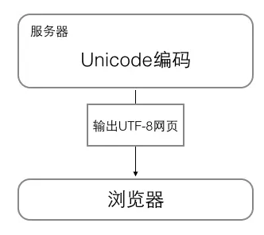

## Buffer

什么是Buffer? 先通过一个粟子来看下：

```
const fs = require('fs')
fs.readFile('./txt.txt', function (err, body) {
  console.log(body)
})
// <Buffer 48 65 6c 6c 6f 20 57 6f 72 6c 64 21>
```

上面粟子返回的就一个 Buffer, 可以看到 Buffer 类似于整数数组, 内部的数据是 16 进制

**Buffer的作用？**

JavaScript 语言自身只有字符串数据类型，没有二进制数据类型。但在处理像 TCP 流或文件流时，必须使用到二进制数据。因此在 Node.js中，定义了一个 Buffer 类，该类用来创建一个专门存放二进制数据的缓存区。简单来说 Buffer 就是帮助我们处理二进制数据的

注意 Buffer 的大小是固定的、且在 V8 堆外分配物理内存。 Buffer 的大小在被创建时确定，且无法调整

在 Node.js 中，Buffer 类是随 Node 内核一起发布的核心库。Buffer 库为 Node.js 带来了一种存储原始数据的方法，可以让 Node.js 处理二进制数据，每当需要在 Node.js 中处理I/O操作中移动的数据时，就有可能使用 Buffer 库。原始数据存储在 Buffer 类的实例中。一个 Buffer 类似于一个整数数组，**但它对应于 V8 堆内存之外的一块原始内存。** Buffer 的大小在被创建时确定且无法调整，也就是说 Buffer 的大小是固定的

Buffer 的基本使用

```js
// 创建一个长度为 10、且用 0 填充的 Buffer。
const buf1 = Buffer.alloc(10);

// 创建一个长度为 10、且用 0x1 填充的 Buffer。 
const buf2 = Buffer.alloc(10, 1);

// 创建一个长度为 10、且未初始化的 Buffer。
// 这个方法比调用 Buffer.alloc() 更快，
// 但返回的 Buffer 实例可能包含旧数据，
// 因此需要使用 fill() 或 write() 重写。
const buf3 = Buffer.allocUnsafe(10);

// 创建一个包含 [0x1, 0x2, 0x3] 的 Buffer。
const buf4 = Buffer.from([1, 2, 3]);

// 创建一个包含 UTF-8 字节 [0x74, 0xc3, 0xa9, 0x73, 0x74] 的 Buffer。
const buf5 = Buffer.from('tést');

// 创建一个包含 Latin-1 字节 [0x74, 0xe9, 0x73, 0x74] 的 Buffer。
const buf6 = Buffer.from('tést', 'latin1');
```

**为什么 Buffer.allocUnsafe() 和 Buffer.allocUnsafeSlow() 不安全**

当调用 `Buffer.allocUnsafe()` 和 `Buffer.allocUnsafeSlow()` 时，被分配的内存段是未初始化的（没有用 0 填充）。 虽然这样的设计使得内存的分配非常快，但已分配的内存段可能包含潜在的敏感旧数据。 使用通过 `Buffer.allocUnsafe()` 创建的没有被完全重写内存的 Buffer ，在 Buffer内存可读的情况下，可能泄露它的旧数据。

### Buffer 与字符编码

Buffer 实例一般用于表示编码字符的序列，比如 UTF-8 、 UCS2 、 Base64 、或十六进制编码的数据。 通过使用显式的字符编码，就可以在 Buffer 实例与普通的 JavaScript 字符串之间进行相互转换

```js
const buf = Buffer.from('州','utf-8'); // <Buffer e5 b7 9e>
console.log(buf.toString('ascii')); // 'e7\u001e'
console.log(buf.toString('base64')); // '5bee'
console.log(buf.toString('utf-8')); // 州
```

Node.js 目前支持的字符编码包括：

- ascii - 仅支持 7 位 ASCII 数据。如果设置去掉高位的话，这种编码是非常快的

- utf8 - 多字节编码的 Unicode 字符。许多网页和其他文档格式都使用 UTF-8

- base64 - Base64 编码。当从字符串创建 Buffer 时，按照 RFC4648 第 5 章的规定，这种编码也将正确地接受 “URL 与文件名安全字母表”

- hex - 将每个字节编码为两个十六进制字符

- utf16le - 2 或 4 个字节，小字节序编码的 Unicode 字符。支持代理对（U+10000 至 U+10FFFF）

- ucs2 - 'utf16le' 的别名。

- latin1 - 一种把 Buffer 编码成一字节编码的字符串的方式（由 IANA 定义在 RFC1345 第 63 页，用作 Latin-1 补充块与 C0/C1 控制码）

- binary - 'latin1' 的别名。

### Buffer 内存管理

## ascii、unicode 和 utf8

### ascii

在计算机内部，字节是最小的单位，一字节为 8 位，每一位可能的值为 0 或 1。标准 ASCII 码使用指定的 7 位二进制数来表示 128 种可能的字符,这些字符包括大写和小写字母，数字 0 到 9、标点符号， 以及在美式英语中使用的特殊控制字符。后 128 个称为扩展 ASCII 码，它允许将每个字符的第 8 位用于确定附加的 128 个特殊符号字符、外来语字母和图形符号

### unicode

全世界那么多语言文字，仅使用 ascii 编码肯定远远不够,为了能表示全世界了各种各样的语言文字，Unicode因此诞生，Unicode（UCS-Unicode Character Set） 也是一种字符编码方法，不过它是由国际组织设计，可以容纳全世界所有语言文字的编码方案，比如 `U+0639` 表示阿拉伯字母 Ain， `U+0041` 表示英语的大写字母 A ，`U+4E25` 表示汉字严。具体的符号对应表，可以查询 [unicode.org](https://home.unicode.org/)，或者专门的汉字对应表。

**unicode的问题**

Unicode 只是一个符号集，它只规定了符号的二进制代码，却没有规定这个二进制代码应该如何存储。

比如，汉字严的 Unicode 是十六进制数4E25，转换成二进制数足足有15位（100111000100101），也就是说，这个符号的表示至少需要2个字节。表示其他更大的符号，可能需要3个字节或者4个字节，甚至更多。

这里就有两个严重的问题

1. 如何才能区别 Unicode 和 ASCII ？计算机怎么知道三个字节表示一个符号，而不是分别表示三个符号呢

2. 英文字母只用一个字节表示就够了，如果 Unicode 统一规定，每个符号用三个或四个字节表示，那么每个英文字母前都必然有二到三个字节是 0 ，这对于存储来说是极大的浪费

### UTF-8

UTF-8 就是在互联网上使用最广的一种 Unicode 的实现方式，UTF-8 最大的一个特点，就是它是一种变长的编码方式。它可以使用1~4个字节表示一个符号，根据不同的符号而变化字节长度

UTF-8 的编码规则很简单，只有二条：

1. 对于单字节的符号，字节的第一位设为0，后面7位为这个符号的 Unicode 码。因此对于英语字母，UTF-8 编码和 ASCII 码是相同的。

2. 对于 n 字节的符号（n > 1），第一个字节的前 n 位都设为 1 ，第 n + 1 位设为 0 ，后面字节的前两位一律设为 10 。剩下的没有提及的二进制位，全部为这个符号的 Unicode 码。

下表总结了编码规则，字母 x 表示可用编码的位。

|  Unicode符号范围(十六进制)      |        UTF-8编码方式（二进制）
|  ----  | ----  |
|0000 0000-0000 007F | 0xxxxxxx|
|0000 0080-0000 07FF | 110xxxxx 10xxxxxx|
|0000 0800-0000 FFFF | 1110xxxx 10xxxxxx 10xxxxxx|
|0001 0000-0010 FFFF | 11110xxx 10xxxxxx 10xxxxxx 10xxxxxx|

下面，还是以汉字严为例，演示如何实现 UTF-8 编码。

严的 Unicode 是4E25（100111000100101），根据上表，严的 UTF-8 编码需要三个字节，即格式是1110xxxx 10xxxxxx 10xxxxxx。然后，从严的最后一个二进制位开始，依次从后向前填入格式中的x，多出的位补0。这样就得到了，严的 UTF-8 编码是 11100100 10111000 10100101，转换成十六进制就是E4B8A5

### 计算机中通用的字符编码的工作方式

在计算机内存中，统一使用Unicode编码，当需要保存到硬盘或者需要传输的时候，就转换为UTF-8编码。

浏览网页的时候，服务器会把动态生成的Unicode内容转换为UTF-8再传输到浏览器：



# 流

`stream`（流）是Node.js提供的又一个仅在服务区端可用的模块，流是一种抽象的数据结构。`Stream` 是一个抽象接口，Node 中有很多对象实现了这个接口。例如，对`http` 服务器发起请求的`request` 对象就是一个`Stream`，还有`stdout`（标准输出流）。

## 为什么要在node中使用流

假设目前需要一个读写文件的操作，不用流的实现方式：

```
var water = fs.readFileSync('a.txt', {encoding: 'utf8'});
fs.writeFileSync('b.txt', water);
```

但使用这种方法有几个问题：

-  占用内存，因为使用读写方式是把文件内容全部读入内存，然后再写入文件，对于小型的文本文件问题不大，但是遇到较大的比如音频、视频文件，动辄几个GB大的文件就非常吃内存了

- 处理数据量较大的文件时不能分块处理，导致速度慢

而流可以把文件资源拆分成小块，一块一块的运输，资源就像水流一样进行传输，使用流的话上述功能可以这样写：

```
var fs = require('fs');
var readStream = fs.createReadStream('a.mp4'); // 创建可读流
var writeStream = fs.createWriteStream('b.mp4'); // 创建可写流

readStream.on('data', function(chunk) { // 当有数据流出时，写入数据
    writeStream.write(chunk);
});

readStream.on('end', function() { // 当没有数据时，关闭数据流
    writeStream.end();
});
```

但这样写还是有一些问题的，如果说写入的速度跟不上读取的速度，有可能导致数据丢失。正常的情况应该是，写完一段，再读取下一段，如果没有写完的话，就让读取流先暂停，等写完再继续.

所以为了让可读流和可写流速度一致，就要用到流中必不可少的属性`pipe`了，`pipe`翻译过来意思是管道，顾名思义，就想上面的倒水一样，如果不用一根管子相连，A桶倒进B桶的水不会均速传输，可能会导致水的浪费，用pipe可以这样解决上述问题:

```
fs.createReadStream('a.mp4').pipe(fs.createWriteStream('b.mp4))
```

需要特别注意的是，`pipe()`只是可读流的方法，也就是说只能从可读流中通过pipe方法拷贝数据到可写流，反之则不行，写的时候要注意顺序

## 流的四种类型

Stream提供了以下四种类型的流:

- Readable 可读流:可读流是对一个可以读取数据的源的抽象。`fs.createReadStream` 方法是一个可读流的例子。

- Writable 可写流:可写流是对一个可以写入数据的目标的抽象。`fs.createWriteStream` 方法是一个可写流的例子。

- Duplex 可读可写流,TCP socket 就属于这种   

- Transform 在读写过程中可以修改和变换数据的Duplex流,变换流是一种特殊的双向流，它会基于写入的数据生成可供读取的数据。例如使用 `zlib.createGzip` 来压缩数据。你可以把一个变换流想象成一个函数，这个函数的输入部分对应可写流，输出部分对应可读流

## 可读流

创建可读流的方式：

- 使用`stream`模块的`Readable`创建一个可读流

- 使用`fs.createReadStream`创建可读文件流

**使用`fs.createReadStream`创建可读文件流**

- 第一个参数是读取文件的路径

- 第二个参数为 `options` 选项，其中有八个参数:

  - flags：标识位，默认为 r

  - encoding：字符编码，默认为 null

  - fd：文件描述符，默认为 null

  - mode：权限位，默认为 0o666

  - autoClose：是否自动关闭文件，默认为 true

  - start：读取文件的起始位置

  - end：读取文件的（包含）结束位置

  - highWaterMark：最大读取文件的字节数，默认 64 * 1024， 每次读多少字节的数据

```
let rs = fs.createReadStream('./files/big.file', {
        //文件系统标志
        flags: 'r',
        //数据编码，如果调置了该参数，则读取的数据会自动解析
        //如果没调置，则读取的数据会是 Buffer
        //也可以通过 rs.setEncoding() 进行设置
        encoding: 'utf8',
        //文件描述符，默认为null
        fd: null,
        //文件权限,
        mode: 0o666,
        //文件读取的开始位置
        start: 0,
        //文件读取的结束位置(包括结束位置)
        end: Infinity,
        //读取缓冲区的大小，默认64K
        // highWaterMark: 3
    });
```

**使用`stream`模块的`Readable`创建一个可读流**

```
const { Readable } = require('stream');  

const inStream = new Readable(); // 创建一个可读流

inStream.push('ABCDEFGHIJKLM'); // 向这个可读流输入数据
inStream.push('NOPQRSTUVWXYZ');

inStream.push(null); // 没有更多数据了

inStream.pipe(process.stdout); // 输出到一个可写流

```

上面的例子中在把该流连接到 `process.stdout` 之前，我们就已经推送了所有数据。接下可以试着推送数据。
我们可以通过在可读流配置中实现 `read()` 方法来达成这一目的：

```
const inStream = new Readable({
    read(size) {
        console.log('size', size)
        this.push(String.fromCharCode(this.currentCharCode++));
        if (this.currentCharCode > 90) {
            this.push(null);
        }
    }
});

inStream.currentCharCode = 65

inStream.pipe(process.stdout);
```
当使用者读取该可读流时，`read` 方法会持续被触发，我们不断推送字母。我们需要在某处停止该循环，
这就是为何我们放置了一个 `if` 语句以便在 `currentCharCode` 大于 90（代表 Z） 时推送一个 `null` 值


```
const startTime = new Date()
    //创建一个文件可读流
    let rs = fs.createReadStream('./files/big.file', {
        //文件系统标志
        flags: 'r',
        //数据编码，如果调置了该参数，则读取的数据会自动解析
        //如果没调置，则读取的数据会是 Buffer
        //也可以通过 rs.setEncoding() 进行设置
        encoding: 'utf8',
        //文件描述符，默认为null
        fd: null,
        //文件权限,
        mode: 0o666,
        //文件读取的开始位置
        start: 0,
        //文件读取的结束位置(包括结束位置)
        end: Infinity,
        //读取缓冲区的大小，默认64K
        // highWaterMark: 3
    });
    
    //文件被打开时触发
    rs.on('open', function () {
        console.log('文件打开');
    });
    
    //监听data事件，会让当前流切换到流动模式
    //当流中将数据传给消费者后触发
    //由于我们在上面配置了 highWaterMark 为 3字节，所以下面会打印多次。
    rs.on('data', function (data) {
        console.log(data);
    });
    
    //流中没有数据可供消费者时触发
    rs.on('end', function () {
        console.log('数据读取完毕', new Date() - startTime);
    });
    
    //读取数据出错时触发
    rs.on('error', function () {
        console.log('读取错误');
    });
    
    //当文件被关闭时触发
    rs.on('close', function () {
        console.log('文件关闭');
    });
    // 1秒后暂停读取， 再过2秒继续读以数据
    setTimeout(function () {
        rs.pause()
        setTimeout(function(){
            rs.resume()
        }, 2000)
    }, 1000);
  
```

可读流中的两种模式：

- 流动模式 ( flowing ) ：数据自动从系统底层读取，并通过事件，尽可能快地提供给应用程序

- 暂停模式 ( paused )，必须显式的调用 read() 读取数据

暂停模式 切换到 流动模式的方式：

- 添加 `data` 事件回调

- 调用 `resume()`

- 调用 `pipe()`

流动模式 切换到 暂停模式:

- 如果没有管道目标，调用 `pause()`

- 如果有管道目标，移除所有管道目标，调用 `unpipe()` 移除多个管道目标

## 可写流

创建可写流

- 使用`stream` 模块的 `Writable` 类创建可写流
    
  ```
  const { Writable } = require('stream');
  const outStream = new Writable({
    write(chunk, encoding, callback) {
      console.log(chunk.toString());
      callback();
    }
  });
      
  process.stdin.pipe(outStream);
  ```
    
  `write` 方法接受三个参数
  
  - `chunk` 通常是一个 `buffer`，除非我们对流进行了特殊配置
    
  - `encoding` 通常可以忽略。除非 `chunk` 被配置为不是 `buffer`
    
  - `callback` 方法是一个在我们完成数据处理后要执行的回调函数。它用来表示数据是否成功写入。若是写入失败，在执行该回调函数时需要传入一个错误对象

- 使用`fs.createWriteStream`方法创建可写的文流

  ```
  const outFile = fs.createWriteStream('./files/test.txt')
  process.stdin.pipe(outFile);
  ```
  
## 双工流（可读可写流）

通过`stream`的`Duplex`创建一个双工流

```
const { Duplex } = require('stream');

const inoutStream = new Duplex({
  write(chunk, encoding, callback) {
    console.log(chunk.toString());
    callback();
  },

  read(size) {
    this.push(String.fromCharCode(this.currentCharCode++));
    if (this.currentCharCode > 90) {
      this.push(null);
    }
  }
});

inoutStream.currentCharCode = 65;

process.stdin.pipe(inoutStream).pipe(process.stdout);
```

## 变换流

通过`stream`的`Transform`创建一个双工流

```
const { Transform } = require('stream');

const upperCaseTr = new Transform({
  transform(chunk, encoding, callback) {
    this.push(chunk.toString().toUpperCase());
    callback();
  }
});

process.stdin.pipe(upperCaseTr).pipe(process.stdout);
```

在这个变换流中，我们只实现了 transform() 方法，却达到了前面双向流例子的效果。在该方法中，我们把 chunk 转换为大写然后通过 push 方法传递给下游。


## 流事件和方法

以下是一些使用可读流或可写流时用到的事件和方法：


这些事件和函数是相关的，因为我们总是把它们组合在一起使用

### 可写流的一些方法：

- `write` 方法

  `ws.write(chunk, [encoding], [callback]);`
  
  - `chunk` 写入的数据 `buffer/string`
  
  - `encoding` 编码格式，`chunk` 为字符串时有用，是个可选参数
  
  - `callback` 写入成功后的回调
  
  返回值为布尔值，系统缓存区满时为 `false`，未满时为 `true`
  
-  `end` 方法

  `ws.end(chunk, [encoding], [callback]);`
  
  表明接下来没有数据要被写入 `Writable` 通过传入可选的 `chunk` 和 `encoding` 参数，可以在关闭流之前再写入一段数据 如果传入了可选的 `callback 函数`，它将作为 `finish` 事件的回调函数
  
可写流的一些事件：

- `drain` 事件

  ```
  ws.on('drain',function(){
      console.log('drain')
  })
  ```
  
  - 当一个流不处在 `drain` 的状态， 对 `write()` 的调用会缓存数据块， 并且返回 `false`
  
  - 当前所有缓存的数据块满了，满了之后情况才会触发 `drain`
  
  - 一旦 `write()` 返回 `false`， 在 `drain` 事件触发前， 不能写入任何数据块
  
- `finish` 事件

  ```
  ws.end('结束');
  ws.on('finish',function(){
      console.log('drain')
  });
  ```
  
  在调用 `end` 方法，且缓冲区数据都已经传给底层系统之后， `finish` 事件将被触发

### 一个可读流文件上的方法和事件：

一个可读流上的事件：

- `open`事件上，当创建一个可读流时，会触发此事件

- `data` 事件，任何时候当可读流发送数据给它的消费者时，会触发此事件

- `end` 事件，当可读流没有更多的数据要发送给消费者时，会触发此事件

- `close`事件上，文件关闭时，触发

一个可读流上的方法：

- `pipe`：传送数据

- `unpipe`: 方法解绑之前使用 `pipe()` 方法绑定的可写流

- `pause`： 暂信传送数据

- `resume`: 继传传送数据

- `unshift`: 将 `chunk` 作为 `null` 传递信号表示流的末尾（EOF），其行为与 `readable.push(null)` 相同


## 可读流的暂停和流动模式

可读流有两种主要的模式，影响我们使用它的方式：

- 它要么处于暂停模式

- 要么就是处于流动模式

这些模式有时也被成为拉取和推送模式

所有的可读流默认都处于暂停模式。但它们可以按需在流动模式和暂停模式间切换。这种切换有时会自动发生。

当一个可读流处于暂停模式时，我们可以使用 `read()` 方法按需的读取数据。而对于一个处于流动模式的可读流，数据会源源不断的流动，我们需要通过事件监听来处理数据

在流动模式中，如果没有消费者监听事件那么数据就会丢失。这就是为何在处理流动模式的可读流时我们需要一个 `data`事件回调函数。事实上，通过增加一个 `data` 事件回调就可以把处于暂停模式的流切换到流动模式；同样的，移除 `data`事件回调会把流切回到暂停模式。这么做的一部分原因是为了和旧的 Node 流接口兼容。

要手动在这两个模式间切换，你可以使用 `resume()` 和 `pause()` 方法

当使用 `pipe` 方法时，它会自动帮你处理好这些模式之间的切换，因此你无须关心这些细节

[流](https://juejin.im/post/5940a9c3128fe1006a0ab176)