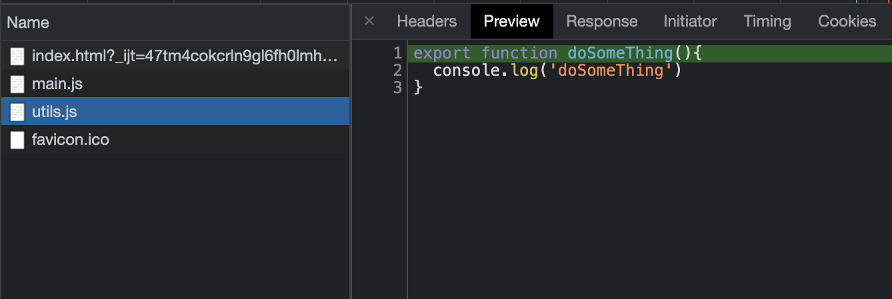
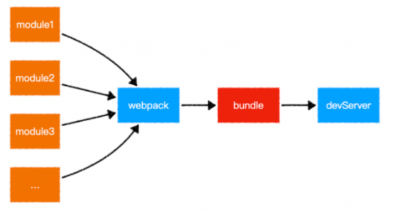

# Vite

[Vite](https://cn.vitejs.dev/guide/) (发音 /vit/) 是一种新型前端构建工具，能够显著提升前端开发体验。它主要由两部分组成：

一个开发服务器，它基于 原生 ES 模块 提供了 丰富的内建功能，如速度快到惊人的 模块热更新（HMR）。

一套构建指令，它使用 Rollup 打包你的代码，并且它是预配置的，可输出用于生产环境的高度优化过的静态资源

Vite 有两个重点要特点：

1. 极速的服务启动

2. 轻量快速的热重载

Vite 快的原因？

Vite 以 原生ESM 方式提供源码。这实际上是让浏览器接管了打包程序的部分工作：Vite 只需要在浏览器请求源码时进行转换并按需提供源码。根据情景动态导入代码，即只在当前屏幕上实际使用时才会被处理。所以先了解一下 原生ESM

## 原生ESM

先来个例子：

```html
<!--index.html-->
 <script type="module" src="/src/main.js"></script>
```
```js
// main.js
import { doSomeThing } from "./utils.js";

doSomeThing()
```
```js
// utils.js
export function doSomeThing(){
  console.log('doSomeThing')
}
```

浏览器打后控制台能正常输出了 `doSomeThing`

控制台 network 的信息如下：



可以发现对于 `main.js` 中的 `import { doSomeThing } from "./utils.js"`

浏览器会发起了一个 `get`请求，下载 `utils.js` 文件并获取其中导出的模块并执行，也就是说不需要任何浏览器直接识别了 `import`

### vite-app

回头看下使用 `vite-app` 创建的项目，浏览器是如何加载的

```js
import { createApp } from 'vue'
import App from './App.vue'

createApp(App).mount('#app')
```

控制台 network 的信息如下：

1. 首先加载：`http://localhost:3000/src/main.js`

下载下来的内容为：

```js
import { createApp } from '/node_modules/.vite/vue.js?v=80d8618d'
import App from '/src/App.vue'

createApp(App).mount('#app')
```

可以看到源码中的 `import { createApp } from 'vue'` 变成了 `import { createApp } from '/node_modules/.vite/vue.js?v=80d8618d'`

这是为了让浏览器把资源路径定位到 `node_modules` 中，准确下载到对应的模块

2. 之后加载：`http://localhost:3000/node_modules/.vite/vue.js`，获取 `createApp` 这个方法

3. 之后再加载： `http://localhost:3000/src/App.vue`，获取 App

4. 最后使用 `createApp` 创建应用并挂载节点

vite 利用 ES module，把 “构建 vue 应用” 这个本来需要通过 webpack 打包后才能执行的代码直接放在浏览器里执行，这么做是的好外就是：**去掉打包步骤** 和 **实现按需加载**

## 去掉打包步骤

打包的概念是开发者利用打包工具以一定规则读取模块的代码，对这些模块进行翻译转换，组成形成 bundle，以便在不支持模块化的浏览器里使用。webpack 的运行就离不开打包这个环节，先回顾一下 Webpack 的运行流程：

- [初始化参数]：从配置文件和 Shell 语句中读取与合并参数，得出最终的参数

- [开始编译]：用上一步得到的参数初始化 Compiler 对象，加载所有配置的插件，执行对象的 run 方法开始执行编译

- [确定入口]：根据配置中的 entry 找出所有的入口文件

- [编译模块]：从入口文件出发，调用所有配置的 Loader 对模块进行翻译，再找出该模块依赖的模块，再递归本步骤直到所有入口依赖的文件都经过了本步骤的处理

- [完成模块编译]：在经过第4步使用 Loader 翻译完所有模块后，得到了每个模块被翻译后的最终内容以及它们之间的依赖关系

- [输出资源]：根据入口和模块之间的依赖关系，组装成一个个包含多个模块的 Chunk，再把每个 Chunk 转换成一个单独的文件加入到输出列表，这步是可以修改输出内容的最后机会

- [输出完成]：在确定好输出内容后，根据配置确定输出的路径和文件名，把文件内容写入到文件系统

在 webpack 的启动和和每次热更新的过程中，模块的编译都需要花费很多的时间

**vite 利用浏览器原生支持模块化导入这一特性，省略了对模块的编译和组装工作，所以打包这一步就可以省略了**

## 实现按需打包

前面说到，webpack 会将各模块提前打包进 bundle 里，在不进行任何的处理的情况，webpack 会将所以的模块打包在一起——不管这个模块的代码是否有被执行到，所以往往一个 bundle 文件会很大，并且随着项目越来越大打包后的 bundle 也越来越大

为了解决这个问题，开发者会使用动态 `import()` 的方式将模块进行分离，实现按需模块（ 但被分离的模块依然需要提前编译和打包)，又或者使用 teaserPlugin 进行代码压缩或 tree shaking 等方式尽力得去减小代码体积，然而这些方式都不如 vite 的优雅，**vite 可以只在某个模块被 `import` 时才去引入它，并且不需要提前打包**

## vite如何处理ESM

通过上文第一个直接使用 ES module 的例子可以发现对于 EMS 模块浏览器是会使用 http 请求的方式去拿到模块，但是这种方法只能识别符合 EMS 的模块，对于其它类型的模块是不能直接使用的，所以 vite 启动时也是启动了一个 web server 去代理这些模块，vite 通过对请求路径的劫持获取资源并对这些模块做了特殊处理

### node_module路径处理

上文在 vite-app 粟子中有提到源码中的 `import { createApp } from 'vue'` 变成了 `import { createApp } from '/node_modules/.vite/vue.js?v=80d8618d'`

在开发时对于 `node_modules中` 的模块，我们是以绝对路径的方式去获取，但是浏览器不知道，所以 vite 会对使用了绝对路径的 `import`，将路径重写成了 `node_modules` 目录下面

### 非EMS模块的处理

既然 Vite 的模块加载是基于 ESM 的，可是现在很多的模块都是已经编译成了 cjs 的形式，对于这种形式的模块，Vite 引用时将不能正常访问，为了处理这个问题 Vite 加入了 `optimize` 命令，只需要在 `vite.config.js` （vite 配置文件）中，配置 `optimizeDeps` 对象，在 include 数组中添加要处理的模块名即可

```js
// vite.config.js
module.exports = {
  optimizeDeps: {
    include: ["lodash"]
  }
}
```

对于上面的配置 vite 在执行 `runOptimize` 的时候中会使用 `roolup` 对 `lodash` 包重新编译，将编译成符合 esm 模块规范的新的包放入 `node_modules` 下的 `.vite_opt_cache` 中，然后配合 `resolver` 对 `lodash` 的导入进行处理：使用编译后的包内容代替原来 `lodash` 的包的内容，这样就解决了 vite 中不能使用 cjs 包的问题。

### 非类型的模块的处理

使用原生的 EMS 只是让浏览器自己支持 `import` JS模块，但是实际开发还存在如 `css`、`less/scss`、`vue` 等形式的模块，对于这类的模块 Vite 都配置的插件这些模块进行转换，但是这类的模块仍在加载时才进行处理的

## VS Webpack

之前对 Vite 有了大致之后，就很容易捊清楚跟 Webpack 的区别了

Webpack 原理图



Vite 原理图


**Webpack**

- 识别入口->逐层识别依赖->分析/转换/编译/输出代码->打包后的代码

- Webpack 需要一个打包的过程，包括在 HMR 方面，即改动了一个模块，Webpack 也是需要将该模块的相关依赖模块全部编译一次

- webpack先打包，再启动开发服务器，请求服务器时直接给予打包后的结果

**Vite**

- vite是直接启动开发服务器，请求哪个模块再对该模块进行编译，真正实现了按需加载模块，极大的缩减了编译时间

- vite 直接利用现代浏览原生支持 ES Module 的特性进行模块加载，省去模块编译过程

**这两点也就是 vite 比 webpack 快的主要原因**

### Vite 的缺点

- 开发与生产环境构建结果不一致的风险；

- 项目生态存在非 ES import 模块化包而导致大量适配成本的风险

虽然在开发环境可以使用特定的浏览器进行快速开发，但在生产环境下仍需要考虑浏览的兼容性和差异性，所以也是要像 Webpack 进行打包工作，目前因为生态的关系 Vite 生产环境的构建还是不如 Webpack 完善

[深入 vite 原理：尤大最新力作到底是如何实现的？](https://jishuin.proginn.com/p/763bfbd29d7f)


