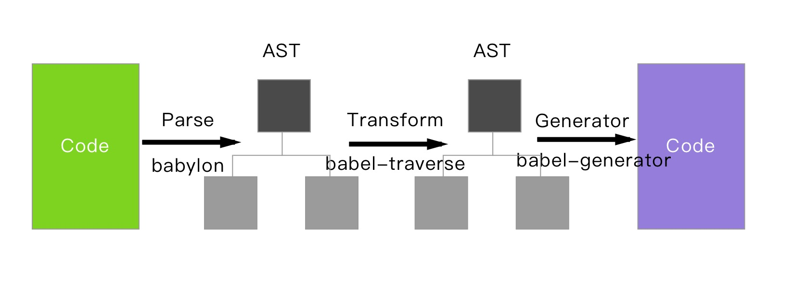

# Babel

Babel 是一个通用的多功能 JavaScript 编译器，但与一般编译器不同的是它只是把同种语言的高版本规则转换为低版本规则，而不是输出另一种低级机器可识别的代码，并且在依赖不同的拓展插件下可用于不同形式的静态分析。

:::tip
静态分析：指在不需要执行代码的前提下对代码进行分析以及相应处理的一个过程，主要应用于语法检查、编译、代码高亮、代码转换、优化、压缩等等
:::

## Babel 主要模块

- `@babel/core`： Babel 的编译器，核心 API 都在这里面，比如常见的 `transform`、`parse`

- `@babel/cli`：`cli` 是命令行工具,  安装了 `@babel/cli `就能够在命令行中使用 `babel`  命令来编译文件。当然我们一般不会用到，打包工具已经帮我们做好了

- `@babel/node`：直接在 node 环境中，运行 ES6 的代码。

- `babylon`：Babel 的JS词法解析器

- `babel-traverse`：用于对 AST 的遍历，维护了整棵树的状态，并且负责替换、移除和添加节点，要给 `plugin` 用

- `babel-types`：用于 AST 节点的 Lodash 式工具库, 它包含了构造、验证以及变换 AST 节点的方法，对编写处理 AST 逻辑非常有用

- `babel-generator`：Babel 的代码生成器，它读取 AST 并将其转换为代码和源码映射（sourcemaps）

- `babel-runtime`: 功能类似 `babel-polyfill` ，一般用于 `library` 或 `plugin中`，因为它不会污染全局作用域

## 运行原理



Babel 工作分为三大阶段：

1. 解析(Parse)：将代码字符串解析为抽象语法树；
  
2. 转换(Transform)：遍历抽象树，对抽象语法树进行再变换；

  `babel` 接收得到 AST 并通过 `babel-traverse` 对其进行遍历，在此过程中进行添加、更新及移除等操作

3. 生成(Generate)：使用 `babel-generator` 模块将 AST 再转换换为 JS 代码

:::warning
此外需要注意的是，babel 只是转译新标准引入的语法，比如 ES6 箭头函数，而新标准引入的新的原生对象对象新增的原型方法及新增的 API 等（Proxy、Set 等）, 这些事不会转译的，需要引入对应的 `polyfill` 来解决
:::

### 解析

解析第一步分为两个步骤: 分词和语法分析

1. 分词:将整个代码字符串分割成 语法单元 数组

  > 语法单元是被解析语法当中具备实际意义的最小单元，通俗点说就是类似于自然语言中的词语
  
   拆分过程就是就是简单粗暴地一个字符一个字符地遍历，然后分情况讨论，整个实现方法就是顺序遍历和大量的条件判断
  
  ```js
  if (1 > 0) {
    alert("if \"1 > 0\"");
  }
  ```
  
  我们希望得到的分词是：
  
  ```js
  'if'     ' '       '('    '1'      ' '    '>'    ' '    ')'    ' '    '{'
  '\n  '   'alert'   '('    '"if \"1 > 0\""'    ')'    ';'    '\n'   '}'
  ```


2. 语义分析:在分词结果的基础之上分析 语法单元之间的关系

  语义分析就是把词汇进行立体的组合，确定词语最终是什么意思、多个词语之间有什么关系以及又应该再哪里断句等

  简单来说语法分析是对语句和表达式识别，这是个递归过程，在解析中，Babel 会在解析每个语句和表达式的过程中设置一个暂存器，用来暂存当前读取到的语法单元，如果解析失败，就会返回之前的暂存点，再按照另一种方式进行解析，如果解析成功，则将暂存点销毁，不断重复以上操作，直到最后生成对应的语法树
  
  我的另一种理解是：在解析每个语句和表达式的过程中设置一个暂存器，用来暂存当前读取到的语法单元，如果读取到的语法单元能与暂存的最后一个语法单元匹配成完整的语法，那么就将当前的语法单元从栈中推出
  
### 转换（Transformation）

插件应用于 Babel 的转译过程，尤其是第二个阶段 `Transformation`，如果这个阶段不使用任何插件，那么 Babel 会原样输出代码

配置插件的方式一般是在项目根目录创建 `babel.config.js` 、 `babel.config.json` 或 `.babelrc`，具体看 [Babel-Config Files](https://www.babeljs.cn/docs/config-files)

配置示例：

```js
// .babelrc 文件
{
  "presets": [
    [
      "@babel/preset-env"
    ]
  ],
  "plugins": [
    ["@babel/plugin-proposal-decorators", { "legacy": true }],
    ["@babel/plugin-proposal-class-properties", { "loose": true }],
    "@babel/plugin-transform-runtime",
  ]
}
```

`presets` 表示 Babel 预设插件， 每年每个 `Preset` 只编译当年批准的内容。而 `babel-preset-env` 相当于 ES2015 ，ES2016 ，ES2017 及最新版本

`plugins` 是通过 npm 安装的其它插件

Preset 和 Plugin 和具体使用区别下文再讲，总之转换阶段需要通过这些插件来进行工作，将之前的 AST 转换成新的 AST

### 生成（Code Generation）

最后使用 `babel-generator` 根据上一步生成的新 AST 树生成 ES5 代码。

## 具体使用

结合 Webpack 来看下怎么使用 Babel，及 Preset 和 Plugin 的区别

安装需要用到的模块：`babel-loadr` 和 Babel 的核心模块 `@babel/core`： `yarn add @babel/core babel-loader -D`

```js
// Webpack 配置： vue.deploy.config.js
const path = require('path')
const config = {
	mode: 'development',
	entry: {
		index: './src/index.js',
	},
	output: {
		filename: '[name].js',
		path: path.resolve(__dirname, 'dist'),
	},
	module: {
		rules: [
			{
				test: /\.js/,
				use: [
					'babel-loader'
				]
			}
		
		]
	}
}
module.exports = config

```

入口文件:

```js
// src/index.js
function component() {
    var element = document.createElement('div');
    element.innerHTML = 'Hello';
    const abc = () => {
        console.log('箭头函数')
    }
    new Promise(() => {})
    var b = [1, 2, 3].includes(1);
    return element;
}

document.body.appendChild(component());
```

`package.json` 添加启动命令

```json
 "scripts": {
    "build": "webpack --progress --colors "
  }
```

执行命令 `yarn build`, 输出以下结果

```js
const abc = () => {  console.log('箭头函数');};
```

可以看到并没做任何的转换，原因上文也说过我们并没有使用任何的转换插件，所以在转换阶段就原样输出了

接下来我们在项目目录创建 `.babelrc` 文件并写以下配置：

```js
/* .babelrc */
{
  "plugins": ["@babel/plugin-transform-arrow-functions"]    
}
```

记得安装模块 `yarn add @babel/plugin-transform-arrow-functions -D`。 然后重新打包

```js
var abc = function () { console.log('箭头函数')};
```

说明转换成功了!

默认情况下 Babel 将从 `node_modules` 中查找使用的插件，也可以指定你的 `Plugin/Preset` 的相对或绝对路径

```js
"plugins": [
  "./node_modules/asdf/plugin",
  "transform-class-properties"
]
```

:::tip
当 `plugins` 包含多个插件时，它的按正顺序执行的。 也就是先执行 `./node_modules/asdf/plugin` 再执行 `transform-class-properties`
:::

同理如果想使用其它 ES6 的语法只要配置相应的转换插件即可，但是有那么多的语法需要转换，一个个的添加插件也太麻烦了，这时候就可以使用 Babel 提供的 `preset` 

### Preset

上文说过 `preset` 是 Babel 官方帮我们做了一些预设的插件集，官方提供了很多 `presets`，比如:

- `preset-env`: 处理 es6+ 规范语法的插件集合

- `preset-stage`: 处理尚处在提案语法的插件集合

- `preset-react`: 处理 `react` 语法的插件集合

还有其它的等等等等。。

`Presets` 是按照 ECMAScript 草案来组织的，通常可以分为以下三大类

1. 已经被写入 ECMAScript 标准里的特性，由于之前每年都有新特性被加入到标准里，所以又细分如下。

  - ES2015：包含在2015年加入的新特性

  - ES2016：包含在2016年加入的新特性

  - ES2017：包含在2017年加入的新特性

  - Env：包含当前所有EAMAScript标准里的最新特性

2. 被社区提出来的但还未写入ECMAScript标准里的特性，这其中又分为以下四种。

  - stage0：只是一个美好激进的想法，一些Babel插件实现了对这些特性的支持，但是不确定是否会被定为标准

  - stage1：值得被纳入标准的特性

  - stage2：该特性规范已经被起草，将会纳入标准进而

  - state3：该特性规范已经定稿，各大浏览器厂商和Node.js社区已开始着手实现

  - state4：在接下的一年里将会加入标准中

3. 用于支持一些特定应用场景下的语法的特性，和ECMAScript标准没有关系，例如 `babel-preset-react` 用于支持React开发里的JSX语法

```js
{
  "presets": [
    "es2015",
    "react",
    "stage-2"
  ]
}
```

:::tip
与 Plugin 执行顺序相反，像上面粟子使用了多个 `Preset` ，执行的时候是倒序执行的，即会按以下顺序运行:  `stage-2`， `react`， 最后 `es2015`
:::

#### reset-env

这里我们主要介绍下 `preset-env`,  `babel-preset-env` 相当于支持 ES2015 ，ES2016 ，ES2017 及最新版本的语法特性的转换

```js
/* .babelrc */
{
  "presets": ["@babel/preset-env"]    
}
```

接下我们修改一下源文件，加入更多 ES6 来验证一下效果：

```js
const fn = () => {}
const { a } = { a: abc}
new Promise(()=> {})
console.log(Array.includes)
```

打包后看下结果可以看到箭头函数和解构都成功转换了，但是 `Promise`、`inclides` 并没有转换成功，在IE浏览器中打开页面，控制台也报错了

```js
SCRIPT5009: “Promise”未定义
```

:::tip
因为 Preset 只能处理ES6新语法，新的API及新原生对象的方法不能转换
:::

**Preset 只是转译新标准引入的语法**，比如:

- 箭头函数

- `let/const`

- 解构

- 等等新语法

**对于新标准引入的全局变量、方法及部分原生对象新增的原型链上的方法，Babel 表示超纲了**

- 全局变量

- `Promise`

- `Symbol`

- `WeakMap`

- `Set`

- `includes`

- `generator` 函数

对于上面的这些 API，Preset 是不会转译的，需要引入 `polyfill` 来解决

### Polyfill

`polyfill` 是一个针对ES2015+环境的 `shim`，使用 `babel-polyfill` 会把 ES2015+ 环境整体引入到你的代码环境中，让你的代码可以直接使用新标准所引入的新原生对象，新API等，一般来说单独的应用和页面都可以这样使用。说白了就是使用 es5 的方式实现了 es6的方法

实现上来说 `@babel/polyfill` 包只是简单的把 `core-js` 和 `regenerator runtime` 包装了下，这两个包才是真正的实现代码所在（后文会详细介绍 `core-js` ）。

#### 使用方法

1. 先安装包： `npm install --save @babel/polyfill`

2. 确保在入口处导入 `polyfill`，因为 `polyfill` 代码需要在所有其他代码前先被调用，以下两种方式都可以

  - 直接在入口文件中引入： `import "@babel/polyfill"`
  
  - Webpack配置： `module.exports = { entry: ["@babel/polyfill", "./app/js"] }`
  
我们在例子中引用 `babel-polyfill`

```js
import '@babel/polyfill'
function component() {
    var element = document.createElement('div');
    element.innerHTML = 'Hello';
    const abc = () => {
        console.log('箭头函数')
    }
    new Promise(() => {})
	console.log('Array.includes',[1, 2, 3].includes(1))
    return element;
}

document.body.appendChild(component());

```

重新打包后发现能在IE下运行了，控制也能出 `Array.includes true`

#### Polyfill的不足

引用 `Polyfill` 解决了ES6 新方法等 Api 不能用的问题，但同时也会发现打包出来的文件大了非常多，不用 `@babel/polyfill` 之前才 `5.1KB` 使用之后变成了 `442KB`，所以直接使用 `@babel/polyfill` 会存在一些问题：

- 打包文件体积变大

- `@babel/polyfill` 会污染全局变量，如果打包出来的文件是一个公共库，那么就可能多次引用 `@babel/polyfill`，可能导致冲突

**针对第一个体积大问题**

`@babel/preset-env` 提供了 `useBuiltIns` 属性帮助我们按需引入需要的 `polyfill`。可以设置的值有：`false`,`entry` 和 `usage`，默认值是 `false`

- `false`：表示不引入 `polyfill`

- `entry`: 根据 `target` 配置的的浏览器列表，引入浏览器不兼容的 `polyfill`。**需要在入口文件手动添加 `import '@babel/polyfill'`**
  ```js
    {
      "presets": [
        [
          "@babel/preset-env",
          {
            "useBuiltIns": "entry",
            "corejs": 2,
            "targets": {
              "edge": "17",
              "safari": "11.1",
              "chrome": "67"
            }
          }
        ]
      ]
    }

  ```

  打包后也能发现体积变小了很多。注意如果没有指定 `browserslist`，跟 `false` 没区别
  
- `usage`：`usage` 会根据配置的浏览器兼容，以及你代码中用到的 API 来进行 `polyfill`，实现了按需添加载，**不需要自添加 `import '@babel/polyfill'`**

  ```js
    {
      "presets": [
        [
          "@babel/preset-env",
          {
            "useBuiltIns": "usage",
            "corejs": 2
          }
        ]
      ]
    }

  ```
  
:::tip
当 `useBuiltIns` 值是 `entry` 或 `usage` 时，需要指定 `core-js` 模块的版本
:::

例子：

源码

```js
const fn = () => {}
new Promise(()=> {})
var b = [1, 2, 3];
b.includes(1)
```

编译后

```js
"use strict";

require("core-js/modules/es7.array.includes");

require("core-js/modules/es6.promise");

require("core-js/modules/es6.object.to-string");

var fn = function fn() {};

new Promise(function () {});
var b = [1, 2, 3];
b.includes(1);
```

结合 `@babel/preset-env` 的配置，可以解决引用 `polyfill` 过大的问题，但对于第二个问题需要使用 `babel-runtime` 解决

### runtime

直接使用 `babel-polyfill` 对于应用或页面等环境在你控制之中的情况来说，并没有什么问题。但是对于在 `library` 中使用 `polyfill` ，就变得不可行了。
因为 `library` 是供外部使用的，但外部的环境并不在 `library` 的可控范围，而 `polyfill` 是会污染原来的全局环境的（因为新的原生对象、API这些都直接由 `polyfill` 引入到全局环境）。这样就很容易会发生冲突，所以这个时候，`babel-runtime` 就可以派上用场了。

粟子：

```js
/* .babelrc */

{
  "presets": ["@babel/preset-env" ],
  "plugins": [
    ["@babel/plugin-transform-runtime", {
      "corejs": 2
    }]
  ]  
}
```

```js
// 源码
const fn = () => {}
new Promise(()=> {})
var b = [1, 2, 3];
b.includes(1)
```

```js
// 编译后结果
"use strict";

var _interopRequireDefault = require("@babel/runtime-corejs3/helpers/interopRequireDefault");

var _includes = _interopRequireDefault(require("@babel/runtime-corejs3/core-js-stable/instance/includes"));

var _promise = _interopRequireDefault(require("@babel/runtime-corejs3/core-js-stable/promise"));

var fn = function fn() {};

new _promise["default"](function () {});
var b = [1, 2, 3];
(0, _includes["default"])(b).call(b, 1);
```

从上面代码可以看到，当我们要使用 `Promise` 时，这个方法是从 `@babel/runtime-corejs3/core-js-stable/instance/includes` 导出并赋值给了一个 `_promise` 变量，通过 `_promise` 来使用 `Promise` ，这样既有了 `Promise` 的功能，同时又没有污染全局环境

#### runtime的不足之处

runtime 的使用跟 polyfill 类似，还能解决全局污染的问题，那是不是就可以不用 polyfill 了呢？ 看下面这个例子

```js
// .babelrc
{
  "presets": [
    [
      "@babel/preset-env"
    ]
  ],
  "plugins": [
    [
      "@babel/plugin-transform-runtime", {
      "corejs": 2
    }
    ]
  ]
}
```

```js
const fn = () => {console.log('箭头函数')}
const { a } = { a: 'abc'}
new Promise(()=> {})
console.log([].includes)
```

上面的 babel 配置使用 presets 转换新语法，使用 transform-runtime 代替新的全局方法和 API ，但是打包运行后发现 `console.log([].includes)` 在IE 下输出为 `undefined`，**说明 transform-runtime 是不能处理对象原型上的方法**，所以根据这种情况，仍然需要使用 polyfill 进行解决

```js
{
  "presets": [
    ["@babel/preset-env",
      {
        "useBuiltIns": "usage",
        "corejs": 2
      }
    ]
  ],
  "plugins": [
    [
      "@babel/plugin-transform-runtime", {
      "corejs": 2
    }
    ]
  ]
}
```

使用 babel 分别看下两者打包出来的区别

没有使用 polyfill

```js
"use strict";

var _interopRequireDefault = require("@babel/runtime-corejs2/helpers/interopRequireDefault");

var _promise = _interopRequireDefault(require("@babel/runtime-corejs2/core-js/promise"));

var fn = function fn() {
  console.log('箭头函数');
};

var _a = {
  a: 'abc'
},
    a = _a.a;
new _promise["default"](function () {});
console.log([].includes);
```

添加了 polyfill

```js
"use strict";

var _interopRequireDefault = require("@babel/runtime-corejs2/helpers/interopRequireDefault");

require("core-js/modules/es7.array.includes.js");

var _promise = _interopRequireDefault(require("@babel/runtime-corejs2/core-js/promise"));

var fn = function fn() {
  console.log('箭头函数');
};

var _a = {
  a: 'abc'
},
    a = _a.a;
new _promise["default"](function () {});
console.log([].includes);
```

可以看到添加  polyfill 后输出文件多了一行 `require("core-js/modules/es7.array.includes.js");`，以此达到 实现 `[].includes` 的目的 

#### transform-runtime和babel-runtime

`babel-plugin-transform-runtime` 插件依赖 `babel-runtime`，`babel-runtime` 是真正提供 `runtime` 环境的包；也就是说 `transform-runtime` 插件是把 js 代码中使用到的新原生对象和静态方法转换成对 `runtime` 实现包的引用，下面是一个使用 `transform-runtime`
插件后的打包的例子：

另外，从上面打包输出的例子我们也可以隐约发现，`babel-runtime` 其实也不是真正的实现代码所在，真正的代码实现是在 `core-js` 中，后面我们再说

总结来说 `babel-plugin-transform-runtime` 插件的功能有以下几点：

- 当代码中有使用到的 ES6 引入的新原生对象和静态方法时，这些方法使用 `babel-runtime/core-js` 对应的方法替代

- 当使用 `generators` 或 `async` 函数时，用 `babel-runtime/regenerator` 导出的函数取代

- 把 Babel 生成的辅助函数改为用 `babel-runtime/helpers` 导出的函数来替代（ Babel 默认会在每个文件顶部放置所需要的辅助函数，如果文件多的话，这些辅助函数就在每个文件中都重复了，通过引用 `babel-runtime/helpers` 就可以统一起来，减少代码体积）
  
- 它可以为你的代码创建一个 `sandboxed environment`（沙箱环境），这在你编写一些类库等公共代码的时候尤其重要。
  
建议不要直接使用 `babel-runtime`，因为` transform-runtime` 依赖` babel-runtime`，大部分情况下都可以用 `transform-runtime` 达成目的

`transform-runtime` 在 `.babelrc` 里配置的时候，还可以设置 `helpers`、`polyfill`、`regenerator` 这三个开关，以自行决定` runtime` 是否要引入对应的功能


:::tip
注意：这里一定要配置 `corejs`，同时安装 `@babel/runtime-corejs2`，不配置的情况下 `@babel/plugin-transform-runtime` 默认是不引入这些 `polyfill` 的`helper` 的
:::

## core-js

从上面例子可以看到 core-js 才是实现 shim 的核心所在，我们也可以直接引入来实现 `polyfill`

**core-js的使用**

1. 类似 `polyfill`，直接把特性添加到全局环境，这种方式体验最完整

  ```js
  require('core-js/fn/set');
  require('core-js/fn/array/from');
  require('core-js/fn/array/find-index');
  
  Array.from(new Set([1, 2, 3, 2, 1])); // => [1, 2, 3]
  [1, 2, NaN, 3, 4].findIndex(isNaN);   // => 2
  ```

2. 类似`runtime` 一样，以库的形式来使用特性，这种方式不会污染全局名字空间，但是不能使用实例方法

  ```js
  var Set       = require('core-js/library/fn/set');
  var from      = require('core-js/library/fn/array/from');
  var findIndex = require('core-js/library/fn/array/find-index');
  
  from(new Set([1, 2, 3, 2, 1]));      // => [1, 2, 3]
  findIndex([1, 2, NaN, 3, 4], isNaN); // => 2
  ```

3. 因为第二种库的形式不能使用 `prototype` 方法，所以第三种方式使用了一个小技巧，通过 `::` 这个符号而不是 `.` 来调用实例方式，从而达到曲线救国的目的。这种方式的使用，路径中都会带有 `/virtual/ `

  ```js
  import {fill, findIndex} from 'core-js/library/fn/array/virtual';
  
  Array(10)::fill(0).map((a, b) => b * b)::findIndex(it => it && !(it % 8)); // => 4
  
  // 对比下polyfill的实现 
  // Array(10).fill(0).map((a, b) => b * b).findIndex(it => it && !(it % 8));
  ```


## 总结

babel 的使用依赖插件。Preset 是官方预设的插件集。但是 Preset 可以转换新的语法，但对于新的全局方法和API及对象原型上的新方法是不同转换的

对于 Preset 不能干的事情，可以使用 polyfill 来解决，但是如果直接全量引入 polyfill 会有两个问题

1. 打包文件体积变大

2. `@babel/polyfill` 会污染全局变量，如果打包出来的文件是一个公共库，那么就可能多次引用 `@babel/polyfill`，可能导致冲突

针对第一个问题可以在配置 Preset 时，按需引入 polyfill，针对第二个问题可以使用 `transform-runtime` 进行解决

多个 Preset 的配置执行时是按倒序执行的，多个 Plugin 的配置是按正序执行的，`Preset` 和 `plugins` 可以同时存在，那么问题来了，如果 `presets` 和 `plugins` 同时存在时，先执行哪个呢？

```js
// .babelrc 文件
{
  "presets": [
    [
      "@babel/preset-env"
    ]
  ],
  "plugins": [
    ["@babel/plugin-proposal-decorators", { "legacy": true }],
    ["@babel/plugin-proposal-class-properties", { "loose": true }],
    "@babel/plugin-transform-runtime",
  ]
}
```

答案是先执行 `plugins` 的配置，再执行 `presets` 的配置

所以上面代码的执行顺序为

1. `@babel/plugin-proposal-decorators`

2. `@babel/plugin-proposal-class-properties`

3. `@babel/plugin-transform-runtime`

4. `@babel/preset-env`

**babel配置**

如果项目不是用于公共库

```js
/* .babelrc */
{
  "presets": [
    [
      "@babel/preset-env",
      {
        "useBuiltIns": "usage",
        "corejs":2
      }
    ]
  ]
}

```

如果是用于公共库：

```js
/* .babelrc */

{
  "presets": ["@babel/preset-env" ],
  "plugins": [
    ["@babel/plugin-transform-runtime", {
      "corejs": 2
    }]
  ]  
}
```


最佳配置应该是这个：

```js
{
  "presets": [
    ["@babel/preset-env",
      {
        "useBuiltIns": "usage",
        "corejs": 2
      }
    ]
  ],
  "plugins": [
    [
      "@babel/plugin-transform-runtime", {
      "corejs": 2
    }
    ]
  ]
}
```

- 使用 `@babel/plugin-transform-runtime` 引入新的全局方法

- 使用 `@babel/preset-env` 转换新语法

- 为何还要使用 `useBuiltIns` 呢？，主是为了某些对象原型上的方法，以 `[].includes` 为例，`transform-runtime` 导出的 Array 是没有 `includes` 方法的，所以还是需要使用 `useBuiltIns` 进行加持

### QA

**在运行 DEMO 时，发现打包出来的文件，虽然项目中的 js 语法转换了，但是 webpack 模块化相关的代码还是出现的箭头函数等ES6 代码**

因为 webpack5 默认使用ecma 6。解决方式，在 webpack 配置需要添加

```js
target: ['web', 'es5']
```

**ES Modules may not assign module.exports or exports.*, Use ESM export syntax, instead**

我的解决方式是在给配置 `babel-loader` 处，添加 `exclude`

```js
{
    test: /\.js/,
    use: [
        'babel-loader'
    ],
    exclude: /core-js|runtime/,
    // include: path.resolve(__dirname)
}
```


[史上最清晰易懂的babel配置解析](https://segmentfault.com/a/1190000018721165)

[webpack4编译代码如何完美适配IE内核](http://louiszhai.github.io/2019/12/02/webpack4.ie/#%E4%BB%A3%E7%A0%81%E5%9C%A8IE9%E4%B8%8B%E8%BF%90%E8%A1%8C)
