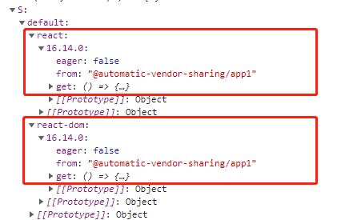

# Module Federation

[Module Federation](https://webpack.docschina.org/concepts/module-federation/) 是 Webpack 5 的一个新特性。文档的介绍如下：  
一个应用可以由多个独立的构建组成。这些独立的构建之间没有依赖关系，他们可以独立开发、部署。上述解释，其实就是微前端的概念。使用 module federation，我们可以在一个 javascript 应用中动态加载并运行另一个 javascript 应用的代码，并实现应用之间的依赖共享

其实看到去好像就是支持模块从别的项目地址进行加载，从而达到复用模块的的效果

## 源码简析

首页回顾一个 Webpack 实现的 [模块加载](./原理/code-split.md) 的原理：

- Webpack 打包后的文件定义了一个 `__webpack_modules__` 对象，用于存储模块的执行内容。`key` 值对应模块的 `id`， `value` 对应模块的模块内容

- Webpack 打包后的文件定义了一个 `_webpack_module_cache__` 是一个对象，用于缓存模块的 `export` 导出结果。`key` 值对应模块的 `id`，`value` 对应模块的输出

- Webpack 还提供了一个 `__webpack_require__` 对象，可用于获取模块的输出。源代码中的 `import xx from 'xxx'`,最终会被转化为 `__webpack_require__.[xx](...)` 的形式

- 对于每一个抽离出来的模块 Webpack 会把这个模块打包为一个含自执行方法的 JS 文件。当加载这个 JS 文件的时候会执行模块对应的相关代码，将对内保存到 `__webpack_modules__` 对象中

- 之后会执行模块的代码内容，输出 `exports` 导出结果同时保存到 `__webpack_module_cache__`

之前模块加载只支持当前项目所在的地址，Federation 的实现就在原来的基本上支持了从其它地上进行模块的获取

官方提供了很多使用 Federation 的粟子 [Module Federation Examples](https://github.com/module-federation/module-federation-examples)

这里以 `Advanced API/automatic-vendor-sharing` 为基础去探索 Federation 的运行原理，粟子下面有两个应用，配置的 Federation 如下所示：

```js
// app1 的 Webpack 配置
new ModuleFederationPlugin({
  name: "app1",
  filename: "remoteEntry.js",
  remotes: {
    app2: "app2@http://localhost:3002/remoteEntry.js",
  },
  exposes: {
    "./Button": "./src/Button",
  },
  shared: {
    ...deps,
    react: {
      singleton: true,
    },
    "react-dom": {
      singleton: true,
    },
  },
})

// app2 的 Webpack 配置
new ModuleFederationPlugin({
  name: "app2",
  filename: "remoteEntry.js",
  remotes: {
    app1: "app1@http://localhost:3001/remoteEntry.js",
  },
  exposes: {
    "./Button": "./src/Button",
  },
  shared: {
    ...deps,
    react: {
      singleton: true,
    },
    "react-dom": {
      singleton: true,
    },
  },
})
```

接下来从 [共享依赖] 和 [加载remote] 两个角度去了解一下 Webpack 是怎么处理的

### 共享依赖

粟子中 `react` 和 `react-dom` 两个配置是共享的，当我们配置了 Federation 的共享模块配置后，主文件内容将会添加如下代码内容

```js
Promise.all(/*! import() */[__webpack_require__.e("webpack_sharing_consume_default_react_react-_2849"), __webpack_require__.e("src_bootstrap_js")]).then(__webpack_require__.bind(__webpack_require__, /*! ./bootstrap */ "./src/bootstrap.js"));
```

源码中这段代码是通过 `eval` 包装起来的，作用是使用 `__webpack_require__.e` 方法加载 `webpack_sharing_consume_default_react_react-_2849` 和 `src_bootstrap_js` 两个模块，这里跟共享配置有关的是 `webpack_sharing_consume_default_react_react-_2849` 文件

`__webpack_require__.e` 实际执行的 `__webpack_require__.f.consumes` 方法去获取 `webpack_sharing_consume_default_react_react-_2849` 模块

```js
// 保存模块的加载的状态
var installedModules = {};
__webpack_require__.f.consumes = (chunkId, promises) => {
    if(__webpack_require__.o(chunkMapping, chunkId)) { // 判断 chunkMapping 对象中是否存在 chunkId 属性，即判断当前模块是否属性共享模块
        chunkMapping[chunkId].forEach((id) => { // 根据 chunkId 获取要载的模块
            // 如果 installedModules 已经该模块的状态，直接取出使用
            if(__webpack_require__.o(installedModules, id)) return promises.push(installedModules[id]);
            // 设置成功的回调
            var onFactory = (factory) => {
                installedModules[id] = 0; // 成功后状态置为 0 ，表示已经安装过
                __webpack_require__.m[id] = (module) => {
                    delete __webpack_require__.c[id];
                    module.exports = factory();
                }
            };
            // 设置失败的回调
            var onError = (error) => {
                delete installedModules[id];
                __webpack_require__.m[id] = (module) => {
                    delete __webpack_require__.c[id];
                    throw error;
                }
            };
            try {
                var promise = moduleToHandlerMapping[id](); // 执行对应的方法
                if(promise.then) {
                    promises.push(installedModules[id] = promise.then(onFactory).catch(onError));
                } else onFactory(promise);
            } catch(e) { onError(e); }
        });
    }
}
```

首先 `chunkMapping` 是一个映射对象，通过当前模块名这件事哪些具体的模块

```js
var chunkMapping = {
	"webpack_sharing_consume_default_react_react-_2849": [
		"webpack/sharing/consume/default/react/react?2849"
	],
	"src_bootstrap_js": [
		"webpack/sharing/consume/default/react-dom/react-dom"
	],
	"webpack_sharing_consume_default_react_react-_76b1": [
		"webpack/sharing/consume/default/react/react?76b1"
	]
};
```

`consumes` 方法就是找出这个模块对应在的路径，通过 `var promise = moduleToHandlerMapping[id]()` 执行对应的方法，然后将返回的 `promise` 返回存到 `promises` 中.  
当 `promise` 执行完成后执行回调 `onFactory` 方法， `onFactory` 就是执行加载的文件，获取 `module.exports`

上面的 ` moduleToHandlerMapping[id]()` 也是一个映射关系，如下所示

```js
var moduleToHandlerMapping = {
	"webpack/sharing/consume/default/react/react?2849": () => (loadSingletonVersionCheckFallback("default", "react", [1,16,13,0], () => (Promise.all([__webpack_require__.e("vendors-node_modules_react_index_js"), __webpack_require__.e("node_modules_object-assign_index_js-node_modules_prop-types_checkPropTypes_js")]).then(() => (() => (__webpack_require__(/*! react */ "./node_modules/react/index.js")))))))，
  //...省略
};
```

然后从 `moduleToHandlerMapping` 得到模块加载的方法，具体代码为：

```js
loadSingletonVersionCheckFallback(
    "default",
    "react",
    [1,16,13,0],
    () => (Promise.all( [
          __webpack_require__.e("vendors-node_modules_react_index_js"), 
          __webpack_require__.e("node_modules_object-assign_index_js-node_modules_prop-types_checkPropTypes_js")
        ]).then(() => (() => (__webpack_require__(/*! react */ "./node_modules/react/index.js")))))
)

var loadSingletonVersionCheckFallback =  init((scopeName, scope, key, version, fallback) => {
	if(!scope || !__webpack_require__.o(scope, key)) return fallback();
	return getSingletonVersion(scope, scopeName, key, version);
});

var init = (fn) => (function(scopeName, a, b, c) {
	var promise = __webpack_require__.I(scopeName);
	if (promise && promise.then) return promise.then(fn.bind(fn, scopeName, __webpack_require__.S[scopeName], a, b, c));
	return fn(scopeName, __webpack_require__.S[scopeName], a, b, c);
});
```

`loadSingletonVersionCheckFallback` 实际上执行的 `init` 返回的函数，根据当前例子参数对应为：

- scopeName： `default`

- a： `react`

- b： `[1,16,13,0]`

- c： Promise 函数

`init` 方法执行 `__webpack_require__.I(scopeName)`，`scopeName=default` 是默认值 

```js
/* webpack/runtime/sharing */
(() => {
    // 初始化一个 __webpack_require__.S 保存共享的依赖名、版本号、获取方法
    __webpack_require__.S = {};
    var initPromises = {};
    var initTokens = {};
    __webpack_require__.I = (name, initScope) => {
        if(!initScope) initScope = [];
        // 处理循环初始化调用      
        var initToken = initTokens[name];
        if(!initToken) initToken = initTokens[name] = {};
        // 如果存在，说明之前获取后，直接返回
        if(initScope.indexOf(initToken) >= 0) return;
        initScope.push(initToken);
        // 防止重复调用
        if(initPromises[name]) return initPromises[name];
        // 保存当前共享模块到 __webpack_require__.S
        if(!__webpack_require__.o(__webpack_require__.S, name)) __webpack_require__.S[name] = {};
        // 运行这个模块的所有初始化代码片段
        var scope = __webpack_require__.S[name];
        var warn = (msg) => (typeof console !== "undefined" && console.warn && console.warn(msg));
        var uniqueName = "@automatic-vendor-sharing/app1";
        // 注册共享模块
        var register = (name, version, factory, eager) => {
            var versions = scope[name] = scope[name] || {};
            var activeVersion = versions[version];
            // 添加当前模块的信息到 versions 对象中，变向保存到 __webpack_require__.S 对于中. 其中 get 属性表示执行模块的获取方法
            if(!activeVersion || (!activeVersion.loaded && (!eager != !activeVersion.eager ? eager : uniqueName > activeVersion.from))) versions[version] = { get: factory, from: uniqueName, eager: !!eager };
        };
        var initExternal = (id) => {
            var handleError = (err) => (warn("Initialization of sharing external failed: " + err));
            try {
                // 获取另个应用的 remoteEntry.js 模块，这里返回 promise
                var module = __webpack_require__(id);
                if(!module) return;
                // module 执行成功后的回调
                var initFn = (module) => (module && module.init && module.init(__webpack_require__.S[name], initScope))
                 // 执行是导步的，先保存 promise 到 promises 中，等成功后再执行 initFn
                if(module.then) return promises.push(module.then(initFn, handleError));
                // 如果是已经加过的，直接执行 initFn
                var initResult = initFn(module);
                // 添加异常的情况
                if(initResult && initResult.then) return promises.push(initResult.catch(handleError));
            } catch(err) { handleError(err); }
        }
        var promises = [];
        switch(name) {
            case "default": {
                register("react-dom", "16.14.0", () => (Promise.all([__webpack_require__.e("vendors-node_modules_react-dom_index_js"), __webpack_require__.e("webpack_sharing_consume_default_react_react-_76b1")]).then(() => (() => (__webpack_require__(/*! ./node_modules/react-dom/index.js */ "./node_modules/react-dom/index.js"))))));
                register("react", "16.14.0", () => (Promise.all([__webpack_require__.e("vendors-node_modules_react_index_js"), __webpack_require__.e("node_modules_object-assign_index_js-node_modules_prop-types_checkPropTypes_js")]).then(() => (() => (__webpack_require__(/*! ./node_modules/react/index.js */ "./node_modules/react/index.js"))))));
                initExternal("webpack/container/reference/app2");
            }
            break;
        }
        if(!promises.length) return initPromises[name] = 1;
        return initPromises[name] = Promise.all(promises).then(() => (initPromises[name] = 1));
    };
})();
```

上面代码通过 `register` 方法添加共享模块的信息到 `__webpack_require__.S` 对象中，此时 `__webpack_require__.S` 对象的内容大致如下图所示：



然后执行 `initExternal("webpack/container/reference/app2")` 方法，调用 `__webpack_require__(id)` 执行 `webpack/container/reference/app2` 模块的内容（这部分是直接在主文件中，所以不用另外加载可以直接执行）：

```js
var __webpack_error__ = new Error();
module.exports = new Promise((resolve, reject) => {
    // 如果存在 app2 执行成功的回调      
	if(typeof app2 !== "undefined") return resolve();
    // 通过加载 remoteEntry.js
	__webpack_require__.l("http://localhost:3002/remoteEntry.js", (event) => {
		if(typeof app2 !== "undefined") return resolve();
		var errorType = event && (event.type === 'load' ? 'missing' : event.type);
		var realSrc = event && event.target && event.target.src;
		__webpack_error__.message = 'Loading script failed.\n(' + errorType + ': ' + realSrc + ')';
		__webpack_error__.name = 'ScriptExternalLoadError';
		__webpack_error__.type = errorType;
		__webpack_error__.request = realSrc;
		reject(__webpack_error__);
	}, "app2");
}).then(() => (app2));
```

`webpack/container/reference/app2` 的内容就是执行 `__webpack_require__.l` 动态创建 `script` 加载 `http://localhost:3002/remoteEntry.js` 这里先不关心 `remoteEntry` 的内容，回塑一下过程：

1. 当这里执行后 `module.exports` 返回的就是一个 Promise , 且 `resolve()` 执行的时候是没返回任务值的

2. 上面的 `module`，在是 `__webpack_require__.I => initExternal()` 执行的 `var module = __webpack_require__(id)`

3. 当 `resolve()` 后将会执行的回调为  `var initFn = (module) => (module && module.init && module.init(__webpack_require__.S[name], initScope))`

4. 原来执行的是这个模块导出的 `init` 方法

总结来说就是加载 `remoteEntry.js` 后就执行这个模块的 `init` 方法，现在在看下这个 `init` 做了什么

此时 `__webpack_require__` 作用就是加载 `remoteEntry`，返回的 `module.exports` 是一个 Promise，这个 Promise 的回调是 `app2`

回到 `initExternal` 方法中，执行 ` return promises.push(module.then(initFn, handleError))`, 返回到 `promises` 集合中

`__webpack_require__.I` 返回的就是这个 Promise 集合 `promises`，当这个 `promises.then` 触发后执行的是 `init` 中的 `fn` 函数参数

```js
var init = (shareScope, initScope) => {
	if (!__webpack_require__.S) return;
	var oldScope = __webpack_require__.S["default"];
	var name = "default"
	if(oldScope && oldScope !== shareScope) throw new Error("Container initialization failed as it has already been initialized with a different share scope");
	__webpack_require__.S[name] = shareScope;
	return __webpack_require__.I(name, initScope);
};
```

上面的参数 `shareScope` 是就是 app1 中 `__webpack_require__.S[name]（共享模块）`，也就是会使用 `app1`的共享模块配置来初始化 `app2` 的共享模块配置，这样就签到了两个应用使用的一份的共享模块的配置.  
结尾执行 `__webpack_require__.I(name, initScope)` ，这里的执行只会执行 `register` 不会执行 `initExternal`

到目前为止 ` __webpack_require__.I` 算是执行了，回到 调用 ` __webpack_require__.I` 方法的地方：

```js
var loadSingletonVersionCheckFallback =  init((scopeName, scope, key, version, fallback) => {
	if(!scope || !__webpack_require__.o(scope, key)) return fallback();
	return getSingletonVersion(scope, scopeName, key, version);
});

var init = (fn) => (function(scopeName, a, b, c) {
	var promise = __webpack_require__.I(scopeName);
	if (promise && promise.then) return promise.then(fn.bind(fn, scopeName, __webpack_require__.S[scopeName], a, b, c));
	return fn(scopeName, __webpack_require__.S[scopeName], a, b, c);
});
var getSingletonVersion = (scope, scopeName, key, requiredVersion) => {
	var version = findSingletonVersionKey(scope, key);
	if (!satisfy(requiredVersion, version)) typeof console !== "undefined" && console.warn && console.warn(getInvalidSingletonVersionMessage(key, version, requiredVersion));
	return get(scope[key][version]);
};
```

`__webpack_require__.I` 执行后就是 调用 `get(scope[key][version])` 的来获取共享的模块了，具体执行方法就是 `register` 共离模块时的传的第三个参数，eg:

```js
register("react", "16.14.0", () => (Promise.all([__webpack_require__.e("vendors-node_modules_react_index_js"), __webpack_require__.e("node_modules_object-assign_index_js-node_modules_prop-types_checkPropTypes_js")]).then(() => (() => (__webpack_require__(/*! ./node_modules/react/index.js */ "./node_modules/react/index.js"))))))
```

就是执行 `__webpack_require__.e("vendors-node_modules_react_index_js")` 和 `__webpack_require__.e("node_modules_object-assign_index_js-node_modules_prop-types_checkPropTypes_js")` 加载这两个文件，将模块内容保存到 `__webpack_modules__` 对象中

#### 小结

单从代码的调用过程真的非常的绕，整理一下流程大致为：

执行入口模块代码时，会通过  `__webpack_require__.I` 方法初始化 `__webpack_require__.S` 对象，这个对应是记录当前应用共享模块的配置的，然后调用 app2 的 `remoteEntry.js`，`app2/remoteEntry.js` 加载成功后会 使用 `app1/__webpack_require__.S` 初始化 `app2/__webpack_require__.S`,达到共有一个共享模块的配置.  
之后执行共享模块的 `get` 方法去获具体的模块

### remote模块

上文有讲到在加载了 `remoteEntry.js`，有定义了 `init` 方法来初始化两边的共享模块配置，除了 `init` 方法其实还定义了一个 `get`, 用来获取远程应用的 `remote` 模块

```js
var moduleMap = {
	"./Button": () => {
		return Promise.all([__webpack_require__.e("webpack_sharing_consume_default_react_react-_2849"), __webpack_require__.e("src_Button_js")]).then(() => (() => ((__webpack_require__(/*! ./src/Button */ "./src/Button.js")))));
	}
};
var get = (module, getScope) => {
	__webpack_require__.R = getScope;
	getScope = (
		__webpack_require__.o(moduleMap, module)
			? moduleMap[module]()
			: Promise.resolve().then(() => {
				throw new Error('Module "' + module + '" does not exist in container.');
			})
	);
	__webpack_require__.R = undefined;
	return getScope;
};
```

因此需要加载 `remote` 模块时就是通过上面的方法去加远程应用的模块

## module federation 配置项详解

一个完整的 module federation 配置项，包含内容如下：

```js
new ModuleFederationPlugin({
    name: 'xxx',
    filename: 'xxx',
    library: {
        type: 'xxx',
        name: 'xxx'
    },
    remotes: {
        app2: 'app2@xxxx',
        app3: 'app3@xxxx',
        ...
    },
    exposes: {
        './Button': './src/Button',
        ...
    },
    shared: {
        'react': {
            import: 'xxx',
            singleton: true,
            requiredVersion: 'xxx',
            strictVersion: 'xxx',
            shareScope: 'xxx',
            packageName: 'xxx',
            sharedKey: 'xxx',
            eager: true
        }
    },
    shareScope: 'xxx'
})

```

### name

当前应用的别名

### **filename**

入口文件名， remote 应用供 host 应用消费时，remote 应用提供的远程文件的文件名。

### **exposes**

remote 应用被 host 应用消费时，有哪些输出内容可以被 host 应用使用。

`exposes` 是一个对象， `key` 为输出内容在 host 应用中的相对路径，`value` 为输出内容的在当前应用的相对路径(也可以是绝对路径)

```js
new ModuleFederationPlugin({
	...
    exposes: {
    	'./Button': '../src/component/Button'
    }
})

```

注意：如果我们在 host 应用中是 `import('app2/Button')`, 那么 `exposes` 中的 `key` 必须为 `'./Button'`; 如果是 `import('app2/shared/Button')`， 那么 `exposes` 中的 `key` 必须为 `'./shared/Button'`.

### **library**

`library` 定义了 remote 应用如何将输出内容暴露给 host 应用。

配置项的值是一个对象，如 `{ type: 'xxx', name: 'xxx'}`。

其中，`name`，暴露给外部应用的变量名； `type`，暴露变量的方式。

`type` 的值，和 `output.libraryTarget` 的值类似:

- var: remote 的输出内容分配给一个通过 var 定义的变量

   ```js
   var app2; app2 = (() => {
       ...
       return __webpack_require__(...);
   })();
   ```
  
- assign: remote 的输出内容分配给一个不通过 var 定义的变量；

   ```js
   app2 = (() => {
       ...
       return __webpack_require__(...);
   })();
   ```
  
- this: remote 的输出内容作为当前上下文 `this` 的一个属性，属性名为 `name` 对应的值

   ```js
   this["app2"] = (() => {
       ...
       return __webpack_require__(...);
   })()
   ```

- window: remote 的输出内容作为 window 对象的一个属性，属性名为 name 对应的值

  ```js
   window["app2"] = (() => {
      ...
      return __webpack_require__(...);
   })()
   ```

- self: remote 的输出内容作为 self 对象的一个属性，属性名为 name 对应的值；

   ```js
   self["app2"] = (() => {
       ...
       return __webpack_require__(...);
   })();
   ```

- commonjs2: remote 的输出内容作为 module.exports 的一个 属性，属性名为 name 对应的值；

   ```js
   module.exports["app2"] = (() => {
       ...
       return __webpack_require__(...);
   })(); 
   ```

- amd: remoteEntry.js 符合 AMD 规范

   ```js
   define('app2', [], function() { return (() => {...})()});
   ```

- umd: remoteEntry.js 符合 UMD 规范；

   ```js
    (function(root, factory){
        if(typeof exports === 'object' && typeof module === 'object')
            module.exports = factory();
        else if(typeof define === 'function' && define.amd)
            define([], factory);
        else if(typeof exports === 'object')
            exports["app2"] = factory();
        else
            root["app2"] = factory();
    }(window, function() {
        return (() => {...})()}
    )

   ```

- jsonp: 将 remote 的输出内容包裹到一个 jsonp 包装容器中;

   ```js
   app2((() =>{...})())
   ```

- system: remoteEntry.js 符合 Systemjs 规范

   ```js
   System.register("app2", [], function(__WEBPACK_DYNAMIC_EXPORT__, __system_context__) {
       return {
           execute: function() {
   	    __WEBPACK_DYNAMIC_EXPORT__(...)
           }
       }
   }

   ```
  
### **remotes**

被当前 host 应用消费的 remote 应用。

remotes 是一个对象，key 值是一个要消费的应用的别名。如果我们在要 host 应用中使用 remote 应用的 button 组件时，我们的代码如下:

```js
const RemoteButton = React.lazy(() => import('app2/button));
```

其中， `import url` 中的 app2 对应 remotes 配置项中的 `key` 值。

`value` 为 remote 应用的对外输出及url，格式必须严格遵循: `obj@url`。其中， obj 对应 remote 应用中 `library` 中的 `name` 配置项， `url` 对应 remote 应用中 remoteEnter 文件的链接

### **shared**

`shared` 配置项指示 `remote` 应用的输出内容和 `host` 应用可以共用哪些依赖。 `shared` 要想生效，则 `host` 应用和 `remote` 应用的 `shared` 配置的依赖要一致

- import

   共享依赖的实际的 `package name`
   
   ```js
   {
   	...,
       shared: {
       	'react-shared': {
               import: 'react'
           }
       }
   }
   ```
  
  如果未指定，默认为用户自定义的共享依赖名，即 `react-shared`。如果是这样的话，webpack 打包是会抛出异常的，因为实际上并没有 `react-shared` 这个包
  
- singleton

   是否开启单例模式。如果值为 `true`，开启单例模式；值为 `false`，不开启单例模式。默认值为 `false`，即不开单例模式
   
   如何启用单例模式，那么 `remote` 应用组件和 `host` 应用共享的依赖只加载一次，且与版本无关。 如果版本不一致，会给出警告
   
   加载的依赖的版本为 `remote` 应用和 `host` 应用中，版本比较高的。
   
   不开启单例模式下，如果 `remote` 应用和 `host` 应用共享依赖的版本不一致，`remote` 应用和 `host` 应用需要分别各自加载依赖
   
- requiredVersion

  指定共享依赖的版本，默认值为当前应用的依赖版本。
  
  如果 `requiredVersion` 与实际应用的依赖的版本不一致，会给出警告
  
- strictVersion

   是否需要严格的版本控制
   
   单例模式下，如果 `strictVersion` 与实际应用的依赖的版本不一致，会抛出异常
   
   默认值为 `false`
   
- shareKey：共享依赖的别名, 默认值为 `shared` 配置项的 `key` 值
   
- shareScope： 当前共享依赖的作用域名称，默认为 default，之前粟子有看到 `__webpack_require__.S` 的结构为：

   
   
- eager:

   共享依赖在打包过程中是否被分离为 `async chunk`。
   
   `eager` 为 `false`， 共享依赖被单独分离为 `async chunk`； `eager` 为 `true`， 共享依赖会打包到 `main`、`remoteEntry`，不会被分离。
   
   默认值为 `false`，如果设置为 `true`， 共享依赖其实是没有意义的


### **shareScope**

所用共享依赖的作用域名称，默认为 `default`。`

如果 `shareScope` 和 `share["xxx"].shareScope` 同时存在，`share["xxx"].shareScope` 的优先级更高

## Q&A

### 为什么 index.js 中需要以 import() 的方式引入 bootstrap.js ？

在查看 module federation 例子的时候，示例中 `index.js` 中使用 `import()` 方法引入 `bootstrap.js` ，如果把 `bootstrap.js` 中的内容，直接粘贴到 `index.js` 中。启动就会报错

原因在于使用 `module federation` 以后，`react` 会作为异步模块，在 `app1` 的 `main.js`、`app2` 的 `remote.js` 完成加载并且初始化 `sharedScope` 以后，才会加载并运行对应的执行方法。

**所以这带来思考：异步后页面的加载不就变长了？**

### module federation 是否可以做到与技术栈无关？

答案是可以的。

假设两个应用， host 应用使用 react 技术栈， remote 应用使用 vue 技术栈，host 应用在使用 remote 应用提供的组件时，不能直接使用，需要额外执行 vue.mount('#xxx') 方法，将 remote 组件挂载的指定位置

### 共享依赖的版本控制

module federation 在初始化 `shareScope` 时，会比较 `host` 应用和 `remote` 应用之间共享依赖的版本，将 `shareScope` 中共享依赖的版本更新为较高版本。

在加载共享依赖时，如果发现实际需要的版本和 `shareScope` 中共享依赖的版本不一致时，会根据 `share` 配置项的不同做相应处理：

- 如果配置 `singleton` 为 `ture`，实际使用 `shareScope` 中的共享依赖，控制台会打印版本不一致警告

- 如果配置 `singleton` 为 `ture`，且 `strictVersion` 为 `ture`，即需要保证版本必须一致，会抛出异常

- 如果配置 `singleton` 为 `false`，那么应用不会使用 `shareScope` 中的共享依赖，而是加载应用自己的依赖

综上，如果 host 应用和 remote 应用共享依赖的版本可以兼容，可将 `singleton` 配置为 `ture`；如果共享依赖版本不兼容，需要将 `singleton` 配置为 `false`

### 多个应用(超过 2 个) 是否可共用一个 shareScope ？
 
假设有这么一个场景， 三个应用 - app1、app2、app3， app2 是 app1 的 remote 应用， app3 是 app2 的 remote 应用， 那么他们是否可共用一个 shareScope ？

答案是肯定的。

使用 module federation 功能以后，所有建立联系的应用，共用一个 shareScope

### 多个应用配置相同的 shareScope，最终使用哪个？

## 总结 

- 使用 module federation，我们可以在一个应用中动态加载并执行另一个应用的代码，且与技术栈无关；

- 通过 module federation 建立连接的应用，共享同一个 `shareScope`，可实现依赖共享；

- host 应用的入口文件，必须使用 `import()` 的方式，否则会报错；

- 使用 module federation 需要基于 webpack5

> [module federation 深入了解](https://www.qiyuandi.com/zhanzhang/zonghe/12450.html)