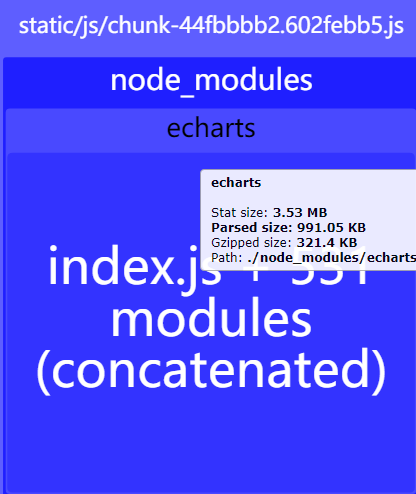

# Webpack 优化实践之Vue-Cli

本次主要从构建速度和打包体积两个方向来进行优化

```
bundle：捆绑好的最终文件。 如果说，chunk 是各种片段，那么bundle 就是一堆chunk 组成的“集大成者”。 当然它也类似于电路上原先是各种散乱的零件，最终组成一个集成块的感觉。 它经历了加载和编译的过程，是源文件的最终版本
```

## 构建速度优化

目前项目的打包时间情况：

| 首次打包    | 重复打包   |
|:---------:| ---------:|
| 201.73s   | 80 ~ 110  |

使用 `speed-measure-webpack-plugin` 来看下 Loader 和 Plugin 的耗时情况


- general output time：可以认为是 loader 和 plugin 的执行时间，但是这其中还包括了 webpack 从硬盘读取这些 loader 和 plugin 的时间，这部分是 SMP 无法测量的，所以这个时间总是会小于 loader 和 plugin 的执行时间综合

- modules with no loaders：webpack 对于基本的 JS 文件的处理


### CLI 配置相关的优化

#### lintOnSave

是否保存时检查代码，只需要在开发环境下执行

```js
lintOnSave: process.env.NODE_ENV === 'development'
```

#### productionSourceMap

- Type: boolean

- Default: true

如果你不需要生产环境的 source map，可以将其设置为 false 以加速生产环境构建

#### runtimeCompiler

- Type: boolean

- Default: true

是否使用包含运行时编译器的 Vue 构建版本。设置为 true 后你就可以在 Vue 组件中使用 template 选项了，但是这会让你的应用额外增加 10kb 左右

#### transpileDependencies

- type: boolean | Array<string | RegExp>

- Default: false

默认情况下 babel-loader 会忽略所有 node_modules 中的文件。你可以启用本选项，以避免构建后的代码中出现未转译的第三方依赖

#### css.sourceMap

- Type: boolean

- Default: false

是否为 CSS 开启 source map。设置为 true 之后可能会影响构建的性能

#### parallel

- Type: boolean

- Default: require('os').cpus().length > 1

是否为 Babel 或 TypeScript 使用 thread-loader。该选项在系统的 CPU 有多于一个内核时自动启用，仅作用于生产构建

### 减少编译范围

#### exclude/include、noParse

这些方面的优化包含以下部分：

- 配置 `Loader` 时合理得使用 `test`、 `exclude`、`include` 属性，优化要使用 Loader 的文件，尽可能少的让文件被Loader处理

- 合理配置 `resolve.modules`，告知 Webpack 从哪里在寻找第三方模块

  Webpack 默认会在当前项目根目录的`node_modules` 下寻找第三方模块，如果当前 `node_modules` 没有找到对应的模块则去上一级目录下的`node_modules`中找，以此类推。


- 合理配置 `resolve.extensions`，便 Webpack 更精确得查找文件

  默认情况下，Webpack 寻找没有带后缀的文件时，会自动带上后缀去寻找，默认是通过 `resolve.extension` 配置的后缀列表按顺序去寻找，默认是：

    ```js
    extensions:['.js', '.json']
    ```

- 合理配置 `resolve.noParse`

  对于没有模块化的文件，通过这个配置让 Webpack 忽略对这些文件的递归解析，以此提高构建性能。比如 `JQuery`、`ChartJs` 等没用采用模块化的方式，让 Webpack 解析这些文件即耗时又没有意义

eg:

```js
// vue.config.js
module.exports = {
   //...
   configureWebpack:{
    module: {
      noParse: /^(lodash|moment)$/
    }
  }
  //...
}
```

```js
//webpack.config.js
const path = require('path');
module.exports = {
    //...
    module: {
        rules: [
            {
                test: /\.js[x]?$/,
                use: ['babel-loader'],
                include: [path.resolve(__dirname, 'src')]
            }
        ]
    },
}
```

以上这些能优化的空间很少，而且 vue-cli 在这这些方面该优化的都有优化了，比如 vue-cli 默认情况下 babel-loader 会忽略所有 `node_modules` 中的文件，而且大部分都是小优化， 所以这些就不深趴了

### 缓存

#### DllPlugin

就是事先把常用但又构建时间长的代码提前打包好（例如 react、react-dom）。 然后 Webpack 直接使用这些打包好的文件内容 。以达到缩短构建时间的目的

DllPlugin 配置需要先生成 dll，然后在 Webpack 中配置使用， 这个过程相比其它插件的使用真的相当繁琐的，所以可以使用 `autodll-webpack-plugin` 这个插件自动帮我们做 dll 的配置工作

但是在 Webpack4之后， 已经渐渐不使用 dllPlugin了，原因主要是因为一方面配置繁琐，维护成本高；另一方面 Webpack 4 之后在打包性能已经做了多大的优化，dll 带来的收益已经不明显

[你真的需要 Webpack DllPlugin 吗？](https://www.cnblogs.com/skychx/p/webpack-dllplugin.html)

#### cache-loader

缓存加载器的编译的结果，避免重新编译. cache-loader 工作分两个阶段：pitch 和 loader

- pitch阶段的处理流程是：cache-loader -> other-loader

- loader阶段的处理流程是：other-loader -> cache-loade

pitch 阶段根据当前正在处理的文件，读取 .cache 目录中对应的 cache 文件，对比 mtime(基于目标文件最后修改时间) 判断是否可以复用

loader阶段依赖pitch阶段的判断，如果pitch阶段判断当前文件的缓存失效了，loader阶段就要重新生成缓存

```js
/* config.module.rule('vue') */
{
  test: /\.vue$/,
  use: [
    {
      loader: 'D:\\code\\work\\esg-cbm-core-spreadjs - 副本\\node_modules\\cache-loader\\dist\\cjs.js',
      options: {
        cacheDirectory: 'D:\\code\\work\\esg-cbm-core-spreadjs - 副本\\node_modules\\.cache\\vue-loader',
        cacheIdentifier: '2d61e554'
      }
    },
    {
      loader: 'vue-loader',
      options: {
        compilerOptions: {
          whitespace: 'condense',
          preserveWhitespace: true
        },
        cacheDirectory: 'D:\\code\\work\\esg-cbm-core-spreadjs - 副本\\node_modules\\.cache\\vue-loader',
        cacheIdentifier: '2d61e554'
      }
    }
  ]
}
```

 vue-cli 中 `vue-loader` 已经启动了 `cache-loader`,  `babel-loader` 自己带了 cache 功能，所以这里也不需要自己去给内置的配置添加缓存，所以优化下项目中自己额外配置的 `loader`

 比如项目下的 `vue.config.js` 中配置了 `svg-sprite-loader` 来将 svg 图标生成的 iconfont ，打包 smp 打包耗时大约在 `13s` 左右，所以添加 `cache-lodaer` 添加缓存功能

 ```js
config.module
    .rule('icons')
    .test(/\.svg$/)
    .include.add(resolve('src/icons'))
    .end()
    .use('cache-loader') // 添加 cache-loader
    .loader('cache-loader') // 添加 cache-loader
    .end()
    .use('svg-sprite-loader')
    .loader('svg-sprite-loader')
    .options({
        symbolId: 'icon-[name]'
    })
    .end()
 ```

添加前后的 svg-sprite-loader 执行耗时对比如下：

| 优化前     | 优化后   |
|:---------:| --------:|
| 12.77 s   | 2.39 s   |

时间少了 60%， 效果还是非常明显的

[CI环境下cache-loader的局限性以及修复方式](https://juejin.cn/post/6844904159670435847)

### hard-source-webpack-plugin

[hard-source-webpack-plugin](https://www.npmjs.com/package/hard-source-webpack-plugin)

HardSourceWebpackPlugin 是 Webpack 插件，用于为模块提供中间缓存步骤。为了查看结果，您需要使用此插件运行两次 Webpack：第一次构建将花费正常时间。第二个版本将明显更快

```js
const HardSourceWebpackPlugin = require('hard-source-webpack-plugin');

plugins: [
    new HardSourceWebpackPlugin()
],
```

|         | 优化前     | 优化后   |
| :-----: |:---------:| --------:|
| 首次打包 | 201.73s   | 190.64s  |
| 重复打包 | 80 ~ 110  | 40s ~ 46s|

以上带有带有 smp 配置后最终在终端输出打包结果， smp 显示的优化前后的耗时信息如下：

 `General output time took 1 min, 8.98 secs  ~ General output time took 12.18 secs` 可以发现时间缩短了 80%

:::waring
使用 HardSourceWebpackPlugin 热更新的速度会变慢
:::

[webpack构建提速-HardSourceWebpackPlugin-热重载不生效](https://juejin.cn/post/7020647510322462756)

### 多进程工作

- 使用 `terser-webpack-plugin` 多进程压缩

- 使用 HappyPack 或 thread-loader 开启多进程来对文件进行解析和转换

vue-cli  对于耗时的 loader 默认有此优化

### 使用更高效的loader/plugin

#### **使用[esbuild-loader](https://www.npmjs.com/package/esbuild-loader)/swc-loader替换 label-loader**

优化前首次打包 label-loader 耗时


```js
const rule = config.module.rule('js');
// 清理自带的babel-loader
rule.uses.clear();
// 添加esbuild-loader
rule.test( /\.m?jsx?$/)
    .use('esbuild-loader')
    .loader('esbuild-loader')
    .options({
        loader: 'tsx',
        target: 'es2015'
    })
    .end()
```

优化前首次打包 label-loader 耗时


smp:

|         | label-loader       | esbuild-loader | esbuild-loader+cache-loader |
| :-----: |:------------------:|:--------------:|:--------------------------:|
| 首次打包 |  1 min, 0.226 secs  | 6.93 secs      | 18.61 secs                 |
| 重复打包 |  24s ~ 36s          | 6s ~ 7s        | 4s ~ 7s                    |

时间为： `Done in 201.73s.` => `Done in 117.93s.`

二次打包时间为 `80 ~ 110` 之间 `89~98`

整体的打包耗时

|         | 优化前     | 优化后   | esbuld-loader+cache-loader |
| :-----: |:---------:| -------:|--------------------------:|
| 首次打包 | 201.73s   | 117.93s  | 118s                      |
| 重复打包 | 91 ~ 110  | 69s ~ 80s| 70s ~ 71s                 |

可以发现使用 esbuild-loader 首次打包的速度比 babel-loader 快了百分40，但是之后的打包后因为 babel-loader 已经有了缓存，之后的打包的时间没有存在很大的差距

:::warning
要提醒的是esbuild-loader 只能编译到 es2015
:::

#### **使用esbuild-minimize-plugin替换 terser 实现 CSS压缩**

```js
// 删除底层 terser, 换用 esbuild-minimize-plugin
config.optimization.minimizers.delete('terser');
config.optimization
    .minimizer('esbuild')
    .use(ESBuildMinifyPlugin, [{ target: 'es2015', minify: true, css: true }]);
```

|         | 默认(terser)   | ESBuildMinifyPlugin        |
| :-----: |:-------------:| :-------------------------:|
| 首次打包 | 260.54s        | 136.43s                    |
| 重复打包 | 83 ~ 96        | 95 ~ 98                     |

可以发现使用 esbuild 后首次打包的速度快了百分50，但是二次打包后因为 terser 已经有了缓存，所以时间没有差多少。

:::waring
需要额外注意的是使用 esbuild 压缩后的体积会比使用 terser 的大一点
:::

**esbuild 使用场景**

- 没有使用一些自定义的 babel-plugin (如 babel-plugin-import)

- 不需要兼容一些低版本浏览器（esbuild 只能将代码转成 es6）

### 减少打包工作

- 根据情况是否要使用 JS source map ？

  - webpack 通过 devtool 设置

  - vue-cli 可以通过  productionSourceMap 属性进行配置


- 是否要启用 CSS sourceMap ？

  - webpack 通过对应 css(less..)-loader 进行配置(options: { sourceMap: true, })

  - vue-cli 通过  css.sourceMap属性进行配置

- 生产环境是否要开启 eslint ？

  - vue-cli 通过  lintOnSave属性进行配置
  
- 使用 更少/更小 的库

- 移除不使用的代码

- 使用 CDN 来引入资源

   如果文件真的非常大的话，可以一试


## 打包输出优化

 首先使用 `webpack-bundle-analyzer` 插件来看当前项目的打包体积情况：

   
 

先回顾一些 Webpack 打包时的几个术语：

- runtime: 在浏览器运行过程中，webpack 用来连接模块化应用程序所需的所有代码。它包含：在模块交互时，连接模块所需的加载和解析逻辑。包括：已经加载到浏览器中的连接模块逻辑，以及尚未加载模块的延迟加载逻辑

- manifest: 一旦你的应用在浏览器中以 index.html 文件的形式被打开，一些 bundle 和应用需要的各种资源都需要用某种方式被加载与链接起来。在经过打包、压缩、为延迟加载而拆分为细小的 chunk 这些 webpack 优化 之后，你精心安排的 /src 目录的文件结构都已经不再存在。所以 webpack 如何管理所有所需模块之间的交互呢？这就是 manifest 数据用途的由来……

当 compiler 开始执行、解析和映射应用程序时，它会保留所有模块的详细要点。这个数据集合称为 "manifest"，当完成打包并发送到浏览器时，runtime 会通过 manifest 来解析和加载模块。无论你选择哪种 模块语法，那些 import 或 require 语句现在都已经转换为 __webpack_require__ 方法，此方法指向模块标识符(module identifier)。通过使用 manifest 中的数据，runtime 将能够检索这些标识符，找出每个标识符背后对应的模块


- chunk: 数据块

  - 一种是非初始化的：例如在打包时，对于一些动态导入的异步代码，webpack 会帮你分割出共用的代码，可以是自己写的代码模块，也可以是第三方库（node_modules 文件夹里的），这些被分割的代码文件就可以理解为 chunk

  - 还有一种是初始化的：就是写在入口文件处 (entry point) 的各种文件或者说模块依赖，就是 chunk ，它们最终会被捆在一起打包成一个 main.js （当然输出文件名你可以自己指定），这个 main.js 可以理解为 bundle，当然它其实也是 chunk

- bundle: 捆绑好的最终文件。如果说，chunk 是各种片段，那么 bundle 就是一堆 chunk 组成的“集大成者”，比如上面说的 main.js 就属于 bundle。


- splitChunks 分割代码  

- compression-webpack-plugin gzip打包

- externals & cdn

### Tree Shaking

Webpack Tree Shaking 依赖 ES6 module，为能让 Webpapck 能高效所以为了避免导入全部模块平时应该使用 ES6 module 的引入方式

eg：项目用到了 echarts ，这个图表库本身的体积就很大，项目中确使用了 `commondJS` 的引入方式进行使用：

```js
const echarts = require("echarts");

var chartDom = document.getElementById("main");
chartDom.style.height = this.chartHeight;
myChart.setOption( options)
```

`require` 是动态引入模块的，这种方式是不能被 Webpack treeshraking，看下此打包后的大小：



接下改成 ES Module 的引入方式进行使用

```html
<v-chart class="chart" :option="option" @click="chartClick" />
```

```js
import { use } from "echarts/core";
import { CanvasRenderer } from "echarts/renderers";
import { TreeChart } from "echarts/charts";
import VChart from "vue-echarts";

use([
  CanvasRenderer,
  TreeChart,
]);
export default{
  data(){
    option: {}
  },
  components: {
    VChart
  },
}

````

优化后重新打包的结果为：


从 '3.53M' 减到 '1.36M'

但是总打包体积才减少了 `0.5M`，可能是因为其它的 chunk 额外引入了 `vue-echart` 的原因. 但是整体思路是正确的

### 慎用体积大的第三方模块

以当前这个项目为例，项目中除了 Echart 还使用 antv 这个图表图，并且 echart 只在一个组件用到且只用了其中一种图表类型


这种情况是可以把 echart 给剔除掉

### 优化SourceMap todo

我们在项目进行打包后，会将开发中的多个文件代码打包到一个文件中，并且经过压缩，去掉多余的空格，且babel编译化后，最终会用于线上环境，那么这样处理后的代码和源代码会有很大的差别，当有bug的时候，我们只能定位到压缩处理后的代码位置，无法定位到开发环境中的代码，对于开发不好调式，因此sourceMap出现了，它就是为了解决不好调式代码问题的

SourceMap的可选值如下：


- 开发环境推荐： cheap-module-eval-source-map 

- 生产环境推荐： cheap-module-source-map 

原因如下： 1. 源代码中的列信息是没有任何作用，因此我们打包后的文件不希望包含列相关信息，只有行信息能建立打包前后的依赖关系。因此不管是开发环境或生产环境，我们都希望添加cheap的基本类型来忽略打包前后的列信息。 2. 不管是开发环境还是正式环境，我们都希望能定位到bug的源代码具体的位置，比如说某个vue文件报错了，我们希望能定位到具体的vue文件，因此我们也需要module配置。 3. 我们需要生成map文件的形式，因此我们需要增加source-map属性。 4. 我们介绍了eval打包代码的时候，知道eval打包后的速度非常快，因为它不生成map文件，但是可以对eval组合使用 eval-source-map使用会将map文件以DataURL的形式存在打包后的js文件中。在正式环境中不要使用 eval-source-map, 因为它会增加文件的大小，但是在开发环境中，可以试用下，因为他们打包的速度很快。

### compression-webpack-plugin todo


**Cannot read property 'tapPromise' of undefined**

重新安装低版本的

```js
npm i compression-webpack-plugin@5.0.1
```

打包后看下最终的文件输出


可以看到压缩后的文件体积只有原文件的 1/3

[compression-webpack-plugin实践](https://segmentfault.com/a/1190000040268844)

## 优化总结

手脚架本身已经做了很多优化，而且使用手脚架本意就明为了节省这部分的构建配置的维护成本，所以最终留下优化配置为：

现在把上面的所有优化做下整合：

- 如果加配了 loader 且耗时较长，可使用 cache-loader

- 如果项目的启动时间过长，且无法容忍，可以添加 hard-source-webpack-pulgin

- 如果第三方模块的体积很大，且该模块的使用频率非常高，可以考虑直接  CDN 引入

- 如果只考虑编译到 ES5，且想更进一步提高构建速度，可使用 esbuild-loader 代替 label-loader

[swc 快在哪？](https://juejin.cn/post/7034316603890237477)

[前端构建工具测评](https://guoyunhe.me/2022/01/24/front-end-build-tool-benchmark/)

[构建性能](https://www.webpackjs.com/guides/build-performance/#%E5%B8%B8%E8%A7%84)

[Webpack 究竟解决了什么问题？](https://zhuanlan.zhihu.com/p/267875652)