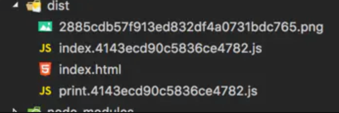
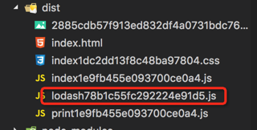

# 配置小记

## 多页面配置

实现多页面配置需要修改的地方：

- 入口配置

- 模板插件 `HtmlWebpackPlugin`

- 自定义服务启动

- 实现页面自动更新

**入口配置**

假设当前的页面目录

```js
- src
  - views
     - page1
       - index.js
     - page1
       - index.js
```

规定 `/src/views` 下的目录代表一个页面，需要在 Webpack `entry` 属配置多入口：

```js
entry: {
    page1: './src/views/page1/index.js',
    page2: './src/views/page2/index.js'
}
```

下面是自动根据目录添加 `entry` 配置的辅助方法：

```js
const glob = require("glob");

function multyEntry() {
    const entry = {};
    //读取src目录所有page入口
    glob.sync('./src/views/*/index.js')
        .forEach(function (filePath) {
            console.log('filePath', filePath)
            var name = filePath.match(/\/src\/views\/(.+)\/index.js/);
            name = name[1];
            entry[name] = [filePath, 'webpack-hot-middleware/client?reload=true'];
        });
    console.log('entry', entry)
    return entry;
};

{
    entry: multyEntry()
}
```

**模板插件 `HtmlWebpackPlugin`**

跟入口文件一样，一个页面需要添加一个 `HtmlWebpackPlugin`, 那么怎么跟入口文件对应呢？ 通过 `chunt`。`chunt` 就是上面例子的 `entry` 的 `key` : `page1`和 `page2`

```js
function multyHtmlWebpackPlugin(){
    const htmlPlugin = [];
    glob.sync('./src/views/*/index.js')
        .forEach(function (filePath) {
            var name = filePath.match(/\/src\/views\/(.+)\/index.js/);
            name = name[1];
            htmlPlugin.push(
                new HtmlWebpackPlugin({
                    title: 'Output Management',
                    filename: './' + name + '/index.html',
                    template: './index.html',
                    inject: true,
                    chunks: [name]
                    
                })
            )
        });
    return htmlPlugin;
}
```

**自定义服务启动**

Webpack 本质是通过 `Webpack-dev-server` 来启动服务的，配置多页面多后如果直接使用 `Webpack-dev-server` ，在访问页面的时候需要输入完整的页面地址才能访问，比如要访问上例中的 `page1`， 我们需要输入 `localhost:8080/page1.html`。通过自己搭个服务可以通过创建路由的方式方便我们访问页面

先了解下 `Webpack-dev-server` 中主要用到了两个核心模块：

- `webpack-dev-middleware`: 是一个处理静态资源的 `middleware`

- `webpack-hot-middleware`: 结合 `webpack-dev-middleware` 使用的 `middleware` ，它可以实现浏览器的无刷新更新（hot reload）。这也是 Webpack 文档里常说的 HMR（Hot Module Replacement）

所以自定义搭建的服务如下：

```js
// dev-server.js
var express = require('express')
var webpack = require('webpack')
var path = require('path')
var webpackHotMiddleware = require('webpack-hot-middleware')
var WebpackDevMiddleware = require('webpack-dev-middleware')
var multyWebpack = require('./webpack.multy')
var webpackConfig = multyWebpack(require('./webpack_config')({}))
var app = express();
// webpack编译器
var compiler = webpack(webpackConfig);
// webpack-dev-server中间件
var devMiddleware = WebpackDevMiddleware(compiler, {
    publicPath: '/',
    // publicPath: webpackConfig.output.publicPath,
    stats: {
        colors: true,
        chunks: false
    },
    progress: true,
    inline: true,
    hot: true
});

app.use(devMiddleware)
app.use(webpackHotMiddleware(compiler))

// 路由
app.get('*', function(req, res, next) {
    const pageKeys = Object.keys(webpackConfig.entry)
    const pageList = pageKeys.map(item => {
        return `<h2><a href="/${item}">${item}.html</a></h2>`
    })
    res.set('content-type', 'text/html');
    res.send(pageList.join(''));
    res.end();
});
module.exports = app.listen(8080, function(err) {
    if (err) {
        // do something
        return;
    }
    console.log('Listening at http://localhost:' + '8000' + '\n')
})
```

当前输入的地址没有匹配到我们多页面的文件时，将会进入上面的路由配置，上面的将根据入口文件返回页面列页列表

**实现页面自动更新**

用自己的服务服务启动项目后，发现当修改代码时，控制台重新编译了，但是页面并没有自动更新。所以我需要额外实现模块热更新功能 

给每个页面注入热更新插件 `webpack-hot-middleware/client?reload=true`，所以优化上文的获取入口的函数

```js
const glob = require("glob");

function multyEntry() {
    const entry = {};
    //读取src目录所有page入口
    glob.sync('./src/views/*/index.js')
        .forEach(function (filePath) {
            console.log('filePath', filePath)
            var name = filePath.match(/\/src\/views\/(.+)\/index.js/);
            name = name[1];
            entry[name] = [filePath, 'webpack-hot-middleware/client?reload=true'];
        });
    return entry;
};

{
    entry: multyEntry()
}
```

完整的热更新还需要实现两点：

- 在 Webpack 配置中添加 `plugin` 插件 `new webpack.HotModuleReplacementPlugin()`

- 在 Express 服务中添加中间件 `webpack-hot-middleware`

## Less

`yarn add less less-loader`

```js
  rules: [
      {
        test: /\.(css|less)$/,
        use: [
          {
            loader: "style-loader",
          },
          {
            loader: "css-loader",
          },
          {
            loader: "less-loader",
            options: {
              lessOptions: {
                strictMath: true,
              },
            },
          },
        ],
      },
    ]
```

## scss

`yarn add node-sass sass-loader`

```js
  rules: [
      {
        test: /\.scss$/,
        use: [
          {
            loader: "style-loader",
          },
          {
            loader: "css-loader",
          },
          {
            loader: "sass-loader",
          },
        ],
      },
    ]
```

如果在 vue 项目，还需要添加以下配置：

```js
     {
        test: /\.vue$/,
        exclude: /node_modules/,
        loader: 'vue-loader',
        options: {
          loaders: {
            'scss': 'style-loader!css-loader!sass-loader'
          }
        }
      },
```

## 支持React

需要添加的依赖：`react`, `react-dom`, `@babel/preset-react`, 

**.babelrc配置**

```js
{
  "presets": [
    [
      "@babel/preset-env",
      {
        "useBuiltIns": "usage",
        "corejs":2
      }
    ],
    "@babel/preset-react"
  ]
}

```

## 支持Vue

需要添加的依赖：`vue`, `vue-loader`, `vue-template-compiler`

**webpack 添加Loader规则**

```js
 rules: [
    {
        test: /\.vue$/,
        exclude: /node_modules/,
        use:[
            "vue-loader"
        ]
    },
 ]
```

**webpack 添加Vue插件**

`Vue-loader` 在 `15.*` 之后的版本 `vue-loader` 的使用都是需要添加插件 `VueLoaderPlugin`

```js
const VueLoaderPlugin = require('vue-loader/lib/plugin')
plugins: [  new VueLoaderPlugin() ]
```

如果运行时提示这个报错：You are using the runtime-only build of Vue where the template compiler is not available. Either pre-compile the templates into render functions, or use the compiler-included build(您正在使用仅在运行时构建的Vue，其中模板编译器不可用。要么将模板预编译为呈现函数，要么使用包含编译器的构建)

添加 webpack 配置显式改变运行时引用包

```js
  resolve: {
    alias: {
      'vue$': 'vue/dist/vue.esm.js' // 'vue/dist/vue.common.js' for webpack 1
    }
  }
```

> [webpack多页面配置6--热加载刷新](https://godbasin.github.io/2017/08/19/webpack-multi-project-6-hot-reload/)

> [多端多页面项目webpack打包实践与优化](https://imweb.io/topic/5d1091abf7b5692b080f25a4)

## CDN 配置

要注意的是CDN服务一般都会为资源开启很长时间的缓存，例如用户在获取 `index.html` 这个文件后，即使之后的发布操作将 `index.html` 文件重新覆盖了，但是用户在很长一段时间内还是会运行之前的版本，这会导致新的发布不能立即生效。

- 针对 HTML 文件：不开启缓存，将 HTML 放在自己的服务器上，而不是 CDN 服务上，同时关闭自己服务器的缓存。自己的服务器只提供HTML文件和数据接口。

- 针对静态的 `JS`，`CSS`，图片等文件：开启 CDN 和缓存，上传到 CDN 服务上，同时为每个文件名带上由文件内容算出的 Hash 值。

如果对形如 `//cdn.com/id/app_a....css` 这样的 URL 感到陌生，则我们需要知道这种 URL 省掉了前端的 `http:` 或者 `https:` 前缀。这样做的好处是，在访问这些资源时会自动根据当前的 HTML 的 URL 采用什么模式去决定是采用 HTTP 还是 HTTPS 模式。

### Webpack实现CDN的接入

- 静态资源的导入 `URL` 需要变成指向 CDN 服务的绝对路径的URL，而不是相对于 HTML 文件的 URL

- 静态资源的文件名需要带上由文件内容算出来的 `Hash` 值，以防止被缓存

- 将不类型的资源放在不同域名的 CDN 服务上，以防止资源的并行加载被阻塞。

Webapck的配置如下：

```js
const path = require("path")
  const ExtractTextPlugin = require('extract-text-webpack-plugin')
  const { WebPlugin } = require('web-webpack-plugin')
  module.exports = {
    output: {
      filename: '[name]_[chunkhash:8].js',
      path: path.resolve(__dirname, './dist'),
      publishpath: '//js.cdn.com/id/',
    },
    modules: {
      rules: [
        {
          test: /\.css/,
          use: ExtractTextPlugin.extract({
            // 压缩css代码
            use:['css-loader?minimize'],
            // 指定存放css中导入的资源（例如图片）的CDN目录URL
            publishPath: '//img.cdn.com/id/'
          })
        },
        {
          test: /\.png/,
          use: ExtractTextPlugin.extract({
            // 压缩css代码
            use: ['file-loader?name=[name]_[hssh:8].[ext]'],
          })
        }
      ]
    },
    plugins: [
      new WebPlugin({
        template: './template.html',
        filename: 'index.html',
        stylePublishPath: '//css.cdn.com/id/',
      }),
      new ExtractTextPlugin({
        // 为输出的css文件名加上Hash值 
        filename: '[name]_[contenthash:8].css'
      })
    ]
  }
```

在以上代码中最核心的部分是通过 `publicPath`，参数设置存放静态资源的 CDN 目录 URL 。为了让不同类型的资源输出不同的 CDN，需要分别进行如下设置。

- 在 `output.publicPath` 中设置 JavaScript 的地址

- `css-loader.publicPath` 中设置被 CSS 导入的资源的地址

- `WebPlugin-stylePublishPath` 中设置 CSS 文件的地址

设置好 `publishPath` 后，`WebPlugin` 在生成 HTML 文件并将 `css-loader` 转换 CSS 代码时，会考虑到配置中的 `publishPath` ,用对应的线上替换原来的相对地址

## Webpack中提取公共代码的配置

Webapck 内置了专门用提取多个 `Chunk` 中的公共部分的插件 `CommonsChunkPlugin`

```js
 const CommonChunkPlugin = require('webpack/lib/optimize/CommonsChunkPlugin')
  new CommonChunkPlugin({
    // 从哪些Chunk中提取仅供代码
    chunks: ['a', 'b'],
    // 提取公共部分成型一个新的Chunk
    name: 'common'
  })
```

通过以上配置就能从网页A 到网页B 中抽离出公共部分，放到 `common` 中

每个 `CommonChunkPlugin` 实例都会生成一个新的 `Chunk`，在这个 `Chunk` 中包含了被提取的代码，配置中的参数说明：

- `name`：告诉插件新生成的 Chunk 的名称

- `chunks`: 指明从哪些已有的 Chunk 中提取，如果不填该属性，则默认会从所有已知的 Chunk 中提取

之前提到的优化方法中提到了代码压缩和分块，这些都是网络传输方面的优化。除此之后，还可以在运行效率上做优化，Prepack就为此而生

## Prepack使用

`Prepack` 优化原理：

编译代码时提前将计算结果放在编译后的代码中，而不是在代码运行时才去求值

以如下代码为例：

```js
 import React, { Component } from 'react'
  import { renderToString } from 'react-dom/server'
  function hello(name) {
    return 'hello' + name
    
  }
  class Button extends Component{
    render() {
      return hello(this.props.name)
    }
  }
  console.log(renderToString(<Button name='webpack'>))
```

被Prepack转换后竟然直接输出：

`console.log('hello webpack')`

可以看出Prepack通过在编译阶段预先执行源码来得到执行结果 ，再直接运行结果输出以提升性能

### Prepack 运行原理

- 通过Babel将JavaScript源码解析成语法树(AST)，以更细粒度分析源码

- Prepack 实现了一个 JavaScript 解释器，用于执行源码。借助这个解释器，`Prepack`才能理解源码具体如何执行的，并将执行过程中的结果返回到输出中。

`Prepack` 还处于初期也仅仅是 ，所以还有一些局限性：

- 不能识别 DOM API 和部分 Node.js，如果在源码中有调用依赖运行环境的 API，就会导致 `Prepack` 报错

- 代码在优化的性能可能更差

- 代码在优化后，文件的尺寸可会大大增加

### Webpack接入Prepack

```js
  const PrepackWebpackPlugin = require('prepack-webpack-plugin').default
  module.exports = {
    plugins: [
      new PrepackWebpackPlugin()
    ]
  }
```

## 关于静态资源的输出路径

关于路径先分清楚在路径名前有没有带 `/` 的情况下他们的区别：

假设我们的HTML页面有引入一张 `bg.png` 的图片

- `/assets/bg.png`: 相对于启动服务(server-relative)

- `assets/bg.png`: 相对于 HTML 页面

- `./assets/`: 相对于 HTML 页面

[官方](https://www.webpackjs.com/configuration/output/#output-publicpath)对于 `output.publicPath` 的解释：

- 参数：`string`|`function`,在多数情况下此选项的值都会以/结束

对于按需加载(on-demand-load)或加载外部资源(external resources)（如JS文件、图片、文件等）来说，`output.publicPath` 是很重要的选项。如果指定了一个错误的值，则在加载这些资源时会收到 `404` 错误。

从这里可以知道一个信息，这个配置影响的是按需加载和静态资源的引入路径

来一个没有配置 `output.publicPath` 的例子和打包结果

```js
// vue.deploy.config.js
entry: {
    index: './src/index.js',
},
output: {
    filename: '[name].js',
    chunkFilename: '[name].bundle.js',
    path: path.resolve(__dirname, 'dist'),
},

```
打包后引入的JS文件地址是：

```js
<script type="text/javascript" src="index.js"></script>
```

HTML打开也是能正常加这个JS文件，接下我们加入 `output.publicPath`

```js
output: {
    filename: '[name].js',
    chunkFilename: '[name].bundle.js',
    path: path.resolve(__dirname, 'dist'),
		publicPath: '/out/',
  },
```

打包后会发现这个JS加载失败了，因为他们引入路径是 `src="/out/index.js"` ，可以看到路径前多了 `output.publicPath` 配置的路径

所以 `output.publicPath` 一般用于生产环境中，假如生产环境我们需要将静态资源放在其它目录或者放入 CDN 时，就需要配置` output.publicPath`，这样才能正确访问到真正的资源

打包静态资源的路径除了受 `output.publicPath` 影响，也会被 Loader 的配置影响，比如 `file-loader` , `file-loader` 的配置中有两个配置属性 `outputPath` 和 `publicPath`,

- `outputPath`: 指定输出文件放在哪个路径下，这个路径是会生成在输出目录中的

- `publicPath`: 跟 `output.publicPath` 类似，会在资源路径前加上 `publicPath` ，一般也是用于生产

```js
// vue.deploy.config.js
 {
    test: /\.(png|svg|jpg|gif)$/,
    use: [
        {
            loader: 'file-loader',
            options: {
                name: '[name].[ext]',
                outputPath: 'images/',
                publicPath: 'assets/'
            }
        }
    ]
},

// 给body添加样式

body{
    background: url("../imgs/bg.png");
}

```

打包后，图片的路径为 `url(/assets/bg.png)`

并且 `file-loader` 中的 `publicPath` 和 `output.publicPath` 同时存在时， `file-loader` 中的 `publicPath` 会覆盖 `output.publicPath`，如果 `file-loader` 中的 `publicPath` 没设置，则使用 `output.publicPath`

## 文件指纹

 [Webpack中的静态资源文件指纹](https://juejin.im/entry/59cf5e3d6fb9a00a627161df?utm_medium=hao.caibaojian.com&utm_source=hao.caibaojian.com)

Webpack 提供了两种方式给输出的文件设置文件指纹

- `hash`:  就是每个构建过程生成的唯一 `hash`

- `chunkhash`: 基于每个 `chunk` 的内容而生成的 `hash`

```js
entry: {
    index: './src/index.js',
    print: './src/print.js'
},
```

```js
output: {
    path: path.resolve(__dirname, 'dist'),
    filename: '[name].[hash].js',
    publicPath: '/'
},
```

第一次build的结果：



第二次build的结果:


即使没有修改文件，也会输出不同的 `hash` 文件

所以我们加入 `chunkFilename`

`output.filename` 不会影响那些「按需加载 chunk」的输出文件。对于这些文件，需要使用 `output.chunkFilename` 选项来控制输出

```js
output: {
    path: path.resolve(__dirname, 'dist'),
    filename: '[name][hash].js',
    chunkFilename: '[name][chunkhash].js',
    publicPath: '/'
}
```



每个文件的 `hash` 指纹都不相同，上线后无改动的文件不会失去缓存

### chunkhash的问题

webpack 的理念是一切都是模块：把所有类型的文件都以 js 为汇聚点，不支持 js 文件以外的文件为编译入口。所以如果我们要编译 `style` 文件，唯一的办法是在 js 文件中引入 `style` 文件。如下

```js
import './style.css';
```

webpack 默认将 js、image、css文件统统编译到一个 js 文件中，

这样的模式下有个很严重的问题，当我们希望将 css 单独编译输出并且打上 `hash` 指纹，按照前文所述的使用 `chunkhash` 配置输出文件名时，编译的结果是 js 和 css 文件的 `hash` 指纹完全相同

即使借助 `extract-text-webpack-plugin` 将 `style` 文件单独编译输出，webpack 也仍将 css 文件视为 js 的一部分，
所以不论是单独修改了 js 代码还是 css 代码，编译输出的 `js/css` 文件都会打上全新的相同的 `hash` 指纹

好在 `extract-text-webpack-plugin` 提供了另外一种 `hash` 值：`contenthash`。顾名思义，`contenthash` 代表的是文本文件内容的`hash` 值，也就是只有 `style` 文件的 `hash` 值。这个 `hash` 值就是解决上述问题的银弹。修改配置如下:

```js
new ExtractTextPlugin('[name].[contenthash].css');
```

此时不修改样式只修改 js 部分的话，样式文件输出的 `contenthash` 是一样的，但是只修改了 `style` 文件，未修改 `index.js` 文件，编译输出的 js 文件的 `hash` 指纹还是会改变的

这是因为**webpack计算`chunkhash`时，以index.js文件为编译入口，整个chunk的内容会将style.css的内容也计算在内**

如果要解决这个问题可以使用插件 `webpack-md5-hash` 来解决

```js
// vue.deploy.config.js

var WebpackMd5Hash = require('webpack-md5-hash');

module.exports = {
    // ...
    output: {
        //...
        chunkFilename: "[chunkhash].[id].chunk.js"
    },
    plugins: [
        new WebpackMd5Hash()
    ]
};
```

## 输出不换行

为了方便看打包输出的代码，有时候希望输出文件能换行，此时就需要通过覆盖默认 `TerserPlugin` 的配置来实现

```js
  optimization: {
    usedExports: true,
    minimize: true,
    minimizer: [
      new TerserPlugin({
        terserOptions: {
          output: {
            beautify: true,
          },
        }
      })
    ],
  },
```

## 删除console.log

```js
  optimization: {
    minimize: true,
    minimizer: [new TerserPlugin({
      terserOptions: {
        compress: {
           pure_funcs: ["console.log"]
        }
      }
    })]
  }
```