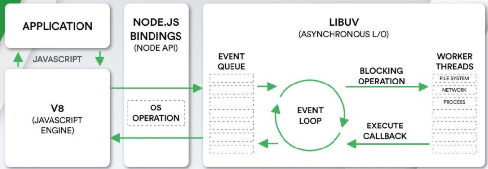

# 事件循环

事件循环是 Node.js 处理非阻塞 I/O 操作的机制，但是关于事件循环大致只是明白其运行过程，还有很细节存在疑惑：

- Node 架构总结为 `V8 + Libuv`, 事件循环在哪 Node 架构中的哪个位置？

- 事件循环中的每一次 Tick 是 `判断队列是否为空+取回调执行`？ 还是 `检查是否完成的任务+添加回调到队列+执行回调` ？

- 基于上一点的问题，线程池跟事件循环到底是怎么配合动作的

- pending callbacks 和 poll，傻傻分不清到底是谁执行 I/O 回调

## 事件循环在哪里

回顾一个 Node 架构



- 我们编写的JavaScript代码会经过V8引擎，再通过Node.js的Bindings（Node.js API），将任务派发到Libuv的事件循环中；

- Libuv提供了事件循环、文件系统读写、网络IO、线程池等等内容；Libuv是使用C语言编写的库；

所以第一个问题 **事件循环是 Libuv 中的一环**

## Node中的事件循环

Node 中的 Event Loop 和浏览器中的是完全不相同的东西。Node.js采用V8作为js的解析引擎，而I/O处理方面使用了自己设计的 libuv，libuv 是一个基于事件驱动的跨平台抽象层，封装了不同操作系统一些底层特性，对外提供统一的API，事件循环机制也是它里面的实现

Node 中事件循环可以分为以下阶段：

```
   ┌───────────────────────────┐
┌─>│           timers          │
│  └─────────────┬─────────────┘
│  ┌─────────────┴─────────────┐
│  │     pending callbacks     │
│  └─────────────┬─────────────┘
│  ┌─────────────┴─────────────┐
│  │       idle, prepare       │
│  └─────────────┬─────────────┘      ┌───────────────┐
│  ┌─────────────┴─────────────┐      │   incoming:   │
│  │           poll            │<─────┤  connections, │
│  └─────────────┬─────────────┘      │   data, etc.  │
│  ┌─────────────┴─────────────┐      └───────────────┘
│  │           check           │
│  └─────────────┬─────────────┘
│  ┌─────────────┴─────────────┐
└──┤      close callbacks      │
   └───────────────────────────┘
```

每个阶段都有一个要执行的回调 FIFO 队列。 尽管每个阶段都有其自己的特殊方式，但是通常，当事件循环进入给定阶段时，它将执行该阶段特定的任何操作，然后在该阶段的队列中执行回调，直到队列耗尽或执行回调的最大数量为止。 当队列已为空或达到回调限制时，事件循环将移至下一个阶段，依此类推。

### 事件循环的实现

libuv 源码关于事件循环部分的代码：

```js
int uv_run(uv_loop_t* loop, uv_run_mode mode) {
  int timeout;
  int r;
  int ran_pending;

  r = uv__loop_alive(loop);
  if (!r)
    uv__update_time(loop);

  while (r != 0 && loop->stop_flag == 0) {
    uv__update_time(loop);
    uv__run_timers(loop);
    ran_pending = uv__run_pending(loop);
    uv__run_idle(loop);
    uv__run_prepare(loop);

    timeout = 0;
    if ((mode == UV_RUN_ONCE && !ran_pending) || mode == UV_RUN_DEFAULT)
      timeout = uv_backend_timeout(loop);

    uv__io_poll(loop, timeout);
    uv__run_check(loop);
    uv__run_closing_handles(loop);

    if (mode == UV_RUN_ONCE) {
      /* UV_RUN_ONCE implies forward progress: at least one callback must have
       * been invoked when it returns. uv__io_poll() can return without doing
       * I/O (meaning: no callbacks) when its timeout expires - which means we
       * have pending timers that satisfy the forward progress constraint.
       *
       * UV_RUN_NOWAIT makes no guarantees about progress so it's omitted from
       * the check.
       */
      uv__update_time(loop);
      uv__run_timers(loop);
    }

    r = uv__loop_alive(loop);
    if (mode == UV_RUN_ONCE || mode == UV_RUN_NOWAIT)
      break;
  }

  /* The if statement lets gcc compile it to a conditional store. Avoids
   * dirtying a cache line.
   */
  if (loop->stop_flag != 0)
    loop->stop_flag = 0;

  return r;
}
```

可以看到 `uv_run` 内部就是一个 `while` 循环，并且循环内执行的方法可以与上面列出的流程图相对应：

- timer 阶段： `uv__run_timers(loop)`

- pending callbacks 阶段：`uv__run_pending(loop)`

- idle 阶段：`uv__run_idle(loop)`

- poll 阶段：`uv__io_poll(loop, timeout)`

- check 阶段：`uv__run_check(loop)`

- close callbacks 阶段：`uv__run_closing_handles(loop)`

**uv__run_timers**

先看下 `Timer`阶段的 `uv__run_timers()` 的实现

```js
void uv__run_timers(uv_loop_t* loop) {
  struct heap_node* heap_node;
  uv_timer_t* handle;

  for (;;) {
    heap_node = heap_min(timer_heap(loop));
    if (heap_node == NULL)
      break;
    handle = container_of(heap_node, uv_timer_t, heap_node);
    if (handle->timeout > loop->time)
      break;
    uv_timer_stop(handle);
    uv_timer_again(handle);
    handle->timer_cb(handle);
  }
}
```

:::tip
读 libuv 的源码不是本篇文章的目的，只是想通过网上大神们对 Libuv 源码的分析找出自己想要的正确信息
:::

从 `uv__run_timers()` 实现整体可以归纳为：

- 当定时器时间大于当前事件循环 tick 的开始时间时，即表示还没有到执行时机，直接 `break` 退出

- 当该值小于当前事件循环 tick 的开始时间时，表示至少存在一个过期的计时器，并调用该计时器所对应的回调函数

这里可以知道 **定时器的判断是事件循环中处理的，且回调是也在事件循环中直接执行**

**uv__io_poll**

根据网上搜索到的关于 [`uv__io_poll`](https://blog.butonly.com/posts/node.js/libuv/5-libuv-io-watcher/) 源码分析的文章，可以知道在这个阶段的事情

1. 计算 Poll 阶段阻塞的时间

2. 获取监听的事件，说白了就是获取完成的 I/O 事件

3. 执行这些 I/O 事件回调

所以在 `poll phase` 也是 `检查是否完成的任务+添加回调到队列+执行回调`

所以 **事件循环的作用包括检查是否完成的I/O事件 + 执行回调的**

## 各阶段详细解释

上面的图例中，将事件循环分为了 6 个不同的阶段

- `Timers`: 用来处理 `setTimeout()` 和 `setInterval()` 的回调

- `pending callbacks`: 虽然大部分 I/O 回调都是在 `poll` 阶段执行，但是会存在一些被延迟调用的 I/O 回调函数。这个阶段就是执行推迟到下一个循环迭代的 I/O 回调

- `idel, prepare`: 仅仅在内部使用，不管它

- `Poll`:  检索新的 I/O 事件，执行与 I/O 相关的回调（除了关闭回调，计时器调度的回调和 setImmediate 之外，几乎所有这些回调） 适当时，node 将在此处阻塞

- `Check`：处理 `setImmediate()` 事件的回调

- `Close callbacks`: 执行一些关闭的回调函数，例如 `cocket.on('close')`

### Timer Phase

任何过期的计时器回调都会在事件循环的这个阶段中运行

定时器的回调会在触发后尽可能早地被调用，这表示实际的延时可能会比定时器规定的时间要长

如果事件循环，此时正在执行一个比较耗时的 `callback`，例如处理一个比较耗时的循环，那么定时器的回调只能等待当前回调执行结束了才能被执行，即被阻塞。事实上，`timer` 阶段的执行受到 `poll` 阶段控制

例如，假设您调度了一个在 `100 毫秒` 后超时的定时器，然后您的脚本开始异步读取会耗费 `95 毫秒`的文件:

```js
const fs = require('fs');

function someAsyncOperation(callback) {
  // Assume this takes 95ms to complete
  fs.readFile('/path/to/file', callback);
}

const timeoutScheduled = Date.now();

setTimeout(() => {
  const delay = Date.now() - timeoutScheduled;

  console.log(`${delay}ms have passed since I was scheduled`);
}, 100);

// do someAsyncOperation which takes 95 ms to complete
someAsyncOperation(() => {
  const startCallback = Date.now();

  // do something that will take 10ms...
  while (Date.now() - startCallback < 10) {
    // do nothing
  }
});

```

执行过程：

- 当事件循环进入 `poll` 阶段时，它有一个空队列（此时 `fs.readFile()` 尚未完成），因此它将等待直到达到最快的计时器 `timer` 阈值为止

- 当它等待 `95 毫秒` 过后时，`fs.readFile()` 完成读取文件，它的那个需要 `10 毫秒` 才能完成的回调将被添加到 `poll` 队列中并执行

- 当循环结束时，`poll` 队列中不再有回调，因此事件循环机制将查看最快到达阈值的计时器，然后将回到 `Timer` 阶段，执行定时器的回调

但是需要注意的是调度计时器到它的回调被执行之间的总延迟将为 `105` 毫秒

### pending callbacks阶段

在某些情况下 IO 观察者绑定的回调函数并不是立即调用的，而是被延迟到下一次事件循环的固定阶段调用的，也就是 `pedding callbacks` 阶段。如 TCP 错误的回调

按 [https://gist.github.com/trevnorris/1f3066ccb0fed9037afa](https://gist.github.com/trevnorris/1f3066ccb0fed9037afa) 这里分析， `pending callback` 阶段 是从 `pending-queue` 中取回调的，而向 `pending-queue` 中插入回调，只能通过 `uv_io_feed 函数`，而调用 `uv_io_feed` 只有以下四个函数是列出四个函数

 ```
- uv__run_pending(): Run all callbacks on the pending_queue. Remove each item from the queue when run.

Note: uv__io_feed() is the only function to insert onto pending_queue.

Note: The following use uv__io_feed():

- uv_pipe_connect(), but only in the case of an error.

- uv__write_req_finish(), part of stream.c

- uv_tcp_connect(), but only in the case of an error.

- uv__udp_send_msg(), for all sent messages.
```

具体的场景就不是很明确了~ 总之绝大部分的 I/O 事件回调还是在 `poll` 阶段执行的

### poll阶段

`poll` 阶段的首要职责是：

1. 计算因处理 I/O 需要阻塞当前事件循环 tick 的时间；该阻塞表示当前事件循环 tick 应该在当前 `poll` 阶段停留多久，这个时间一般是根据最小的 `setTimeout/setInterval` 的时间阈值等多个因素来确定。在到达阻塞时间后，会经历当前事件循环 tick 的后续阶段，并最终进入下一个事件循环 tick 的 `timer` 阶段，此时，过期的计时器的回调函数得以执行

2. 处理 I/O 事件回调，事件循环可能会在 `poll` 阶段阻塞

当事件循环进入 `poll` 阶段可能发生以下几种情况：

- 如果轮询队列 (poll queue) 不为空，则事件循环将遍历其回调队列，使其同步执行，直到队列用尽或达到与系统相关的硬限制为止 

- 如果轮询队列 (poll queue) 为空,事件循环将检查哪些计时器 `timer` 已经到时间

  - 若不存在任何计时器，那么当前事件循环 `tick` 中的 `poll` 阶段将无限制阻塞。以实现一旦存在 I/O 回调函数加入到 `poll queue` 中即可立即得到执行

  - 若存在已经完成的计时器，则结束当前事件循环 `tick`。这样就可以马上进入下一次事件循环然后在 `timer` 阶段执行完成的计时器回调

  - 如果发现有 `setImmediate` 设置的回调，则会结束当前 `poll` 阶段，并继续执行 `check` 阶段以执行 `setImmediate` 设置的回调

  `poll` 阶段的本质

  1. 为了尽可能快的处理异步 I/O 事件，那么事件循环 tick 总有一种维持 `poll` 状态的倾向

  2. 当前 `poll` 阶段应该维持（阻塞）多长时间是由 **后续 tick 各个阶段是否存在不为空的回调函数队列** 和 **最近的计时器时间节点** 决定。若所有队列为空且不存在任何计时器，那么事件循环将无限制地维持在 `poll` 阶段。

**poll 对 timer 的影响**

事件循环总是有一种维持在 `poll` 阶段的倾向，那么在没有满足 `poll` 阶段的结束条件时，就无法进入到下一个事件循环 tick 的 `timer` 阶段，就无法执行 `timer queue` 中到期计时器的回调函数。所以才会存在 **poll 阶段控制了计时器回调函数的执行时机** 的说法。

另外，如果无限制的处理 `poll` 阶段的回调函数，会导致完全不会清空 `poll` 的回调函数队列，进而永远都不会执行之后阶段的回调导致拖垮整个事件循环迭代。libuv 在其内部设定了一个依赖于系统的最大执行数。当 `poll` 阶段超过这个指定时间的时候，将会执行之后的阶段的回调。所以**计时器无法保证准确的执行回调函数，而是尽快的执行回调函数的原因之一**

### check 阶段

此阶段允许在轮询 `poll` 阶段完成后立即执行回调，使用 `setImmediate()` 方法的回调将会添加这个阶段

### close 阶段

如果套接字或处理函数突然关闭（例如 `socket.destroy()`），则 `close`  事件将在这个阶段发出。否则它将通过 `process.nextTick()` 发出。

:::tip
Nodejs 为了防止某个 Phase 任务太多, 导致后续的 Phase 发生饥饿的现象, 所以消息循环的每一个迭代(iterate) 中, 每个 Phase 执行回调都有个最大数量. 如果超过数量的话也会强行结束当前 Phase 而进入下一个 Phase. 这一条规则适用于消息循环中的每一个 Phase
:::

## process.nextTick()

`process.nextTick` 的意思就是定义出一个异步动作，并且这个动作在事件循环当前阶段结束后执行

例如下面代码，将打印 `first`的操作放在`nextTick`的回调中执行

```js
process.nextTick(function(){
    console.log('first')
})
console.log('next')
// next
// first
```

`process.nextTick` 其实不是事件循环的一部分，但是它的回调也是由事件循环调用的，该方法的回调会放在 `nextTictQueue` 中，在事件循环的如果 `nextTictQueue` 不为空，都会在当前阶段操作结束后优先执行 `nextTickQueue` 中的回调函数，当 `nextTickQueue` 中的回调方法被执行完毕后，事件循环才会继续向下执行,所以如果 `process.nextTick` 回调函数出现了阻塞操作，事件循环后面的阶段也会被阻塞

::: warning
Node限制了 `nextTickQueue` 的大小，如果递归调用了 `process.nextTick` ，那么当 `nextTickQueue` 达到最大限制后会抛出一个错误
:::

```js
function recerse(i){
    while(i <9999)
    {
      process.nextTick(recerse(i++)) // 后置运算符，参数永远传的 0
    }
}
recerse(0)
//RangeError:Maxium call stack size exceeded
```

`process.nextTick` 在事件循环的位置:

```
           ┌───────────────────────────┐
        ┌─>│           timers          │
        │  └─────────────┬─────────────┘
        │           nextTickQueue
        │  ┌─────────────┴─────────────┐
        │  │     pending callbacks     │
        │  └─────────────┬─────────────┘
        │           nextTickQueue
        │  ┌─────────────┴─────────────┐
        |  |     idle, prepare         │
        |  └─────────────┬─────────────┘
  nextTickQueue     nextTickQueue
        |  ┌─────────────┴─────────────┐
        |  │           poll            │
        │  └─────────────┬─────────────┘
        │           nextTickQueue
        │  ┌─────────────┴─────────────┐
        │  │           check           │
        │  └─────────────┬─────────────┘
        │           nextTickQueue
        │  ┌─────────────┴─────────────┐
        └──┤       close callbacks     │
           └───────────────────────────┘
```

### 微任务

微任务会在主线之后和事件循环的每个阶段之后立即执行，像 `process.nextTick()` 设置的回调就属性微任务

在 Node 领域，微任务是来自以下对象的回调：

- `process.nextTick()`

- `promise.then`

- `queueMicrotask` 方法

优先级 `process.nextTick()` > `promise.then()` = `queueMicrotask()`

## setImmediate()

`setImmediate` 的事件会在当前事件循环中的 `check` 阶段被执行

**setImmediate和nextTick**

`nextTick` 的回调是在事件循环任何阶段结束后就会被执行，而 `setImmediate` 是在事件循环的末尾 `check` 阶段执行，所以总是先执行 `nextTick` 后执行 `setImediate`

当有递归的异步操作时只能使用 `setImmediate`，不能使用 `process.Tick`，

前面展示过了如果过多循环调用 `nextTick` 会出现错误，下是使用 `setImmediate` 来试试看：

```js
function recurse(i, end) {
    if(i >end) {
      console.log('Done')
    } else {
      console.log(i)
      setImmediate(recurse, i+1, end)
    }
}
recurse(0, 99999999)
```

### setTimeout vs setImmediate

在现行的 nodejs 环境中，有且仅有两种计时器，一种是 `setTimeout/setInterval`，另一种是 `setImmediate`

- `setTimeout/setInterval`: 目的在于经历一段最小时间阈值后尽快调用指定的回调函数, 已超过设置的定时时间的回调将在 `timer` 阶段执行

- `setImmediate`： 作为特殊的计时器而存在，其设计目的是给予用户能在 `poll` 阶段结束后（即 `check` 阶段）能够立即执行代码的机会，而不用在 `timer` 阶段执行

那么如果两个都存在的情况下，哪个更快呢？

```js
setTimeout(
  /* setTimeoutCallback */ () => {
    console.log('from setTimeout')
  },
  0
)

setImmediate(
  /* setImmediateCallback */ () => {
    console.log('from setImmediate')
  }
)
```

答案是顺序不固定

```
// 可能是
from setTimeout
from setImmediate
// 也可能是
from setImmediate
from setTimeout

```

当执行到 `timer` 阶段时, 会发生两种可能. 因为每一轮迭代刚刚进入 `timer` 阶段 时会取系统时间保存起来, 以 `ms(毫秒)` 为最小单位

- 如果 `timer 阶段中回调预设的时间 > 消息循环所保存的时间`, 则 `timer` 阶段将执行 `setTimeout` 的回调，然后在进入 `Check` 阶段时，将执行 `setImmediate` 的回调
  
- 如果运行比较快, `timer` 阶段回调预设的时间可能刚好小于消息循环所保存的时间, 这种情况下 `timer` 阶段中的回调不会执行, 则继续下一个阶段. 直到 `Check` 阶段执行 `setImmediate` 的回调. 然后等下一轮迭代的 `timer` 阶段, 这时的时间一定是满足 `timer 阶段中回调预设的时间 > 消息循环所保存的时间`, 所以 `setTimeout` 的回调将得到执行 
  结果就是 `2 1`.
  
所以, 输出不稳定的原因就取决于进入 `timer` 阶段的时间是否和执行 `setTimeout` 的时间在 `1ms` 内。 如果把代码改成如下, 则一定会得到稳定的输出:

```js
const fs = require('fs')

fs.readFile(__dirname, () => {
  setTimeout(() => {
    console.log('from setTimeout')
  }, 1)

  setImmediate(() => {
    console.log('from setImmediate')
  })
})

// from setImmediate
// from setTimeout
```

基于先前的分析，在一次循环中当没有可执行的 `setTimeout/setInterval` 计时器回调时，先前事件循环 `tick` 总会在 `poll` 阶段所阻塞。`poll` 阶段的下一阶段始终是 `check` 阶段，那么在 `poll` 阶段将执行的 I/O  回调即上面例中的 `setTimeout` 和 `setImmediate` 回调，然后进入下一阶段 （`check` 阶段）执行包含 `setImmediate` 回调然后再进入到下一事件循环 `tick` 的 `timer` 阶段执行 `setTimeout` 回调。

所以在 I/O 回调中注册的 `setTimeout/setInterval` 回调函数始终在 `setImmediate` 的回调函数之后执行

## 总结

- Node 架构总结为 `V8 + Libuv`, 事件循环在 Node 架构中的哪个位置？

  Libuv

- 事件循环中的每一次 Tick 是 `判断队列是否为空+取回调执行`？ 还是 `检查是否完成的任务+添加回调到队列+执行回调` ？

  检查是否完成的任务+添加回调到队列+执行回调

- 基于上一点的问题，线程池跟事件循环到底是怎么配合动作的

  根据《深入浅出Nodejs》中的描述：线程池中的 I/O 操作调用完毕之后，会调用 `PostQueuedCompletionStatus()` 通知 IOCP（即 Libuv），然后在事件循环的 Tick 执行中可以通过 `GetQueuedCompletiontatus()` 方法获取是否有执行完的请求，如果存在，会将请求对象加入到 I/O 观察者的队列中，然后将其当做事件处理

- pending callbacks 和 poll，傻傻分不清到底是谁执行 I/O 回调

  主要还是在 Poll 阶段检查和执行 I/O 的回调，部分特别的 I/O `pending callbacks` 阶段执行


### Q&A

事件循环是 Node 处理非阻塞I/O操作的机制。 事件循环是尽可能的将相应的操作分担给操作系统，从而让单线程的 node 专注于非阻塞式的I/O操作

**如果你的计算机只有一单核的CPU（暂先不考虑超线程程技术，即在一个CPU上同时执行两个线程），还能做到并行吗？**

就算把代码写出花来，也不能获得真正的并行

**是事件循环提供了并行的能力吗？**

事件循环也是运行在单线程环境中，这表示一个时刻只能处理一个事件，没法提供并行支持

**如果存在并行，那么应该位于Node的哪个层面？**

并行存在于 libuv 的线程池中，实现的并行为线程级别的并行（需要多核CPU）

**与浏览器实现对比**

在 nodejs 中事件循环不再是由单一个 `task queue` 和 `micro-task queue` 组成，而是由多个阶段 `phase` 的多个回调函数队列 `callbacks queues` 组成一次事件循环 `tick`。 并且在每一个单独的阶段都存在一个单独的回调函数 `FIFO` 队列。

> [Node.js 事件循环-比官方更全面](https://learnku.com/articles/38802)

> [从 libuv 看 nodejs 事件循环](https://set.sh/post/200317-how-nodejs-event-loop-works)
  
> [libuv 源码分析](https://blog.butonly.com/archives/)