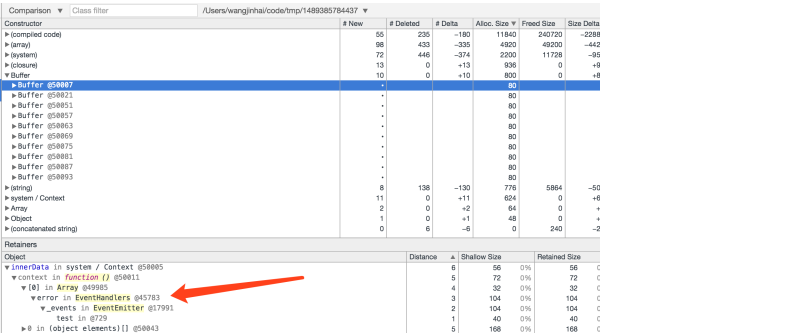

# 内存泄露

内存泄漏（Memory Leak）指由于疏忽或错误造成程序未能释放已经不再使用的内存的情况。如果内存泄漏的位置比较关键，那么随着处理的进行可能持有越来越多的无用内存，这些无用的内存变多会引起服务器响应速度变慢，严重的情况下导致内存达到某个极限（可能是进程的上限，如 v8 的上限；也可能是系统可提供的内存上限）会使得应用程序崩溃

在 V8 中，每次 GC 时，是根据 root 对象 (浏览器环境下的 window，Node.js 环境下的 global ) 依次梳理对象的引用，如果能从 root 的引用链到达访问，V8 就会将其标记为可到达对象，反之为不可到达对象。被标记为不可到达对象（即无引用的对象）后就会被 V8 回收

所以在 Node.js 中内存泄露的原因就是本该被清除的对象，被可到达对象引用以后，未被正确的清除而常驻内存

## 内存泄漏的几种情况

**全局变量**

```js
a = 10;
//未声明对象。

global.b = 11;
//全局变量引用
```

**闭包**

```js
function out() {
  const bigData = new Buffer(100);
  inner = function () { void bigData;
  }
}
```

闭包会引用到父级函数中的变量，如果闭包未释放，就会导致内存泄漏。上面例子是 inner 直接挂在了 root 上，那么每次执行 out 函数所产生的 bigData 都不会释放，从而导致内存泄漏。

需要注意的是，这里举得例子只是简单的将引用挂在全局对象上，实际的业务情况可能是挂在某个可以从 root 追溯到的对象上导致的

**事件监听**

Node.js 的事件监听也可能出现的内存泄漏。例如对同一个事件重复监听，忘记移除（removeListener），将造成内存泄漏。这种情况很容易在复用对象上添加事件时出现，所以事件重复监听可能收到如下警告：

```
(node:2752) Warning: Possible EventEmitter memory leak detected。11 haha listeners added。Use emitter。setMaxListeners() to increase limit
```

例如，Node.js 中 Agent 的 `keepAlive` 为 `true` 时，可能造成的内存泄漏。当 `Agent keepAlive` 为 `true` 的时候，将会复用之前使用过的 socket，如果在 socket 上添加事件监听，忘记清除的话，因为 socket 的复用，将导致事件重复监听从而产生内存泄漏。

原理上与前一个添加事件监听的时候忘了清除是一样的。在使用 Node.js 的 http 模块时，不通过 `keepAlive` 复用是没有问题的，复用了以后就会可能产生内存泄漏。所以，你需要了解添加事件监听的对象的生命周期，并注意自行移除

**其他原因**

还有一些其他的情况可能会导致内存泄漏，比如缓存。在使用缓存的时候，得清楚缓存的对象的多少，如果缓存对象非常多，得做限制最大缓存数量处理。还有就是非常占用 CPU 的代码也会导致内存泄漏，服务器在运行的时候，如果有高 CPU 的同步代码，因为Node.js 是单线程的，所以不能处理处理请求，请求堆积导致内存占用过高。

定位内存泄漏

## 内存泄漏排查

**一、重现内存泄漏情况**

想要定位内存泄漏，通常会有两种情况：

第一种：对于只要正常使用就可以重现的内存泄漏，这是很简单的情况只要在测试环境模拟就可以排查了。

第二种：对于偶然的内存泄漏，一般会与特殊的输入有关系。想稳定重现这种输入是很耗时的过程。如果不能通过代码的日志定位到这个特殊的输入，那么推荐去生产环境打印内存快照了。需要注意的是，打印内存快照是很耗 CPU 的操作，可能会对线上业务造成影响。

快照工具推荐使用 heapdump 用来保存内存快照，使用 devtool 来查看内存快照。使用 heapdump 保存内存快照时，只会有 Node.js 环境中的对象，不会受到干扰（如果使用 node-inspector 的话，快照中会有前端的变量干扰）。

PS：安装 heapdump 在某些 Node.js 版本上可能出错，建议使用 npm install heapdump -target=Node.js 版本来安装

**二、打印内存快照**

将 heapdump 引入代码中，使用 heapdump.writeSnapshot 就可以打印内存快照了了。为了减少正常变量的干扰，可以在打印内存快照之前会调用主动释放内存的 gc() 函数（启动时加上 –expose-gc 参数即可开启）。

```js
const heapdump = require('heapdump');

const save = function () {
  gc();
  heapdump.writeSnapshot('./' + Date.now() + '.heapsnapshot');
}
```

在打印线上的代码的时候，建议按照内存增长情况来打印快照。heapdump 可以使用 kill 向程序发送信号来打印内存快照（只在 *nix 系统上提供）。

```
kill -USR2 
```

推荐打印 3 个内存快照，一个是内存泄漏之前的内存快照，一个是少量测试以后的内存快照，还有一个是多次测试以后的内存快照。

第一个内存快照作为对比，来查看在测试后有哪些对象增长。在内存泄漏不明显的情况下，可以与大量测试以后的内存快照对比，这样能更容易定位。

**三、对比内存快照找出泄漏位置**

通过内存快照找到数量不断增加的对象，找到增加对象是被谁给引用，找到问题代码，改正之后就行，具体问题具体分析，这里通过我们在工作中遇到的情况来讲解

eg:

```js
const {EventEmitter} = require('events');
const heapdump = require('heapdump');

global.test = new EventEmitter();
heapdump.writeSnapshot('./' + Date.now() + '.heapsnapshot');

function run3() {
  const innerData = new Buffer(100);
  const outClosure3 = function () { void innerData;
  };
  test.on('error', () => { console.log('error');
  });
  outClosure3();
}

for(let i = 0; i < 10; i++) {
  run3();
}
gc();

heapdump.writeSnapshot('./' + Date.now() + '.heapsnapshot');
```

这里是对错误代码的最小重现代码。

首先使用 node –expose-gc index.js 运行代码，将会得到两个内存快照，之后打开 devtool，点击 profile，载入内存快照。打开对比，Delta 会显示对象的变化情况，如果对象 Delta 一直增长，就很有可能是内存泄漏了。


可以看到有三处对象明显增长的地方，闭包、上下文以及 Buffer 对象增长。点击查看一下对象的引用情况：



其实这三处对象增长都是一个问题导致的。test 对象中的 error 监听事件中闭包引用了 innerData 对象，导致 buffer 没有被清除，从而导致内存泄漏

其实这里的 error 监听事件中没有引用 innerData 为什么会闭包引用了 innerData 对象，这个问题很是疑惑，后来弄清是 V8 的优化问题，在文末会额外讲解一下。对于对比快照找到问题，得看你对代码的熟悉程度，还有眼力了。

## 如何避免内存泄漏

- ESLint 检测代码检查非期望的全局变量

- 使用闭包的时候，得知道闭包了什么对象，还有引用闭包的对象何时清除闭包。最好可以避免写出复杂的闭包，因为复杂的闭包引起的内存泄漏，如果没有打印内存快照的话，是很难看出来的

- 绑定事件的时候，一定得在恰当的时候清除事件。在编写一个类的时候，推荐使用 init 函数对类的事件监听进行绑定和资源申请，然后 destroy 函数对事件和占用资源进行释放

[Node.js中内存泄漏分析](https://www.huaweicloud.com/articles/12580885.html)