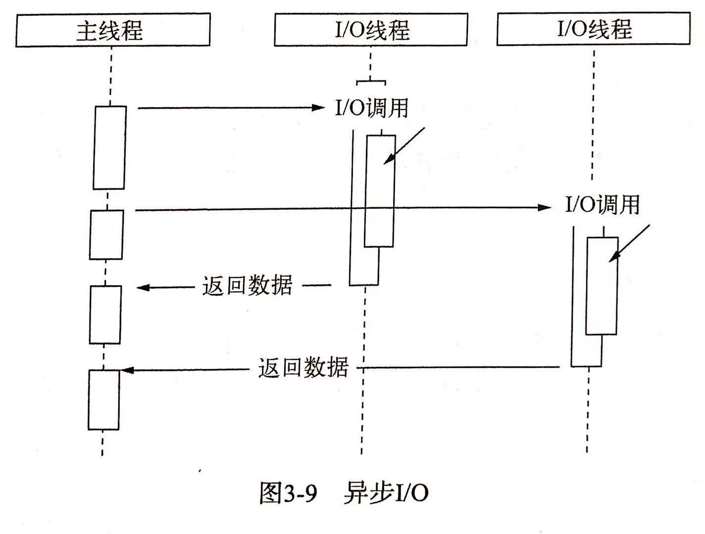
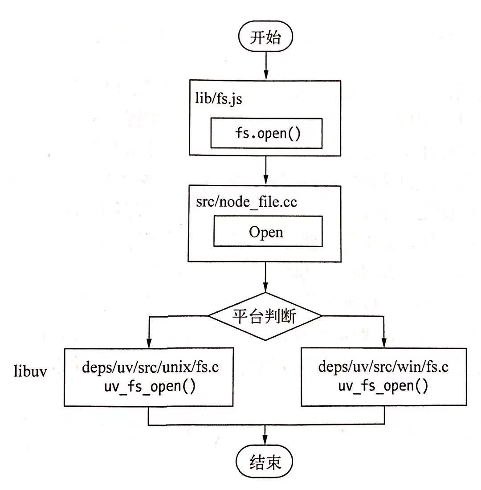
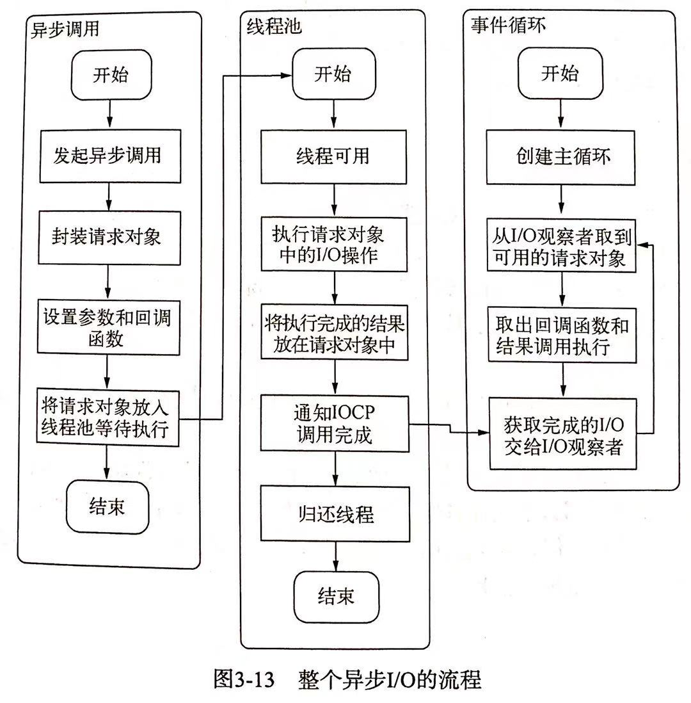
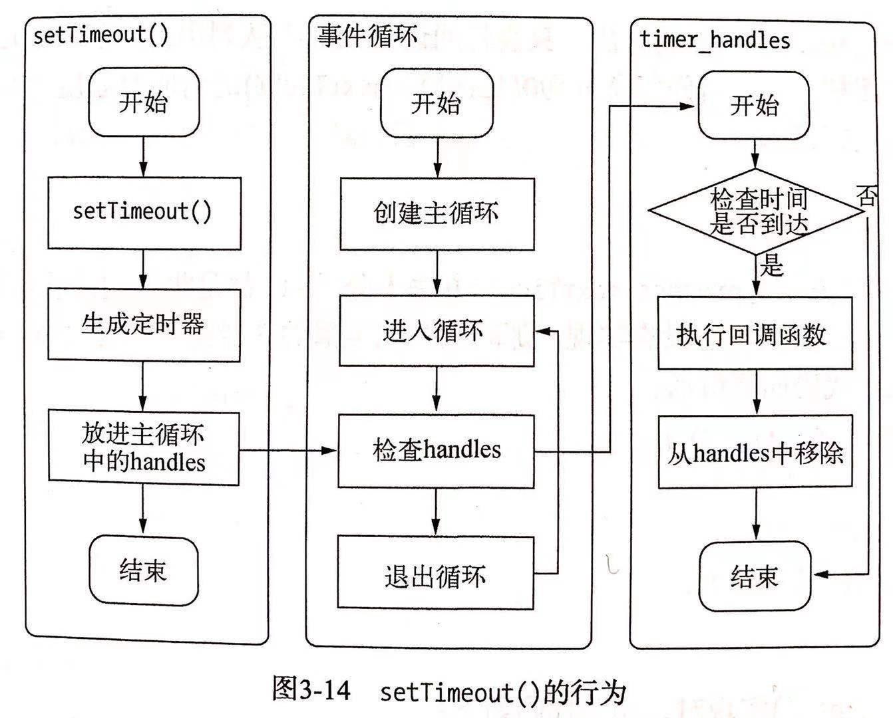
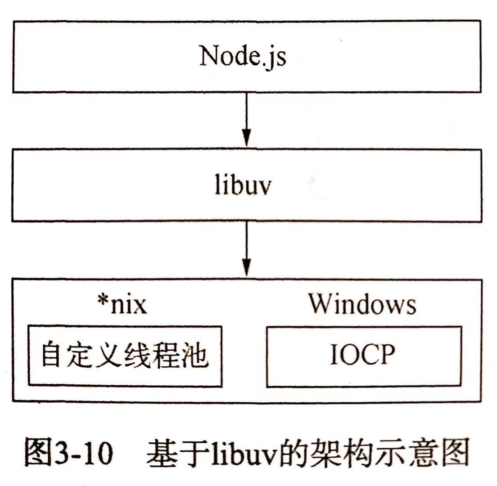

# 认识Node

作为一个异步事件驱动的 JavaScript 运行时，Node.js 被设计用来构建可扩展的网络应用，同时使用了一个非阻塞式I/O 的模型，使其轻量又高效

这里出现了两个关键词：事件驱动和非阻塞式I/O，所以要认识 Node 得先理解这两个是什么意思

## 事件驱动

事件驱动是一种编程模型，编程模型是指操作系统在处理 IO 时所采用的方式，这通常是为了解决 IO 速度比较慢的问题而诞生的

事件驱动模型无需为每一个请求创建额外的线程，事件驱动编程是使用协作式处理任务，而不是多线程的抢占式。它的特点是包含一个事件循环，当外部事件发生时使用回调机制来触发相应的处理

我们把每一个 I/O 任务都当作是一个事件，在事件驱动模型中，每一个I/O操作都会被添加到事件队列中，主线程循环地处理队列上的工作任务，当执行过程中遇到阻塞（读取文件、查询数据库）时，线程不会停下来等待结果，而是继续执行队列中的下一个任务。当阻塞的事件完成时会将回调添加到事件队列中，待下一次事件循环中将取出执行

为了更好理解事件驱动模型，顺便了解一下其它的编程模型

### 其它编程模型

除了上面讲的事件驱动编程模型，还有同步式模型，多进程模型，多线程模型

#### 同步式模型

同步式模型就是每次值处理一个请求，迭代地将所有请求处理完毕。无并发可言，处理效率当然很低

#### 多进程模型

每收到一个用户请求，就开启一个进程去处理

**优点**

- 每个进程互相独立，子进程崩溃没关系

- 通过增加CPU，就可以容易扩充性能

- 充分利用系统资源

**缺点**

- 各个进程地址空间相互隔离，这一优点也会变成缺点，那就是进程间要想通信就会变得比较困难

- 进程开销是比线程要大的，频繁的创建销毁进程无疑会加重系统负担。

#### 多线程模型

每个用户请求，开一个线程去处理。由于线程共享进程地址空间，因此线程间通信天然不需要借助任何通信机制，直接读取内存就好了

**优点**

- 为每个请求创建一个线程，即使一个线程因执行I/O操作——比如读取数据库等——被阻塞暂停运行也不会影响到其它线程

- 所有线程可以直接共享内存和变量等

- 线程方式消耗的总资源比进程方式好

**缺点**

- 线程之间的同步和加锁控制比较麻烦

- 一个线程的崩溃可能影响到整个程序的稳定性

- 虽然线程创建开销相比进程小，但依然也是有开销的

## 非阻塞I/O

Node 在 I/O 操作方面性能是十分高效的，因为 Node 使用的是：异步+非阻塞I/O操作。那么到底怎么理解异步+非阻塞？异步跟非阻塞感觉像是同一个意思，具体怎么区分？

### 什么是 I/O 操作

首先所谓的阻塞/非阻塞通常是针对 I/O 操作的，所以得先明白什么是 I/O 操作? 输入/输出（I/O）是在内存和外部设备（如磁盘，终端和网络）之间复制数据的过程。不仅仅是文件读写，包括键盘输入，网络请求等都属于 I/O 操作

以读取文件为例，一个完整的 I/O 操作包括：系统内核完成磁盘寻道 -> 读取数据 -> 复制数据到内存这些步聚

**在Node中，I/O特指 Node 程序在 Libuv 支持下与系统磁盘和网络交互的过程**

如何进行 I/O 操作，整体分为阻塞型 I/O 和非阻塞型 I/O 两种

### 阻塞/非阻塞

**阻塞型 I/O**是指在调用 I/O 操作后，应用程序需要等待 I/O 完成并返回结果，然后才能进行之后的其它任务

**非阻塞I/O**则是调用I/O 操作后，不用等待结果直接返回。但是不带结果返回的话应用程序怎么获取结果呢？此时就需要通过类似轮循的方式不断得去读取 I/O 操作是否有结果

所以到目前为止所谓的非阻塞 I/O 并不理想，因为执行这种非阻塞 I/O 后，虽然 CPU 的时间片可以用来处理其他事务提高了性能，但是仍需要不断得轮循，这会造成 CPU 浪费。我们期望是理想操作是发起 I/O 操作后无须通过遍历或者事件唤醒等方式轮询，可以直接处理下一个任务，只需在 I/O 完成后通过信号或回调将数据传递给应用程序即可，如下面示意图



### 异步+非阻塞

前面主要是从单线程场景考虑这很难达到理想的 I/O 操作，但如果是多线程就可以。通过让部分线程进行阻塞 I/O 或非阻塞I/O + 轮询技术来完成数据获取，让一个线程进行计算处理，通过线程之间的通信将 I/O 得到的数据进行传递，这就实现我们想要的 I/O 操作，也就是**异步I/O 操作**

Node 的异步非阻塞 I/O 就是这么个意思了，通过多线程来执行非阻塞I/O来达到高效的 I/O 处理。所以说 Node 其实是多线程的，平时说的单线程是指我们的 JS 代码执行在单线程中

上文提到 Node 底层仍是利用了多线程进行 I/O 处理，多线程的实现根据平台不同有各自的实现方法。在 *nix 平台下 Node 使用自定义的线程池来实现 异步I/O 操作，在Window 平台下使用其自有 IOCP 来实现I/O 。因此为了解决平台的兼容差异问题，所以 Node 提供了 libuv 作为抽象封装层，所有平台兼容性的判断都由这一层完成

### 异步I/O的过程

完成整个异步I/O 操作需要事件循环，观察者，请求对象和线程池等配合完成

**事件循环**

类似浏览器中的事件循环，每一次循环都会查找是否有完成的事件，有的话就取出执行，事件循环怎么查找呢？从观察者队列中查找

**观察者**

观察者的作用就是观察，观察啥？观察是否有完成的 I/O 事件，观察者根据 I/O 类型也分成：文件I/O 观察者，网络I/O 观察者等，在每一次的事件循环中，观察都会通过API获取是否有完成的I/O事件，有的话就添加的自己的观察者队列中

**请求对象**

JS执行 I/O操作 时实际上是通过底层的 libuv 进行系统调用的，此时 libuv 会创建一个请求对象，我们要执行的方法，参数和回调都会包装在这个请求对象中，然后将这个请求推入到线程池，等待线程池处理

**线程池**

上面提到了包装完请求对象后就会推入线程池，交于线程池来执行具体的I/O操作

#### 粟子

接下来通过 `fs.open()` 方法来概述一下 Node 和底层之间是如何执行异步 I/O 的

1. JS 调用 Node 的核心模块执行 `open()` 方法，即 `fs.open()` 方法

2. 核心模块内部调用 C++ 内建模块

3. 内建模块通过 libuv 进行系统调用

   libuv 作为封装层，有两个平台的实现，无论怎样实际上是调用了 `uv_fs_open()` 方法

   

4. 调用 `uv_fs_open` 的过程中会创建一个请求对象，从JS传入的参数，回调和当前方法都会包装到这个请求对象中，然后将这个请求对象推入到线程池中，当线程池有可用线程时，就会根据请求对象调用具体的方法。至此 JS 调用就结束了，JS所在线程可以继续执行后续操作

6. 当线程池中 I/O 操作完成之后，就会通过 IOCP，告知当前对象操作已经完成

7. 之后事件循环的每一次 tick 中，观察者都会检查是否有完成的请求对象，如果存在，会将请求对象加入到 I/O 观察者队列中，下一次事件循环的时候就会从队列中取出当作事件执行

整个过程的示意图：




### 非I/O的异步API

非I/O的异步API是指 `setTimeout()`,`setInterval()`, `setImmediate()` 和 `process.next()`

**`setTimeout`和`setInterval`**

`setTimeout()` 和 `setInterval()` 实现原理与 I/O 比较类似，只是不需要线程池参与。调用`setTimeout()` 和 `setInterval()` 时创建的定时器会被插入到定时器观察者内部的一个红黑树中。每次 Tick 执行时，会从该红黑树中迭代取出定时器对象，检查是否超过定时时间，如果超过，就形成一个事件，它的回调函数将立即执行。如下示意图



:::tip
定时器并非精准的，因为可能在一次 Tick 中在触发定时回调之前有耗时的任务，这样导致定时器延时执行
:::

**`process.nextTick()`**

`process.nextTick()` 的意思就是定义出一个异步动作，并且这个动作在事件循环当前阶段结束后执行

```
           ┌───────────────────────────┐
        ┌─>│           timers          │
        │  └─────────────┬─────────────┘
        │           nextTickQueue
        │  ┌─────────────┴─────────────┐
        │  │     pending callbacks     │
        │  └─────────────┬─────────────┘
        │           nextTickQueue
        │  ┌─────────────┴─────────────┐
        |  |     idle, prepare         │
        |  └─────────────┬─────────────┘
  nextTickQueue     nextTickQueue
        |  ┌─────────────┴─────────────┐
        |  │           poll            │
        │  └─────────────┬─────────────┘
        │           nextTickQueue
        │  ┌─────────────┴─────────────┐
        │  │           check           │
        │  └─────────────┬─────────────┘
        │           nextTickQueue
        │  ┌─────────────┴─────────────┐
        └──┤       close callbacks     │
           └───────────────────────────┘
```

**`setImmediate()`**

`setImmediate()` 定义出一个异步动作事件会在当前事件循环中的 check 阶段被执行

## 同步/异步

同步和异步描述的是进程/线程的调用方式

同步调用指的是进程/线程发起调用后，一直等待调用返回后才继续执行下一步操作，这并不代表 CPU 在这段时间内也会一直等待，操作系统多半会切换到其它的进程/线程中，等到调用返回后再切换回原来的进程/线程

异步就相反，发起调用后，进程/线程继续向下执行，当调用返回后，通过某种手段来通过知调用者

## Node 架构

上面提到 Node 底层是支持多线程的，依靠多线程的支持实现了高效异步 I/O 操作，接下就捊捊Node 整体架构。

 Nodejs 的运行依赖于 V8 引擎和 libuv 库

- V8：执行 JS 的引擎. 也就是翻译 JS. 包括我们熟悉的编译优化, 垃圾回收等等.

- libuv: 是操作系统 API 层的一个抽象层，Node 通过它实现了异步非阻塞 I/O

那么 Nodejs 如何组织它们呢? 如下图:


Nodejs 通过一层 `C++ Binding`, 把 JS 传入 V8, V8 解析后交给 libuv 发起 `asnyc I/O`, 并结合事件循环进行调度. 再看看下面的图:


### IO调用的结果怎么返回给调用的进程/线程

通过内核进程复制给调用进程，在 Linux 下，用户进程没办法直接访问内核空间，通常是内核调用 `copy_to_user` 方法来传递数据的。大致的流程是 IO 的数据会先被内核空间读取，然后内核将数据复制给用户进程。还有一种零复制技术，大致是内核进程和用户进程共享一块内存地址，这避免了内存的复制

### libuv

上文提到过为了实现异步的 I/O 操作，需要实现线程池，最初 Node 在 *nix 平台下采用了 libeio 配合 libev 实现了异步 I/O，在Node v0.9.3 中，自行实现了线程池来完成异步 I/O；而在 Window 下则是使用了 IOCP，它在某种程度上提供了理想的异步 I/O ，它的内部其实仍然是线程池原理

由于 Window 和 *inx 平台的差异，Node 提供了 libuv 作为抽象封装层，使得所有平台兼容性的判断都在这一层来完成，并保证上层的 Node 与下层的自定义线池及 IOCP 之间各自独立

所以 Node 的异步 I/O 调用是由libuv来支持的，以 `readFile` 为例，读取文件的系统调用是由libuv来完成的，Node只负责调用libuv 的接口，等数据返回后再执行对应的回调方法

> 线程池：基本思想还是一种对象池的思想，开辟一块内存空间，里面存放了众多(未死亡)的线程，池中线程执行调度由池管理器来处理。当有线程任务时，从池中取一个，执行完成后线程对象归池，这样可以避免反复创建线程对象所带来的性能开销，节省了系统的资源



## 高并发的Node

- 并发：两排队伍在排队，但是只有一个买票窗口

- 并行：两个队伍在排，而且有两个买票窗口

**Node中的并发**

单线程支持高并发，通常都是依靠异步+事件驱动（循环）来实现的，异步使得代码在面临多个请求时不会发生阻塞，事件循环提供了IO调用结束后调用回调函数的能力

先来看一个例子：

```js
// helper
function delay(time){
    return new Promise(resolve => {
        setTimeout(() => {
            console.log('延时：', time)
            resolve()
        }, time * 1000)
    })
}
function fibonacci(n) {
    if (n == 1 || n == 2) {
        return 1
    };
    return fibonacci(n - 2) + fibonacci(n - 1);
}

module.exports = {
    delay,
    fibonacci
}
```

```js
const Koa = require('koa')
const app = new Koa()
const Router = require('@koa/router');
const { delay, fibonacci } = require('./helper')

function timeLog(start, end = new Date()){
    return `开始处理时间：${start};结束时间：${end};处理时长：${end - start}`
}

const router = new Router();
router.get('/delay', async (ctx, next) => {
    const start = new Date()
    await delay(6)
    ctx.body = timeLog(start)
  });
router.get('/fibonacci', async (ctx, next) => {
    const start = new Date()
    fibonacci(45)
    ctx.body = timeLog(start)
});
router.get('/', async (ctx, next) => {
    const start = new Date()
    ctx.body = timeLog(start)
  });
  
  app
    .use(router.routes())
    .use(router.allowedMethods());

app.listen(3000, () => {
    console.log('去吧 皮卡丘：3000')
})
```

上面代码中 `delay(6)` 是一个用定时器 `setTimeout` 做的延迟函数。当我们在浏览器输入 `localhost:3000/delay` 因为延迟的关系并不会立马取到返回值，紧接着在新的 `Tab` 页输入 `localhost:3000/` 可以立马显示返回的内容，并没有被之前的 `localhost:3000/delay` 请求所阻塞

另个场景先在浏览器输入 `localhost:3000/fibonacci`，这是一个 `fibonacci` 需要点时间，之后在新的 `Tab` 页输入 `localhost:3000/` 并没有显示内容而是之前的请求阻塞了

那么 Node 在哪些场景下是非阻塞的？ 处理 IO 操作的时候，这个 IO 包括数据库操作（连接数，机器性能等）、缓存服务、网络IO、文件读写等操作。

**引用 [CNODE 社区 - 关于 Nodejs 服务器高并发的疑问](https://cnodejs.org/topic/5c8b0a4a7ce0df3732428254) 中的一个评论来帮助理解 node 高并发的适合场景**

CPU密集型本身就不适合 nodejs，但非常适合大量 io 操作的情况

假设一个请求流程 需要 `10ms` 的简单运算，`900ms` 的数据库查询，`90ms` 的数据返回。完整时间是1s

如果是 java 处理

如果是 `1000` 个请求，不在考虑数据库压力的情况下，理论上 java 会并发产生 `1000` 个线程来处理，理论上也就可以在 `1s` 内处理完 `1000` 个请求并全部返回数据。但是为了这 `1000` 个线程，服务器可能产生了 `百分之80` 的资源消耗，也就是说你这台服务器能支撑 `1000` 个并发已经很好了。

如果是 nodejs 处理

如果 `1000` 个请求，从第一个请求开始，`10ms` 处理完成，然后就交给数据去处理了，这个时候就可以处理下一个 `10ms` 的请求。也就是需要 `10s` 才可以接收完所有的请求，但是第一个请求返回时间是 `1s`，第二个请求返回时间是 `1s+10ms`，以此类推，但是这 `1000` 个并发 nodejs 会在 `11s` 左右全部处理完

你可能觉得 java 是 `1s`，nodejs 是 `11s`，差距很大，但是需要注意的是服务器消耗

java 是 `1000` 个进程可能已经是服务器的极限看了，但是 nodejs 服务器确一点事情都没有。换而言之，我一台服务器打开 `10` 个 nodejs 进程，我一台服务器就可以处理的并发是 `10s，1W` 的，但是 java 确实 `1s，1000`, 我需要用10台服务器才完成。

实际工作中，我们会发现。在相同的业务需求下，io 密集型的需求，使用 nodejs 同一台服务器可以处理的并发量更大，当然，牺牲了一部分的时间。但是这个完全可以用多开进程的方式来弥补来达到一个均衡。同样的服务器，仅 io 密集型的需求而言，nodejs 更加合适。

但是如果是 cpu 密集型的你 java 开 `1000` 个线程，是并发计算的，一个计算 `1` 秒， `1000` 的线程也 `1` 秒返回了，但是使用 nodejs，你需要 `1000` 秒才可以返回。

**node 在处理 IO 操作时是非阻塞的，处理 CPU 密集型计算时会阻塞的**


## 总结

Node 为什么是高性能的？

1. Node 采用事件驱动的方式处理请求，无须为每个请求创建额外的线程 ，可以省掉创建线程和销毁线程的开销

2. Node 底层又是具有线程池的，依靠 Libuv 线程池 Node 可以实现异步 I/O 操作 