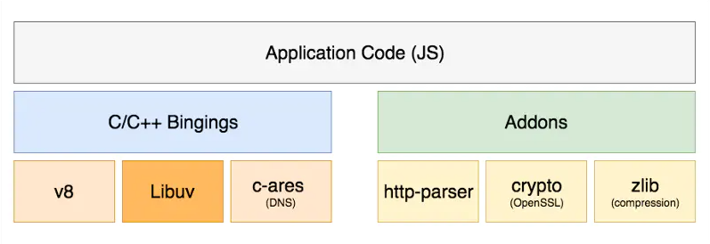
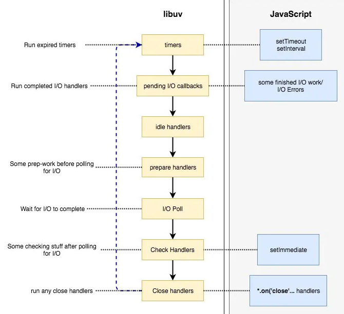

# 认识Node

## Node 架构

Nodejs 的运行依赖于 V8 引擎和 libuv 库

- V8：执行 JS 的引擎. 也就是翻译 JS. 包括我们熟悉的编译优化, 垃圾回收等等.

- libUV: 提供 async I/O, 提供消息循环. 可见, 是操作系统 API 层的一个抽象层

那么 Nodejs 如何组织它们呢? 如下图:



Nodejs 通过一层 `C++ Binding`, 把 JS 传入 V8, V8 解析后交给 libUV 发起 `asnyc I/O`, 并等待消息循环调度. 再看看下面的图:



## Node内部机制

首先先要了解一下 CPU 的运作

- 在任务完成之前，CPU在任何情况下都不会暂停或者停止执行，CPU 如何执行和同步或异步，阻塞或者非阻塞都没有必然联系

- 操作系统始终保证 CPU 外在动作运行状态，这是通过系统调度来实现的，具体一点就是通过在不同进程/线程间切换实现的

## 回调

就是将一个函数作为参数传递给另一个函数，并且作为参数的函数可以被执行，其本质上是一个高阶函数。

## 异步非阻塞

Node 的优势在于其异步非阻塞的特点，那么到底怎么理解异步非阻塞？同步、异步、阻塞、非阻塞怎么区分？

### 阻塞/非阻塞


**同步/异步**

同步和异步描述的是进程/线程的调用方式

同步调用指的是进程/线程发起调用后，一直等待调用返回后才继续执行下一步操作，这并不代表 CPU 在这段时间内也会一直等待，操作系统多半会切换到其它的进程/线程中，等到调用返回后再切换回原来的进程/线程

异步就相反，发起调用后，进程/线程继续向下执行，当调用返回后，通过某种手段来通过知调用者

**同步和异步的“调用返回”，是指内核进程将数据复制到调用进程**

JavaScript 是一门异步的语言，但 ECMAScript 里并没有关于异步的规范，JavaScript 的异步更是依靠浏览器内部其他线程来实现，并非JavaScript 本身的功能，是浏览器提供的支持让 JavaScript 看起来像是一个异步的语言

**阻塞和非阻塞**

阻塞和非阻塞是概念是针对 IO 状态而言的，关注程序在等待 IO 调用返回这段时间的状态

**阻塞/非阻塞和同步/导步完全是两个概念，它们之间没有任何的必然联系**

### 什么是IO操作

输入/输出（I/O）是在内存和外部设备（如磁盘，终端和网络）之间复制数据的过程，
在实践中IO操作几乎无处不在，因为大多数程序都要产生输出结果才有意义（往往是输出到磁盘或者屏幕），除非你只在内存中计算一个斐波那契数列而且不采用其他任何操作

**在Node中，I/O特指 Node 程序在 Libuv 支持下与系统磁盘和网络交互的过程**

### IO调用的结果怎么返回给调用的进程/线程

通过内核进程复制给调用进行，在 Linux 下，用户进程没办法直接访问内核空间，通常是内核调用 `copy_to_user` 方法来传递数据的，大致的流程是 IO 的数据会先被内核空间读取，然后内核将数据复制给用户进程。还有一种零复制技术，大致是内核进程和用户进程共享一块内存地址，这避免了内存的复制

## IO编程模型

编程模型是指操作系统在处理 IO 时所采用的方式，这通常是为了解决 IO 速度比较慢的问题而诞生的

一般来说，编程模型有以下几种

**阻塞IO（blocking I/O）**

对于IO来说，通常可以分为两个阶段，准备数据和返回结果，阻塞型 IO 在进程发出一个系统调用请求之后，进程就一直等待上述两个阶段完成，等待拿到返回结果之后再重新运行

**非阻塞IO（noblocking I/O）**

和上面的过程相似，不同之处是当进程发起一个调用后，如果数据还没有就绪，就会马上返回一个有 `error` 结果告诉进程现在还没有就绪，用户进程判断结果是一个 `error` 时，它就知道数据还没有准备好，于是它可以再次发送 `read` 操作(轮循)，和阻塞 IO 的区别是用户进程会不断查询内核状态。这个过程依旧是同步的。

**IO multiplexing/Event Driven**

这是 IO 通常被称为事件驱动 IO，同样是以询询的方式来查询内核的执行状态，和非阻塞 IO 的区别是一个进程可能会管理多个 IO 请求，当某个 IO 调用有了结果之后，就返回对应的结果

**Asynchronous I/O**

当进程发起内核调用后，内核会立刻返回结果，进程会继续做其他的事情，直到操作系统返回数据，给用户进程发送一个信号，注意，异步IO并没有涉及任何关于回调函数的概念，此外，这里的异步IO只存于Linux系统下

既然即然如此，为什么在官网上Node没有标榜自己是异步IO，而是写成非阻塞IO呢？

这是因为非阻塞是实打实的，而Nodo中的“异步I/O“是依靠 Libuv 模拟出来的

## "单线程"的Node

Node没有多线程的支持，这代表用户编写的代码只能运行在当前线程中，用于运行代码的事件循环也是单线程运行的。开发者无法在一个独立进程中增加新的进程，但是可以派生出多个进程来达到并行完成工作的目的

另一方面，Node 的底层实现并非是单线程的， libuv 会通过类似线程池的实现来模拟不同操作系统下的导师步调用，这对开发者来说是不可见的

### libuv中的多线程

如果说Node都是依靠单线程运行的，那就不正确了，因为libuv中是有线程池的概念存在的

Libuv是一个跨平台的异步IO库，它结合了UNIX下的libev和Window下的IOCP的性性，最由Node的作者开发，专门为Node提供多平台下的异步IO支持。libuv本身是由C/C++语言实现的，Node中的非阻塞IO以及事件循环的底层机制，都是由libuv来实现的

Node的异步调用是由libuv来支持的，以 `readFile` 为例，读取文件的系统调用是由libuv来完成的，Node只负责调用libuv的接口，等数据返回后再执行对应的回调方法

> 线程池：基本思想还是一种对象池的思想，开辟一块内存空间，里面存放了众多(未死亡)的线程，池中线程执行调度由池管理器来处理。当有线程任务时，从池中取一个，执行完成后线程对象归池，这样可以避免反复创建线程对象所带来的性能开销，节省了系统的资源

### 并行和并发

- 并发：两排队伍在排队，但是只有一个买票窗口

- 并行：两个队伍在排，而且有两个买票窗口

**Node中的并发**

单线程支持高并发，通常都是依靠异步+事件驱动（循环）来实现的，异步使得代码在面临多个请求时不会发生阻塞，事件循环提供了IO调用结束后调用回调函数的能力

## 高并发的Node

先来看一个例子：

```js
// helper
function delay(time){
    return new Promise(resolve => {
        setTimeout(() => {
            console.log('延时：', time)
            resolve()
        }, time * 1000)
    })
}
function fibonacci(n) {
    if (n == 1 || n == 2) {
        return 1
    };
    return fibonacci(n - 2) + fibonacci(n - 1);
}

module.exports = {
    delay,
    fibonacci
}
```

```js
const Koa = require('koa')
const app = new Koa()
const Router = require('@koa/router');
const { delay, fibonacci } = require('./helper')

function timeLog(start, end = new Date()){
    return `开始处理时间：${start};结束时间：${end};处理时长：${end - start}`
}

const router = new Router();
router.get('/delay', async (ctx, next) => {
    const start = new Date()
    await delay(6)
    ctx.body = timeLog(start)
  });
router.get('/fibonacci', async (ctx, next) => {
    const start = new Date()
    fibonacci(45)
    ctx.body = timeLog(start)
});
router.get('/', async (ctx, next) => {
    const start = new Date()
    ctx.body = timeLog(start)
  });
  
  app
    .use(router.routes())
    .use(router.allowedMethods());

app.listen(3000, () => {
    console.log('去吧 皮卡丘：3000')
})
```

上面代码中 `delay(6)` 是一个用定时器 `setTimeout` 做的延迟函数。当我们在浏览器输入 `localhost:3000/delay` 因为延迟的关系并不会立马取到返回值，紧接着在新的 `Tab` 页输入 `localhost:3000/` 可以立马显示返回的内容，并没有被之前的 `localhost:3000/delay` 请求所阻塞

另个场景先在浏览器输入 `localhost:3000/fibonacci`，这是一个 `fibonacci` 需要点时间，之后在新的 `Tab` 页输入 `localhost:3000/` 并没有显示内容而是之前的请求阻塞了

那么 Node 在哪些场景下是非阻塞的？ 处理 IO 操作的时候，这个 IO 包括数据库操作（连接数，机器性能等）、缓存服务、网络IO、文件读写等操作。

**引用 [CNODE 社区 - 关于 Nodejs 服务器高并发的疑问](https://cnodejs.org/topic/5c8b0a4a7ce0df3732428254) 中的一个评论来帮助理解 node 高并发的适合场景**

CPU密集型本身就不适合 nodejs，但非常适合大量 io 操作的情况

假设一个请求流程 需要 `10ms` 的简单运算，`900ms` 的数据库查询，`90ms` 的数据返回。完整时间是1s

如果是 java 处理

如果是 `1000` 个请求，不在考虑数据库压力的情况下，理论上 java 会并发产生 `1000` 个线程来处理，理论上也就可以在 `1s` 内处理完 `1000` 个请求并全部返回数据。但是为了这 `1000` 个线程，服务器可能产生了 `百分之80` 的资源消耗，也就是说你这台服务器能支撑 `1000` 个并发已经很好了。

如果是 nodejs 处理

如果 `1000` 个请求，从第一个请求开始，`10ms` 处理完成，然后就交给数据去处理了，这个时候就可以处理下一个 `10ms` 的请求。也就是需要 `10s` 才可以接收完所有的请求，但是第一个请求返回时间是 `1s`，第二个请求返回时间是 `1s+10ms`，以此类推，但是这 `1000` 个并发 nodejs 会在 `11s` 左右全部处理完

你可能觉得 java 是 `1s`，nodejs 是 `11s`，差距很大，但是需要注意的是服务器消耗

java 是 `1000` 个进程可能已经是服务器的极限看了，但是 nodejs 服务器确一点事情都没有。换而言之，我一台服务器打开 `10` 个 nodejs 进程，我一台服务器就可以处理的并发是 `10s，1W` 的，但是 java 确实 `1s，1000`, 我需要用10台服务器才完成。

实际工作中，我们会发现。在相同的业务需求下，io 密集型的需求，使用 nodejs 同一台服务器可以处理的并发量更大，当然，牺牲了一部分的时间。但是这个完全可以用多开进程的方式来弥补来达到一个均衡。同样的服务器，仅 io 密集型的需求而言，nodejs 更加合适。

但是如果是 cpu 密集型的你 java 开 `1000` 个线程，是并发计算的，一个计算 `1` 秒， `1000` 的线程也 `1` 秒返回了，但是使用 nodejs，你需要 `1000` 秒才可以返回。

**node 在处理 IO 操作时是非阻塞的，处理 CPU 密集型计算时会阻塞的**

## 为什么不是多线程

这个问题可以转换成多线程有什么缺点？

1. 多线程的代价在于创建线程和执行线程上下文切换的开销较大

2. 在复杂的业务中，多线程编程经常面临锁、状态同步等问题