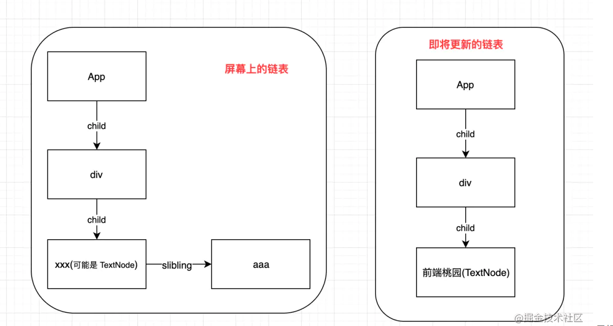
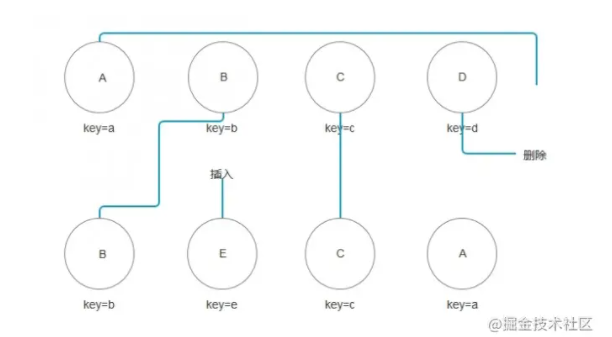
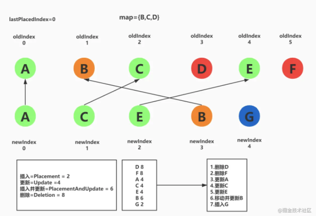

# React16 Diff

React 以前的 Diff 算法就是基于树的，现在整体的数据结构改为了链表结构，链表的每一个节点是 Fiber

React16 的 diff 策略采用从链表头部开始比较的算法，是层次遍历，算法是建立在一个节点的插入、删除、移动等操作且这些都是在节点树的同一层级中进行的

`reconcileChildFibers` 方法是开始 diff 的地方，简单看下源码：

```js
    function reconcileChildFibers(returnFiber, currentFirstChild, newChild, expirationTime) {
      // 这里 就是 处理 <></> 这样的子节点的，因为 这样的 节点是 没有 key 的，就把内部的
      // 子节点 统一处理 为 数组子节点
      var isUnkeyedTopLevelFragment = typeof newChild === 'object' && newChild !== null && newChild.type === REACT_FRAGMENT_TYPE && newChild.key === null;
      if (isUnkeyedTopLevelFragment) {
        newChild = newChild.props.children;
      } 
      var isObject = typeof newChild === 'object' && newChild !== null;
      // 如果新节点是对象类型也就是  REACT_ELEMENT_TYPE 或者 REACT_PORTAL_TYPE
      if (isObject) {
        switch (newChild.$$typeof) {
          case REACT_ELEMENT_TYPE:
            return placeSingleChild(reconcileSingleElement(returnFiber, currentFirstChild, newChild, expirationTime));
          case REACT_PORTAL_TYPE:
            return placeSingleChild(reconcileSinglePortal(returnFiber, currentFirstChild, newChild, expirationTime));
        }
      }
      // 如果新节点是文本类型
      if (typeof newChild === 'string' || typeof newChild === 'number') {
        return placeSingleChild(reconcileSingleTextNode(returnFiber, currentFirstChild, '' + newChild, expirationTime));
      }
      // 如果新节点是数组类型
      if (isArray$1(newChild)) {
        return reconcileChildrenArray(returnFiber, currentFirstChild, newChild, expirationTime);
      }
      // 如果新节点是包含迭代遍历器的，类型数组
      if (getIteratorFn(newChild)) {
        return reconcileChildrenIterator(returnFiber, currentFirstChild, newChild, expirationTime);
      } 
      // ....
      // 只有可能newChild === null，说明新的更新清空掉了所有子节点。
      return deleteRemainingChildren(returnFiber, currentFirstChild);
    }
```

`reconcileChildFibers(returnFiber, currentFirstChild, newChild, expirationTime)` 接收参数表示如下：

- `returnFiber`：是即将 Diff 的这层的父节点

- `currentFirstChild`：是当前层的第一个 Fiber 节点

- `newChildren`：即将更新的 vdom 节点(可能是 TextNode、可能是 ReactElement，可能是数组)，不是 Fiber 节点

- `expirationTime`：过期时间（这里不讨论这个）

从上面的代码可以看出 diff 根据新节点的类型进行不同处理，这些类型会有四种情况

- TextNode(包含字符串和数字)

- React Element(通过该节点是否有 $$typeof 区分)

- 数组

- 可迭代的 children，跟数组的处理方式差不多

下面针对不同的类型看下具体的 diff 实现

## TextNode

如果新节点是文本类型 eg:



```js
  if (typeof newChild === 'string' || typeof newChild === 'number') {
    return placeSingleChild(reconcileSingleTextNode(returnFiber, currentFirstChild, '' + newChild, expirationTime));
  }
  // reconcileSingleTextNode
function reconcileSingleTextNode(returnFiber, currentFirstChild, textContent, expirationTime) {
  if (currentFirstChild !== null && currentFirstChild.tag === HostText) { // 如果也是TextNode
    deleteRemainingChildren(returnFiber, currentFirstChild.sibling); // 删除后面的节点
    var existing = useFiber(currentFirstChild, textContent);
    existing.return = returnFiber;
    return existing;
  }
  deleteRemainingChildren(returnFiber, currentFirstChild);
  var created = createFiberFromText(textContent, returnFiber.mode, expirationTime);
  created.return = returnFiber;
  return created;
}
```

根据代码走两个分支：

1. 如果旧节点是 `TextNode` 则复用当前这个旧节点，更新新的文本内容  

因为是文本节点，所以旧节点后面的兄弟节点是要被移除的所以会执行 `deleteRemainingChildren(returnFiber, currentFirstChild.sibling)` 删除旧节点兄弟节点  
最后返回这个节点
   
2. 如果旧节点不是一个 `TextNode`，那么就代表这个节点不能复用，所以就执行 `deleteRemainingChildren(returnFiber, currentFirstChild)` 从 `currentFirstChild` 开始删掉剩余的节点。并通过 `createFiberFromText` 创建 `TextNode` 并添加到Fiber树中

### 小结

文字节点的对比比较简单粗暴，直接找老的 `children` 中的第一个节点，如果是文字节点就复用，如果不是就删除全部老的节点，创建新的文字节点

## React.Element

```js
if (isObject) {
switch (newChild.$$typeof) {
  case REACT_ELEMENT_TYPE:
    return placeSingleChild(reconcileSingleElement(returnFiber, currentFirstChild, newChild, expirationTime));
}
}
// reconcileSingleElement
function reconcileSingleElement( returnFiber: Fiber, currentFirstChild: Fiber | null, element: ReactElement, lanes: Lanes, ): Fiber {
    const key = element.key;
    let child = currentFirstChild;
      while (child !== null) {
        if (child.key === key) {
          switch (child.tag) {
            case Fragment:
            {
              if (element.type === REACT_FRAGMENT_TYPE) {
                deleteRemainingChildren(returnFiber, child.sibling);
                var existing = useFiber(child, element.props.children);
                existing.return = returnFiber;
                {
                  existing._debugSource = element._source;
                  existing._debugOwner = element._owner;
                }
                return existing;
              }
              break;
            }
            default:
            {
              if (child.elementType === element.type || ( // Keep this check inline so it only runs on the false path:
                isCompatibleFamilyForHotReloading(child, element) )) {
                deleteRemainingChildren(returnFiber, child.sibling);
                var _existing3 = useFiber(child, element.props);
                _existing3.ref = coerceRef(returnFiber, child, element);
                _existing3.return = returnFiber;
                {
                  _existing3._debugSource = element._source;
                  _existing3._debugOwner = element._owner;
                }
                return _existing3;
              }

              break;
            }
          } // Didn't match.
          deleteRemainingChildren(returnFiber, child);
          break;
        } else {
          deleteChild(returnFiber, child);
        }
        child = child.sibling;
      }
  }
```

React Element Diff思路和 TextNode 是一致的：先找有没有可以复用的节点，如果没有就另外创建一个。如何判断这个节点是否可以复用呢？需要满足两个条件：

1. `key` 相同

2. 节点的类型相同

注意上面的 `while`，说明查找可以复用的 React Element 节点，不是像 `TextNode` 一样只是找第一个 `child` 是否可以复用，而是采用遍历查找策略，在当前节点及其兄弟节点中搜索可复用的节点，之所以这么设计是考虑下面这种情况



如果没有找到可复用的节点则重新创建节点

```js
  if (element.type === REACT_FRAGMENT_TYPE) {
    var created = createFiberFromFragment(element.props.children, returnFiber.mode, expirationTime, element.key);
    created.return = returnFiber;
    return created;
  } else {
    var _created4 = createFiberFromElement(element, returnFiber.mode, expirationTime);

    _created4.ref = coerceRef(returnFiber, currentFirstChild, element);
    _created4.return = returnFiber;
    return _created4;
  }
```

### 小结

跟 `TextNode` 类似也是优先找可以复用的节点，但是要注意的是上面的 `while`，说明查找可以复用的 React Element 节点不像 `TextNode` 只是找第一个 `child` 是否可以复用，而是采用遍历查找策略，在当前节点及其兄弟节点中搜索可复用的节点。如果没有找到可复用的节点则重新创建节点

## children diff

子节点的 diff 逻辑主要在 `reconcileChildrenArray(returnFiber, currentFirstChild, newChildren, expirationTime)` 方法中，参数表示如下：

- returnFiber：当前子节点对象的父节点

- currentFirstChild：旧节点

- newChildren：新节点

- expirationTime：过期时间（这里不讨论这个）

`reconcileChildrenArray` 对子节点的 diff 主要是通过四步进行处理

**一、首先对新旧相同位置(index)进行比较**

```js
  for (; oldFiber !== null && newIdx < newChildren.length; newIdx++) {
   // 每一次的循环都是对相同位置的新旧节点进行比较
   // nextOldFiber 保存下一次遍历要对比的旧节点
    if (oldFiber.index > newIdx) {  
      nextOldFiber = oldFiber;
      oldFiber = null;
    } else {
      nextOldFiber = oldFiber.sibling;
    }
    // 返回复用的节点，如果没有可以复用的就返回 null
    var newFiber = updateSlot(returnFiber, oldFiber, newChildren[newIdx], expirationTime);
    if (newFiber === null) { // 如果newFiber的值为空的话，说明该节点不能复用，则跳出循环
      if (oldFiber === null) {
        oldFiber = nextOldFiber;
      }
      break;
    }
    // 如果是第一次渲染（即shouldTrackSideEffects为 true），并且 newFiber 没有要复用的 oldFiber 的话，则删除该 fiber 下的所有子节点
    if (shouldTrackSideEffects) {
      if (oldFiber && newFiber.alternate === null) { // 没有fiber
        deleteChild(returnFiber, oldFiber); // 移除旧节点
      }
    }
    // 将 newFiber 节点挂载到 DOM 树上，并判断更新后是否移动过，如果移动，则需要重新挂载，返回最新移动的 index，并赋值给lastPlacedIndex
    lastPlacedIndex = placeChild(newFiber, lastPlacedIndex, newIdx);
   // 组成当前链
    if (previousNewFiber === null) {
      resultingFirstChild = newFiber;
    } else {
      previousNewFiber.sibling = newFiber;
    }
    previousNewFiber = newFiber;
    oldFiber = nextOldFiber; // 指向下一个 旧节点
  }
```

遍历新节点，对比相同位置（索引index）的新旧节点，重点在于 `updateSlot(returnFiber, oldFiber, newChildren[newIdx], expirationTime)` 的处理，这个方法执行的流程大致为：

1. 尝试获取当前旧节点的 `key`
   
   `var key = oldFiber !== null ? oldFiber.key : null`
   
2. 如果新节点是字符串或者数字，那么说明新节点是文本节点，此时根据上一步 `key` 是否为 `null` 做不同的处理
   
   1. 如果 `key!==null` 说明旧节点之前不是文本节点，那么说明新旧节点不同无法利用，则返回 `null`
    
   2. 如果 `key===null`，则通过 `updateTextNode(returnFiber, oldFiber, '' + newChild, expirationTime)` 更新文本

3. 如果新节点是对象，也会根据上一步新旧节点的 `key` 是否相同做不同的处理
   
   1. 如果 `newChild.key === key` （这里只考虑正常的 ReactElement 元素）此时执行 `updateElement(returnFiber, _matchedFiber, newChild, expirationTime)` 进行节点的复用
    
   2. 如果 `key` 不同则返回 `null`

所以 `updateSlot` 的结果要么为 `null`，要么为可复用的结果，之继续做以下步骤

1. 如果新旧都为 `null`，应该表示没有需要 diff 节点了，直接退出当前循环 

2. 移除旧节点

3. 使用 `newFiber` 生成链

**经过上一步的遍历后，如果新节点已经遍历完毕，对剩余新节点执行添加操作**

```js
if (newIdx === newChildren.length) {
  // 新的 children 长度已经够了，所以把剩下的删除掉
  deleteRemainingChildren(returnFiber, oldFiber);
  return resultingFirstChild;
}
// deleteRemainingChildren
function deleteRemainingChildren(returnFiber, currentFirstChild) {
  if (!shouldTrackSideEffects) {
    // Noop.
    return null;
  } 
  var childToDelete = currentFirstChild;

  while (childToDelete !== null) {
    deleteChild(returnFiber, childToDelete);
    childToDelete = childToDelete.sibling;
  }

  return null;
}
```

`returnFiber` 表示当前节点的父节点，`oldFiber` 表示要删除的节点，可以看到 `deleteRemainingChildren` 内部使用 `while` 循环删除所有的 `oldFiber` 节点

**老节点已经遍历完毕后还存在新节点**

```js
  if (oldFiber === null) {
    for (; newIdx < newChildren.length; newIdx++) {
      var _newFiber = createChild(returnFiber, newChildren[newIdx], expirationTime);
      if (_newFiber === null) {
        continue;
      }
      lastPlacedIndex = placeChild(_newFiber, lastPlacedIndex, newIdx);
      if (previousNewFiber === null) { // 创建一个链
        resultingFirstChild = _newFiber;
      } else {
        previousNewFiber.sibling = _newFiber; // 往这个链添加一个子节点
      }
      previousNewFiber = _newFiber; // 更改当前链的位置
    }
    return resultingFirstChild;
  }
```

如果旧节点遍历完，还存在新节点，则遍历剩余新节点通过 `createChild` 创建新节点，并添加到当前链当中

**移动可复用的节点**

```js
  var existingChildren = mapRemainingChildren(returnFiber, oldFiber); // 创建 Map{key: fiber}，通过 key与 fiber映射在一起

  for (; newIdx < newChildren.length; newIdx++) {
    var _newFiber2 = updateFromMap(existingChildren, returnFiber, newIdx, newChildren[newIdx], expirationTime);

    if (_newFiber2 !== null) {
      if (shouldTrackSideEffects) {
        if (_newFiber2.alternate !== null) {
          // 移除已经复用的 map 值 
          existingChildren.delete(_newFiber2.key === null ? newIdx : _newFiber2.key);
        }
      }
      lastPlacedIndex = placeChild(_newFiber2, lastPlacedIndex, newIdx);
      if (previousNewFiber === null) {
        resultingFirstChild = _newFiber2;
      } else {
        previousNewFiber.sibling = _newFiber2;
      }
      previousNewFiber = _newFiber2;
    }
  }
  if (shouldTrackSideEffects) {
    // 还有剩余的旧节点，则遍历他们进行移除
    existingChildren.forEach(function (child) {
      return deleteChild(returnFiber, child);
    });
  }
  return resultingFirstChild;
```

1. 这一步首先是通过 `mapRemainingChildren` 遍历旧节点，得到 `{key: fiber}` 的 `map` 结果

2. 遍历剩余新节点执行 `updateFromMap`， `updateFromMap` 的有以下几种情况 

   1. 如果当前新节点只是数字或者字符串，则通过 `updateTextNode` 创建新的文本节点
   
   2. 如果当新节点是对象且 `$$typeof===REACT_ELEMENT_TYPE` (表示是 `ReactElement` 创建的类型)，则尝试通过 `key` 在 `mapRemainingChildren` 找出复用的节点，没有重新创建
   
   3. 还有其它情况暂时先忽略
   
3. 如果在 `mapRemainingChildren` 中得到了可得用的节点，则移除当前 `key` 的映射

4. 如果遍历完之后 `mapRemainingChildren` 还有剩余的旧节点，则遍历他们进行移除

### 小结

- 首先遍历新数组，对相同 `index` 的新老节点进行对比，通过 `updateSlot` 方法找到可以复用的节点，直到找到不可以复用的节点就退出循环。

- 首次遍历完之后，就是删除老数组中剩余的老节点，追加剩余的新节点的过程。如果是新节点已遍历完成，就将剩余的老节点批量删除；如果是老节点遍历完成仍有新节点剩余，则将新节点直接插入。

- 上述遍历过程结束后，为了处理元素移动，最后会把所有老数组元素按 `key` 或 `index` 放 `Map` 里，然后再遍历新数组，从中找到复用的老数组元素插入到新数组中，达到移动元素目的。

## placeChild

// todo

`lastPlacedIndex` 判断节点是否发生了移动 ?

当复用的节点 `oldIndex小于lastPlacedIndex` 时，则为移动，如果不需要移动，则会将 `lastPlacedIndex` 更新为较大的 `oldIndex`，下一个节点会以新值判断

```js
function placeChild(newFiber, lastPlacedIndex, newIndex) {
  newFiber.index = newIndex;

  if (!shouldTrackSideEffects) {
    // Noop.
    return lastPlacedIndex;
  }

  var current = newFiber.alternate;

  if (current !== null) {
    var oldIndex = current.index;
     // /移动了的节点
    if (oldIndex < lastPlacedIndex) {
      // 因为是移动的节点，所以要重新挂载到 DOM 上
      newFiber.effectTag = Placement;
      return lastPlacedIndex;
    } else {
      // 没有移动
      return oldIndex;
    }
  } else {
    //current 为 null 说明该节点没有被渲染过
    //所以是新插入的节点
    newFiber.effectTag = Placement;
    return lastPlacedIndex;
  }
}
```

- 如果不是初次渲染的话（`shouldTrackSideEffects` 为 `true` ），无需更新 `shouldTrackSideEffects`

- `newFiber.alternate` 有值的话，说明是由旧节点更新来的，那么就需要比较 `oldIndex` 和 `lastPlacedIndex` ，有移动过的话，则返回 `lastPlacedIndex` ，否则返回 `oldIndex`

- `newFiber.alternate` 没有值的话，说明不是由旧节点更新来的，而是新插入的节点，返回 `lastPlacedIndex`



**对比顺序**

1. 如果可以找到 `key` 对应的节点，再对比类型，如果类型不同，就删除旧节点重新创建，

2、类型相同，对比 `lastPlacedIndex` 与 `oldIndex`，`lastPlacedIndex <= oldIndex` 不需要移动，否则就需要移动位置，并且更新属性

将A B C D E F修改为A C E B G 的执行顺序

- lastPlacedIndex  = 0

- A在map里面存在，而且位置相同，复用节点更新属性

- C  对比 lastPlacedIndex < oldIndex，lastPlacedIndex = 2，位置不动，只更新属性

- E  对比 lastPlacedIndex < oldIndex，lastPlacedIndex = 4，位置不动，只更新属性

- B  对比 lastPlacedIndex > oldIndex，需要移动位置并更新属性

- G  在map里找不到，需要创建并插入

- 将map中剩余的元素 D F标记为删除

## 总结

对于新老节点的对比，React 以新节点为基础来构建整个 `currentInWorkProgress`，diff 过程对不同的节点类型执行不同的 diff 处理：

**TextNode**

判断老的 `children` 中的第一个节点是否也是文字节点，如果是就复用，如果不是就删除全部老的节点，创建新的文字节点

**React.Element**

优先在旧节点链中查找可以复用的节点，。如果没有找到可复用的节点则重新创建节点

**children diff**

- 首先遍历新数组，对相同 `index` 的新老节点进行对比，通过 `updateSlot` 方法找到可以复用的节点，直到找到不可以复用的节点就退出循环。

- 首次遍历完之后，就是删除老数组中剩余的老节点，追加剩余的新节点的过程。如果是新节点已遍历完成，就将剩余的老节点批量删除；如果是老节点遍历完成仍有新节点剩余，则将新节点直接插入。

- 上述遍历过程结束后，为了处理元素移动，最后会把所有老数组元素按 `key` 或 `index` 放 `Map` 里，然后再遍历新数组，从中找到复用的老数组元素插入到新数组中，达到移动元素目的。


:::tip
React diff 的过程是层次遍历，类似迭代遍历，`workLoopSync` 每次都处理同一层的节点，之后返回子节点，如果有子节点继续调用 `performUnitOfWork`
```js
  function workLoopSync() {
    // Already timed out, so perform work without checking if we need to yield.
    while (workInProgress !== null) {
      workInProgress = performUnitOfWork(workInProgress);
    }
  }
```
:::

>[React 16的Diff 过程详解](http://article.docway.net/details?id=60a094570a6c64093cc74c6c)
>[K 码农](http://kmanong.top/kmn/qxw/form/article?id=72653&cate=85)


