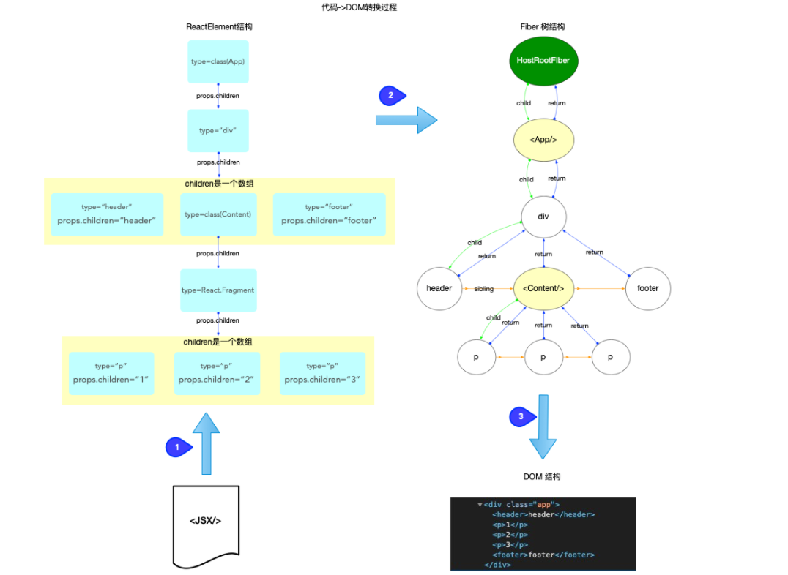
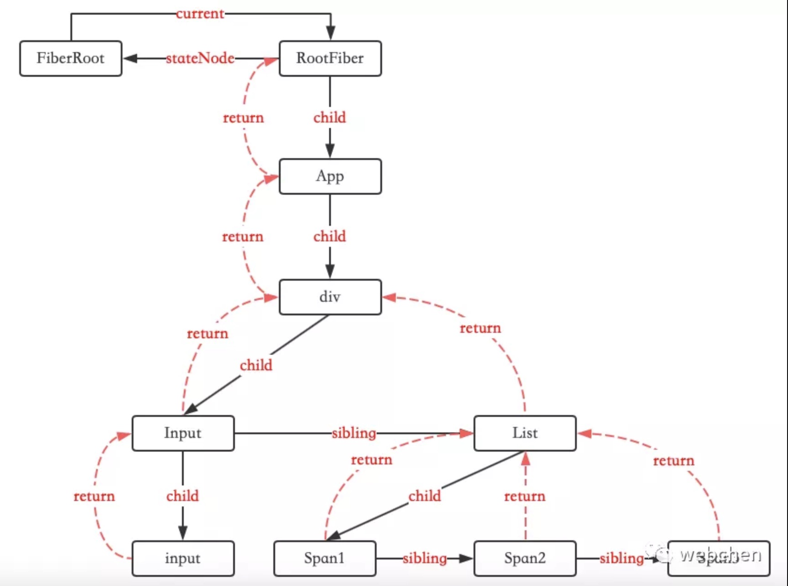
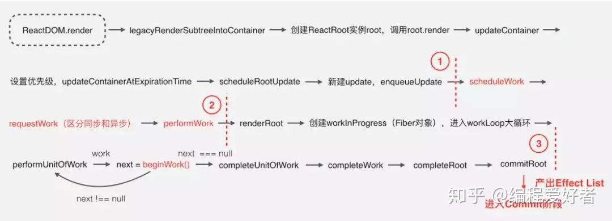
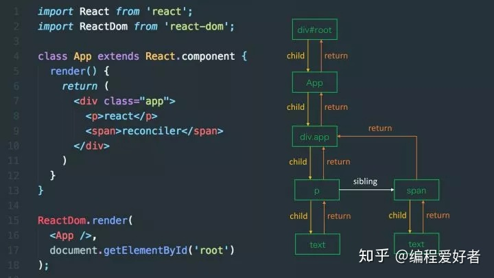

# Fiber

Fiber 就是 React 16 实现的一套新的更新机制，让 React 的更新过程变得可控，避免了之前采用递归需要一气呵成影响性能的做法

## React 颈

React 追求的是 “快速响应”，那么，“快速响应“的制约因素都有什么呢？

- CPU的瓶颈：当项目变得庞大、组件数量繁多、遇到大计算量的操作或者设备性能不足使得页面掉帧，导致卡顿

- IO的瓶颈：发送网络请求后，由于需要等待数据返回才能进一步操作导致不能快速响应

这两个问题一直也是最影响前端开发体验的地方，一个会造成卡顿，一个会造成白屏，本文要聊的fiber 架构主要就是用来解决 CPU的瓶颈

### vs Vue3

**Vue3**

Vue3.0 提出动静结合的 DOM diff 思想，动静结合的 DOM diff 其实是在预编译阶段进行了优化。之所以能够做到预编译优化，是因为 Vue core 可以静态分析 template，在解析模版时，整个 parse 的过程是利用正则表达式顺序解析模板，当解析到开始标签、闭合标签和文本的时候都会分别执行对应的回调函数，来达到构造 AST 树的目的。

借助预编译过程，Vue 可以做到的预编译优化就很强大了。比如在预编译时标记出模版中可能变化的组件节点，再次进行渲染前 diff 时就可以跳过“永远不会变化的节点”，而只需要对比“可能会变化的动态节点”。这也就是动静结合的 DOM diff 将 diff 成本与模版大小正相关优化到与动态节点正相关的理论依据。

**React**

而 React 就是局部重新渲染，React 拿到的或者说掌管的，所负责的就是一堆递归 `React.createElement` 的执行调用（参考下方经过Babel转换的代码），它无法从模版层面进行静态分析。JSX 和手写的 `render function` 是完全动态的，过度的灵活性导致运行时可以用于优化的信息不足。

```js
//JSX 写法：
<div>
  <h1>六个问题助你理解 React Fiber</h1>
  <ul>
    <li>React</li>
    <li>Vue</li>
  </ul>
</div>
```

递归 React.createElement：

```js
// Babel转换后
React.createElement(
  "div",
  null,
 React.createElement(
    "h1",
    null,
    "\u516D\u4E2A\u95EE\u9898\u52A9\u4F60\u7406\u89E3 React Fiber"
 ),
 React.createElement(
    "ul",
    null,
   React.createElement("li", null, "React"),
   React.createElement("li", null, "Vue")
 )
);
```

**template vs jsx**

- JSX 具有 JavaScript 的完整表现力，可以构建非常复杂的组件。但是灵活的语法，也意味着引擎难以理解，无法预判开发者的用户意图，从而难以优化性能

- Template 模板是一种非常有约束的语言，你只能以某种方式去编写模板。

:::error
以上部分需要进一步核实
:::

Fiber 是 React 的最小工作单元，在理解 Fiber 之前，先总结一下与 Fiber 与另外两个元素 ReactElement、DOM 对象之间的关系

- ReactElement 对象: 所有采用jsx语法书写的节点, 都会被编译器转换, 最终会以 `React.createElement(...)` 的方式, 创建出来一个与之对应的 `ReactElement `对象

- fiber 对象: fiber对象是通过 `ReactElement对象` 进行创建的, 多个 fiber对象 构成了一棵 fiber树, fiber树 是构造DOM树的数据模型, fiber树 的任何改动, 最后都体现到 DOM 树

- DOM 对象: 文档对象模型

eg:

```js

class App extends React.Component {
  render() {
    return (
      <div className="app">
        <header>header</header>
        <Content />
        <footer>footer</footer>
      </div>
    );
  }
}

class Content extends React.Component {
  render() {
    return (
      <React.Fragment>
        <p>1</p>
        <p>2</p>
        <p>3</p>
      </React.Fragment>
    );
  }
}

export default App;
```

上面 JSX 代码到 DOM 节点的转换过程:



小结：

- 平时书写的 JSX, 也就是 `ReactElement对象`

- `fiber 树`是通过 `ReactElement` 生成的, 如果脱离了 `ReactElement` , `fiber树`也无从谈起. 所以是 `ReactElement树` (不是严格的树结构, 为了方便也称为树)驱动 `fiber树`.

- `fiber树` 是 DOM 树的数据模型, `fiber树` 驱动 DOM 树

```js
// 源码定义：
function FiberNode(
  tag: WorkTag,
  pendingProps: mixed,
  key: null | string,
  mode: TypeOfMode,
) {

  // Fiber元素的静态属性相关
  this.tag = tag;
  this.key = key; // fiber的key
  this.elementType = null;
  this.type = null; // fiber对应的DOM元素的标签类型，div、p...
  this.stateNode = null; // fiber的实例，类组件场景下，是组件的类，HostComponent场景，是dom元素

  // Fiber 链表相关
  this.return = null; // 指向父级fiber
  this.child = null; // 指向子fiber
  this.sibling = null; // 同级兄弟fiber
  this.index = 0;

  this.ref = null; // ref相关

  // Fiber更新相关
  this.pendingProps = pendingProps;
  this.memoizedProps = null;
  this.updateQueue = null; // 存储update的链表
  this.memoizedState = null; // 类组件存储fiber的状态，函数组件存储hooks链表
  this.dependencies = null;

  this.mode = mode;

  // Effects
  // flags原为effectTag，表示当前这个fiber节点变化的类型：增、删、改
  this.flags = NoFlags;
  this.nextEffect = null;

  // effect链相关，也就是那些需要更新的fiber节点
  this.firstEffect = null;
  this.lastEffect = null;

  this.lanes = NoLanes; // 该fiber中的优先级，它可以判断当前节点是否需要更新
  this.childLanes = NoLanes;// 子树中的优先级，它可以判断当前节点的子树是否需要更新

  /*
  * 可以看成是workInProgress（或current）树中的和它一样的节点，
  * 可以通过这个字段是否为null判断当前这个fiber处在更新还是创建过程
  * */
  this.alternate = null;

}
```

## Fiber树的结构

从上的源码中可以看到一个 fiber 节点包含了很多属性，这里先看以下几个属性：

- Type：`<div>`, `<span>`, 原生标签等. 及 react 中的 `宿主组件 (string)`, `类` 或者 `函数复合组件`

- Child：指向子fiber

   ```js
   const Name = (props) => {
     return(
       <div className="name">
         {props.name}
       </div>
     )
   }
   ```
   
   `<Name>` 组件的 `child` 就是返回的 `<div>`

- Sibling: 同级兄弟fiber
   
   ```js
   const Name = (props) => {
     return([<Customdiv1 />, <Customdiv2 />])
   }
   ```
   
   `<Customdiv1>` `sibling` 就是返回的 `<Customdiv2 />`

- Return: 返回给父 fiber 节点

通过以上属性串联各个 fiber 形成 fiber 树, 所以 fiber 树是一个类似单向链表的结构



## vs Virtual Dom

Virtual Dom 是对 渲染的 Dom 结构的对象表示，Fiber是对Virtual DOM的一种升级

- Virtual DOM使用栈来调度需要更新的内容，中间无法中断、暂停。Fiber支持中断，在浏览器渲染帧里面分片执行更新任务

- Fiber结构让虚拟节点记录父节点、兄弟节点、子节点，形成链表树，你可以从任意顶点遍历到任意子节点，并返回

- Fiber的分片操作使用 `requestAnimationFrame`(高优先级任务)和 `requestIdleCallback` (低优先级任务)

- Fiber 对任务的执行优先级进行标记，高优先级的任务可以先执行，实现架构上的无阻塞

## Fiber 更新

React渲染页面的两个阶段

- 调度阶段（reconciliation）：在这个阶段 React 会更新数据生成新的 Virtual DOM，然后通过Diff算法，快速找出需要更新的元素，放到更新队列中去，得到新的更新队列

- 渲染阶段（commit）：这个阶段 React 会遍历更新队列，将其所有的变更一次性更新到DOM上。

### React 的核心思想

内存中维护一颗虚拟DOM树，数据变化时（setState），自动更新虚拟 DOM，得到一颗新树，然后 Diff 新老虚拟 DOM 树，找到有变化的部分，得到一个 Change(Patch)，将这个 Patch 加入队列，最终批量更新这些 Patch 到 DOM 中

### React 15 架构

React15架构可以分为两层：

Reconciler（协调器）—— React 会自顶向下通过递归，遍历新数据生成新的 Virtual DOM，然后通过 Diff 算法，找到需要变更的元素(Patch)，放到更新队列里面去

Renderer（渲染器）—— 遍历更新队列，通过调用宿主环境的API，实际更新渲染对应元素。宿主环境，比如 DOM、Native、WebGL 等。

在React15及以前，Reconciler采用递归的方式创建虚拟DOM，递归过程是不能中断的。如果组件树的层级很深，递归会占用线程很多时间，递归更新时间超过了16ms，用户交互就会卡顿。

为了解决这个问题，React16将递归的无法中断的更新重构为异步的可中断更新，由于曾经用于递归的虚拟DOM数据结构已经无法满足需要。于是，全新的Fiber架构应运而生。 

### React 16 架构

为了解决同步更新长时间占用线程导致页面卡顿的问题，也为了探索运行时优化的更多可能，React开始重构并一直持续至今。重构的目标是实现Concurrent Mode（并发模式）。

从v15到v16，React团队花了两年时间将源码架构中的Stack Reconciler重构为Fiber Reconciler

React16架构可以分为三层：

Scheduler（调度器）—— 调度任务的优先级，高优任务优先进入Reconciler；
Reconciler（协调器）—— 负责找出变化的组件：更新工作从递归变成了可以中断的循环过程。Reconciler内部采用了Fiber的架构；
Renderer（渲染器）—— 负责将变化的组件渲染到页面上。

### React 17 优化

React16的expirationTimes模型只能区分是否>=expirationTimes决定节点是否更新。React17的lanes模型可以选定一个更新区间，并且动态的向区间中增减优先级，可以处理更细粒度的更新

:::tip
Lane用二进制位表示任务的优先级，方便优先级的计算（位运算），不同优先级占用不同位置的“赛道”，而且存在批的概念，优先级越低，“赛道”越多。高优先级打断低优先级，新建的任务需要赋予什么优先级等问题都是Lane所要解决的问题
:::

Concurrent Mode的目的是实现一套可中断/恢复的更新机制。其由两部分组成：

- 一套协程架构：Fiber Reconciler

- 基于协程架构的启发式更新算法：控制协程架构工作方式的算法

为了解决之前提到解决方案遇到的问题，提出了以下几个目标：

- 暂停工作，稍后再回来。

- 为不同类型的工作分配优先权。

- 重用以前完成的工作。

- 如果不再需要，则中止工作。

为了做到这些，我们首先需要一种方法将任务分解为单元。从某种意义上说，这就是 Fiber，Fiber 代表一种工作单元

但是仅仅是分解为单元也无法做到中断任务，因为函数调用栈就是这样，每个函数为一个工作，每个工作被称为堆栈帧，它会一直工作，直到堆栈为空，无法中断

所以我们需要一种增量渲染的调度，那么就需要重新实现一个堆栈帧的调度，这个堆栈帧可以按照自己的调度算法执行他们。另外由于这些堆栈是可以自己控制的，所以可以加入并发或者错误边界等功能。

因此 Fiber 就是重新实现的堆栈帧，本质上 Fiber 也可以理解为是一个虚拟的堆栈帧，将可中断的任务拆分成多个子任务，通过按照优先级来自由调度子任务，分段更新，从而将之前的同步渲染改为异步渲染

所以我们可以说 Fiber 是一种数据结构(堆栈帧)，也可以说是一种解决可中断的调用任务的一种解决方案，它的特性就是时间分片(time slicing)和暂停(supense)。

### Fiber 是如何工作的

- ReactDOM.render() 和 setState 的时候开始创建更新。

- 将创建的更新加入任务队列，等待调度。

- 在 requestIdleCallback 空闲时执行任务。

- 从根节点开始遍历 Fiber Node，并且构建 WokeInProgress Tree。

- 生成 effectList。

- 根据 EffectList 更新 DOM。

下面是一个详细的执行过程图：



1. 第一部分从 ReactDOM.render() 方法开始，把接收的 React Element 转换为 Fiber 节点，并为其设置优先级，创建 Update，加入到更新队列，这部分主要是做一些初始数据的准备。

2. 第二部分主要是三个函数：scheduleWork、requestWork、performWork，即安排工作、申请工作、正式工作三部曲，React 16 新增的异步调用的功能则在这部分实现，这部分就是 Schedule 阶段，前面介绍的 Cooperative Scheduling 就是在这个阶段，只有在这个解决获取到可执行的时间片，第三部分才会继续执行。具体是如何调度的，后面文章再介绍，这是 React 调度的关键过程。

3. 第三部分是一个大循环，遍历所有的 Fiber 节点，通过 Diff 算法计算所有更新工作，产出 EffectList 给到 commit 阶段使用，这部分的核心是 beginWork 函数，这部分基本就是 Fiber Reconciler ，包括 reconciliation 和 commit 阶段。

## Fiber Node

FIber Node，承载了非常关键的上下文信息，可以说是贯彻整个创建和更新的流程，下来分组列了一些重要的 Fiber 字段

```js
{  ...  // 跟当前Fiber相关本地状态（比如浏览器环境就是DOM节点）  stateNode: any,    // 单链表树结构  return: Fiber | null,// 指向他在Fiber节点树中的`parent`，用来在处理完这个节点之后向上返回  child: Fiber | null,// 指向自己的第一个子节点  sibling: Fiber | null,  // 指向自己的兄弟结构，兄弟节点的return指向同一个父节点  // 更新相关  pendingProps: any,  // 新的变动带来的新的props  memoizedProps: any,  // 上一次渲染完成之后的props  updateQueue: UpdateQueue<any> | null,  // 该Fiber对应的组件产生的Update会存放在这个队列里面  memoizedState: any, // 上一次渲染的时候的state  // Scheduler 相关  expirationTime: ExpirationTime,  // 代表任务在未来的哪个时间点应该被完成，不包括他的子树产生的任务  // 快速确定子树中是否有不在等待的变化  childExpirationTime: ExpirationTime, // 在Fiber树更新的过程中，每个Fiber都会有一个跟其对应的Fiber  // 我们称他为`current <==> workInProgress`  // 在渲染完成之后他们会交换位置  alternate: Fiber | null,  // Effect 相关的  effectTag: SideEffectTag, // 用来记录Side Effect  nextEffect: Fiber | null, // 单链表用来快速查找下一个side effect  firstEffect: Fiber | null,  // 子树中第一个side effect  lastEffect: Fiber | null, // 子树中最后一个side effect  ....};
```

### Fiber Reconciler

在第二部分，进行 Schedule 完，获取到时间片之后，就开始进行 reconcile。

Fiber Reconciler 是 React 里的调和器，这也是任务调度完成之后，如何去执行每个任务，如何去更新每一个节点的过程，对应上面的第三部分。

reconcile 过程分为2个阶段（phase）：

1. （可中断）render/reconciliation 通过构造 WorkInProgress Tree 得出 Change。

2. （不可中断）commit 应用这些DOM change。

### reconciliation 阶段

在 reconciliation 阶段的每个工作循环中，每次处理一个 Fiber，处理完可以中断/挂起整个工作循环。通过每个节点更新结束时向上归并 Effect List 来收集任务结果，reconciliation 结束后，根节点的 Effect List里记录了包括 DOM change 在内的所有 Side Effect

render 阶段可以理解为就是 Diff 的过程，得出 Change(Effect List)，会执行声明如下的声明周期方法：

[UNSAFE_]componentWillMount（弃用）
[UNSAFE_]componentWillReceiveProps（弃用）
getDerivedStateFromProps
shouldComponentUpdate
[UNSAFE_]componentWillUpdate（弃用）
render

由于 reconciliation 阶段是可中断的，一旦中断之后恢复的时候又会重新执行，所以很可能 reconciliation 阶段的生命周期方法会被多次调用，所以在 reconciliation 阶段的生命周期的方法是不稳定的，我想这也是 React 为什么要废弃 componentWillMount 和 componentWillReceiveProps方法而改为静态方法 getDerivedStateFromProps 的原因吧。

### commit 阶段

commit 阶段可以理解为就是将 Diff 的结果反映到真实 DOM 的过程

在 commit 阶段，在 commitRoot 里会根据 effect的 effectTag，具体 effectTag 见源码 ，进行对应的插入、更新、删除操作，根据 tag 不同，调用不同的更新方法

commit 阶段会执行如下的声明周期方法

getSnapshotBeforeUpdate
componentDidMount
componentDidUpdate
componentWillUnmount

:::tip
注意区别 reconciler、reconcile 和 reconciliation，reconciler 是调和器，是一个名词，可以说是 React 工作的一个模块，协调模块；reconcile 是调和器调和的动作，是一个动词；而 reconciliation 只是 reconcile 过程的第一个阶段。
:::

### Fiber Tree 和 WorkInProgress Tree

React 在 render 第一次渲染时，会通过 React.createElement 创建一颗 Element 树，可以称之为 Virtual DOM Tree，由于要记录上下文信息，加入了 Fiber，每一个 Element 会对应一个 Fiber Node，将 Fiber Node 链接起来的结构成为 Fiber Tree。它反映了用于渲染 UI 的应用程序的状态。这棵树通常被称为 current 树（当前树，记录当前页面的状态）。

在后续的更新过程中（setState），每次重新渲染都会重新创建 Element, 但是 Fiber 不会，Fiber 只会使用对应的 Element 中的数据来更新自己必要的属性，

Fiber Tree 一个重要的特点是链表结构，将递归遍历编程循环遍历，然后配合 requestIdleCallback API, 实现任务拆分、中断与恢复

每一个 Fiber Node 节点与 Virtual Dom 一一对应，所有 Fiber Node 连接起来形成 Fiber tree, 是个单链表树结构，如下图所示：



**当 render 的时候有了这么一条单链表，当调用 setState 的时候又是如何 Diff 得到 change 的呢？**

采用的是一种叫双缓冲技术（double buffering），这个时候就需要另外一颗树：WorkInProgress Tree，它反映了要刷新到屏幕的未来状态

WorkInProgress Tree 构造完毕，得到的就是新的 Fiber Tree，然后喜新厌旧（把 current 指针指向WorkInProgress Tree，丢掉旧的 Fiber Tree）就好了

这样做的好处：

能够复用内部对象（fiber）
节省内存分配、GC的时间开销
就算运行中有错误，也不会影响 View 上的数据

每个 Fiber上都有个alternate属性，也指向一个 Fiber，创建 WorkInProgress 节点时优先取alternate，没有的话就创建一个

创建 WorkInProgress Tree 的过程也是一个 Diff 的过程，Diff 完成之后会生成一个 Effect List，这个 Effect List 就是最终 Commit 阶段用来处理副作用的阶段

## 总结

本开始想一篇文章把 Fiber 讲透的，但是写着写着发现确实太多了，想写详细，估计要写几万字，所以我这篇文章的目的仅仅是在没有涉及到源码的情况下梳理了大致 React 的工作流程，对于细节，比如如何调度异步任务、如何去做 Diff 等等细节将以小节的方式一个个的结合源码进行分析。


https://zhuanlan.zhihu.com/p/98295862