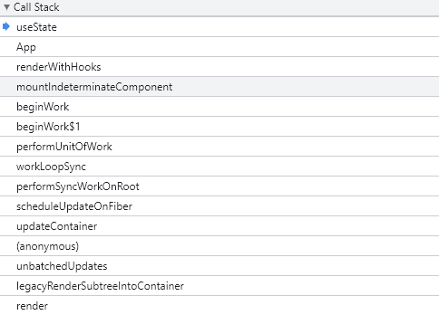
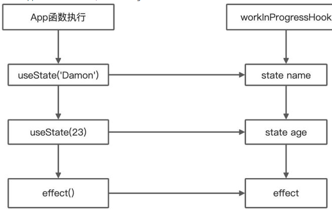

# Hook

Hook 是 React16 引入的新特性， 是 React 团队在 React 组件开发实践中，逐渐认知到的一个改进点，这背后其实涉及对类组件和函数组件两种组件形式的思考和侧重。

## 类组件VS函数组件

### 类组件

所谓类组件，就是基于 ES6 Class 这种写法，通过继承 `React.Component` 得来的 React 组件。以下是一个类组件：

```js
class DemoClass extends React.Component {
  state = {
    text: ""
  };
  componentDidMount() {
    //...
  }
  changeText = (newText) => {
    this.setState({
      text: newText
    });
  };

  render() {
    return (
      <div className="demoClass">
        <p>{this.state.text}</p>
        <button onClick={this.changeText}>修改</button>
      </div>
    );
  }
}
```

可以看出，React 类组件内部预置了相当多的“现成的东西”等着我们去调度/定制，`state` 和生命周期就是这些“现成东西”中的典型。要想得到这些东西，难度也不大，只需要继承一个 `React.Component` 即可。  
当然，这也是类组件的一个不便，它太繁杂了，对于解决许多问题来说，编写一个类组件实在是一个过于复杂的姿势。复杂的姿势必然带来高昂的理解成本，这也是我们所不想看到的。除此之外，由于开发者编写的逻辑在封装后是和组件粘在一起的，这就使得类组件内部的逻辑难以实现拆分和复用

### 函数组件

函数组件就是以函数的形态存在的 React 组件。早期并没有 React-Hooks，函数组件内部无法定义和维护 state，因此它还有一个别名叫“无状态组件”。以下是一个函数组件：

```js
function DemoFunction(props) {
  const { text } = props
  return (
    <div className="demoFunction">
      <p>{`函数组件接收的内容：[${text}]`}</p>
    </div>
  );
}
```

相比于类组件，函数组件肉眼可见的特质自然包括轻量、灵活、易于组织和维护、较低的学习成本等。

通过对比，从形态上可以对两种组件做区分，它们之间的区别如下：

- 类组件需要继承` class`，函数组件不需要

- 类组件可以访问生命周期方法，函数组件不能

- 类组件中可以获取到实例化后的 `this`，并基于这个 `this` 做各种各样的事情，而函数组件不可以

- 类组件中可以定义并维护状态 （state），而函数组件不可以

所以在 React-Hooks 出现之前，类组件的能力边界明显强于函数组件

组件本身的定位就是函数，一个输入数据、输出 UI 的函数。作为开发者，我们编写的是声明式的代码，而 React 框架的主要工作，就是及时地把声明式的代码转换为命令式的 DOM 操作，把数据层面的描述映射到用户可见的 UI 变化中去。  
但函数组件比起类组件少了很多东西，比如生命周期、对 `state` 的管理等。这就给函数组件的使用带来了非常多的局限性，导致我们并不能使用函数这种形式，写出一个真正的全功能的组件。而 React-Hooks 的出现，就是为了帮助函数组件补齐这些（相对于类组件来说）缺失的能力。

React-Hooks 是一套能够使函数组件更强大、更灵活的“钩子”。

## Q&A

### 为什么 useState 要使用数组而不是对象

useState 的用法：

```js
const [count, setCount] = useState(0)
```

**数组的解构赋值**

```js
const foo = [1, 2, 3];
const [one, two, three] = foo;
console.log(one);	// 1
console.log(two);	// 2
console.log(three);	// 3
```

**对象的解构赋值**

```js
const user = {
  id: 888,
  name: "xiaoxin"
};
const { id, name } = user;
console.log(id);	// 888
console.log(name);	// "xiaoxin"
```

看完这两个例子，答案应该就出来了：

- 如果 useState 返回的是数组，那么使用者可以对数组中的元素命名，代码看起来也比较干净

- 如果 useState 返回的是对象，在解构对象的时候必须要和 `useState` 内部实现返回的对象同名，想要使用多次的话，必须得设置别名才能使用返回值

下面来看看如果 useState 返回对象的情况：

```js
// 第一次使用
const { state, setState } = useState(false);
// 第二次使用
const { state: counter, setState: setCounter } = useState(0) 

```

这里可以看到，返回对象的使用方式还是挺麻烦的，更何况实际项目中会使用的更频繁。  
总结：`useState` 返回的是 `array` 而不是 `object` 的原因就是为了降低使用的复杂度，返回数组的话可以直接根据顺序解构，而返回对象的话要想使用多次就需要定义别名了

### React Hooks 解决了哪些问题

React Hooks 主要解决了以下问题：

（1）在组件之间复用状态逻辑很难

React 没有提供将可复用性行为“附加”到组件的途径（例如，把组件连接到 `store` ）解决此类问题可以使用` render` `props` 和 高阶组件。但是这类方案需要重新组织组件结构，这可能会很麻烦，并且会使代码难以理解。由 `providers`，`consumers`，高阶组件，`render` `props` 等其他抽象层组成的组件会形成“嵌套地狱”。尽管可以在 DevTools 过滤掉它们，但这说明了一个更深层次的问题：React 需要为共享状态逻辑提供更好的原生途径。

可以使用 Hook 从组件中提取状态逻辑，使得这些逻辑可以单独测试并复用。Hook 使我们在无需修改组件结构的情况下复用状态逻辑。 这使得在组件间或社区内共享 Hook 变得更便捷。

**复杂组件变得难以理解**

在组件中，每个生命周期常常包含一些不相关的逻辑。例如，组件常常在 `componentDidMount` 和 `componentDidUpdate` 中获取数据。但是，同一个 `componentDidMount` 中可能也包含很多其它的逻辑，如设置事件监听，而之后需在 `componentWillUnmount` 中清除。相互关联且需要对照修改的代码被进行了拆分，而完全不相关的代码却在同一个方法中组合在一起。

为了解决这个问题，Hook 将组件中相互关联的部分拆分成更小的函数（比如设置订阅或请求数据），而并非强制按照生命周期划分。你还可以使用 `reducer` 来管理组件的内部状态，使其更加可预测。

**难以理解的 class**

除了代码复用和代码管理会遇到困难外，class 是学习 React 的一大屏障。我们必须去理解 JavaScript 中 `this` 的工作方式，这与其他语言存在巨大差异。还不能忘记绑定事件处理器。没有稳定的语法提案，这些代码非常冗余。
 
 从概念上讲，React 组件一直更像是函数。而 Hook 则拥抱了函数，同时也没有牺牲 React 的精神原则。Hook 提供了问题的解决方案，无需学习复杂的函数式或响应式编程技术
 
### useEffect 与 useLayoutEffect 的区别

**共同点**

- 运用效果： `useEffect` 与 `useLayoutEffect` 两者都是用于处理副作用，这些副作用包括改变 DOM、设置订阅、操作定时器等。在函数组件内部操作副作用是不被允许的，所以需要使用这两个函数去处理。

- 使用方式：` useEffect` 与 `useLayoutEffect` 两者底层的函数签名是完全一致的，都是调用的 `mountEffectImpl` 方法，在使用上也没什么差异，基本可以直接替换。

**不同点**

使用场景： `useEffect` 在 React 的渲染过程中是被异步调用的，用于绝大多数场景；而 `useLayoutEffect` 会在所有的 DOM 变更之后同步调用，主要用于处理 DOM 操作、调整样式、避免页面闪烁等问题。也正因为是同步处理，所以需要避免在 `useLayoutEffect` 做计算量较大的耗时任务从而造成阻塞。

使用效果： `useEffect` 是按照顺序执行代码的，改变屏幕像素之后执行（先渲染，后改变DOM），当改变屏幕内容时可能会产生闪烁；`useLayoutEffect` 是改变屏幕像素之前就执行了（会推迟页面显示的事件，先改变DOM后渲染），不会产生闪烁。`useLayoutEffect` 总是比 `useEffect` 先执行。


在未来的趋势上，两个 API 是会长期共存的，暂时没有删减合并的计划，需要开发者根据场景去自行选择。React 团队的建议非常实用，如果实在分不清，先用 `useEffect`，一般问题不大；如果页面有异常，再直接替换为 `useLayoutEffect` 即可
 
### React Hooks在平时开发中需要注意的问题和原因

**不要在循环，条件或嵌套函数中调用Hook，必须始终在 React函数的顶层使用Hook**

这是因为 React 需要利用调用顺序来正确更新相应的状态，以及调用相应的钩子函数。一旦在循环或条件分支语句中调用 Hook，就容易导致调用顺序的不一致性，从而产生难以预料到的后果

**使用useState时候，使用push，pop，splice等直接更改数组对象的坑**

使用push直接更改数组无法获取到新值，应该采用析构方式，但是在class里面不会有这个问题。代码示例：

```js
function Indicatorfilter() {
  let [num,setNums] = useState([0,1,2,3])
  const test = () => {
    // 这里坑是直接采用push去更新num
    // setNums(num)是无法更新num的
    // 必须使用num = [...num ,1]
    num.push(1)
    // num = [...num ,1]
    setNums(num)
  }
return (
    <div className='filter'>
      <div onClick={test}>测试</div>
        <div>
          {num.map((item,index) => (
              <div key={index}>{item}</div>
          ))}
      </div>
    </div>
  )
}

class Indicatorfilter extends React.Component<any,any>{
  constructor(props:any){
      super(props)
      this.state = {
          nums:[1,2,3]
      }
      this.test = this.test.bind(this)
  }

  test(){
      // class采用同样的方式是没有问题的
      this.state.nums.push(1)
      this.setState({
          nums: this.state.nums
      })
  }

  render(){
      let {nums} = this.state
      return(
          <div>
              <div onClick={this.test}>测试</div>
                  <div>
                      {nums.map((item:any,index:number) => (
                          <div key={index}>{item}</div>
                      ))}
                  </div>
          </div>

      )
  }
}

```

 
### React Hooks 和生命周期的关系？
 
函数组件 的本质是函数，没有 `state` 的概念的，因此不存在生命周期一说，仅仅是一个 `render` 函数而已。但是引入 Hooks 之后就变得不同了，它能让组件在不使用 `class` 的情况下拥有 `state`，所以就有了生命周期的概念，所谓的生命周期其实就是 `useState`、 `useEffect()` 和 `useLayoutEffect()`
 
即：Hooks 组件（使用了Hooks的函数组件）有生命周期，而函数组件（未使用Hooks的函数组件）是没有生命周期的
 
下面是具体的 class 与 Hooks 的生命周期对应关系：

**constructor**

函数组件不需要构造函数，可以通过调用 **useState 来初始化 state** 

`const [num, UpdateNum] = useState(0)`

**[getDerivedStateFromProps](https://zh-hans.reactjs.org/docs/react-component.html#static-getderivedstatefromprops)**

一般情况下，我们不需要使用它，可以在渲染过程中更新 `state`，以达到实现 `getDerivedStateFromProps` 的目的

```js
function ScrollView({row}) {
  let [isScrollingDown, setIsScrollingDown] = useState(false);
  let [prevRow, setPrevRow] = useState(null);
  if (row !== prevRow) {
    // Row 自上次渲染以来发生过改变。更新 isScrollingDown。
    setIsScrollingDown(prevRow !== null && row > prevRow);
    setPrevRow(row);
  }
  return `Scrolling down: ${isScrollingDown}`;
}
```


**shouldComponentUpdate**

`shouldComponentUpdate(nextProps, nextState)`

根据 `shouldComponentUpdate()` 的返回值，判断 React 组件的输出是否受当前 `state` 或 `props` 更改的影响。默认行为是 `state` 每次发生变化组件都会重新渲染

可以用 **React.memo** 包裹一个组件来对它的 `props` 进行浅比较

```js
const Button = React.memo((props) => {  // 具体的组件});
```

注意：`React.memo 等效于` `PureComponent`，它只浅比较 `props`

**componentWillUnmount**

相当于 `useEffect` 里面返回的 `cleanup` 函数

```js
// componentDidMount/componentWillUnmount
useEffect(()=>{
  // 需要在 componentDidMount 执行的内容
  return function cleanup() {
    // 需要在 componentWillUnmount 执行的内容      
  }
}, [])
```

**componentDidCatch and getDerivedStateFromError：目前还没有这些方法的 Hook 等价写法**
 

## useState

使用官方的例子： 

```js
import React, { useState } from 'react';

function Example() {
  // 声明一个叫 "count" 的 state 变量
  const [count, setCount] = useState(0);
  return (
    <div>
      <p>You clicked {count} times</p>
      <button onClick={() => setCount(count + 1)}>
        Click me
      </button>
    </div>
  );
}
```

上面使用Hook例子 `const [count, setCount] = useState(0)` 包含以下信息：

- 声明一个叫 `count` 的 `state` 变量

- 这个 `count` 的初始值是 `0`

- 使用 `setCount` 方法进行修改这个 `count` 的值

:::tip
更新 `state` 变量的方法，并不会像 `this.setState` 一样，合并 `state` 。而是替换 `state` 变量
:::

### 手写useState

```js
let lastState
function useState(initState) {
    lastState = lastState || initState;
    function setState(newState) {
        lastState = newState
        render()
    }
    return [lastState,setState]
}
function App(){
    const [count, setCount] = useState(0);
    return (
        <div>
            {count}
            <button
                onClick={() => {
                    setCount(count + 1);
                }}
            >
                增加
            </button>
        </div>
    );
}
// 新增方法
function render(){
    ReactDOM.render(
        <App />,
        document.getElementById('root')
    );
}
render()
```

如代码所示，我们自己创建了一个 `useState` 方法

- 如果是第一次使用，则取 `initState` 的值，否则就取上一次的值 `laststate`

- 内部创建了一个 `setState` 方法，该方法用于更新 `state` 的值和触发 `render` 更新

- 最后返回一个 `lastSate` 属性和 `setState` 方法

这里只是用了一个 `useState`，要是我们使用了很多个呢？难道要声明很多个全局变量吗？这显然是不行的，所以，我们可以设计一个全局数组来保存这些 `state`

```js
let lastState = []
let stateIndex = 0
function useState(initState) {
    lastState[stateIndex] = lastState[stateIndex] || initState;
    const currentIndex = stateIndex
    function setState(newState) {
        lastState[currentIndex] = newState
        render()
    }
    return [lastState[stateIndex++],setState]
}
```

这里的 `currentIndex` 是利用了闭包的思想，将某个 `state` 相应的 `index` 记录下来了

### 源码解析

```js
 // useState
  function useState(initialState) {
    var dispatcher = resolveDispatcher();
    return dispatcher.useState(initialState);
  }
  function resolveDispatcher() {
    var dispatcher = ReactCurrentDispatcher.current;
    return dispatcher;
  }
  /**
   * Keeps track of the current dispatcher.
   */
  var ReactCurrentDispatcher = {
    /**
     * @internal
     * @type {ReactComponent}
     */
    current: null
  };
```

从上面代码发现 `userSata(initialState)` = `ReactCurrentDispatcher.current.userSata(initialState)`，`ReactCurrentDispatcher.current` 一开始为 `null`，所以接下来就是找找 `ReactCurrentDispatcher.current` 是什么东西

看下执行到 `useState` 方法时的执行栈



于是在 `renderWithHooks` 方法发现了这么几行代码 

```js
    {
      if (current !== null && current.memoizedState !== null) {
       // 更新渲染
        ReactCurrentDispatcher.current = HooksDispatcherOnUpdateInDEV;
      } else if (hookTypesDev !== null) {
       // 忽略
        ReactCurrentDispatcher.current = HooksDispatcherOnMountWithHookTypesInDEV;
      } else {
        // 首次渲染
        ReactCurrentDispatcher.current = HooksDispatcherOnMountInDEV;
      }
    }
```

先看首次渲染时做的事情，所以 `current=null`，先看 `HooksDispatcherOnMountInDEV`， 它的定义如下：

```js
    HooksDispatcherOnMountInDEV = {
      readContext: function (context, observedBits) {
       // ...
      },
      useCallback: function (callback, deps) {
       // ...
      },
      useContext: function (context, observedBits) {
       // ...
      },
      useEffect: function (create, deps) {
        // ...
      },
      useImperativeHandle: function (ref, create, deps) {
       // ...
      },
      useLayoutEffect: function (create, deps) {
       // ...
      },
      useMemo: function (create, deps) {
       // ...
      },
      useReducer: function (reducer, initialArg, init) {
        // ...
      },
      useRef: function (initialValue) {
        // ...
      },
      useState: function (initialState) {
        currentHookNameInDev = 'useState';
        mountHookTypesDev();
        var prevDispatcher = ReactCurrentDispatcher.current;
        ReactCurrentDispatcher.current = InvalidNestedHooksDispatcherOnMountInDEV;
        try {
          return mountState(initialState);
        } finally {
          ReactCurrentDispatcher.current = prevDispatcher;
        }
      },
      useDebugValue: function (value, formatterFn) {
           // ...
      },
      useResponder: function (responder, props) {
           // ...
      },
      useDeferredValue: function (value, config) {
           // ...
      },
      useTransition: function (config) {
        // ...
      }
    };
```

原来我们使用 `Hook Api` 都在 `HooksDispatcherOnMountInDEV` 对象里

此时回到 `renderWithHooks` 方法，赋值了 `ReactCurrentDispatcher.current` 对象后，下面会执行 `var children = Component(props, secondArg)`， 这个 `Component` 就是我们的函数组件，执行的过程中会执行 `useState()` 方法

 `useState` 方法中，重点看下 `mountState`

```js
  function mountState(initialState) {
    var hook = mountWorkInProgressHook();
    if (typeof initialState === 'function') {
      initialState = initialState();
    }
    hook.memoizedState = hook.baseState = initialState;
    var queue = hook.queue = { // 更新队列
      pending: null, // 待更新
      dispatch: null, // 更新函数
      lastRenderedReducer: basicStateReducer, // 当更新 state 时会通过这个方法最新的state
      lastRenderedState: initialState, // 最后一次的state
    };
    // dispatchAction负责更新 state 的函数
    var dispatch = queue.dispatch = dispatchAction.bind(null, currentlyRenderingFiber$1, queue);
    return [hook.memoizedState, dispatch];
  }
```

`mountWorkInProgressHook` 方法定义如下：

```js
  function mountWorkInProgressHook() {
    var hook = {
      memoizedState: null,// 不同的hook保存的不同值， useState保存的是state； useEffect保存的是effect对象
      baseState: null, // 最新的值
      baseQueue: null, // 最新的队列
      queue: null, // 待更新队列
      next: null, // 指向下一个hook对象
    };
   
    // react hooks的数据结构是链表的方式
    if (workInProgressHook === null) {
      // 函数内的第一个hooks就会走到这里
      currentlyRenderingFiber$1.memoizedState = workInProgressHook = hook;
    } else {
      // 接下来每个hook都会被添加到链接到未尾
      workInProgressHook = workInProgressHook.next = hook;
    }

    return workInProgressHook;
  }
```

每次执行一个 hooks 函数都会调用这个方法来创建一个 hook 对象，更新 `queue` 属性，所以这个 hook 对象里保存了这个 hook 所对应的 `state` 数据、新的队列和指向下一个 hook 的对象指针

然后判断 `initialState` 是否 `function`，是的话执行得到 `state` 数据。接着把 `state` 赋值给了 `memoizedState` 、 `baseState`和 `queue.lastRenderedState`。

`queue` 对象是个更新队列，最近创建更新 `state` 的函数 `dispatch` 

 `var dispatch = queue.dispatch = dispatchAction.bind(null, currentlyRenderingFiber$1, queue);`

- `currentlyRenderingFiber$1`: 表示当前的 fiber 链（链头）

- `queue`: `mountState` 申明的更新队列

- `action`: 这个就是我们传进来的参数

`dispatchAction` 有一些和 fiber`相关的逻辑。但在这里关于 hooks 的就是会创建一个 `update` 对象然后添加到 `queue` 链表上面，然后会判断当前是否处于渲染阶段，不是的话就会去获取上一个 `state` 和当前的 `state` 进行浅对比，相等就会 `return` 不会执行更新，不相等就会执行 `scheduleUpdateOnFiber` 进行更新


#### 更新阶段

上面讲了初始阶段 react 会给 `ReactCurrentDispatcher.current` 赋值 `HooksDispatcherOnMount`，更新阶段赋值 `HooksDispatcherOnUpdate`。在更新阶段实际上调用的是 `updateState`

```js
  function updateState(initialState) {
    return updateReducer(basicStateReducer);
  }
```

https://cloud.tencent.com/developer/article/1784501?from=article.detail.1843869

来看个例子，看看为什么不能在条件语句中申明 hook

```js
import React, { useState, useEffect, useRef } from 'react';
const App = () => {
 const [name, setName] = useState('Damon');
 const [age, setAge] = useState(23);
  if (age !== 23) {
    const Ref = useRef(null);
  }
 
  useEffect(() => {
   console.log(name, age);
  }, []);
 
  return (
   <div>
     <span>{name}</span>
     <span>{age}</span>
    </div>
  )
}
export default App;
```

当这个App组件被渲染的时候，`workInProgressHook.memoizedState` 中会以链表的形式来保存这些 hook



如果在条件语句中申明 hook，那么在更新阶段链表结构会被破坏，Fiber树上缓存的 hooks信息就会和当前的 `workInProgressHook` 不一致，不一致的情况下读取数据可能就会出现异常

## Effect Hook

Effect Hook 可以让你在函数组件中执行副作用操作

> 数据获取，设置订阅以及手动更改 React 组件中的 DOM 都属于副作用

官方例子：

```js
import React, { useState, useEffect } from 'react';

function Example() {
  const [count, setCount] = useState(0);

  useEffect(() => {
    document.title = `You clicked ${count} times`;
  });

  return (
    <div>
      <p>You clicked {count} times</p>
      <button onClick={() => setCount(count + 1)}>
        Click me
      </button>
    </div>
  );
}
```

`useEffect` 的作用：

- 告诉 React 组件需要在渲染后执行某些操作

- 并且在执行 DOM 更新之后调用它

从这里可以看出，`useEffect` 的作用相当同时定义了 `componentDidMount` 和 `conponetDidUpdate` 两个生命周期函数，例子中我们点击按钮增加计数
的同时，页面的 `title` 也会发生变化，说明每次都会执行 `useEffect` 中的方法

### 清除Effect

即希望有 `componentWillUnMount` 的功能，在Hook中的实现方式是在 `useEffect` 方法中添置一个 `return function(){}`

```js
useEffect(function () {
        // 组件渲染完成时执行
        // do something
        return () => {
            console.log('unMount') // // 组件将御载时执行
        }
    })
```

### 只在特定条件下执行 effectHook

在某些情况下，每次渲染后都执行清理或者执行 `effect` 可能会导致性能问题, 在 class 组件中，我们可以使用 `componentDidMount` 方法定义组件在
渲染完成时要做的事情，使用 `componentDidUpdate` 方法控制组件更新时要做的事情

```js
componentDidUpdate(prevProps, prevState) {
  if (prevState.count !== this.state.count) {
    document.title = `You clicked ${this.state.count} times`;
  }
}
```

在 `useEffect` 中，通过传入第二个参数来实现上面的功能

```js
useEffect(() => {
  document.title = `You clicked ${count} times`;
}, [count]) // 仅在 count 更改时更新
```

第二个参数是个数组，数组中元素可以是 `props` 或 `state`,添加这个参数后表示当前这个 `effect` 只在这个数组中的元素发生变化后才执行，
例子中则是 `count` 发生变化后才会执行 `effect`

第二个参数也可以是 `props` 中的属性

```js
useEffect(() => {
  document.title = `You clicked ${props.count} times`;
}, [props.count]) // 仅在 count 更改时更新
```

那如何实现 `componentDidMount` 钩子只在组件渲染时执行一次的功能？ 只需要把第二个参数设为一个空数组就可以了：

```js
useEffect(() => {
  document.title = `You clicked ${props.count} times`;
}, []) // 只在组件渲染时执行一次
```

## useMemo

`const memoizedValue = useMemo(() => computeExpensiveValue(a, b), [a, b]);`

返回一个 `memoized` 值

把“创建”函数和依赖项数组作为参数传入 `useMemo`，它仅会在某个依赖项改变时才重新计算 `memoized` 值。
这种优化有助于避免在每次渲染时都进行高开销的计算

例子：

```js
function App() {
    // 声明一个叫 "count" 的 state 变量
    const [count, setCount] = useState(0);
    function doSomething() {
        console.log('doSomething')
    }
    const abc = doSomething()
    return (
        <div>
            <p>You clicked {count} times</p>
            <button onClick={() => setCount(count+1)}>
                Click me
            </button>
        </div>
    );
}
```

上面的例子中，每次点击更新 `count` 的时候，都会触发组件渲染，然后 `doSomething` 每次都会执行，如果这个函数有非常耗时的计算，那无疑会影响组件
性能，接下来我们使用`useMemo`优化

```js
function App() {
    // 声明一个叫 "count" 的 state 变量
    const [count, setCount] = useState(0);
    function doSomething() {
        console.log('doSomething')
        return 'abc'
    }
    const abc = useMemo(() => doSomething(), [])
    return (
        <div>
            <p>You clicked {count} times {abc}</p>
            <button onClick={() => setCount(count+1)}>
                Click me
            </button>
        </div>
    );
}
```

使用 `useMemo` 包装 `doSomething` 方法，第二参数是一个数组，存放的是当前 `doSomething` 方法依赖的属性，上面传入的空数组，意味着 `doSomething`
只会在组件首次渲染的时候才会执行。

如果我们改为：`const abc = useMemo(() => doSomething(), [count])`,那么只在 `count` 改变时，`doSomething` 才会执行

## useCallback

由于React的更新机制是当组件的 `state` 更新时，当前组件以及子组件都会重新渲染，即使这些子组件的 `props` 没有更新也会渲染。`React.memo`
的作用就是包装子组件，这样只有当依赖的 `props` 更新的时候才会去重新渲染子组件, 如果 `props` 包含 `useState` 或 `useContext` 的 Hook, 
当 `context` 发生变化时，它仍会重新渲染

```js
const ChildrenComponent = memo(({ cab }) => {
    console.log('ChildrenComponent rending');
    return <div>ChildrenComponent</div>;
});
function App() {
    // 声明一个叫 "count" 的 state 变量
    const [count, setCount] = useState(0);
    const callBack = () => setCount(100)
    return (
        <div>
            <p>You clicked {count} times</p>
            <button onClick={() => setCount(count+1)}>
                Click me
            </button>
            <ChildrenComponent cab={callBack}></ChildrenComponent>
        </div>
    );
}

```

上面例子中 `ChildrenComponent` 每次都会重新渲染，是 `memo` 不起作用嘛？并不是，当子组件用 `memo` 包装之后，这个子组件只有在 `props`
更新之后才会渲染，而上面 `const callBack = () => setCount(100)` ，在当前组件更新后都会重新赋值一个方法，赋值后地址就变了，那么
子组件自然会被重新渲染

使用 `useCallback` 解决这个问题：

```js
const ChildrenComponent = memo(({ cab }) => {
    console.log('ChildrenComponent rending');
    return <div>ChildrenComponent</div>;
});
function App() {
    // 声明一个叫 "count" 的 state 变量
    const [count, setCount] = useState(0);
    const callBack = useCallback(() => setCount(100), [])
    return (
        <div>
            <p>You clicked {count} times</p>
            <button onClick={() => setCount(count+1)}>
                Click me
            </button>
            <ChildrenComponent cab={callBack}></ChildrenComponent>
        </div>
    );
}
```

把内联回调函数及依赖项数组作为参数传入 `useCallback`，它将返回该回调函数的 `memoized` 版本，该回调函数仅在某个依赖项改变时才会更新

## useMemo和useCallback的区别

`useMemo` 和 `useCallback` 接收的参数都是一样，都是在其依赖项发生变化后才执行，都是返回缓存的值，区别在于 `useMemo`  返回的是函数运行的结果，
`useCallback` 返回的是函数

[什么时候使用 useMemo 和 useCallback](https://jancat.github.io/post/2019/translation-usememo-and-usecallback/)

## useRef

`const refContainer = useRef(initialValue);`

`useRef` 返回一个可变的 `ref 对象`，其 `.current` 属性被初始化为传入的参数（initialValue）。**返回的 `ref` 对象在组件的整个生命周期内保持不变**

它的作用总结如下：

### 保存dom

```js
function App() {
    const inputEl = useRef(null);
    useEffect(() => {
        console.log('inputEl', inputEl)
    })
    return (
        <div ref={inputEl}>
            你个弟弟
        </div>
    );
}

```

### 保存事件程序

```js
function Test() {
  const t = useRef(null);
  function handleClick() {
    t.current = setTimeout(() => l(1), 2000);
  }
  function handleClear() {
    clearTimeout(t.current);
  }

  return (
    <>
      <button onClick={handleClick}>start</button>
      <button onClick={handleClear}>clear</button>
    </>
  );
}
```

### 存储以前的值

```js
function Test() {
  const t = useRef(null);
  const [name, setName] = useState("ajanuw");
  useEffect(() => {
    t.current = name;
  });
  const prevName = t.current;
  return (
    <div>
      <input value={name} onChange={e => setName(e.target.value)} />
      <h2>{name}</h2>
      <p>{prevName}</p>
    </div>
  );
}
```

## useLayoutEffect

作用与 `useEffect` 相同类似，可以使用它来读取 DOM 布局并同步触发重渲染。
在浏览器执行绘制之前，`useLayoutEffect` 内部的更新计划将被同步刷新

**`useLayoutEffect`和`useEffect`**的区别

在区分之前，我们先了解React 组件的更新过程:

1. 初始化,变更`state` 或者 `props` 时都会触发组件更新

2. 当前组件就会调用 `render` 函数

3. React 会执行 `useLayoutEffect`，直到该函数逻辑执行完毕

4. 虚拟`dom元素`真实地更新到屏幕上

5. 执行 `useEffect` 表示更新完毕

可以看到 `useEffect` 是在Dom完成渲染之后执行，`useLayoutEffect` 则在Dom最终渲染前执行

## useImperativeHandle

`useImperativeHandle(ref, createHandle, [deps])`

`useImperativeHandle` 可以让你在使用 `ref` 时自定义暴露给父组件的实例值。在大多数情况下，应当避免使用 `ref` 这样的命令式代码。
`useImperativeHandle` 应当与 `forwardRef` 一起使用：

```js
function FancyInput(props, ref) {
  const inputRef = useRef();
  useImperativeHandle(ref, () => ({
    focus: () => {
      inputRef.current.focus();
    }
  }));
  return <input ref={inputRef} ... />;
}
FancyInput = forwardRef(FancyInput);
```

在本例中，渲染 `<FancyInput ref={inputRef} />` 的父组件可以调用 `inputRef.current.focus()`

## 自定义Hook

自定义Hook就是将`useState`和`useEffect`放在一个公共函数中，这个函数就成了一个`Hook`，这样就可以让多个组件使用这个`Hook`

```js
import { useState, useEffect } from 'react';

export default function useCount(init) {
    const [count, setCount] = useState(init);
    useEffect(function () {
        // setCount(count+10)
        setTimeout(() => {
            setCount(count+10)
        }, 1000)
    }, )
    return count
}

```

使用：

```js
import React, { useState, useEffect } from 'react';
import useCount from './helper/hook/useCount'

function App() {
    const isOnline = useCount(10)
    return (
        <div>
            <p>自定义Hook:{isOnline}</p>
        </div>
    );
}

export default App;
```

**自定义hook的注意点**

- 自定义 Hook 必须以 “use” 开头

- 在两个组件中使用相同的 Hook 不会共享 state

- 组合更新时，自定义 Hook中的`effect`的执行规则也是一样的，我们可以利用这种做 hook 通信

  ```
  // 自定义hook
  import { useState, useEffect } from 'react';
  
  export default function useCount(init) {
      const [count, setCount] = useState(init);
      useEffect(function () {
          console.log(init) // 接收新的init
          return
      })
      return count
  }
  -------------------------------------------------
  //
   import React, { useState, useEffect } from 'react';
   import logo from './logo.svg';
   import useCount from './helper/hook/useCount'
   import './App.css';
   import Inbox from './pages/Inbox'
   
   function App() {
       // 声明一个叫 "count" 的 state 变量
       const [count, setCount] = useState(0);
       const count2 = useCount(count)
       function f() {
           setCount(count + 1)
       }
       return (
           <div>
               <p>You clicked {count} times</p>
               <button onClick={f}>
                   Click me
               </button>
               {
                   count%2 === 0 && <Inbox></Inbox>
               }
           </div>
       );
   }
   
   export default App;


  ```

## Hook使用规则

- 不要在循环，条件或嵌套函数中调用 Hook， 确保总是在你的 React 函数的最顶层调用他们。

- 只在 React 函数中调用 Hook

  - 不要在循环，条件或嵌套函数中调用 Hook， 确保总是在你的 React 函数的最顶层调用他们。

  - 在自定义 Hook 中调用其他 Hook 

https://juejin.cn/post/6940942549305524238#heading-22

https://github.com/7kms/react-illustration-series

[什么时候使用 useMemo 和 useCallback](https://jancat.github.io/post/2019/translation-usememo-and-usecallback/)

https://developer.aliyun.com/article/784027