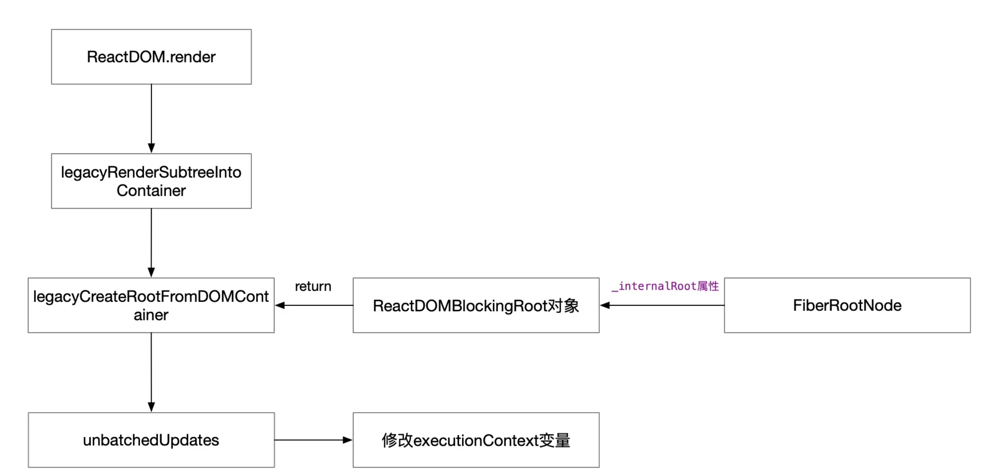
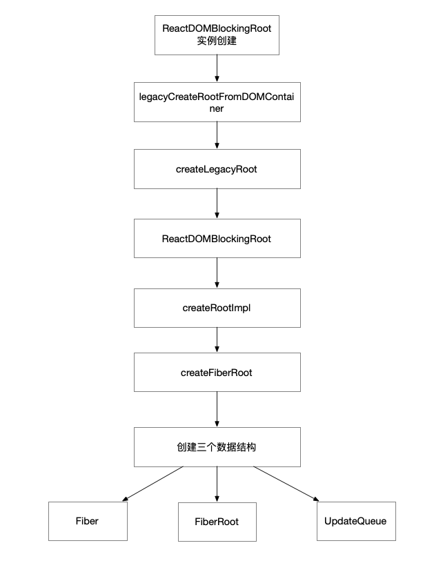

# ReactDOM.render

`ReactDOM.render(element, container[, callback])`

eg:

```js
const root = document.createElement('div')
root.id = 'app'
document.body.appendChild(root)

const App = (<h2>Hello World!</h2>)

render(App, root)
```

在提供的 `container` 里渲染一个 React 元素，并返回对该组件的引用（或者针对无状态组件返回 `null`）

如果 React 元素之前已经在 `container` 里渲染过，这将会对其执行更新操作，并仅会在必要时改变 DOM 以映射最新的 React 元素

如果提供了可选的回调函数，该回调将在组件被渲染或更新之后被执行

::: warning
`ReactDOM.render()` 会控制你传入容器节点里的内容。当首次调用时，容器节点里的所有 DOM 元素都会被替换，后续的调用则会使用 React 的 DOM 差分算法（DOM diffing algorithm）进行高效的更新。

`ReactDOM.render()` 不会修改容器节点（只会修改容器的子节点）。可以在不覆盖现有子节点的情况下，将组件插入已有的 DOM 节点中。

`ReactDOM.render()` 目前会返回对根组件 ReactComponent 实例的引用。 但是，目前应该避免使用返回的引用，因为它是历史遗留下来的内容，而且在未来版本的 React 中，组件渲染在某些情况下可能会是异步的。 如果你真的需要获得对根组件 ReactComponent 实例的引用，那么推荐为根元素添加 `callback ref`。

使用 `ReactDOM.render()` 对服务端渲染容器进行 hydrate 操作的方式已经被废弃，并且会在 React 17 被移除。作为替代，请使用 `hydrate()`。
:::

`ReactDOM.render` 用于初次渲染时将 React 应用挂载在 DOM 元素上

对于 React 项目，平时会以 jsx 的格式进行开发，但是 jsx 并不是标准的格式，所以需要 label 进行转议，以上面 eg 代码为例，最终会转换成以下形式的代码：

```js
const root = document.createElement("div");
root.id = "app";
document.body.appendChild(root);
const App = /*#__PURE__*/ React.createElement("h2", null, "Hello World!");
render(App, root);
```

jsx 编写的组件会转议成 `React.createElement` 的形式，所以 React 最终是通过 `React.createElement` 来创建一个 `reactElement` 

在现在的 React 中 `reactElement` 也被称为是 `fiber 树`，`fiber树` 是 DOM 树的数据模型

## 源码跟踪

`ReactDom.render` 的源码定义：

```js
function render(element, container, callback) {
  // 忽略部分代码
  return legacyRenderSubtreeIntoContainer(null, element, container, false, callback);
}
```

执行 `ReactDOM.render` 返回的  `legacyRenderSubtreeIntoContainer` 方法函数调用的结果，该方法传入五个参数：

- `null`: `parentComponent`

- `element`：`ReactDOM.render` 的第一个参数，React 元素也就是一个 `ReactElement`

- `container` ： `ReactDOM.render` 的第二个参数，挂载 React 元素的一个 element容器

- `false`： `forceHydrate` 服务端渲染用的，可以忽略

- `callback`：`ReactDOM.render` 的第三个参数，一个回调函数

```js
function legacyRenderSubtreeIntoContainer(parentComponent, children, container, forceHydrate, callback) {
  var root = container._reactRootContainer;
  var fiberRoot;
  // 首次执行时 `container` 是要挂载的目标节点，此时它是没有 `_reactRootContainer` 属性的
  if (!root) {
    // 创建一个ReactRooter
    root = container._reactRootContainer = legacyCreateRootFromDOMContainer(container, forceHydrate);
    fiberRoot = root._internalRoot;

    //初始化安装不需要批量更新
    unbatchedUpdates(function () {
      updateContainer(children, fiberRoot, parentComponent, callback);
    });
  } else { // 非首次执行
    fiberRoot = root._internalRoot;
    updateContainer(children, fiberRoot, parentComponent, callback);
  }

  return getPublicRootInstance(fiberRoot); // 返回fiberRoot
}
```

`legacyRenderSubtreeIntoContainer()` （翻译成啥啥渲染子数到容器），在当前例子中执行这个函数时传进来的参数为：

- 首次渲染 `container._reactRootContainer` 肯定为空

- 调用 `legacyCreateRootFromDOMContainer` 函数创建 `ReactDOMBlockingRoot` 赋值给 `root` 和 `container._reactRootContainer`，函数内也同时创建了 `fiberRootNode` 保存在 `_internalRoot` 属性中

- 赋值 `fiberRootNode` 给 `fiberRoot`

- 调用 `unbatchedUpdates` 函数，取消批量更新



### legacyCreateRootFromDOMContainer

```js
function legacyCreateRootFromDOMContainer(container, forceHydrate) {
   // 判断是否服务端渲染
   var shouldHydrate = forceHydrate || shouldHydrateDueToLegacyHeuristic(container);
   if (!shouldHydrate) {
      var rootSibling;
      // 删除container中的内容
      while (rootSibling = container.lastChild) {
         {
            container.removeChild(rootSibling);
         }
      }
      return createLegacyRoot(container, shouldHydrate ? {
         hydrate: true
      } : undefined);
   }
}
```

- 这个函数其实就做了一件事，就是遍历删除 `container` 中的内容

- 然后调用 `createLegacyRoot` 生成 ReactRooter

### createLegacyRoot

```js
function createLegacyRoot(container, options) {
  // createLegacyRoot 方法返回 ReactDOMBlockingRoot 的实例
  return new ReactDOMBlockingRoot(container, LegacyRoot, options);
}
```

`new` 了一个 `ReactDOMBlockingRoot` 传递了三个参数

- container：DOM Element

- LegacyRoot：一个常量，这里表示 `blockingRoot`

- options: 可以忽略，就是那个 `hydrate`

### ReactDOMBlockingRoot

```js
function ReactDOMBlockingRoot(container, tag, options) {
  this._internalRoot = createRootImpl(container, tag, options);
}
```

在 `_internalRoot` 赋值 `createRootImpl` 函数调用的结果，在之前 `legacyRenderSubtreeIntoContainer` 方法中 `fiberRoot = root._internalRoot` 就是这里来的

### createRootImpl

```js
function createRootImpl(container, tag, options) {
  // Tag is either LegacyRoot or Concurrent Root
  var hydrate = options != null && options.hydrate === true;
  var hydrationCallbacks = options != null && options.hydrationOptions || null;
  // 创建React容器 fiberRootNode
  var root = createContainer(container, tag, hydrate);
  // 将fiberNode 挂载到container对象上
  markContainerAsRoot(root.current, container);
  return root;
}

// 给当前 DOM 节点标记一个 internalContainerInstanceKey 属性
// internalContainerInstanceKey=__reactContainere$wyxea1uq6a
function markContainerAsRoot(hostRoot, node) {
   node[internalContainerInstanceKey] = hostRoot;
}
```

- 调用 `createContainer` 创建 FiberNode 对象

- `markContainerAsRoot` 函数只是将最终返回的 FiberRoot对象上的 `current` 属性挂载到了 `container` 上面

### createContainer

```js
// 创建 FiberRoot
function createContainer(containerInfo, tag, hydrate, hydrationCallbacks) {
  // 调用createFiberRoot
  return createFiberRoot(containerInfo, tag, hydrate, hydrationCallbacks);
}
// createFiberRoot
function createFiberRoot(containerInfo, tag, hydrate, hydrationCallbacks) {
  // 创建fiber树root节点
  var root = new FiberRootNode(containerInfo, tag, hydrate);
  var uninitializedFiber = createHostRootFiber(tag);
  root.current = uninitializedFiber;
  uninitializedFiber.stateNode = root;
  initializeUpdateQueue(uninitializedFiber);
  return root;
}
```

- `new FiberRootNode`： 就是实例化了一个FiberRoot对象

- `createHostRootFiber`：创建的是一个Fiber对象，这个Fiber也经常被叫 RootFiber ,并且保存到 `FiberRoot.current` 下面

- `initializeUpdateQueue`：创建一个更新队列，挂载 `fiber.updateQueue` 下面

- 最后进行返回 `root`


 ```js
 // tag = 0
 function createHostRootFiber(tag) {
   var mode;
   if (tag === ConcurrentRoot) {
     mode = ConcurrentMode | BlockingMode | StrictMode;
   } else if (tag === BlockingRoot) {
     mode = BlockingMode | StrictMode;
   } else {
     // 执行到这里
     mode = NoMode;
   }
   // 此时 mode=0
   return createFiber(HostRoot, null, null, mode);
 }
 // createFiber 创建 fiber
 var createFiber = function (tag, pendingProps, key, mode) {
   // $FlowFixMe: the shapes are exact here but Flow doesn't like constructors
   return new FiberNode(tag, pendingProps, key, mode);
 };
 ```

整理一个流程



### 小结

- root = container._reactRootContainer = ReactDOMBlockingRoot

- root._internalRoot = fiberRootNode

root 对象（container._reactRootContainer）上有一个 `_internalRoot` 属性，这个 `_internalRoot` 也就是一个 FiberRootNode 对象，其中包含一个 `current` 属性，`current` 对象是一个 Fiber节点，不仅如此，它还是当前 Fiber 树的头部节点

所以在执行 `unbatchedUpdates()` 之前 `render` 主要是 **完成 Fiber 树中基本实体的创建** 其中

- fiberRoot 的关联对象是真实 DOM 的容器节点

- rootFiber 则作为虚拟 DOM 的根节点存在

接下来，`fiberRoot` 将和 `ReactDOM.render` 方法的其他入参一起，被传入 `updateContainer` 方法，从而形成一个回调。这个回调，正是接下来要调用的 `unbatchedUpdates` 方法的入参

### unbatchedUpdates

```js
function unbatchedUpdates(fn, a) {
 var prevExecutionContext = executionContext;
 // 这里是对上下文的处理，不用关注
 // 去除executionContext上的BatchedContext
 executionContext &= ~BatchedContext;
 // 往executionContext上添加LegacyUnbatchedContext
 executionContext |= LegacyUnbatchedContext;

 try {
   return fn(a);
 } finally {
    // finally 逻辑里是对回调队列的处理，此处不用太关注
   executionContext = prevExecutionContext;
   if (executionContext === NoContext) {
      // 刷新同步任务队列
     flushSyncCallbackQueue();
   }
 }
}
```

- 修改 `executionContext` 这个变量，让他含有 `LegacyUnbatchedContext`，也就是非批量更新模式

- 然后就是 `fn()` 执行传入的回调函数 `updateContainer`

- 最后会执行 `flushSyncCallbackQueue`，刷新同步任务队列

### updateContainer

此时参数依次为：

- `children`：App 组件

- `fiberRoot`: 上一步创建的 `FilberRoot`

- `parentComponent`： `null`

- `callback`: `undefined`

```js
function updateContainer(element, container, parentComponent, callback) {
  {
    onScheduleRoot(container, element);
  }
  var current$1 = container.current;
  // 计算新开始的时间
  var currentTime = requestCurrentTimeForUpdate();
 // 创建优先级
  var suspenseConfig = requestCurrentSuspenseConfig();
  // 计算过期时间
  var expirationTime = computeExpirationForFiber(currentTime, current$1, suspenseConfig);
  // 由于parentComponent为null,所以返回空对象{}
  var context = getContextForSubtree(parentComponent);

  if (container.context === null) {
    container.context = context;
  } else {
    container.pendingContext = context;
  }

  {
    if (isRendering && current !== null && !didWarnAboutNestedUpdates) {
      didWarnAboutNestedUpdates = true;
    }
  }
  // 结合 suspenseConfig（优先级）信息，创建 update 对象，一个 update 对象意味着一个更新
  var update = createUpdate(expirationTime, suspenseConfig); // Caution: React DevTools currently depends on this property

  // update 的 payload 对应的是一个 React 元素
  update.payload = {
    element: element
  };
// 处理 callback，这个 callback 其实就是我们调用 ReactDOM.render 时传入的 callback
  callback = callback === undefined ? null : callback;

  if (callback !== null) {
    {
      if (typeof callback !== 'function') {
        error('render(...): Expected the last optional `callback` argument to be a ' + 'function. Instead received: %s.', callback);
      }
    }

    update.callback = callback;
  }
 // 将 update 入队
  // 一整个React应用中，会有多次更新，而这多次更新均在更新队列中
  enqueueUpdate(current$1, update);
  //进行任务调度
  //当React进行Update后，就要进行调度
  //即 根据任务的优先级去调度任务
  //先执行优先级高的任务，
  scheduleWork(current$1, expirationTime);
  return expirationTime;
}
```

`updateContainer` 函数最关键的事情可以总结为三件：

1. 创建当前 Fiber 节点的 suspenseConfig（优先级）

2. 结合 suspenseConfig（优先级），创建当前 Fiber 节点的 `update` 对象，并将其入队

3. 调度当前节点（rootFiber）。

`scheduleUpdateOnFiber` 函数的任务是调度当前节点的更新。在这个函数中，会处理一系列与优先级、打断操作相关的逻辑。但是在 `ReactDOM.render` 发起的首次渲染链路中，这些意义都不大，因为这个渲染过程其实是同步的

具体的更新过程另外放个章节研究

## 总结

**ReactDOM.render** 做的事情核心就做两件事件

1. 创建 FiberNode

2. 发布调试任务，更新更新

> [深入react-ReactDOM.render](https://segmentfault.com/a/1190000021883117)  
> [深入理解ReactDOM.render 是如何串联渲染链路的全过程](https://cloud.tencent.com/developer/article/1843869)