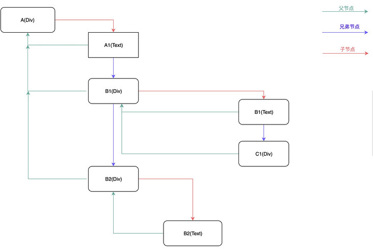
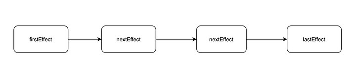
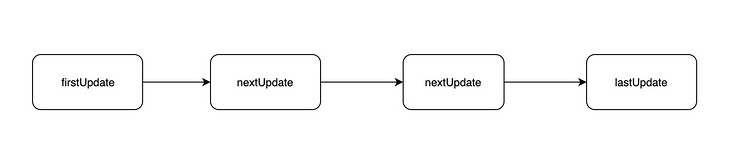
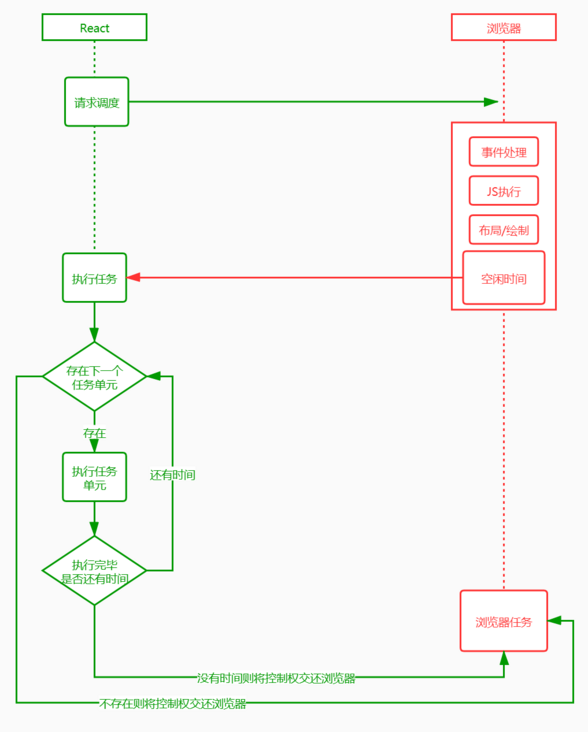

# 时间切片

**浏览器一帧都会干些什么？**

我们都知道，页面的内容都是一帧一帧绘制出来的，浏览器刷新率代表浏览器一秒绘制多少帧。原则上说 1s 内绘制的帧数也多，画面表现就也细腻。目前浏览器大多是 60Hz（60帧/s），每一帧耗时也就是在 16.6ms 左右。那么在这一帧的（16.6ms） 过程中浏览器又干了些什么呢？

浏览器一帧会经过下面这几个过程：

1. 接受输入事件

2. 执行事件回调

3. 开始一帧

4. 执行 RAF (RequestAnimationFrame)

5. 页面布局，样式计算

6. 绘制渲染

7. 执行 RIC (RequestIdelCallback)

因此如果 React 调和算法在每次更新都遍历整个 App 树，然后渲染，如果遍历的时间超过 16ms, 就会导致丢帧，你知道丢帧并不太好，会导致动画卡顿，不连贯

这就是赋予更新任务的优先级非常好的一个大的原因，而不是盲目应用每次更新到调和器。另一个非常的特性是可以暂停，在下一帧恢复。这种方式 React 可以在 16ms 内更好地控制任务渲染的时间。

这导致了 React 团队重写了调和算法，新的算法被称为 Fiber


### requestIdleCallback 的启示

上面第七步的 RIC 事件不是每一帧结束都会执行，只有在一帧的 16.6ms 中做完了前面 6 件事儿且还有剩余时间，才会执行。如果一帧执行结束后还有时间执行 RIC 事件，那么下一帧需要在事件执行结束才能继续渲染，所以 RIC 执行不要超过 30ms，如果长时间不将控制权交还给浏览器，会影响下一帧的渲染，导致页面出现卡顿和事件响应不及时

我们以浏览器是否有剩余时间作为任务中断的标准，那么我们需要一种机制，当浏览器有剩余时间时通知我们。

```js
// 用法示例
var tasksNum = 10000

requestIdleCallback(unImportWork)

function unImportWork(deadline) {
 while (deadline.timeRemaining() && tasksNum > 0) {
  console.log(`执行了${10000 - tasksNum + 1}个任务`)
  tasksNum--
 }
 if (tasksNum > 0) { // 在未来的帧中继续执行
  requestIdleCallback(unImportWork)
 }
}
```

但是由于以下因素，Facebook 抛弃了 `requestIdleCallback` 的原生 API：

- 浏览器兼容性；

- 触发频率不稳定，受很多因素影响。比如当我们的浏览器切换 tab 后，之前 tab 注册的 `requestIdleCallback` 触发的频率会变得很低。

基于以上原因，在 React 中实现了功能更完备 `的requestIdleCallbackpolyfill`，这就是 `Scheduler`。除了在空闲时触发回调的功能外，`Scheduler` 还提供了多种调度优先级供任务设置

## React Fiber 中的时间分片

把一个耗时长的任务分成很多小片，每一个小片的运行时间很短，虽然总时间依然很长，但是在每个小片执行完之后，都给其他任务一个执行的机会，这样唯一的线程就不会被独占，其他任务依然有运行的机会。

React Fiber 把更新过程碎片化，每执行完一段更新过程，就把控制权交还给 React 负责任务协调的模块，看看有没有其他紧急任务要做，如果没有就继续去更新，如果有紧急任务，那就去做紧急任务

:::tip
在 React 内部采用 requestAnimationFrame 作为 ployfill，通过 帧率动态调整，计算 timeRemaining，模拟 requestIdleCallback，从而实现时间分片（Time Slicing）
:::

### Stack Reconciler

基于栈的 Reconciler，浏览器引擎会从执行栈的顶端开始执行，执行完毕就弹出当前执行上下文，开始执行下一个函数，直到执行栈被清空才会停止。然后将执行权交还给浏览器。由于 React 将页面视图视作一个个函数执行的结果。每一个页面往往由多个视图组成，这就意味着多个函数的调用。

如果一个页面足够复杂，形成的函数调用栈就会很深。每一次更新，执行栈需要一次性执行完成，中途不能干其他的事儿，只能"一心一意"。结合前面提到的浏览器刷新率，JS 一直执行，浏览器得不到控制权，就不能及时开始下一帧的绘制。如果这个时间超过 16ms，当页面有动画效果需求时，动画因为浏览器不能及时绘制下一帧，这时动画就会出现卡顿。不仅如此，因为事件响应代码是在每一帧开始的时候执行，如果不能及时绘制下一帧，事件响应也会延迟

### Fiber Reconciler

在 React Fiber 中用链表遍历的方式替代了 React 16 之前的栈递归方案。在 React 16 中使用了大量的链表。

使用多向链表的形式替代了原来的树结构；

```html
<div id="A">
A1
<div id="B1">
  B1
  <div id="C1"></div>
</div>
<div id="B2">
  B2
</div>
</div>
```



副作用单链表；



状态更新单链表；



链表是一种简单高效的数据结构，它在当前节点中保存着指向下一个节点的指针；遍历的时候，通过操作指针找到下一个元素。

链表相比顺序结构数据格式的好处就是：

1. 操作更高效，比如顺序调整、删除，只需要改变节点的指针指向就好了。

2. 不仅可以根据当前节点找到下一个节点，在多向链表中，还可以找到他的父节点或者兄弟节点

但链表也不是完美的，缺点就是：

1. 比顺序结构数据更占用空间，因为每个节点对象还保存有指向下一个对象的指针。

2. 不能自由读取，必须找到他的上一个节点

React 用空间换时间，更高效的操作可以方便根据优先级进行操作。同时可以根据当前节点找到其他节点，在下面提到的挂起和恢复过程中起到了关键作用

### React Fiber 是如何实现更新过程可控？

更新过程的可控主要体现在下面几个方面：

- 任务拆分

- 任务挂起、恢复、终止

- 任务具备优先级

### 任务拆分

在 React Fiber 机制中，它采用"化整为零"的思想，将调和阶段（Reconciler）递归遍历 VDOM 这个大任务分成若干小任务，每个任务只负责一个节点的处理

### 任务挂起、恢复、终止

**workInProgress tree**

workInProgress 代表当前正在执行更新的 Fiber 树。在 render 或者 setState 后，会构建一颗 Fiber 树，也就是 workInProgress tree，这棵树在构建每一个节点的时候会收集当前节点的副作用，整棵树构建完成后，会形成一条完整的副作用链

**currentFiber tree**

currentFiber 表示上次渲染构建的 Filber 树。在每一次更新完成后 workInProgress 会赋值给 currentFiber。在新一轮更新时 workInProgress tree 再重新构建，新 workInProgress 的节点通过 alternate 属性和 currentFiber 的节点建立联系

在新 workInProgress tree 的创建过程中，会同 currentFiber 的对应节点进行 Diff 比较，收集副作用。同时也会复用和 currentFiber 对应的节点对象，减少新创建对象带来的开销。也就是说无论是创建还是更新、挂起、恢复以及终止操作都是发生在 workInProgress tree 创建过程中的。workInProgress tree 构建过程其实就是循环的执行任务和创建下一个任务

### 挂起

当第一个小任务完成后，先判断这一帧是否还有空闲时间，没有就挂起下一个任务的执行，记住当前挂起的节点，让出控制权给浏览器执行更高优先级的任务

### 恢复

在浏览器渲染完一帧后，判断当前帧是否有剩余时间，如果有就恢复执行之前挂起的任务。如果没有任务需要处理，代表调和阶段完成，可以开始进入渲染阶段。

如何判断一帧是否有空闲时间的呢？
使用前面提到的 RIC (RequestIdleCallback) 浏览器原生 API，React 源码中为了兼容低版本的浏览器，对该方法进行了 Polyfill。

恢复执行的时候又是如何知道下一个任务是什么呢？
答案是在前面提到的链表。在 React Fiber 中每个任务其实就是在处理一个 FiberNode 对象，然后又生成下一个任务需要处理的 FiberNode

### 终止

其实并不是每次更新都会走到提交阶段。当在调和过程中触发了新的更新，在执行下一个任务的时候，判断是否有优先级更高的执行任务，如果有就终止原来将要执行的任务，开始新的 workInProgressFiber 树构建过程，开始新的更新流程。这样可以避免重复更新操作。这也是在 React 16 以后生命周期函数 componentWillMount 有可能会执行多次的原因



## 任务具备优先级

React Fiber 除了通过挂起，恢复和终止来控制更新外，还给每个任务分配了优先级。具体点就是在创建或者更新 FiberNode 的时候，通过算法给每个任务分配一个到期时间（expirationTime）。在每个任务执行的时候除了判断剩余时间，如果当前处理节点已经过期，那么无论现在是否有空闲时间都必须执行该任务。过期时间的大小还代表着任务的优先级。

任务在执行过程中顺便收集了每个 FiberNode 的副作用，将有副作用的节点通过 firstEffect、lastEffect、nextEffect 形成一条副作用单链表 A1(TEXT)-B1(TEXT)-C1(TEXT)-C1-C2(TEXT)-C2-B1-B2(TEXT)-B2-A。

其实最终都是为了收集到这条副作用链表，有了它，在接下来的渲染阶段就通过遍历副作用链完成 DOM 更新。这里需要注意，更新真实 DOM 的这个动作是一气呵成的，不能中断，不然会造成视觉上的不连贯（commit）。

```js
<div id="A1">
  A1
  <div id="B1">
    B1
    <div id="C1">C1</div>
    <div id="C2">C2</div>
  </div>
  <div id="B2">
    B2
  </div>
</div>
```

https://segmentfault.com/a/1190000039682751

## Fiber 是如何工作的

现在我们知道了开发 fiber 的动机，让我们总结下需要实现的特性。

再一次引用 Andrew Clark’s 的笔记：

为不同类型的任务赋予优先级
任务的暂停与恢复
如果任务不再需要，可以中止
复用之前已完成的工作

回到我们的栈调和器，当 React 遍历树的时候，在执行栈中进行的。因此当接受到更新的时候，他们到达事件队列（排列好的）。只有当执行栈为空的时候，这些更新才会被处理。这恰恰是 fiber 通过近乎重新实现强大的能力的堆栈来解决的问题 - 暂停，恢复，丢弃等。

简而言之，一个fiber 就代表一个携带虚拟栈帧的任务单元。在之前的调和算法的实现中，React 创建了一个不可变得对象（React 元素）树，然后递归的遍历它们

在当前的实现中，React 创建了一个可以改变的 fiber 节点树。fiber 节点保留了组件的 state， props, 和潜在的需要渲染到的目标 DOM 元素

因为 fiber 节点是可以改变的，React 不需要每次更新都为每个节点重新创建一遍 - 它可以简单地克隆，当有更新的时候更新这个节点。另外再 fiber 树的情况下，React 不用递归遍历；相反，它创建了一个单向链表和父到子，深度优先的遍历

这里介绍一下 fiber 另外几种属性：

**pendingProps and memoizedProps**

记忆（memoization）意味着函数的执行结果，你可以后面再使用，避免重新计算。pendingProps 代表传入组件的 props，memoizedProps 在执行栈的末尾初始化，存储这个节点的 props。（译者注：pendingProps 代表 componentWillReceiveProps 的第一个参数，nextProps, memorized 代表 this.props。这里不知道对不对）

当使用到来的 pendingProps 和 memoizedProps 一样时，代表fiber 之前的输出可以复用，避免没必要的工作量。

**pendingWorkPriority**

fiber 用一个数字代表任务的优先级。ReactPriorityLevel 模块列出了不同的优先级及代表什么。有个例外就是 NoWork 是 0, 标明一个较低的优先级。

**Alternate**

任何时候，一个组件实例最多两个对应的 fiber 节点：当前的 fiber 和 处于工作中的 fiber。当前 fiber 的alternate 就是 工作中的 fiber，工作中的 alternate 就是当前的 fiber。（当前的 fiber 和 工作中的 fiber 都有一个 alternate 属性指向对方）。当前 fiber 代表已经渲染的内容，工作中的 fiber 是概念上的还没有返回值的栈帧（栈帧在执行中，还没执行完返回值）

https://zhuanlan.zhihu.com/p/98295862


最早是从Lin Clark分享的经典Fiber演讲中了解到的时间切片。时间切片指的是一种将多个粒度小的任务放入一个个时间切片中执行的一种方法

**时间切片的作用**

在刚执行完一个时间切片准备执行下一个时间切片前，React能够：

- 判断是否有用户界面交互事件和其他需要执行的代码，比如点击事件，有的话则执行该事件

- 判断是否有优先级更高的任务需要执行，如果有，则中断当前任务，执行更高的优先级任务。也就是利用时间前片来实现高优先级任务插队。

即时间切片有两个作用：

- 在执行任务过程中，不阻塞用户与页面交互，立即响应交互事件和需要执行的代码

- 实现高优先级插队

## React对时间切片的实现

首先在这里引入当前React版本中的一段注释说明：

>// Scheduler periodically yields in case there is other work on the main  
 // thread, like user events. By default, it yields multiple times per frame.  
 // It does not attempt to align with frame boundaries, since most tasks don't  
 // need to be frame aligned; for those that do, use requestAnimationFrame.  
 let yieldInterval = 5;

`let yieldInterval = 5`，表示时间切片周期, 默认是 `5ms` (如果一个 task 运行超过该周期, 下一个 task 执行之前, 会把控制权归还浏览器)  
注释中说一个帧中会有多个时间切片（显而易见，一帧~=16.67ms，包含3个时间切片还多），切片时间不会与帧对齐，如果要与帧对齐，则使用 `requestAnimationFrame`

### Message Channel和Fiber

了解时间切片实现方法前需掌握的知识点:Message Channel 和 Fiber

**Message Channel**

浏览器提供的一种数据通信接口，可用来实现订阅发布。其特点是其两个端口属性支持双向通信和异步发布事件
    
```js
const channel = new MessageChannel()
const port1 = channel.port1
const port2 = channel.port2

port1.onmessage = e => { console.log( e.data ) }
port2.postMessage('from port2')
console.log( 'after port2 postMessage' )

port2.onmessage = e => { console.log( e.data ) }
port1.postMessage('from port1')
console.log( 'after port1 postMessage' )

// 控制台输出: 
// after port2 postMessage
// after port1 postMessage
// from port2
// from port1
```

**Fiber**

Fiber是一个的节点对象，React使用链表的形式将所有Fiber节点连接，形成链表树，即虚拟DOM树

当有更新出现，React会生成一个工作中的 Fiber树，并对工作中 Fiber树 上每一个 Fiber节点 进行计算和 `diff`，完成计算工作（React称之为渲染步骤）之后，再更新DOM（提交步骤）

### 具体实现

首先 React 会默认有许多微小任务，即所有的工作中 fiber节点

在执行调度工作循环和计算工作循环时，执行每一个工作中Fiber。但是，有一个条件是每隔 `5毫秒`，会跳出工作循环，运行一次异步的 `MessageChannel` 的 `port.postMessage(...)` 方法，检查是否存在事件响应、更高优先级任务或其他代码需要执行，如果有则执行，如果没有则重新创建工作循环，执行剩下的工作中Fiber

当执行 setState() 或首次 render() 时，进入工作循环，循环体中处理的单元为 Fiber Node, 即是拆分任务的最小单位，从根节点开始，自顶向下逐节点构造 workInProgress tree（构建中的新 Fiber Tree）。
beginWork() 主要做的事情是从顶向下生成所有的 Fiber Node，并标记 Diff。
completeUnitOfWork() 当没有子节点，开始遍历兄弟节点作为下一个处理单元，处理完兄弟节点开始向上回溯，真到再次回去根节点为止，将收集向上回溯过程中的所有 diff，拿到 diff 后开始进入 commit 阶段。
构建 workInProgress tree 的过程就是 diff 的过程，通过 requestIdleCallback 来调度执行一组任务，每完成一个任务后回来看看有没有插队的（更紧急的），把时间控制权交还给主线程，直到下一次 requestIdleCallback 回调再继续构建 workInProgress tree。


https://juejin.cn/post/6844904081178230792

https://zhuanlan.zhihu.com/p/60307571