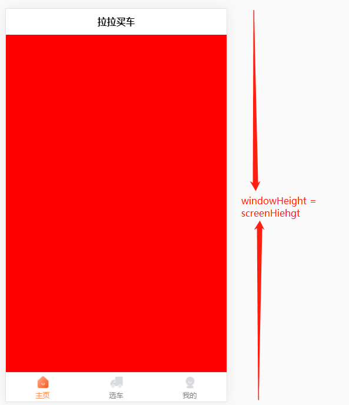

# 使用小记

> 以下笔记目前只是针对小程序和 H5 平台

## uni.getSystemInfo()

`uni.getSystemInfo` 用于获取系统信息，日常开发主要会使用这个方法获取设置的可视高度、可编辑高度、运行平台等

以下是分别在小程序端和 H5 端 调用 `uni.getSystemInfo()` 方法返回的信息



```js
// H5 - 有标题栏
{
  "windowTop": 0,
  "windowBottom": 0,
  "windowWidth": 375,
  "windowHeight": 667,
  "pixelRatio": 2,
  "screenWidth": 375,
  "screenHeight": 667,
  "language": "zh-CN",
  "statusBarHeight": 0,
  "system": "iOS 13.2.3",
  "platform": "ios",
  "model": "iPhone",
  "safeArea": {
    "left": 0,
    "right": 375,
    "top": 0,
    "bottom": 667,
    "width": 375,
    "height": 667
  },
  "safeAreaInsets": {
    "top": 0,
    "right": 0,
    "bottom": 0,
    "left": 0
  },
  "errMsg": "getSystemInfo:ok"
}
// H5 - 无标题栏
{
  "windowTop": 0,
  "windowBottom": 0,
  "windowWidth": 375,
  "windowHeight": 667,
  "pixelRatio": 2,
  "screenWidth": 375,
  "screenHeight": 667,
  "language": "zh-CN",
  "statusBarHeight": 0,
  "system": "iOS 13.2.3",
  "platform": "ios",
  "model": "iPhone",
  "safeArea": {
    "left": 0,
    "right": 375,
    "top": 0,
    "bottom": 667,
    "width": 375,
    "height": 667
  },
  "safeAreaInsets": {
    "top": 0,
    "right": 0,
    "bottom": 0,
    "left": 0
  },
  "errMsg": "getSystemInfo:ok"
}
```


```js
// 小程序 - 有标题栏
{
  "errMsg": "getSystemInfo:ok",
  "model": "iPhone 5",
  "pixelRatio": 2,
  "windowWidth": 320,
  "windowHeight": 456,
  "system": "iOS 10.0.1",
  "language": "zh_CN",
  "version": "7.0.4",
  "screenWidth": 320,
  "screenHeight": 568,
  "SDKVersion": "2.12.2",
  "brand": "devtools",
  "fontSizeSetting": 16,
  "benchmarkLevel": 1,
  "batteryLevel": 100,
  "statusBarHeight": 20,
  "safeArea": {
    "right": 320,
    "bottom": 568,
    "left": 0,
    "top": 20,
    "width": 320,
    "height": 548
  },
  "deviceOrientation": "portrait",
  "platform": "devtools",
  "devicePixelRatio": 2,
  "safeAreaInsets": {
    "top": 20,
    "left": 0,
    "right": 0,
    "bottom": -112
  }
}
// 小程序-无标题栏
{
  "errMsg": "getSystemInfo:ok",
  "model": "iPhone 5",
  "pixelRatio": 2,
  "windowWidth": 320,
  "windowHeight": 520,
  "system": "iOS 10.0.1",
  "language": "zh_CN",
  "version": "7.0.4",
  "screenWidth": 320,
  "screenHeight": 568,
  "SDKVersion": "2.12.2",
  "brand": "devtools",
  "fontSizeSetting": 16,
  "benchmarkLevel": 1,
  "batteryLevel": 100,
  "statusBarHeight": 20,
  "safeArea": {
    "right": 320,
    "bottom": 568,
    "left": 0,
    "top": 20,
    "width": 320,
    "height": 548
  },
  "deviceOrientation": "portrait",
  "platform": "devtools",
  "devicePixelRatio": 2,
  "safeAreaInsets": {
    "top": 20,
    "left": 0,
    "right": 0,
    "bottom": -48
  }
}
```

从上面的几个例子可以得到以下信息：

**H5 端**

在 H5 端，无论有没配置标题栏 `windowHeight` 与 `screenHeight` 总是一致的，`windowHeight` 包含了 uni-app 自定义的标题栏和底部导航栏的高度

所以当我们要获取可编辑的全屏区域时，需要自己计算可布局的高度

```js
// #ifdef H5
let getPageHead = document.querySelector('.uni-page-head')
if(getPageHead) {
    this.globalData.appStyle.pageHeight = getPageHead.getBoundingClientRect().height
}
let getPageTabBar = document.querySelector('.uni-tabbar')
if(getPageTabBar) {
    this.globalData.appStyle.tabBarHeight = getPageTabBar.getBoundingClientRect().height
}
const { tabBarHeight, pageHeight } = this.globalData.appStyle
this.globalData.appStyle.accessHeight = res.windowHeight - tabBarHeight - pageHeight
// #endif
```

**小程序 端**

`windowHeight` 就是我们的可编辑的全屏区域