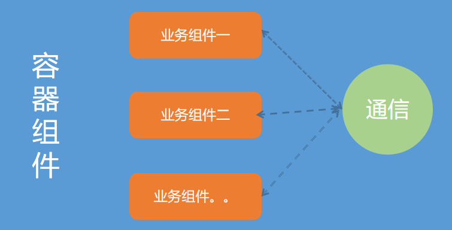
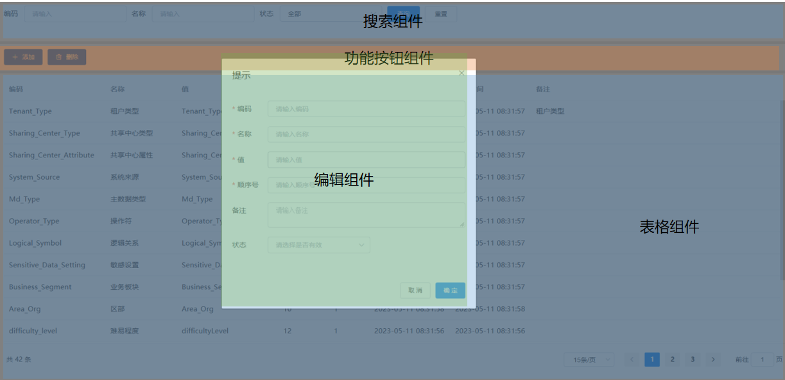
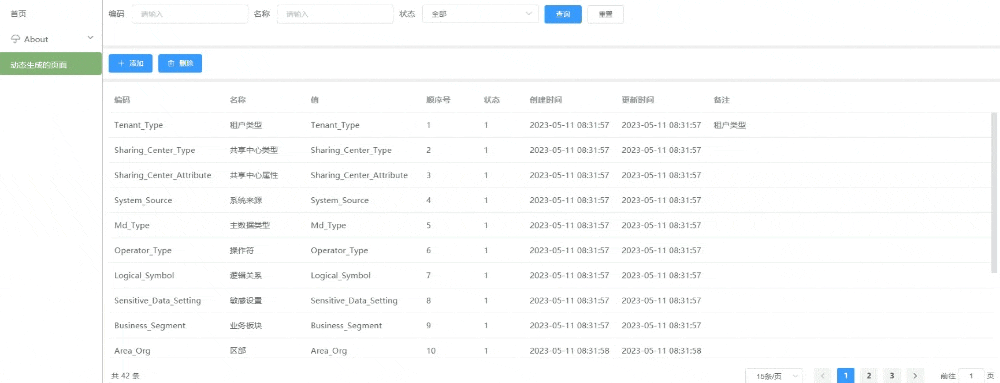

# Render

正常情况下，我们在开发VUE项目时，都是使用 Template 的形式来编写我们的UI结构，因为它是类似 HTML 的语法， 因此我们在使用上非常亲切与方便。  
但同时Vue 还提供一个 Render方法，通过这个方法也可以让我们实现 UI 结构的开发。那么们的区别是什么？

1. 模板是不能直接被浏览器识别的，所以需要 Vue 的编译器进行编译换为渲染函数，然后浏览器通过渲染函数来进行 UI 渲染
   
2. 因此在运行时动态生成模板比较困难。而渲染函数可以通过JavaScript代码来动态生成UI结构，并对数据进行逻辑处理。

3. 如果是简单的UI结构或者需要快速开发，使用模板会更加方便。而如果需要更大的灵活性、更好的性能或者处理复杂场景，则渲染函数更具优势

本篇文章将介绍 Render 如何在工作中如何使用以及能用这个方法做什么

## VUE-Render

Vue 对 [`render`](https://v2.cn.vuejs.org/v2/api/#render) 方法的说明：


上面提到了 `redner` 方法是字符串模板的代替方法，所以我们先理解一下这句话是什么意思

为了理解这句话，我们又得从 Template 模板的解析说起

## 从 Template 模板到 DOM

通过一个例子来了解一下 Template 模板到真实 DOM 都做了哪些事情：

```vue
<div class="page">
	{{name}}的列表:<span v-for="(item, index) in list" :key="index">{{item}}</span>
</div>
```

### 模板解析

模板解析就是通过正则手段对模板字符串进行解析，生成 AST 抽象语法树，我们例子解析完成得到以下 AST：

```javascript
{
	type:1,
	tag:"div",
	attrsList:[],
	attrsMap:{
		class:"page"
	},
	rawAttrsMap:{},
	plain:false,
	staticClass:""page"",
	children:[
		{
			type:2,
			expression:"_s(name)+"的列表:"",
			tokens:[
				{
					@binding:"name"
				},
				"的列表："
			],
			text: "{{name}}的列表:"
		},
		{
			alias: "item",
			attrsList: [],
			attrsMap: {
				":key": "index",
				"v-for": "(item, index) in list"
			},
			children: [
				{
					expression: "_s(item)"
					text: "{{item}}",
					tokens: [
						{
							@binding: "item"
						}
					]
				}
			],
			for: "list"
			forProcessed: true
			iterator1: "index"
			key: "index",
			parent: (父级的引用),
			plain: false
			pre: undefined,
			rawAttrsMap: {},
			tag: "span"
			type: 1
		}
	
	],
}
```

### 将AST转换成函数字符串

根据上文的 AST 转换成一个函数字符串

```js
with(this){
    return _c(
            'div',
            { staticClass: "page" },
            [
                 _v(_s(name)+"的列表:"),
                 _l(
                    (list),
                    function(item,index){return _c('span',{key:index},[_v(_s(item))])}
                  )
            ]
        )
}
```

通过 `new Function` 方法将函数字符串转换成可执行函数，也就是 `render` 方法

上文的 ` _c`， `_v` 都是 Vue 内置的一些方法，作用都是生成对应的 `VNode` 节点    
比如例子中一开始要渲染的一个 DOM 节点 `<div class="page"></div>`， 那么这个节点将转换成 `_c('div',{staticClass:"page"}，[])` 字符串,通过 `_c` 方法生成一个 `VNode` 节点

再比如 `v-for` 则使用 `_l` 方法进行渲染, `_l` 表示使用列表渲染，它将循环生成 `VNode`，从上文的转换结果可以看 `_l` 的第一个参数就是渲染源数据 `list`，每二个参数则是一个具体渲染子节点 `VNode` 的方法

除了 `_c` 、 `_l`，`Vue` 中还内置其它的生成 `VNode` 方法，如 `_v` 对应 `createTextVNode` 创建文本 `VNode`、`_s` 是生成字符串方法等等等等等等等

**总而言之：到一步就是为了生成 Render 方法**

### 通过`render`方法，创建VNode

上文中 `render` 方法开始是 `with(this)` 语句  
`with` 的作用是设置当前上下文的作用域链，上面函数中的变量来源就是通过 `with` 来设置的 ，`with(this)` 中的 `this` 是指向 Vue 实例的（也就是 `date`、 `methods` 之类的）

使用 Demo:

```javascript
const data = { name: 'TONY', list: ['A', 'B'] } //
render.call(data)
```

上面的 `redner` 方法生成的 `VNode`

```js
VNode{
	context: 'div',
	tag: {
		staticClass: "page"
	},
	text: undefined,
	children: [
		VNode{
			text: "lanjz的列表:",
			children: undefined
		},
		VNode{
			key: "__vlist_1_0__",
			tag: {
				key: 0
			},
			context: "span",
			text: undefined,
			children: [
				VNode{
					text: "A",
					context: undefined
				}
			]
		},
		VNode{
			key: "__vlist_1_1__",
			tag: {
				key: 1
			},
			text: undefined,
			context: "span",
			children: [
				VNode{
					text: "B",
					context: undefined
				}
			]
		}
	]
	
}
```

上面的 VNode 对象做了简化，可以看到其实结构跟之前 AST 对象有点相似，都是使用JS对象表示 `DOM` 元素节点，他们具体的区别是什么呢？

- AST只是模板的对象表示，并没结合具体的 `data` 值进行渲染

- `VNode` 是结合了 `vue指令` 和 `data` 值最终渲染出的 `DOM` 的对象描述

### 渲染成真实DOM

这一步就是遍历 `VNode` 转生成真实DOM，并插入到浏览器视图中

### 小结

从 Template 模板到 DOM：`template => AST => Render => VNode => DOM`

对 VUE 模板的解析有了大概认识之后，接下再下 `createElement` 的使用说明

## createElement 用法

Render 方法主要是提供了一个 `createElement` 方法参数用于渲染一个 VNode，用法如下：

```js
// @returns {VNode}
createElement(
  // {String | Object | Function}
  // 一个 HTML 标签名、组件选项对象，或者
  // resolve 了上述任何一种的一个 async 函数。必填项。
  'div',

  // {Object}
  // 一个与模板中 attribute 对应的数据对象。可选。
  {
    // (详情见下一节)
  },

  // {String | Array}
  // 子级虚拟节点 (VNodes)，由 `createElement()` 构建而成，
  // 也可以使用字符串来生成“文本虚拟节点”。可选。
  [
    '先写一些文字',
    createElement('h1', '一则头条'),
    createElement(MyComponent, {
      props: {
        someProp: 'foobar'
      }
    })
  ]
)
```

可以发现 `createElement()` 用法跟之前解析的模板例子非常的相似，再结合 VUE 对 `Redner` 方法的说明，就可以理解为什么说 Render 是可以代替字符串模板模板了

**因为我们平时编写的Vue模板在最终在打包阶段也会转换成 Render 方法**，这个Render方法在项目运行时生成最终的DOM

**那么我们也可以使用 Render 方法直接实现组件供运行时使用**

先使用 Render 方法实现一个后台系统都用到的表单渲染

## 配置化组件

所以配置化组件一般由两个部分组成：

1. 一组 schema (元数据)，用于说明元素的渲染配置与规则

2. 一个组件，用于解析元数据 ， 并根据元数据的配置与规则进行渲染，生成最终的表单效果

假设现在有一组如下粟子的元数据

```js
[
  {
    prop: 'name',
    label: '姓名',
    render: 'input',
  },
  {
    prop: 'region',
    label: '活动区域',
    render: 'select',
    child: [
      {label: '区域一', value: 'shanghai'},
      {label: '区域二', value: 'beijing'},
    ]
  },
  {
    prop: 'region',
    label: '是否默认',
    render: 'radio',
    child: [
      {label: '是', value: 'shanghai'},
      {label: '否', value: 'beijing'},
    ]
  },
  {
    prop: 'region',
    render: 'datePicker',
    label: '活动区域',
  },
]
```

常规的封装方式：

```js
<el-form ref="form">
  <el-form-item v-for="item in formConfig" :label="item.label" :key="item.prop">
    
    <el-input v-if="item.render==='input'" v-model="formModel[item.prop]"></el-input>
    
    <el-select v-else-if="item.render==='select'" v-model="formModel[item.prop]">
      <el-option v-for="item.child" :key="item.value" :value="item.value">
        {{item.label}}
      </el-option>
    </el-select>
    
    <el-date-picker v-else-if="item.render==='datePicker'" type="date" v-model="formModel[item.prop]"></el-date-picker>
    <!-- 还有N多个 v-else-if -->
  </el-form-item>
</el-form>
```

**此方法的缺点：**

- 以 elementUI 为例，有 15 个表单组件，如果得全支持的话就得写 15 个 `v-else-if`，如果需要支持更多自定义的组件话，那我们写的  `v-else-if` 会更多  
  也就是意味着，这个配置化表单所支持的组件是需要手动维护的

- 单项组件独有的特性都得在代码中显性实现，比如 el-select 的 el-option，插槽等

这种写法的组件最大的问题就是不好维护，扩展性差、代码量随组件的数量成正比的关系

### 使用 Render 方法来实现

**封装createElement**

为了更方便使用 `createElement`，结合自己的使用场景先简单封装一下

```vue
<script>
function createElement(h, ctx, noVModel){
  const { prop, render, child, onEvent = {},  ...attrs } = ctx.data.attrs
  if(typeof render === 'string'){
    return h(
        render,
        {
          props: !noVModel ? {'value': ctx.props.form[prop]}: {},// 根据 noVModel 是否添加 V-MODEL 语法糖
          on: !noVModel ?{input: function (event) {ctx.props.form[prop] = render === 'el-input' ? (event||'').trim(): event}, ...onEvent}: {...onEvent},
          attrs
        },
        child&&child.map(item => (createElement(h, {data: {attrs: item}, props: ctx.props}, true)))
    )
  }
  return (render(h, ctx.props.form, ctx.data.attrs))
}
export default {
  name: 'CFormRender',
  functional: true,
  props: {
    form: {
      type: Object,
      default: () => {}
    },
  },
  render: createElement
};
</script>
```

- 这个组件将自动帮我们使用 `createElement` 方法渲染组件，这个渲染的组件是任意的，也就意味外层提供什么标签就渲染什么标签/组件

- 元数据中属性传什么，我们就是原样进行传递即可，不关心你渲染什么组件，也不关心你需要支持什么属性（这是最终渲染组件要关心的事）

- 至于组件的子元素如 select、checkout的子项元素，直接根据 `child` 属性进行递归调用当前封装的  `createElement` 方法 

上面只是简单的封装，`createElement` 方法中还有很多属性没有处理，但已经跢满足决大部分的使用场景

接下来实现配置表单组件容器

```vue
<template>
  <el-form
      ref="elForm"
      v-bind="$attrs"
      v-on="$listeners"
      :model="model"
      :class="['c-form', formClass]"
  >
    <slot>
      <el-form-item
          v-for="(column, index) in column"
          :key="index"
          v-bind="column.itemFormAttr"
          :prop="column.prop"
          :label="column.label"
      >
        <render
            :form="form"
            v-bind="column"
        />
      </el-form-item>
    </slot>
  </el-form>
</template>
```
这样就完成一个配置化表单组件  
配置的JSON也稍微改造一下：

```js
[
  {
    prop: 'name',
    label: '姓名',
    render: 'el-input',
    // 其它属性一并支持、提供什么我们就是传递什么
  },
  {
    prop: 'region',
    label: '活动区域',
    render: 'el-select',
    child: [
      {label: '区域一', value: 'shanghai', render: 'el-option'},
      {label: '区域二', value: 'beijing', render: 'el-option'},
    ]
  },
  {
    prop: 'region',
    label: '是否默认',
    render: '个性化的组件',
  },
  {
    prop: 'region',
    render: 'el-datePicker',
    label: '活动区域',
  },
]
```

整个配置化表单要渲染的组件将全部由组件外进行控制，也不需要进行个别的个性化特殊处理

这种方式比常规的 `if-else` 方式比不仅极大精简了代码，组件渲染也变得更多灵活

## 动态生成页面

基于上面的配置化表单，我们可以将这种实现思路进一步进行扩展，就是动态生成页面

因为我们的页面其实就是一个组件，只要是组件我们就可以直接使用 render 方法来创建，那么对于一些简单的页面我们可以省去页面的创建，直接动态渲染

假设我们要实现的渲染规则如下：

1. 根据当前的路径判断是内置的页面还是需要动态渲染的页面

2. 如果是动态渲染的页面，根据路径动态注册一个路由，这个路由的组件指向一个封装好的配置化容器组件（类似上面的配置表单组件容器）

3. 进入到这个配置化容器后，根据路径或者其它规则请求接口获取这个页面的元数据
   
4. 根据元数据进行整个页面的渲染

如果设计这个配置化容器？

1. 整体的思路跟之前配置表单的实现是一致的，都是通过 Vue 的 Render 进行实现

2. 根据这个思路，我们的元数据仍然是只提供两个信息，一个是要渲染的组件、一个是传递给这个组件的属性

3. 那么我们要组件将会是包含完整业务功能的组件，如果上面的配置的配置表单组件，这个组件本身是实现一个完整的表单功能的组件，比如它应该会有一个查询按钮，当我们点击这个按钮时会根据属性来判断是否对当前表单数据进行合理校验

  再比如我们还会提供一个配置表格组件集成了表格渲染与分页渲染，属性需要提供列表数据的接口api，并提供设置请求接口查询参数的方法

4. 通过某种规则，当我们点击配置表单的查询按钮时将能通知到配置表格的查询功能，表格的查询通过则需要实现数据请求后再到最终列表的渲染

5. **相比简单的配置化组件，配置化容器则需要考虑内部渲染组件之间的通信，因此我们还需要额外设计一套通信规则**



接下来对以上的每一步进行代码实现

### 组件通信

组件通信方式这里直接使用 中央事件总线（EventBus）的方式进行组件通过，通过 EventBus 来通知当前哪个任务（方法）需要被执行

```js
import {EventBus} from '@/utils/helpe';

export default {
    methods: {
        postMsg(eventName, ...params){
            this[eventName](...params)
        }
    },
    mounted() {
        EventBus.$off(this.$options.componentName+'-event')
        EventBus.$on(this.$options.componentName+'-event', this.postMsg)
        this.EventBusST = EventBus
    },
    destroyed() {
        EventBus.$off(this.$options.componentName+'-event')
    }
};
```

定义元数据里的事件配置规则

```js
const actionMeta = {
    render: 'DAction',
    actions: [
        {
            prop: 'add',
            label: '添加',
            icon: 'el-icon-plus',
            eventTarget: ['d-dialog-form-event', 'open']
        },
        {
            prop: 'dicName',
            label: '删除',
            icon: 'el-icon-delete'
        },
    ],
};
```

上面的 `eventTarget` 属性表示点击当前 `添加` 按钮，触发 `d-dialog-form` 组件 open 方法

### 判断访问路径是需要动态页面

这一步直接在路由拦截器里添加相应的逻辑

```js
const router = new VueRouter({
  routes: fillRouterPath(routes)
})
// 路由守卫
router.beforeEach(async (to, from, next) => {
  try {
    const isRegister = router.getRoutes().find(item => {
      let reg = new RegExp(item.regex)
      return reg.test(to.path)
    })
    if(!isRegister){
      router.addRoute('/', {
        path: to.path,
        name: to.path,
        component: Dynamic
      });
    }
    return isRegister ? next(): next(to.path)
  } catch (error) {
    console.log(error);
  }
});
export default router

```

上面的判断逻辑是如果当前路径在已注册的路由中没有匹配到就当做是动态生成的， Dynamic 就是容器组件

### 容器组件

```vue
<template>
  <div class="global-container-wrap global-flex-column">
    <render
        v-for="(item, index) in meta"
        :meta=item
        :key="index"
    />
  </div>
</template>

<script>
import render from './Render'
import meta from './meta'
export default {
  name: 'dynamic',
  components: { render },
  data(){
    return {
      meta
    }
  }
}
</script>

<style scoped>

</style>
```

Render 组件简单 Demo，这一步还是 createElement 方法的封装

```js
<script>
function createElement(h, ctx) {
  const { render, child, ...prop } = ctx.props.meta;
  if (typeof render === 'string') {
    return h(
        render,
        {
          props: prop,
        },
        child && child.map((item) => createElement(h, { data: { attrs: item }, props: ctx.props }, true))
    );
  }
  return render(h, ctx);
}
export default {
  name: 'render',
  functional: true,
  props: {
    meta: {
      type: Object,
      default: () => {},
    },
  },
  render: createElement,
};
</script>

```

### 业务组件

以常见的后台页面为例，我们们需要准备以下业务组件：

1. 搜索组件，可直接使用配置表单组件，包含表单渲染，字段校验，集成搜索与重置功能

2. 操作组件，集成所有操作按钮容器

3. 表格组件，集成分页功能，可接收搜索组件传递的数据进行接口请求，并渲染列表

4. 编辑组件，集成了配置表单的弹窗组件，可用于编辑表格数据、并更新到后台服务




### 元数据

定义这四个业务组件行为的元数据，例子如下：

```js
const searchMeta = {
    render: 'DSearch',
    searchFormConfig: [
        {
            prop: 'dicKey',
            label: '编码',
            render: 'el-input',
            placeholder: '请输入',
            clearable: true,
        },
        {
            prop: 'dicName',
            label: '名称',
            render: 'el-input',
            placeholder: '请输入',
            clearable: true,
        },
        {
            prop: 'status',
            label: '状态',
            render: 'el-select',
            placeholder: '请选择',
            clearable: true,
            child: [
                { label: '全部', value: '', render: 'el-option' },
                { label: '有效', value: 1, render: 'el-option' },
                { label: '无效', value: 0, render: 'el-option' },
            ],
        },
    ],
    eventTarget: ['d-table-event', 'onSearch']
};
const actionMeta = {
    render: 'DAction',
    actions: [
        {
            prop: 'add',
            label: '添加',
            icon: 'el-icon-plus',
            eventTarget: ['d-dialog-form-event', 'open']
        },
        {
            prop: 'dicName',
            label: '删除',
            icon: 'el-icon-delete'
        },
    ],
};
const tableMeta = {
    render: 'DTable',
    tableUrl: '/list',
    tableConfig: [
        {
            prop: 'dicKey',
            label: '编码',
            width: 200,
        },
        {
            prop: 'dicName',
            label: '名称',
            width: 140,
        },
        { prop: 'dicValue', label: '值', width: 200 },
        { prop: 'sort', label: '顺序号', width: 100 },
        {
            prop: 'status',
            label: '状态',
            width: 80,
        },
        { prop: 'createTime', label: '创建时间', width: 160 },
        {
            prop: 'updateTime',
            label: '更新时间',
            width: 160,
        },
        { prop: 'remark', label: '备注', minWidth: 200, opt: { 'show-overflow-tooltip': true } },
    ]
};
const editFormMeta = {
    render: 'DDialogForm',
    editFormConfig: [
        {
            prop: 'dicKey',
            label: '编码',
            render: 'el-input',
            placeholder: '请输入编码',
            clearable: true,
            itemFormAttr: {
                rules: [{ required: true, message: '请输入编码', trigger: 'blur' }],
            },
        },
        {
            prop: 'dicName',
            label: '名称',
            render: 'el-input',
            placeholder: '请输入名称',
            clearable: true,
            itemFormAttr: {
                rules: [{ required: true, message: '请输入名称', trigger: 'blur' }],
            },
        },
        {
            prop: 'dicValue',
            label: '值',
            render: 'el-input',
            placeholder: '请输入值',
            clearable: true,
            itemFormAttr: {
                rules: [{ required: true, message: '请输入值', trigger: 'blur' }],
            },
        },
        {
            prop: 'sort',
            label: '顺序号',
            render: 'el-input',
            placeholder: '请输入顺序号',
            clearable: true,
            itemFormAttr: {
                rules: [{ required: true, message: '请输入顺序号', trigger: 'blur' }],
            },
        },
        {
            prop: 'remark',
            label: '备注',
            render: 'el-input',
            type: 'textarea',
            placeholder: '请输入备注',
            clearable: true,
        },
        {
            prop: 'status',
            label: '状态',
            render: 'el-select',
            placeholder: '请选择是否有效',
            clearable: true,
            child: [
                { label: '有效', value: 1, render: 'el-option' },
                { label: '无效', value: 0, render: 'el-option' },
            ],
        },
    ],
}
export default [
    searchMeta,
    actionMeta,
    tableMeta,
    editFormMeta
]
```

### 运行效果

