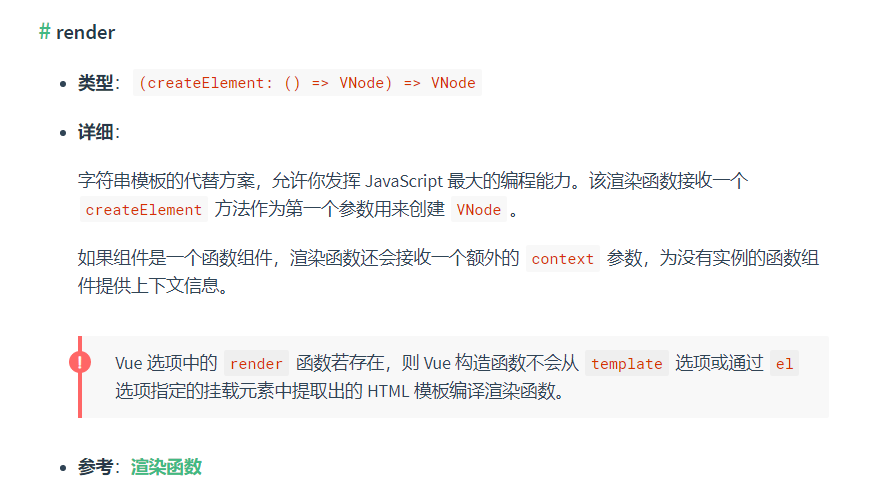

# PAAS应用

## render

Vue 对 [`render`](https://v2.cn.vuejs.org/v2/api/#render) 方法的说明：



上面提到了 `redner` 方法是字符串模板模板的代替方法，所以我们先理解一下这句话是什么意思

## Template 模板到 DOM

通过一个例子来了解一下 Template 模板到真实 DOM 都做了哪些事实：

```vue
<div class="page">
	{{name}}的列表:<span v-for="(item, index) in list" :key="index">{{item}}</span>
</div>
```

### 模板解析

模板解析就是通过正则手段对模板字符串进行解析，生成 AST 抽象语法树，我们例子解析完成得到以下 AST：

```javascript
{
	type:1,
	tag:"div",
	attrsList:[],
	attrsMap:{
		class:"page"
	},
	rawAttrsMap:{},
	plain:false,
	staticClass:""page"",
	children:[
		{
			type:2,
			expression:"_s(name)+"的列表:"",
			tokens:[
				{
					@binding:"name"
				},
				"的列表："
			],
			text: "{{name}}的列表:"
		},
		{
			alias: "item",
			attrsList: [],
			attrsMap: {
				":key": "index",
				"v-for": "(item, index) in list"
			},
			children: [
				{
					expression: "_s(item)"
					text: "{{item}}",
					tokens: [
						{
							@binding: "item"
						}
					]
				}
			],
			for: "list"
			forProcessed: true
			iterator1: "index"
			key: "index",
			parent: (父级的引用),
			plain: false
			pre: undefined,
			rawAttrsMap: {},
			tag: "span"
			type: 1
		}
	
	],
}
```

### 将AST转换成函数字符串

根据上文的 AST 转换成一个函数字符串

```js
with(this){
    return _c(
            'div',
            { staticClass: "page" },
            [
                 _v(_s(name)+"的列表:"),
                 _l(
                    (list),
                    function(item,index){return _c('span',{key:index},[_v(_s(item))])}
                  )
            ]
        )
}
```

通过 `new Function` 方法将函数字符串转换成可执行函数，也就是 `render` 方法

上文的 ` _c`， `_v` 都是 Vue 内置的一些方法，作用都是生成对应的 `VNode` 节点    
比如例子中一开始要渲染的一个 DOM 节点 `<div class="page"></div>`， 那么这个节点将转换成 `_c('div',{staticClass:"page"}，[])` 字符串,通过 `_c` 方法生成一个 `VNode` 节点

再比如 `v-for` 则使用 `_l` 方法进行渲染, `_l` 表示使用列表渲染，它将循环生成 `VNode`，从上文的转换结果可以看 `_l` 的第一个参数就是渲染源数据 `list`，每二个参数则是一个具体渲染子节点 `VNode` 的方法

除了 `_c` 、 `_l`，`Vue` 中还内置其它的生成 `VNode` 方法，如 `_v` 对应 `createTextVNode` 创建文本 `VNode`、`_s` 是生成字符串方法等等等等等等等

**总而言之：到一步就是为了生成 Render 方法**

### 通过`render`方法，创建VNode

上文中 `render` 方法开始是 `with(this)` 语句  
`with` 的作用是设置当前上下文的作用域链，上面函数中的变量来源就是通过 `with` 来设置的 ，`with(this)` 中的 `this` 是指向 Vue 实例的（也就是 `date`、 `methods` 之类的）

使用 Demo:

```javascript
const data = { name: 'TONY', list: ['A', 'B'] } //
render.call(data)
```

上面的 `redner` 方法生成的 `VNode`

```js
VNode{
	context: 'div',
	tag: {
		staticClass: "page"
	},
	text: undefined,
	children: [
		VNode{
			text: "lanjz的列表:",
			children: undefined
		},
		VNode{
			key: "__vlist_1_0__",
			tag: {
				key: 0
			},
			context: "span",
			text: undefined,
			children: [
				VNode{
					text: "A",
					context: undefined
				}
			]
		},
		VNode{
			key: "__vlist_1_1__",
			tag: {
				key: 1
			},
			text: undefined,
			context: "span",
			children: [
				VNode{
					text: "B",
					context: undefined
				}
			]
		}
	]
	
}
```

上面的 VNode 对象做了简化，可以看到其实结构跟之前 AST 对象有点相似，都是使用JS对象表示 `DOM` 元素节点，他们具体的区别是什么呢？

- AST只是模板的对象表示，并没结合具体的 `data` 值进行渲染

- `VNode` 是结合了 `vue指令` 和 `data` 值最终渲染出的 `DOM` 的对象描述

### 渲染成真实DOM

这一步就是遍历 `VNode` 转生成真实DOM，并插入到浏览器视图中

### 小结

`template => AST => Render => VNode => DOM`


## createElement 使用

```js
// @returns {VNode}
createElement(
  // {String | Object | Function}
  // 一个 HTML 标签名、组件选项对象，或者
  // resolve 了上述任何一种的一个 async 函数。必填项。
  'div',

  // {Object}
  // 一个与模板中 attribute 对应的数据对象。可选。
  {
    // (详情见下一节)
  },

  // {String | Array}
  // 子级虚拟节点 (VNodes)，由 `createElement()` 构建而成，
  // 也可以使用字符串来生成“文本虚拟节点”。可选。
  [
    '先写一些文字',
    createElement('h1', '一则头条'),
    createElement(MyComponent, {
      props: {
        someProp: 'foobar'
      }
    })
  ]
)
```

可以发现 `createElement()` 用法跟之前解析的模板例子非常的相似，再结合 VUE 对 `Redner` 方法的说明，就可以理解为什么说 Render 是可以代替字符串模板模板了

**因为我们平时编写的Vue模板最终也会转换成 Render 方法**

说白了，我们可以使用 Render 来编写组件

## 配置化组件

```js
[
  {
    prop: 'name',
    label: '姓名',
    render: 'input',
  },
  {
    prop: 'region',
    label: '活动区域',
    render: 'select',
    child: [
      {label: '区域一', value: 'shanghai'},
      {label: '区域二', value: 'beijing'},
    ]
  },
  {
    prop: 'region',
    label: '是否默认',
    render: 'radio',
    child: [
      {label: '是', value: 'shanghai'},
      {label: '否', value: 'beijing'},
    ]
  },
  {
    prop: 'region',
    render: 'datePicker',
    label: '活动区域',
  },
]
```

正常的封装方式：

```js
<el-form ref="form">
  <el-form-item v-for="item in formConfig" :label="item.label" :key="item.prop">
    
    <el-input v-if="item.render==='input'" v-model="formModel[item.prop]"></el-input>
    
    <el-select v-else-if="item.render==='select'" v-model="formModel[item.prop]">
      <el-option v-for="item.child" :key="item.value" :value="item.value">
        {{item.label}}
      </el-option>
    </el-select>
    
    <el-date-picker v-else-if="item.render==='datePicker'" type="date" v-model="formModel[item.prop]"></el-date-picker>
    <!-- 还有N多个 v-else-if -->
  </el-form-item>
</el-form>
```

**问题：**

- 以 elementUI 为例，有 15 个表单组件，如果得全支持的话就得写 15 个 `v-else-if`，如果需要支持更多自定义的组件话，那我们写的  `v-else-if` 会更多  
  也就是意味着，这个配置化表单所支持的组件是需要手动维护的

- 单项组件独有的特性都得在代码中显性实现，比如 el-select 的 el-option，插槽等

这种写法的组件最大的问题就是不好维护，除着要支持的组件代码量也会越来越多

组件封装原则 ？

### 使用 Render 方法来实现

**封装createElement**

为了更方便使用 `createElement`，先封装一下

```vue
<script>
function createElement(h, ctx, noVModel){
  const { prop, render, child, onEvent = {},  ...attrs } = ctx.data.attrs
  if(typeof render === 'string'){
    return h(
        render,
        {
          props: !noVModel ? {'value': ctx.props.form[prop]}: {},// 根据 noVModel 是否添加 V-MODEL 语法糖
          on: !noVModel ?{input: function (event) {ctx.props.form[prop] = render === 'el-input' ? (event||'').trim(): event}, ...onEvent}: {...onEvent},
          attrs
        },
        child&&child.map(item => (createElement(h, {data: {attrs: item}, props: ctx.props}, true)))
    )
  }
  return (render(h, ctx.props.form, ctx.data.attrs))
}
export default {
  name: 'CFormRender',
  functional: true,
  props: {
    form: {
      type: Object,
      default: () => {}
    },
  },
  render: createElement
};
</script>
```

这个组件将自动帮我们自动使用 `createElement` 方法渲染组件

上面只是简单的封装，`createElement` 方法中还有很多属性没有处理，但已经跢满足决大部分的使用场景

```vue
<template>
  <el-form
      ref="elForm"
      v-bind="$attrs"
      v-on="$listeners"
      :model="model"
      :class="['c-form', formClass]"
  >
    <slot>
      <el-form-item
          v-for="(column, index) in column"
          :key="index"
          v-bind="column.itemFormAttr"
          :prop="column.prop"
          :label="column.label"
      >
        <render
            :form="form"
            v-bind="column"
        />
      </el-form-item>
    </slot>
  </el-form>
</template>
```
这样就完成一个配置化表单组件  
配置的JSON也稍微改造一下：

```js
[
  {
    prop: 'name',
    label: '姓名',
    render: 'el-input',
  },
  {
    prop: 'region',
    label: '活动区域',
    render: 'el-select',
    child: [
      {label: '区域一', value: 'shanghai', render: 'el-option'},
      {label: '区域二', value: 'beijing', render: 'el-option'},
    ]
  },
  {
    prop: 'region',
    label: '是否默认',
    render: '个性化的组件',
  },
  {
    prop: 'region',
    render: 'el-datePicker',
    label: '活动区域',
  },
]
```

整个配置化表单要渲染的组件将全部由组件外进行控制，也不需要进行个别的个性化特殊处理

不仅极大精简了代码，组件渲染也变得更多灵活

## 动态生成页面

基于上面的配置化表单，我们可以将这种实现思路进一步进行扩展，就是动态生成页面

因为我们的页面其实就是一个组件，只要是组件我们就可以直接使用 render 方法来创建，那么对于一些简单的页面我们可以省去页面的创建，直接动态渲染
