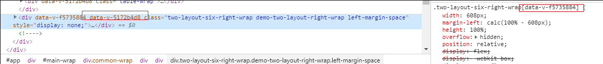

# 吱不吱

### 在使用计算属性的时，函数名和 data 数据源中的数据可以同名吗？

可以同名，但 `data` 会覆盖 `methods`。因为`Props`、`methods`、`data`、`computed`、`watch` 都是在 `initState` 函数中被初始化的。初始化顺序就是我上面给出的顺序，本质上这些都是要挂载到 `this` 上面的，如果重名的话，后面出现的属性自然而然会覆盖之前挂载的属性了。

### 跟keep-alive有关的生命周期是哪些？描述下这些生命周期

- `activated`: 动态组件激活时执行，包括首次显示在`mounted`后执行

- `deactivatd`: 动态组件离开时执行

### vue中怎么重置data

vue组件有两个属性：

- `this.$data`: 当前状态下的 `data`

- `this.$options.data()`: 获取初化状态下的 `data`

所以重置 `data` 的方式为：`Object.assign(this.$data, this.$options.data())`

### style加scoped属性的用途和原理

用途：`防止污染同名的CSS样式`

原理：在标签加上 `v-data-something` 属性，再在选择器时加上对应 `[v-data-something]` ，即 CSS 带属性选择器，以此完成类似作用域的选择方式



### vue的错误捕获

- `errorCaptured`: `errorCaptured` 是组件内部钩子，可捕捉本组件与子孙组件抛出的错误，接收`error`、`vm`、`info` 三个参数，`return false` 后可以阻止错误继续向上抛出

- `errorHandler` 为全局钩子，使用 `Vue.config.errorHandler` 配置，接收参数与`errorCaptured `一致

```js
Vue.config.errorHandler = function (err, vm, info) {
  // handle error
  // `info` 是 Vue 特定的错误信息，比如错误所在的生命周期钩子
  // 只在 2.2.0+ 可用
}
```

### 在vue事件中传入 `$event`，使用 `e.target` 和 `e.currentTarget`有什么区别

- `e.currentTarget`：绑定事件的对象

- `e.target`: 真正触发事件的对象

- `$event`: `e`

### vue变量名如果以_、$开头的属性会发生什么问题？怎么访问到它们的值

以 `_` 或 `$` 开头的属性不会被 Vue 实例代理，因为它们可能和 Vue 内置的属性、API 方法冲突。你可以使用例如 `vm.$data._property` 的方式访问这些属性

### vue使用v-for遍历对象时，是按什么顺序遍历的

1. 会先判断是否有 `iterator` 接口，如果有循环执行 `next()` 方法

2. 没有 `iterator` 的情况下，会调用 `Object.keys()` 方法，在不同浏览器中，JS引擎不能保证输出顺序一致

保证对象的输出顺序可以把对象放在数组中，作为数组的元素

### .lazy修辞符

在默认情况下，`v-model` 在每次 `input` 事件触发后将输入框的值与数据进行同步 (除了上述输入法组合文字时)。你可以添加 `lazy` 修饰符，从而转为在 `change` 事件之后进行同步：

```html
<!-- 在“change”时而非“input”时更新 -->
<input v-model.lazy="msg">
```

[248+个知识点](https://zhuanlan.zhihu.com/p/71229672)