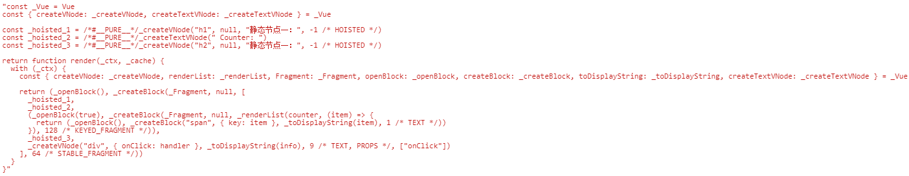
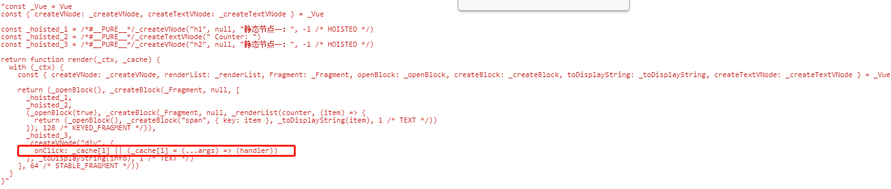

# Diff

之前了解了下 Vue3 升级目的，发现有介绍到 Vue3 在 Diff 方面做了优化，所以整理一下 Vue3 Diff 以及在 Diff 方面做了哪些改进

## Diff过程

Diff 主要是处理新旧子节点的过程，直接找到对应位置

```js
    const patchChildren = (n1, n2, container, anchor, parentComponent, parentSuspense, isSVG, optimized = false) => {
      const c1 = n1 && n1.children;
      const prevShapeFlag = n1 ? n1.shapeFlag : 0;
      const c2 = n2.children;
      const { patchFlag, shapeFlag } = n2;
      // fast path
      if (patchFlag > 0) {
        if (patchFlag & 128 /* KEYED_FRAGMENT */) {
          patchKeyedChildren(c1, c2, container, anchor, parentComponent, parentSuspense, isSVG, optimized);
          return;
        }
        else if (patchFlag & 256 /* UNKEYED_FRAGMENT */) {
          // unkeyed
          patchUnkeyedChildren(c1, c2, container, anchor, parentComponent, parentSuspense, isSVG, optimized);
          return;
        }
      }
      // children has 3 possibilities: text, array or no children.
    };
```

`patchChildren` 根据是否存在 `key` 执行 `patchKeyedChildren` 或 `patchUnkeyedChildren`

### patchUnkeyedChildren

```js
    const patchUnkeyedChildren = (c1, c2, container, anchor, parentComponent, parentSuspense, isSVG, optimized) => {
      c1 = c1 || EMPTY_ARR;
      c2 = c2 || EMPTY_ARR;
      const oldLength = c1.length;
      const newLength = c2.length;
      const commonLength = Math.min(oldLength, newLength);
      let i;
      for (i = 0; i < commonLength; i++) {
        const nextChild = (c2[i] = optimized
          ? cloneIfMounted(c2[i])
          : normalizeVNode(c2[i]));
        patch(c1[i], nextChild, container, null, parentComponent, parentSuspense, isSVG, optimized);
      }
      if (oldLength > newLength) {
        // remove old
        unmountChildren(c1, parentComponent, parentSuspense, true, false, commonLength);
      }
      else {
        // mount new
        mountChildren(c2, container, anchor, parentComponent, parentSuspense, isSVG, optimized, commonLength);
      }
    };
```

我们可以得到结论，对于不存在key情况

- 取新老 `children` 节点的 `length` 获取最小值，进行 `patch` 工作。

- 如果老节点数量大于新的节点数量 ，移除多出来的节点。

- 如果新的节点数量大于老节点的数量，重新 mountChildren新增的节点。

### patchKeyedChildren

```js
let i = 0; // 记录索引
const l2 = c2.length; // 新vnode的数量
let e1 = c1.length - 1; // 老vnode 最后一个节点的索引
let e2 = l2 - 1; // 新节点最后一个节点的索引
```

**一、开始第一次 `while` 循环：**

```js
  while (i <= e1 && i <= e2) {
    const n1 = c1[i];
    const n2 = (c2[i] = optimized
      ? cloneIfMounted(c2[i])
      : normalizeVNode(c2[i]));
    if (isSameVNodeType(n1, n2)) {
      patch(n1, n2, container, null, parentComponent, parentSuspense, isSVG, optimized);
    }
    else {
      break;
    }
    i++;
  }
```

这一步的事情就是从头开始比较新旧节点，如果相同的话执行 `patch`，如果发现有不相同的节点，立即跳出循环

**二、之后如果发现没有 `patch` 完则再次进入 `while` 循环：**

```js
  while (i <= e1 && i <= e2) {
    const n1 = c1[e1];
    const n2 = (c2[e2] = optimized
      ? cloneIfMounted(c2[e2])
      : normalizeVNode(c2[e2]));
    if (isSameVNodeType(n1, n2)) {
      patch(n1, n2, container, null, parentComponent, parentSuspense, isSVG, optimized);
    }
    else {
      break;
    }
    e1--;
    e2--;
  }
```

当前循环则是从尾部开始遍历依次向前 `diff`，如果发现不是相同的节点，那么立即跳出循环

经过前两次的循环，已对首尾连续相同的节点都 `patch` 了

**三-1、如果旧节点都遍历完了，新的节点还没有遍历完，走下面的分支：**

```js
  if (i > e1) {
    if (i <= e2) {
      const nextPos = e2 + 1;
      const anchor = nextPos < l2 ? c2[nextPos].el : parentAnchor;
      while (i <= e2) {
        patch(null, (c2[i] = optimized
          ? cloneIfMounted(c2[i])
          : normalizeVNode(c2[i])), container, anchor, parentComponent, parentSuspense, isSVG);
        i++;
      }
    }
  }
```

此时表示在新节点序列中剩余的节点都是新增的节点

**三-2如果是新的节点完了，旧的节点没有遍历完，则走以下分支**

```js
  else if (i > e2) {
    while (i <= e1) {
      unmount(c1[i], parentComponent, parentSuspense, true);
      i++;
    }
  }
```

此时表示在旧节点序列中剩余的节点都要除移的节点

**四、没有满足步骤三的条件则进入最后的 `else` 分支**

```js
// 开始进入 else 
const s1 = i; // prev starting index
const s2 = i; // next starting index
// 5.1 build key:index map for newChildren
const keyToNewIndexMap = new Map();
```

`i` 表示还未遍历的位置，`keyToNewIndexMap` 用于保存新节点

```js
for (i = s2; i <= e2; i++) {
  const nextChild = (c2[i] = optimized
    ? cloneIfMounted(c2[i])
    : normalizeVNode(c2[i]));
  if (nextChild.key != null) {
    if ( keyToNewIndexMap.has(nextChild.key)) {
      warn(`Duplicate keys found during update:`, JSON.stringify(nextChild.key), `Make sure keys are unique.`);
    }
    keyToNewIndexMap.set(nextChild.key, i);
  }
}
```

遍历剩余的新节点，如果节点存在 `key`,以 `key` 为键保存到 `keyToNewIndexMap` 中，同时如果存在相同的 `key`的节点的，则提示 `warn`

这一步主要的作用就是寻找有 `key` 的节点

**五、处理剩余没有 patch 的节点**

```js
// 处理剩余没有 patch 的节点
// 匹配节点 & 移除不存在的节点
let j;
let patched = 0;
const toBePatched = e2 - s2 + 1; // 未 patch 的节点数量
let moved = false; // 用于跟踪任何节点是否已移动
let maxNewIndexSoFar = 0;
// works as Map<newIndex, oldIndex>
// Note that oldIndex is offset by +1
// and oldIndex = 0 is a special value indicating the new node has
// no corresponding old node.
// used for determining longest stable subsequence
const newIndexToOldIndexMap = new Array(toBePatched);
for (i = 0; i < toBePatched; i++)
  newIndexToOldIndexMap[i] = 0; // 初始化所有值为 0
for (i = s1; i <= e1; i++) { // 遍历未 patch 的旧节点序列
  const prevChild = c1[i];
  if (patched >= toBePatched) {
    // 如果当前遍历的数量已经超过了 toBePatched 长度，说明这些都是要移除的
    unmount(prevChild, parentComponent, parentSuspense, true);
    continue;
  }
  let newIndex;
  if (prevChild.key != null) {
    // 如果存在 key 则，则从 `keyToNewIndexMap` 找出对应的新节点的索引
    newIndex = keyToNewIndexMap.get(prevChild.key);
  }
  else {
    // key-less node, try to locate a key-less node of the same type
    // 否则遍历未patch的旧节点，寻找与当前旧节点相同的节点，获取索引值   
    for (j = s2; j <= e2; j++) {
      if (newIndexToOldIndexMap[j - s2] === 0 &&
        isSameVNodeType(prevChild, c2[j])) {
        newIndex = j;
        break;
      }
    }
  }
  if (newIndex === undefined) {
    // 如果没有找到相同的节点，那么直接移除旧节点    
    unmount(prevChild, parentComponent, parentSuspense, true);
  }
  else {
    // 有的话则保存到 newIndexToOldIndexMap 中    
    newIndexToOldIndexMap[newIndex - s2] = i + 1;
    if (newIndex >= maxNewIndexSoFar) {
      // 表示匹配的节点顺序是不变的    
      // maxNewIndexSoFar 指向匹配到的最大索引位置
      maxNewIndexSoFar = newIndex;
    }
    else {
      // 表示存在移动的节点
      moved = true;
    }
   // path 匹配到的新旧节点
    patch(prevChild, c2[newIndex], container, null, parentComponent, parentSuspense, isSVG, optimized);
    patched++;
  }
}
```

关于上面几个变量的定义：

**toBePatched：** 新节点序列中还未匹配的节点数量

**newIndexToOldIndexMap：** 

- `newIndexToOldIndexMap` 是一个数组，`key` 表示当前新节点的索引，`value` 表示跟这个新节点相同的旧节点的索引，两个节点相同说明可以直接复用旧节点，判断节点是否相同主要还是通过判断是否有相同的 `key` 为主

- `newIndexToOldIndexMap` 初始化长度就是 `toBePatched`，且默认值是 `0`，`0` 表示没有对应的旧节点

- 因为用 `0` 表示没有对应旧节点，但是索引 `0` 在数组是个有效的位置，所以对于有匹配的旧节点的，规则在原来索引值 + 1

遍历剩余的旧节点序列，如果当前的旧节点存在 `key` ，则从 `keyToNewIndexMap` 中找到对应的新节点索引，否则通过 `isSameVNodeType` 方法两个两个节点是否相同

如果没有找到相同的节点则卸载这个旧节点，否则通过 `patch` 继续处理这两个节点

当前步骤五主要作用就是在新旧两个序列中寻找相同的节点，**如果存在相同的节点继续使用 `patch` 处，如果存在移除的节点则进行卸载处理**，但是还没做移动和新增地点的处理，所以还得继续下往走

**六、移动和新增节点**

```js
// 5.3 move and mount
// 只在节点移动时生成最长稳定子序列
// const EMPTY_ARR =  Object.freeze([])
const increasingNewIndexSequence = moved
  ? getSequence(newIndexToOldIndexMap)
  : EMPTY_ARR;
j = increasingNewIndexSequence.length - 1;
// looping backwards so that we can use last patched node as anchor
for (i = toBePatched - 1; i >= 0; i--) {
  const nextIndex = s2 + i;
  const nextChild = c2[nextIndex];
  const anchor = nextIndex + 1 < l2 ? c2[nextIndex + 1].el : parentAnchor;
  if (newIndexToOldIndexMap[i] === 0) {
    // mount new
    patch(null, nextChild, container, anchor, parentComponent, parentSuspense, isSVG);
  }
  else if (moved) {
    // move if:
    // 没有稳定的子序列 (e.g. a reverse)
    // 或者当前节点不在稳定序列中
    if (j < 0 || i !== increasingNewIndexSequence[j]) {
      move(nextChild, container, anchor, 2 /* REORDER */);
    }
    else {
      j--;
    }
  }
}
```

通过 `toBePatched` 遍历剩余新节点序列，如果 `newIndexToOldIndexMap` 没有匹配的旧地点，则表示这个节点是新增的，否则移动节点

上面代码对于存在要移动的节点，会根据 `newIndexToOldIndexMap` 生成最长递增子序列，如：

```
对于原始序列：0, 8, 4, 12, 2, 10, 6, 14, 1, 9, 5, 13, 3, 11, 7, 15
最长递增子序列为：0, 2, 6, 9, 11, 15
```

最长递增子序列的作用：需要一个序列作为基础的参照序列，其他未在稳定序列的节点，进行移动

表示有点看不懂最后移动的操作~

## Diff总结

经过上述我们大致知道了diff算法的流程

1. 从前往后遍历新旧子序列找到有相同的节点进行 `patch` 操作 ，如果发现不同的立即跳出循环

2. 从后往前遍历新旧子序列找到有相同的节点进行 `patch` 操作 ，如果发现不同的立即跳出循环

3. 如果旧的节点遍历完，新的节点没有遍历完 ，对于剩下的新节点全部以新增vnode处理

4. 如果新的节点遍历完，旧的节点没有遍历完，对于剩下的旧节点进行卸载处理

5. 如果 3、4 都不成立继续做进一步处理

  1. 遍历剩余的新节点，寻找 `key` 通过 `map 结构`保存起来

  2. 遍历剩余旧节点，查找是否存在相同的节点，有的话跟新节点做下映射，用于利用节点使用
  
  3. 如果不存在如果卸载旧节点
  
  4. 最后对剩余新节点做下遍历，通过前面映射关系，如果可复用的旧节点则进行节点的移动操作否则进行新增节点的操作
  
### isSameVNodeType

`isSameVNodeType` 方法是用于判断两个节点是否相同的

```js
  function isSameVNodeType(n1, n2) {
    if (
      n2.shapeFlag & 6 /* COMPONENT */ &&
      hmrDirtyComponents.has(n2.type)) {
      // HMR only: if the component has been hot-updated, force a reload.
      return false;
    }
    return n1.type === n2.type && n1.key === n2.key;
  }
```

只是根据当前 vnode 类型和 vnode 的 `key` 是否相等
  
## 相比2.0做的优化

3.0中的 `diff` 除了逻辑重构了之外，在速度在比做很多改进，捊下这些改进的地方

### 动态与静态节点

```js
const processFragment = (n1, n2, container, anchor, parentComponent, parentSuspense, isSVG, optimized) => {
    if (patchFlag > 0 &&
      patchFlag & 64 /* STABLE_FRAGMENT */ &&
      dynamicChildren &&
      n1.dynamicChildren) {
       patchBlockChildren(n1.dynamicChildren, dynamicChildren, container, parentComponent, parentSuspense, isSVG);
      if ( parentComponent && parentComponent.type.__hmrId) {
        traverseStaticChildren(n1, n2);
      }
      else if (
        n2.key != null ||
        (parentComponent && n2 === parentComponent.subTree)) {
        traverseStaticChildren(n1, n2, true /* shallow */);
      }
}
```

从 `processFragment` 方法可以看到，符合判断语句后先执行 `traverseStaticChildren(n1, n2)` 处理动态节点，然后再执行 `traverseStaticChildren(n1, n2, true /* shallow */)` 

```html
<div id="counter">
    <h1>静态节点一：</h1> 
    Counter:
    <span v-for="item in counter" :key="item">{{item}}</span> <!--动态节点-->
    <h2>静态节点一：</h2>
    {{info}} <!--动态节点-->
</div>
```

当前例子动态节点是 `<span v-for="item in counter" :key="item">{item}</span>` 和 `{info} `，对于动态节点仍然会调用 `patch` 做进一步的比较

动态节点处理完之后，调用 `traverseStaticChildren` 处理静态节点，静态节点的处理则是将旧节点直接赋值给新节点，不需要做 `patch` 比较了

### 静态提升 hoistStatic

在 Vue2.0 中无论元素是否参与更新，每次都会重新创建，然后再渲染，下面的例子就是 2.0 生成的 `render` 方法

```js
with(this){return _c('div',{attrs:{"id":"app"}},[_c('h1',[_v("静态节点一：")]),_v("\n      Counter:\n      "),_l((counter),function(item){return _c('span',{key:item},[_v(_s(item))])}),_v(" "),_c('h2',[_v("静态节点一：")]),_v("\n      "+_s(info)+"\n  ")],2)}
```

静态节点为：

```js
_c('h1',[_v("静态节点一：")])
_v("\n      Counter:\n      ")
_c('h2',[_v("静态节点一：")])
```

这三个方法每次渲染时都会执行

而在 3.0 中使用了静态提升后，对于不参与更新的元素，只会被创建一次，在渲染时直接复用即可：


### 事件侦听器缓存 cacheHandlers

默认情况下onClick会被视为动态绑定，所以每次都会去追踪它的变化，但是因为是同一个函数，所以没必要去追踪它的变化，想办法将它直接缓存起来复用就会提升性能

**默认**



**开启cacheHandlers后**



但是怎么开启的这个选项，怎么找不到地方也不懂

## Diff改进点总结

Vue3 在 diff 时做了优化措施有：

- 区别静态节点和动态节点，只对动态节点做了 diff 比较

- 静态提升，静态节点的结果做了缓存，不用重复渲染

- 事件缓存

> (vue3.0 diff算法详解(超详细))[https://zhuanlan.zhihu.com/p/150103393]