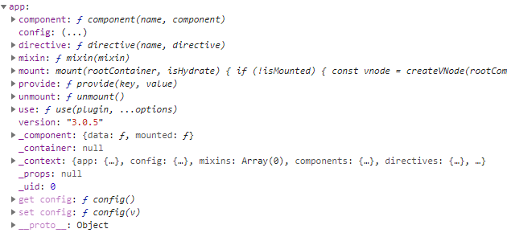

# createApp

Vue3.0和Vue2.0 创建应用的区别

```js
// 2.0
import Vue from 'vue'
// 全局混入
Vue.minxin()
// 注册全局指令
Vue.directive('focus', {})
// 注册全局组件
Vue.component('my-component-name', { /* ... */ })
// 注册插件
Vue.use()
//绑定的全局方法和变量
Vue.prototype.xxx = xxx
// 挂载
new Vue({
    router,
    render:(h)=> h(App)
}).$mount(root)

```

```js
// 3.0
import Vue from 'vue'
const app = Vue.createApp({})
// 混
app.mixin()
// 注册全局组件
app.component('SearchInput', SearchInputComponent)
// 注册全局指令
app.directive('focus', FocusDirective)
// 注册插件
app.use(LocalePlugin)

```

3.0 将通过 `Vue.createApp({})` 创建一个应用实例，并在这个实例上面注册一些全局API

当执行 `createApp` 方法时源码的执行如下：

```js
  const createApp = ((...args) => {
    const app = ensureRenderer().createApp(...args);
    {
      injectNativeTagCheck(app);
    }
    const { mount } = app;
    app.mount = (containerOrSelector) => {
      const container = normalizeContainer(containerOrSelector);
      if (!container)
        return;
      const component = app._component;
      if (!isFunction(component) && !component.render && !component.template) {
        component.template = container.innerHTML;
      }
      // clear content before mounting
      container.innerHTML = '';
      const proxy = mount(container);
      if (container instanceof Element) {
        container.removeAttribute('v-cloak');
        container.setAttribute('data-v-app', '');
      }
      return proxy;
    };
    return app;
  })

  function ensureRenderer() {
    // rendererOptions 是一些操作DOM的方法
    return renderer || (renderer = createRenderer(rendererOptions));
  }

  function createRenderer(options) {
    return baseCreateRenderer(options);
  }

function baseCreateRenderer(){
    // 定义了一些处理 VNode 的一些方法
    return {
      render,
      hydrate,
      createApp: createAppAPI(render, hydrate)
    }
}
```

从上面代码可以看到 `createApp` 实际上执行的是 `createAppAPI(render, hydrate)` 返回后的函数

```js
  function createAppAPI(render, hydrate) {
    return function createApp(rootComponent, rootProps = null) {
      // rootProps 就是 createApp 传进来的参数，必需是对象
      if (rootProps != null && !isObject(rootProps)) {
        warn(`root props passed to app.mount() must be an object.`);
        rootProps = null;
      }
      // 通过 createAppContext() 方法，创建上下文，包含 app、config、mixins、components、directives、provides 等属性
      const context = createAppContext();
      const installedPlugins = new Set(); // 存储插件
      let isMounted = false;
      // 给这个context 赋值
      // 一个 app就是一个 context
      const app = (context.app = {
        _uid: uid$1++,
        _component: rootComponent,
        _props: rootProps,
        _container: null,
        _context: context,
        version,
        get config() {
          return context.config;
        },
        set config(v) {
          {
            warn(`app.config cannot be replaced. Modify individual options instead.`);
          }
        },
        use(plugin, ...options) {
          if (installedPlugins.has(plugin)) {
            warn(`Plugin has already been applied to target app.`);
          }
          else if (plugin && isFunction(plugin.install)) {
            installedPlugins.add(plugin);
            plugin.install(app, ...options);
          }
          else if (isFunction(plugin)) {
            installedPlugins.add(plugin);
            plugin(app, ...options);
          }
          else {
            warn(`A plugin must either be a function or an object with an "install" ` +
              `function.`);
          }
          return app;
        },
        mixin(mixin) { 
          {
            if (!context.mixins.includes(mixin)) {
              context.mixins.push(mixin);
              // global mixin with props/emits de-optimizes props/emits
              // normalization caching.
              if (mixin.props || mixin.emits) {
                context.deopt = true;
              }
            }
            else {
              warn('Mixin has already been applied to target app' +
                (mixin.name ? `: ${mixin.name}` : ''));
            }
          }
          return app;
        },
        component(name, component) {
          {
            validateComponentName(name, context.config);
          }
          if (!component) {
            return context.components[name];
          }
          if ( context.components[name]) {
            warn(`Component "${name}" has already been registered in target app.`);
          }
          context.components[name] = component;
          return app;
        },
        directive(name, directive) {
          {
            validateDirectiveName(name);
          }
          if (!directive) {
            return context.directives[name];
          }
          if ( context.directives[name]) {
            warn(`Directive "${name}" has already been registered in target app.`);
          }
          context.directives[name] = directive;
          return app;
        },
        mount(rootContainer, isHydrate) {
          if (!isMounted) {
            // 创建虚似节点
            const vnode = createVNode(rootComponent, rootProps);
            // store app context on the root VNode.
            // this will be set on the root instance on initial mount.
            vnode.appContext = context;
            // HMR root reload
            {
              context.reload = () => {
                render(cloneVNode(vnode), rootContainer);
              };
            }
            if (isHydrate && hydrate) {
              hydrate(vnode, rootContainer);
            }
            else {
              // 非ssr 执行render
              render(vnode, rootContainer);
            }
            isMounted = true;
            app._container = rootContainer;
            rootContainer.__vue_app__ = app;
            {
              devtoolsInitApp(app, version);
            }
            return vnode.component.proxy;
          }
          else {
            warn(`App has already been mounted.\n` +
              `If you want to remount the same app, move your app creation logic ` +
              `into a factory function and create fresh app instances for each ` +
              `mount - e.g. \`const createMyApp = () => createApp(App)\``);
          }
        },
        unmount() {
          if (isMounted) {
            render(null, app._container);
            {
              devtoolsUnmountApp(app);
            }
          }
          else {
            warn(`Cannot unmount an app that is not mounted.`);
          }
        },
        provide(key, value) {
          if ( key in context.provides) {
            warn(`App already provides property with key "${String(key)}". ` +
              `It will be overwritten with the new value.`);
          }
          // TypeScript doesn't allow symbols as index type
          // https://github.com/Microsoft/TypeScript/issues/24587
          context.provides[key] = value;
          return app;
        }
      });
      return app;
    };
  }
```

`createAppAPI` 方法是一个闭包函数，内部的 `createApp` 方法返回一个 `app`,就是我们的应用实例了，可以看到平常用到 `use`、`minxin`、`component` 等方法都是在这里面添加的，这里的 `app` 只保存着用户自定义的一些配置项

 `render` 方法包含直接操作组件相关的方法

`app` 的大致内容如下图：



回到最开始的 `createApp` 中，创建完 `app` 实例后，先保存 `app` 中原有 `mount` 方法，然后再重新创建一个 `mount` 方法,供外部使用

回忆下咱们创建 vue 应用的方法: ` Vue.createApp(CounterApp).mount('#counter')`，最后是调用 `mount` 开发挂载应用

```js
    // containerOrSelector Dom节点 id属性
    app.mount = (containerOrSelector) => {
     // 判断节点是否有效
      const container = normalizeContainer(containerOrSelector);
      if (!container)
        return;
      const component = app._component;
      // 我们挂载的根组件不是函数没有 render 方法，也没有 template 属性就是创建一个 template 属性
      if (!isFunction(component) && !component.render && !component.template) {
        component.template = container.innerHTML;
      }
      // 清除之前节点中的内容
      container.innerHTML = '';
      // 调用之前的 mount 方法
      const proxy = mount(container);
      if (container instanceof Element) {
        container.removeAttribute('v-cloak');
        container.setAttribute('data-v-app', '');
      }
      return proxy;
    }
```
```js
mount(rootContainer, isHydrate) {
  if (!isMounted) {
    // 创建虚拟节点
    const vnode = createVNode(rootComponent, rootProps);
    // store app context on the root VNode.
    // this will be set on the root instance on initial mount.
    vnode.appContext = context;
    // HMR root reload
    {
      context.reload = () => {
        render(cloneVNode(vnode), rootContainer);
      };
    }
    if (isHydrate && hydrate) {
      hydrate(vnode, rootContainer);
    }
    else {
      // 不是ssr执行这个 render
      render(vnode, rootContainer);
    }
    isMounted = true;
    app._container = rootContainer;
    rootContainer.__vue_app__ = app;
    {
      devtoolsInitApp(app, version);
    }
    return vnode.component.proxy;
  }
  else {
    warn(`App has already been mounted.\n` +
      `If you want to remount the same app, move your app creation logic ` +
      `into a factory function and create fresh app instances for each ` +
      `mount - e.g. \`const createMyApp = () => createApp(App)\``);
  }
}
```

```js
// render
const render = (vnode, container) => {
  if (vnode == null) {
    if (container._vnode) {
      unmount(container._vnode, null, null, true);
    }
  }
  else {
    patch(container._vnode || null, vnode, container);
  }
  flushPostFlushCbs();
  container._vnode = vnode;
}
```

`render` 中执行 `patch` 方法,`patch` 也是 `diff` 节点的地方，这里是加载根元素，所以 `processComponent() => mountComponent()` 方法

```js
const mountComponent = (initialVNode, container, anchor, parentComponent, parentSuspense, isSVG, optimized) => {
  // 创建组件实例
  const instance = (initialVNode.component = createComponentInstance(initialVNode, parentComponent, parentSuspense));
  if ( instance.type.__hmrId) {
    registerHMR(instance);
  }
  {
    // 将当前vnode 添加到全局栈 stack 中
    pushWarningContext(initialVNode);
    startMeasure(instance, `mount`);
  }
  // inject renderer internals for keepAlive
  if (isKeepAlive(initialVNode)) {
    instance.ctx.renderer = internals;
  }
  // resolve props and slots for setup context
  {
    startMeasure(instance, `init`);
  }
  // 通过组件属性(data, compunted, watch 等)，组装组件实例
  setupComponent(instance);
  {
    endMeasure(instance, `init`);
  }
  // setup() is async. This component relies on async logic to be resolved
  // before proceeding
  if ( instance.asyncDep) {
    parentSuspense && parentSuspense.registerDep(instance, setupRenderEffect);
    // Give it a placeholder if this is not hydration
    // TODO handle self-defined fallback
    if (!initialVNode.el) {
      const placeholder = (instance.subTree = createVNode(Comment));
      processCommentNode(null, placeholder, container, anchor);
    }
    return;
  }
  setupRenderEffect(instance, initialVNode, container, anchor, parentSuspense, isSVG, optimized);
  {
    popWarningContext();
    endMeasure(instance, `mount`);
  }
};
```
