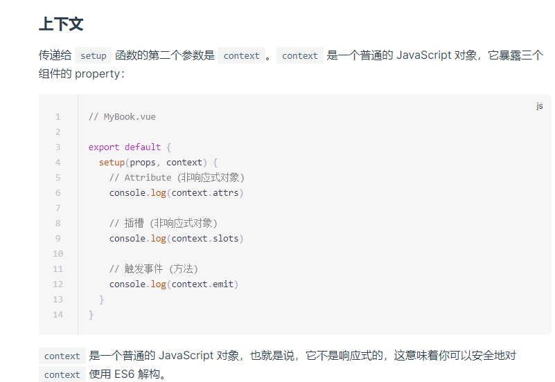

# setup

Vue3 一个大更新就是组合式API的，`setup` 就是进行组合的地方，从源码串看看其定义

源码追踪： `mountComponent(n2, container) => setupComponent(instance) => setupStatefulComponent(instance, isSSR)`

```js
    const { setup } = Component;
    if (setup) {
      const setupContext = (instance.setupContext =
        setup.length > 1 ? createSetupContext(instance) : null);
      currentInstance = instance;
      pauseTracking();
      const setupResult = callWithErrorHandling(setup, instance, 0 /* SETUP_FUNCTION */, [ shallowReadonly(instance.props) , setupContext]);
      resetTracking();
      currentInstance = null;
      if (isPromise(setupResult)) {
        if (isSSR) {
          // return the promise so server-renderer can wait on it
          return setupResult.then((resolvedResult) => {
            handleSetupResult(instance, resolvedResult);
          });
        }
        else {
          // async setup returned Promise.
          // bail here and wait for re-entry.
          instance.asyncDep = setupResult;
        }
      }
      else {
        handleSetupResult(instance, setupResult);
      }
    }
```

**解析：**

`const setupContext = (instance.setupContext = setup.length > 1 ? createSetupContext(instance) : null)`

`setup` 就是组件定义的方法，`setup.length` 表示定义 `setup` 函数使用到的参数，比如下面粟子：

```js
// setup1
setup (props) {
    let repositories = [1]

    return {
        repositories,
    }
}
// setup2
setup (props, context) {
    let repositories = [1]

    return {
        repositories,
    }
}
```

第一个 `setup.length = 1`，第二个`setup.length = 2` ，只有当 `setup.length = 2` 将执行 `createSetupContext(instance)`

```js
  function createSetupContext(instance) {
    const expose = exposed => {
      if ( instance.exposed) {
        warn(`expose() should be called only once per setup().`);
      }
      instance.exposed = proxyRefs(exposed);
    };
    {
      return Object.freeze({
        get props() {
          return instance.props;
        },
        get attrs() {
          return new Proxy(instance.attrs, attrHandlers);
        },
        get slots() {
          return shallowReadonly(instance.slots);
        },
        get emit() {
          return (event, ...args) => instance.emit(event, ...args);
        },
        expose
      });
    }
  }
```

`createSetupContext` 的作用就是返回组件 `props`、`attrs`、`slots`、`emit`、 `expose` 属性，结合官方文档对 setup 的第二个参数 `context` 的说明：



那么 `context` 就是在这里给的

**go on**

`const setupResult = callWithErrorHandling(setup, instance, 0 /* SETUP_FUNCTION */, [ shallowReadonly(instance.props) , setupContext])`

- shallowReadonly(instance.props)：内部调用 `createReactiveObject(target, true, shallowReadonlyHandlers, readonlyCollectionHandlers)`添加代理，注意此时代理的属性是只读的

```js
  function callWithErrorHandling(fn, instance, type, args) {
    let res;
    try {
      res = args ? fn(...args) : fn();
    }
    catch (err) {
      handleError(err, instance, type);
    }
    return res;
  }
```

执行 `fn` 即 `setup` 方法得到返回值，上面的例子返回 `{ repositories: [1] }`

**go on**

```js
  instance.setupState = proxyRefs(setupResult);
  {
    exposeSetupStateOnRenderContext(instance);
  }
```

给 `setupResult` 添加代理保存到 `setupState` 属性中, `exposeSetupStateOnRenderContext(instance);` 核心代码为：

```js
  function exposeSetupStateOnRenderContext(instance) {
    const { ctx, setupState } = instance;
    Object.keys(toRaw(setupState)).forEach(key => {
      if (key[0] === '$' || key[0] === '_') {
        warn(`setup() return property ${JSON.stringify(key)} should not start with "$" or "_" ` +
          `which are reserved prefixes for Vue internals.`);
        return;
      }
      Object.defineProperty(ctx, key, {
        enumerable: true,
        configurable: true,
        get: () => setupState[key],
        set: NOOP
      });
    });
  }
```

这样就可以在 `ctx` 中访问 `setupState` 的属性了，但...然后了

`PublicInstanceProxyHandlers` 方法有这么几行语句：

```js
const n = accessCache[key];
if (n !== undefined) {
  switch (n) {
    case 0 /* SETUP */:
      return setupState[key];
    case 1 /* DATA */:
      return data[key];
    case 3 /* CONTEXT */:
      return ctx[key];
    case 2 /* PROPS */:
      return props[key];
    // default: just fallthrough
  }
}
else if (setupState !== EMPTY_OBJ && hasOwn(setupState, key)) {
  accessCache[key] = 0 /* SETUP */;
  return setupState[key];
}
```

当访问属性时，vue 对于每个属性使用 `accessCache` 做了标识，表示从哪些地方取，这些地方包括 `data`、`setupState` 等，以之前的例子为例，当访问 `this.repositories` 时，此时 `setupState` 并没标记当前 `repositories` 属性的类型，所以往下走在 `hasOwn(setupState, key)` 属性了这个属性，则返回这个属性值的同时，并向 `accessCache` 添加对应的标识

## 总结

看来看去 vue 对 `setup` 方法的处理就是将它的返回结果做了代理。 

最后再看一个 `proxyRefs` 方法的定义，出现了好几次都

### proxyRefs

以下相关的定义

```js
  function proxyRefs(objectWithRefs) {
    return isReactive(objectWithRefs)
      ? objectWithRefs
      : new Proxy(objectWithRefs, shallowUnwrapHandlers);
  }
  function isReactive(value) {
    if (isReadonly(value)) {
      return isReactive(value["__v_raw" /* RAW */]);
    }
    return !!(value && value["__v_isReactive" /* IS_REACTIVE */]);
  }
  function isReadonly(value) {
    return !!(value && value["__v_isReadonly" /* IS_READONLY */]);
  }
  const shallowUnwrapHandlers = {
    get: (target, key, receiver) => unref(Reflect.get(target, key, receiver)),
    set: (target, key, value, receiver) => {
      const oldValue = target[key];
      if (isRef(oldValue) && !isRef(value)) {
        oldValue.value = value;
        return true;
      }
      else {
        return Reflect.set(target, key, value, receiver);
      }
    }
  };
  function unref(ref) {
    return isRef(ref) ? ref.value : ref;
  }
  function isRef(r) {
    return Boolean(r && r.__v_isRef === true);
  }
```

vue 处理过的对象会增加一些私有的属性，如：

- __v_isReadonly：表示这个属性是不是只读的，比如 `computed` 属性就会设置这个 `__v_isReadonly`

- __v_raw：  `__v_raw` 属性也是被代理的，标志这个属性是否是响应式的

  ```js
    // createGetter 中的 get 定义
    if (key === "__v_raw" /* RAW */ &&
      receiver === (isReadonly ? readonlyMap : reactiveMap).get(target)) {
      return target;
    }
  ```
  
- __v_isReactive：等于 `!__v_isReadonly`

吧啦一堆 `proxyRefs` 的作用判断通过参数传的对象是否之前已经处理的，如果是的话如果返回，如果不是的话就添加一层代理...然后就没有了


