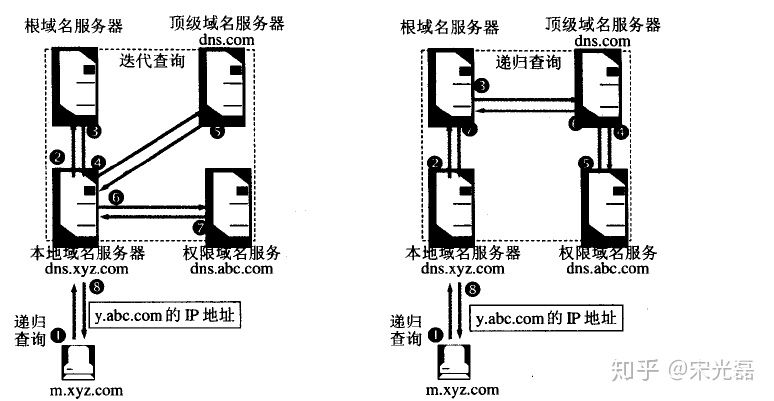

# DNS

TCP/IP网络中要求每一个互连的计算机都具有一个唯一的 IP 地址，并基于这个 IP 地址进行通信。 然而直接使用 IP 地址有很多不便之处，比如不方便记忆。在这样的背景下，产生了一个可以有效管理主机名和 IP 地址之间对应关系的系统，那就是 DNS 系统

**DNS 属于应用层协议**，实际上它是为其它应用层协议工作的，包括不限一`HTTP`,`SMRP`, `FTP`,用于将用户提供的主机名解析成 IP 地址

## 域名

域名是一个由多级部分组成一个简单结构，各级别用`.`分隔

### 域名级别

```
www.   zhihu.  com     .
三级域 二级域 顶级域 根域

www.   zhihu. com.   cn      .
四级域 三级域 二级域 顶级域 根域
```

> 说明：根域是后面的点`.`

- 顶级域名，也叫一级域名: `.com`  `.net`  `.edu`  `.gov` 等属于通用顶级域名

- 二级域名（SLD，second-level domain）:就是最靠近顶级域名左侧的字段

  `baidu.com`，`baidu` 属于二级域名`

- 其它级别域名： 即最靠近二级域名左侧的字段，从右向左便可依次有三级域名、四级域名、五级域名等，依次类推即可

## 为什么要解析？

网络通讯大部分是基于TCP/IP的，而TCP/IP是基于IP地址的，所以计算机在网络上进行通讯时只能识别如“202.96.134.133”之类的IP地址，而不能认识域名。我们无法记住10个以上IP地址的网站，所以我们访问网站时，更多的是在浏览器地址栏中输入域名，就能看到所需要的页面，这是因为有一个叫“DNS服务器”的计算机自动把我们的域名“翻译”成了相应的IP地址，然后调出IP地址所对应的网页

## DNS 查询过程

以浏览器中输入`www.qq.com` 域名为例

1. 浏览器会检查缓存中有没有域名对应的ip地址，这个缓存是有过期时长的，一般是几分钟到几小时不等

  Chrome 输入`chrome://net-internals/#dns`可以查看各域名的DNS

2. 检查本地 `hosts` 文件是这个网址的映射

3. 从本机 DNS 解析器缓存中查找网址的映射（不懂在哪）

4. 向本机配置的本地区DNS域名服务器（LDNS）发起请求，此服务器收到查询时，如果要查询的域名，包含在本地配置区域资源中，则返回解析结果给客户机，完成域名解析（具有权威性）
  
  本地区DNS域名服务器：如果你是通过学校连接互联网的一般是你学校的DNS服务器，如果你是在小区连接互联网的一般是网络提供商比如电信，联通的DNS服务器
  
5. 如果要查询的域名，不由本地DNS服务器区域解析，但该服务器已缓存了此网址映射关系，则调用这个IP地址映射，完成域名解析(不具有权威性)

6A. 根据本地DNS服务器的设置（是否设置转发器）进行查询，如果`未用转发模式`

  1. 本地DNS就把请求发至13台根DNS服务器,根DNS服务器收到请求后会判断这个域名(`.com`)是谁来授权管理, 并会返回一个负责该顶级域名服务器的一个主域名服务器（gTLD）地址, ，gTLD是国际顶级域名服务器，比如`.com`, `.cn`, `.org`等。

  2. 本地域名服务器LDNS再向上一步返回的gLTD服务器发送请求, 这台负责`.com`域的服务器收到请求后，如果自己无法解析，它就会找一个管理`.com域`的下一级DNS服务器地址(`http://qq.com`)给本地DNS服务器

  3. 当本地DNS服务器收到这个地址后，就会找`http://qq.com域`服务器，重复上面的动作，进行查询，直至找到`www.qq.com`主机

  以上方式属于**迭代查询**

6B. 根据本地DNS服务器的设置（是否设置转发器）进行查询，如果用 `转发模式`

  此DNS服务器就会把请求转发至上一级DNS服务器，由上一级服务器进行解析，上一级服务器如果不能解析，再把转请求转至上上级（即替主机继续查询），以此循环。
  
  以上方式属于**递归查询**

不管使用哪个查询方式，**最后都是把结果返回给本地DNS服务器，由此DNS服务器再返回给客户机。**

## 递归查询和迭代查询



**递归查询**

如果主机所询问的本地域名服务器不知道被查询的域名的IP地址，那么本地域名服务器就以DNS客户的身份向其它根域名服务器继续发出查询请求报文(即替主机继续查询)，而不是让主机自己进行下一步查询。
  
因此，递归查询返回的查询结果或者是所要查询的IP地址，或者是报错，表示无法查询到所需的IP地址
  
**迭代查询**

当根域名服务器收到本地域名服务器发出的迭代查询请求报文时，要么给出所要查询的IP地址，要么告诉本地服务器：“你下一步应当向哪一个域名服务器进行查询”，让本地DNS服务器自己再去请求
  
## HTTPS可以御防 DNS 劫持嘛

HTTPS 是在客户端与服务端建立时加的一个安全通道，而且验证过程也双方可以通信的时候才做的

而 DNS 是一个域名解析的过程， 在客户端到达服务端时做的事情，因此 HTTPS 是不能御防 DNS 劫持的

## DNS劫持方法

1. 本机修改

  攻击者通过某些手段使用户的计算机感染上木马病毒，或者恶意软件之后，恶意修改本地DNS配置，比如修改本地hosts文件，缓存等
  
2. 路由DNS劫持

  很多用户默认路由器的默认密码，攻击者可以侵入到路由管理员账号中，修改路由器的默认配置
  
3. 很多用户默认路由器的默认密码，攻击者可以侵入到路由管理员账号中，修改路由器的默认配置

  直接攻击DNS服务器，例如对DNS服务器进行DDOS攻击，可以是DNS服务器宕机，出现异常请求，还可以利用某些手段感染dns服务器的缓存，使给用户返回来的是恶意的ip地址
  
## DNS的防范

- 加强本地计算机病毒检查，开启防火墙等，防止恶意软件，木马病毒感染计算机

- 改变路由器默认密码，防止攻击者修改路由器的DNS配置指向恶意的DNS服务器
  
- 企业的话可以准备两个以上的域名，一旦一个域名挂掉，还可以使用另一个

- 用HTTP DNS 代替 Local DNS
