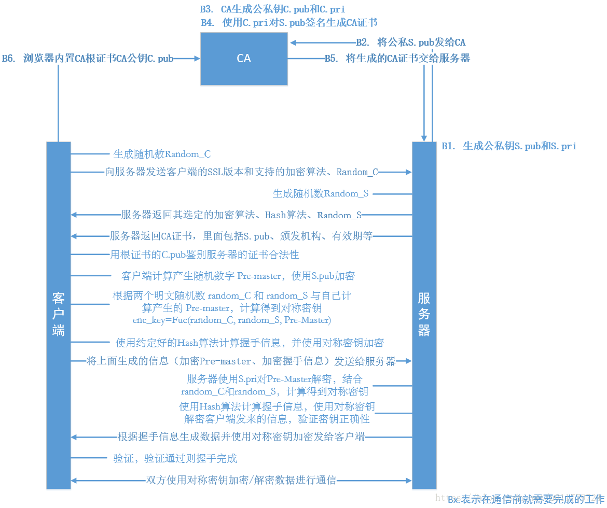
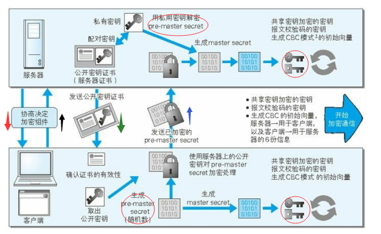
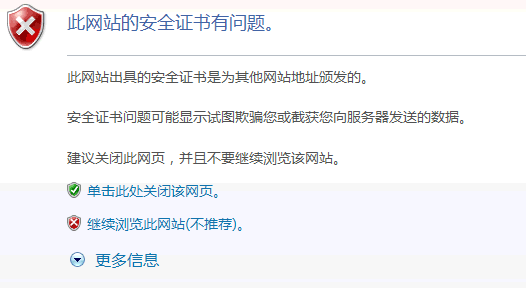

# HTTPS

HTTPS是身披SSL外壳的HTTP，在HTTP上基础上加了加密和认证处理以及完整性保护

## SSL/TLS作用

- 认证用户和服务器，确保数据发送到正确的客户机和服务器

- 加密数据以防止数据中途被窃取

- 维护数据的完整性，确保数据在传输过程中不被改变

## HTTPS采用混合加密机制

HTTPS采用共享密钥和公开密钥加密两者并用的混合加密机制。在交换密钥环节使用公开密钥加密方式，之后的建立通信交换报文阶段使用共享密钥加密方式

## 建立SSL的步骤

1. 客户端通过`ClientHello`报文开始SSL通信。报文中包含以下内容等：

    - 支持的TLS协议版本，比如TLS 1.0版

    - 一个客户端生成的随机数，稍后用于生成`master key(对话密钥)`

    - 支持的加密组件列表，比如RSA公钥加密

    - 支持的压缩方法

    由于客户端(如浏览器)对一些加解密算法的支持程度不一样，但是在TLS协议传输过程中必须使用同一套加解密算法才能保证数据能够正常的加解密。在TLS握手阶段，客户端首先要告知服务端，自己支持哪些加密算法，所以客户端需要将本地支持的加密套件(Cipher Suite)的列表传送给服务端。除此之外，客户端还要产生一个随机数，这个随机数一方面需要在客户端保存，另一方面需要传送给服务端，客户端的随机数需要跟服务端产生的随机数结合起来产生后面要讲到的 `Master Secret`

2. 服务器确认客户端使用的加密通信协议版本，比如TLS 1.0版本。如果浏览器与服务器支持的版本不一致，服务器关闭加密通信。如果可进行SSL通信时，会以`SeverHello`报文作为应答。报文中将包含TLS版本以及加密组件和一个随机字符串，加密组件是从客户端传过来的加密组件列表中筛选出来的

3. 服务器发送`Certificate`报文。报文中包含公开密钥证书

4. 最后服务器发送`Server Hello Done`报文通知客户端，最初阶段的SSL握手协商部分结束

    - 对于非常重要的保密数据，服务端还需要对客户端进行验证，以保证数据传送给了安全的合法的客户端。服务端可以向客户端发出 `Cerficate Request` 消息，要求客户端发送证书对客户端的合法性进行验证。比如，金融机构往往只允许认证客户连入自己的网络，就会向正式客户提供USB密钥，里面就包含了一张客户端证书

5. 客户端以`Client Key Exchange`报文作为回应，这个报中包含一个称为`pre-master secret`的密码串，并且这个密码串用公钥进行了加密

> 客户端和服务端都会利用两个随机数和 `PreMasterSecret` 生成 `master secret`，也就是接下来使用的对称秘钥(Session Key)

6. 客户端发送 `ChangeCipherSpec` ，客户端已经切换到之前协商好的加密套件（Cipher Suite）的状态，告诉对方接下来所有的消息都是经过加密的

7. 客户端发送`master secret`加密的`Finished`报文，包含对应的MAC（类似HASH值），服务器解密并且验证 HASH值，如果解密或者验证失败，握手失败

  这里之所以要带上握手信息的HASH是因为，防止信息被篡改。如果信息被篡改，那么服务端接收到信息进行HASH时，就会发现HASH值和客户端传回来的不一样。这里就保证了信息不会被篡改。

8. 服务端发送 `ChangeCipherSpec` ，客户端已经切换到之前协商好的加密套件（Cipher Suite）的状态，告诉对方接下来所有的消息都是经过加密的

9. 服务端发送`master secret`加密的 `Finished`报文并且包含对应的MAC（类似HASH值），客户端解密并验证

10. SSL连接就算建立完成。当然，通信会受到SSL的保护。从此处开始进行应用层协议的通信，即发送HTTP请求。

11. 应用层协议通信，即发送HTTP响应

12. 最后由客户端断开连接。断开连接时，发送close_notify报文。

## HTTPS缺点

HTTPS也存在一些问题，那就是使用SSL时，它的处理速度会变慢。

- 多了一层SSL认证，通信变慢

- 加密和解密的过程需要大量消耗CPU及内存资源，导致处理速度变慢

## HTTP和HTTPS的区别

- HTTP 明文传输，数据都是未加密的，安全性较差，HTTPS（SSL+HTTP） 数据传输过程是加密的，安全性较好。

- 使用 HTTPS 协议需要到 CA（Certificate Authority，数字证书认证机构） 申请证书，一般免费证书较少，因而需要一定费用。证书颁发机构如：Symantec、Comodo、GoDaddy 和 GlobalSign 等。

- HTTP 页面响应速度比 HTTPS 快，主要是因为 HTTP 使用 TCP 三次握手建立连接，客户端和服务器需要交换 3 个包，而 HTTPS除了 TCP 的三个包，还要加上 ssl 握手需要的 9 个包，所以一共是 12 个包。

- http 和 https 使用的是完全不同的连接方式，用的端口也不一样，前者是 80，后者是 443。

- HTTPS 其实就是建构在 SSL/TLS 之上的 HTTP 协议，所以，要比较 HTTPS 比 HTTP 要更耗费服务器资源

## 总结

SSL客户端（也是TCP的客户端）在TCP链接建立之后，发出一个`ClientHello`来发起握手，这个消息里面包含了自己可实现的算法列表和其它一些需要的消息，SSL的服务器端会回应一个`ServerHello`，这里面确定了这次通信所需要的算法，然后发过去自己的证书（里面包含了身份和自己的公钥）。Client在收到这个消息后会生成一个秘密消息，用SSL服务器的公钥加密后传过去，SSL服务器端用自己的私钥解密后，会话密钥协商成功，双方可以用同一份会话密钥来通信了。

**附：密钥协商的形象化比喻**

A：我想和你安全的通话，我这里的对称加密算法有DES,RC5,密钥交换算法有RSA和DH，摘要算法有MD5和SHA。

B：我们用DES－RSA－SHA这对组合好了。 这是我的证书，里面有我的名字和公钥，你拿去验证一下我的身份（把证书发给A）。 目前没有别的可说的了。

A：（查看证书上B的名字是否无误，并通过手头早已有的CA的证书验证了B的证书的真实性，如果其中一项有误，发出警告并断开连接，这一步保证了B的公钥的真实性） （产生一份秘密消息，这份秘密消息处理后将用作加密密钥，加密初始化向量（IV）和hmac的密钥。将这份秘密消息-协议中称为per_master_secret-用B的公钥加密，封装成称作ClientKeyExchange的消息。由于用了B的公钥，保证了第三方无法窃听） 我生成了一份秘密消息，并用你的公钥加密了，给你（把ClientKeyExchange发给B） 注意，下面我就要用加密的办法给你发消息了！ （将秘密消息进行处理，生成加密密钥，加密初始化向量和hmac的密钥） [我说完了]

B：（用自己的私钥将ClientKeyExchange中的秘密消息解密出来，然后将秘密消息进行处理，生成加密密钥，加密初始化向量和hmac的密钥，这时双方已经安全的协商出一套加密办法了） 注意，我也要开始用加密的办法给你发消息了！ [我说完了]

A：[我的秘密是…]

B：[其它人不会听到的…]

## Q&A

**PreMaster secret是什么**

`PreMaster Secret`是在客户端使用`RSA`或者`Diffie-Hellman`等加密算法生成的。它将用来跟服务端和客户端在Hello阶段产生的随机数结合在一起生成 `Master Secret`。在客户端使用服务端的公钥对`PreMaster Secret`进行加密之后传送给服务端，服务端将使用私钥进行解密得到`PreMaster secret`。也就是说服务端和客户端都有一份相同的`PreMaster secret`和随机数。

`PreMaster secret`前两个字节是TLS的版本号，这是一个比较重要的用来核对握手数据的版本号，因为在Client Hello阶段，
客户端会发送一份加密套件列表和当前支持的SSL/TLS的版本号给服务端，而且是使用明文传送的，如果握手的数据包被破解之后，攻击者很有可能串改数据包，选择一个安全性较低的加密套件和版本给服务端，从而对数据进行破解。所以，服务端需要对密文中解密出来对的PreMaster版本号跟之前Client Hello阶段的版本号进行对比，如果版本号变低，则说明被篡改，则立即停止发送任何消息。

理解：假设在Client Hello阶段被截取，并且修改了加密组件，此时客房用用密钥生成`PreMaster secret`，此时的`PreMaster secret`的**TLS版本号是正确的版本号**。服务端解密得到`PreMaster secret`发现里面的TLS版本号与之前Client Hello阶段不一致，就说明被篡改了

**什么是Master secret**

`Master secret`是由一系列的`hash值`组成的，它将作为数据加解密相关的`secret的 `Key Material` 的一部分。`Key Material`最终解析出来的数据如下：

- `write MAC key`:就是`session secret`或者说是`session key`

- `Client write MAC key`:是客户端发数据的`session secret`

- `Server write MAC secret`:是服务端发送数据的`session key`

- `MAC(Message Authentication Code)`，是一个数字签名，用来验证数据的完整性，可以检测到数据是否被串改。

**如何验证证书有效性**

- 验证证书是否在有效期内。

  在服务端面返回的证书中会包含证书的有效期，可以通过失效日期来验证证书是否过期

- 验证证书是否被吊销了。

  被吊销后的证书是无效的。验证吊销有CRL(证书吊销列表)和OCSP(在线证书检查)两种方法。

  - CRL（Certificate Revocation List）即证书撤销名单。证书颁发者会提供一份已经失效证书的名单，供浏览器验证证书使用。当然这份名单是巨长无比的，浏览器不可能每次TLS都去下载，所以常用的做法是浏览器会缓存这份名单，定期做后台更新。

  -  OCSP(Online Certificate StatusProtocol)即在线证书状态协议。除了离线文件，证书颁发者也会提供实时的查询接口，查询某个特定证书目前是否有效。实时查询的问题在于浏览器需要等待这个查询结束才能继续TLS握手，也会有些延迟。

- 证书是否是信任的有效证书。所谓信任：浏览器内置了信任的根证书，就是看看web服务器的证书是不是这些信任根发的或者信任根的二级证书机构颁发的。所谓有效，就是看看web服务器证书是否在有效期，是否被吊销了。

- 对方是不是上述证书的合法持有者，验证对方是否持有证书的私钥，验证方法有两种
  
  - 一种是对方签个名，我用证书验证签名；

  - 另外一种是用证书做个信封，看对方是否能解开

以上的所有验证，除了验证证书是否吊销需要和CA关联，其他都可以自己完成。

- 验证证书是否是上级CA签发的。

  系统中保留了所有受信任的根证书，浏览器可以查看信任的根证书，自然可以验证服务器的证书，是不是由这些受信任根证书颁发的或者受信任根证书的二级证书机构颁发的（根证书机构可能会受权给底下的中级证书机构，然后由中级证书机构颁发中级证书）。
  
- 浏览器使用相同的hash算法计算出服务器发来的证书的hash值，将这个计算的hash值与证书中签名做对比
      
   - 网站的公钥是公开的，客户端用公钥解密证书的数字签名，得到证书明文的hash
    
   - 将证书明文用一样的方法（证书里有说明签名算法）计算出hash
    
   - 两个hash值一样证书才合法
 
**为什么最后客户端和服务端都要发送一个Finish报文？**

上面已经提及，Finish报文是对至今全部报文的整体校验值（也就是HASH值）。当客户端把这个值通过得到的公钥进行加密的时候，服务器得到之后对其进行解密，然后再对全部报文进行一个HASH求值。如果这个值跟解密得到的值相等的话，那么说明客户端是可信赖的。
同样的，服务器发送这样的一个整体校验值，用来客户端验证服务器是否是真正要进行通信的那一个。
综上，这个Finish报文就是用来校验双方的身份的。

**整个过程中产生的三个随机数有什么用呢？还有，后面进行HTTP通信的时候，是用哪一个密钥进行加密，还有怎么保证报文的完整性**

对于客户端：

当其生成了`Pre-master secret`之后，会结合原来的A、B随机数，用DH算法计算出一个`master secret`，紧接着根据这个`master secret`推导出`hash secret`和`session secret`。

对于服务端：

当其解密获得了`Pre-master secret`之后，会结合原来的A、B随机数，用DH算法计算出一个`master secret`，紧接着根据这个`master secret`推导出`hash secret`和`session secret`。

> 在客户端和服务端的`master secret`是依据三个随机数推导出来的，它是不会在网络上传输的，只有双方知道，不会有第三者知道。同时，客户端推导出来的`session secret`和`hash secret`与服务端也是完全一样的。

双方使用对称加密算法进行加密，用`hash secret`对HTTP报文做一次运算生成一个`MAC`，附在HTTP报文的后面，然后用`session-secret`加密所有数据（`HTTP+MAC`），然后发送。

接收方则先用`session-secret`解密数据，然后得到H`HTTP+MAC`，再用相同的算法计算出自己的`MAC`，如果两个`MAC`相等，证明数据没有被篡改。

> MAC(Message Authentication Code)称为报文摘要，能够查知报文是否遭到篡改，从而保护报文的完整性。

**为什么要使用三个随机数呢？**

- 黑客可能拦截了这样的一个加密的报文，他不对报文进行修改，而是不停的向报文的接受者发送重复的报文，以扰乱通信的建立。于是，就可以加这么一个随机数。只要任何一个通信方，接收到的报文中的随机数出现重复的情况，就可以知道有中间者对通信的过程进行了扰乱，可以立即中断通信

- `pre-master secret`的存在在于SSL协议不信任每个主机都能产生完全随机的随机数，如果随机数不随机，那么`pre-master secret`就有可能被猜出来，那么仅适用`pre-master secret`作为密钥就不合适了，因此必须引入新的随机因素，那么客户端和服务器加上`pre-master secret`三个随机数一同生成的密钥就不容易被猜出了，一个伪随机可能完全不随机，可是是三个伪随机就十分接近随机了，每增加一个自由度，随机性增加的可不是一。

> 我们在计算机所使用的随机数都是伪随机，而不是物理上所说的真正随机。

**如果黑客拦截了服务器把证书发送给客户端，并对证书进行恶意修改，会出现什么情况？**

第一种情况，假如黑客只是单纯的修改数字证书中的内容，那么由于数字签名的存在，客户端会很容易的判断出报文是否被篡改。

第二种情况，黑客不仅修改了数字证书的内容，并且把数字签名替换掉了，由于黑客不可能知道CA的私钥，于是在客户端用CA的公钥进行解密的时候，解密之后得不到正确的信息，也很容易判断出报文是否被修改。

第三种情况，黑客恶意的从相同的第三方CA申请了一个数字证书。由于这个CA是真实存在的，所以客户端是可以用CA的公钥进行解密，得到了黑客提供的数字证书中的公钥。但是，由于数字证书在申请的时候，会绑定一个域名，当客户端比如说浏览器，检测到这个数字证书中的域名和我们现在网页访问的域名不一致，便会发出警告，此时我们也能得知数字证书被替换了。发出的警告如下：

**fiddler拦截HTTPS请求的原理**

下面假设`fiddler`是个被黑客利用物工具

- 黑客通过特殊途径在被攻击者的手机上安装根证书

- （A）客户端发起连接请求，代理服务器（Fiddler）在中间截取请求，返回自己签名的伪造证书并且Fiddler伪装成客户端向服务器发送请求进行握手

- 客户端收到证书后会在系统中查找信任的根证书，因为黑客已经事先在被攻击者手机上安装了自己的根证书，因此客户端验证通过

- 客户端后续就会把Fiddler当成合法的服务器；

- 回到上面的A步骤，Fiddler伪装成客户端向服务器发送请求进行握手，服务器发回相应，Fiddler获取到服务器的CA证书， 用根证书公钥进行解密， 验证服务器数据签名， 获取到服务器CA证书公钥

- Fiddler截获客户端发送给服务器的HTTPS请求，Fiddler用自己的私钥解密，然后再用自己的截取到的公钥加密发送给服务端

- 与普通过程中服务器端的操作相同，服务器用私钥解开后建立信任，然后再发送加密的握手消息给客户端

- Fiddler截获服务器发送的密文， 用对称密钥解开， 再用自己伪造证书的私钥加密传给客户端

- 客户端拿到加密信息后，用公钥解开，验证HASH。握手过程正式完成，客户端与服务器端就这样建立了”信任“

fiddler拦截HTTPS请求最核心的地方在于真正的客户端需要安装fiddler的证书。这样子的话，fiddler能够伪造出CA证书，达到欺骗客户端

**“客户”发送一个随机的字符串给“服务器”去用私钥加密，以便判断对方是否真的持有私钥。但是有一个问题，
“黑客”也可以发送一个字符串给“服务器”去加密并且得到加密后的内容，这样对于“服务器”来说是不安全的，
因为黑客可以发送一些简单的有规律的字符串给“服务器”加密，从而寻找加密的规律，有可能威胁到私钥的安全。
所以说，“服务器”随随便便用私钥去加密一个来路不明的字符串并把结果发送给对方是不安全的。**

每次收到“客户”发来的要加密的的字符串时，“服务器”并不是真正的加密这个字符串本身，而是把这个字符串进行一个hash计算，
加密这个字符串的hash值(不加密原来的字符串)后发送给“客户”，“客户”收到后解密这个hash值并自己计算字符串的hash值然后进行对比是否一致。也就是说，“服务器”不直接加密收到的字符串，而是加密这个字符串的一个hash值，这样就避免了加密那些有规律的字符串，从而降低被破解的机率。“客户”自己发送的字符串，因此它自己可以计算字符串的hash值，然后再把“服务器”发送过来的加密的hash值和自己计算的进行对比，同样也能确定对方是否是“服务器”。

**在双方的通信过程中，“黑客”可以截获发送的加密了的内容，虽然他无法解密这个内容，但是他可以捣乱，例如把信息原封不动的发送多次，扰乱通信过程。**

可以给通信的内容加上一个序号或者一个随机的值，如果“客户”或者“服务器”接收到的信息中有之前出现过的序号或者随机值，
那么说明有人在通信过程中重发信息内容进行捣乱，双方会立刻停止通信。有人可能会问，如果有人一直这么捣乱怎么办？那不是无法通信了？ 

答案是的确是这样的，例如有人控制了你连接互联网的路由器，他的确可以针对你。但是一些重要的应用，例如军队或者政府的内部网络，它们都不使用我们平时使用的公网，因此一般人不会破坏到他们的通信。 

**在双方的通信过程中，“黑客”除了简单的重复发送截获的消息之外，还可以修改截获后的密文修改后再发送，因为修改的是密文，虽然不能完全控制消息解密后的内容，但是仍然会破坏解密后的密文。因此发送过程如果黑客对密文进行了修改，“客户”和“服务器”是无法判断密文是否被修改的。虽然不一定能达到目的，但是“黑客”可以一直这样碰碰运气。**

在每次发送信息时，先对信息的内容进行一个hash计算得出一个hash值，将信息的内容和这个hash值一起加密后发送。接收方在收到后进行解密得到明文的内容和hash值，然后接收方再自己对收到信息内容做一次hash计算，与收到的hash值进行对比看是否匹配，如果匹配就说明信息在传输过程中没有被修改过。如果不匹配说明中途有人故意对加密数据进行了修改，立刻中断通话过程后做其它处理。

**浏览器地址栏左侧提示“您与此网站之间建立的连接不安全”**

因为该网站未采用SSL证书使用https加密连接。

**https链接提示“您与此网站之间建立的连接并非完全安全的解决方法”**

虽然是https链接，但是页面中存在http的资源
 
**HTTPS可以御防 DNS 劫持嘛**

HTTPS 是在客户端与服务端建立时加的一个安全通道， 而且验证过程也双方可以通信的时候才做的

而 DNS 是一个域名解析的过程， 在客户端到达服务端时做的事情，因此 HTTPS 是不能御防 DNS 劫持的

**Ca是什么**

CA是证书的签发机构，它是公钥基础设施（Public Key Infrastructure，PKI）的核心。CA是负责签发证书、认证证书、管理已颁发证书的机关

**Ca证书的内容是什么**

证书的内容包括：电子签证机关的信息、公钥用户信息、公钥、权威机构的签字和有效期等等。证书的格式和验证方法普遍遵循X.509国际标准

## 附

**公钥密码体制(public-key cryptography)**

公钥密码体制分为三个部分，公钥、私钥、加密解密算法，它的加密解密过程如下：

- 加密：通过加密算法和公钥对内容(或者说明文)进行加密，得到密文。加密过程需要用到公钥。 

- 解密：通过解密算法和私钥对密文进行解密，得到明文。解密过程需要用到解密算法和私钥。注意，由公钥加密的内容，只能由私钥进行解密，也就是说，由公钥加密的内容，如果不知道私钥，是无法解密的。

公钥密码体制的公钥和算法都是公开的(这是为什么叫公钥密码体制的原因)，私钥是保密的。大家都以使用公钥进行加密，但是只有私钥的持有者才能解密。在实际的使用中，有需要的人会生成一对公钥和私钥，把公钥发布出去给别人使用，自己保留私钥。

**对称加密算法(symmetric key algorithms)**

在对称加密算法中，加密使用的密钥和解密使用的密钥是相同的。也就是说，加密和解密都是使用的同一个密钥。因此对称加密算法要保证安全性的话，密钥要做好保密，只能让使用的人知道，不能对外公开。这个和上面的公钥密码体制有所不同，公钥密码体制中加密是用公钥，解密使用私钥，而对称加密算法中，加密和解密都是使用同一个密钥，不区分公钥和私钥。

**非对称加密算法(asymmetric key algorithms)**

在非对称加密算法中，加密使用的密钥和解密使用的密钥是不相同的。前面所说的公钥密码体制就是一种非对称加密算法，他的公钥和是私钥是不能相同的，也就是说加密使用的密钥和解密使用的密钥不同，因此它是一个非对称加密算法。

**签名**

签名就是在信息的后面再加上一段内容，可以证明信息没有被修改过，怎么样可以达到这个效果呢？一般是对信息做一个hash计算得到一个hash值，注意，这个过程是不可逆的，也就是说无法通过hash值得出原来的信息内容。在把信息发送出去时，把这个hash值加密后做为一个签名和信息一起发出去。 接收方在收到信息后，会重新计算信息的hash值，并和信息所附带的hash值(解密后)进行对比，如果一致，就说明信息的内容没有被修改过，因为这里hash计算可以保证不同的内容一定会得到不同的hash值，所以只要内容一被修改，根据信息内容计算的hash值就会变化。当然，不怀好意的人也可以修改信息内容的同时也修改hash值，从而让它们可以相匹配，为了防止这种情况，hash值一般都会加密后(也就是签名)再和信息一起发送，以保证这个hash值不被修改。至于如何让别人可以解密这个签名，这个过程涉及到数字证书等概念，我们后面在说到数字证书时再详细说明，这里您先只需先理解签名的这个概念。

**PreMaster Secret 计算**

PreMaster Secret(Key)的计算，主要是通过RSA或者Diffie-Hellman算法生成。由于在Say Hello阶段，随机数都是明文传送的，如果PreMaster Secret泄漏的话，会导致整个SSL/TLS失效。

**算法**

对称加密算法有DES,RC5

密钥交换算法有RSA和DH

摘要算法有MD5和SHA

> [Https 建立安全连接的过程（SSL原理）](https://blog.csdn.net/xiaopang_yan/article/details/78709574)

