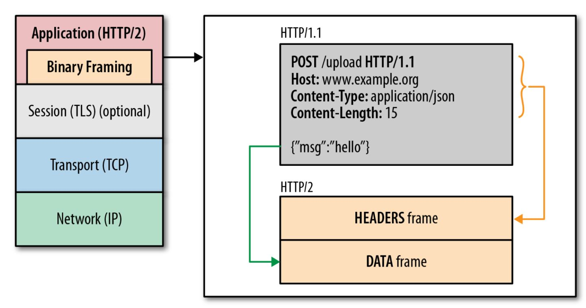
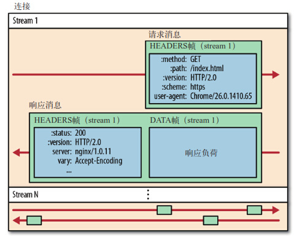

# HTTP及演变

> [MDN-HTTP](https://developer.mozilla.org/zh-CN/docs/Web/HTTP)

## HTTP协议

什么是 HTTP协议 ？ 

- **超文本传输协议**（HTTP）用于传输诸如HTML这样的的网络资源的 `protocol`(通讯协议)。它通用用于浏览器与Web服务器之间通信。

- HTTP遵循经典的客户端-服务端模型。通常基于 TCP/IP 层，但可以在任何可靠的传输层上使用，比如 UDP

- HTTP 属于应用层协议

### HTTP协议的特点

- HTTP 协议是构建于 TCP/IP 协议之上，是一个应用层协议，`默认端口是80`

- HTTP 是简单

  下一代 HTTP/2 协议将 HTTP 消息封装到了帧(`iframe)`中，但大体上还是设计简单易懂

- HTTP 是可扩展的

  通过HTTP中的`Headers`属性，我们可以方便进行一些扩展

- HTTP 是无状态的，有会话的

  在同一个连接中，两个执行成功的请求之间没有任何关系。这就带来一个问题，用户没有办法在同一网站中进行连续的交互，如果在电商网站中，用户把某个商品加入购物车，切换一个而后再添加了商品，这两次添加的商品的请求之间没有关联，浏览器无法知道用户最终选择了哪些商品。而使用HTTP的头部扩展，HTTP `Cookies`就可以解决这些问题。把`Cookies`添加到头部，创建一个会话让每个请求都能共享相同的上下文信息，达成相同的状态

  **HTTP是无状态的，但使用Cookies可以创建有状态的会话**

### HTTP报文

**请求报文**


一个请求由下以下元素组成：

- Method：请求方法，例如`GET`、`POST`等

- Path：获取资源的路径

- HTTP 协议版本号

- 为服务端表达其他信息的可选头部 `headers`

- 对于一些像 `POST` 这样的方法，报文的body就包含了发送的资源，这与响应报文的body类似

**响应报文**


响应报头包含以下元素：

- HTTP协议版本号

- 一个状态码和状态短语，来告知对应请求执行成功或失败，以及失败的原因

- `HTTP Headers`

- 返回资源的 `Body`，

### HTTP能控制什么

- 缓存：

  资源如何缓存能通过 HTTP 来控制。服务端能告诉代理和客户端哪些资源需要被缓存，缓存多久，而客户端也能够命令中间的缓存代理来忽略存储的文档。

- 开放同源限制

  为了防止网络窥听和其它隐私泄漏，浏览器强制对 Web网站 做了同源限制。只有来自于相同来源的网页才能够获取网站的全部信息。这样的限制有时会来不便，比如前后端的资源不同源的情况下，前端就不能访问到后端资源了，HTTP可以通过修改头部来开放这样的限制，因此Web文档可以是由不同域下的信息拼接成的（某些情况下，这样做还有安全因素考虑）。

- 认证

  一些页面能够被保护起来，仅让特定的用户进行访问。基本的认证功能可以直接通过 HTTP 提供，使用 `Authenticate` 相似的头部即可，或用 HTTP `Cookies` 来设置指定的会话。

- 代理和隧道

  通常情况下，服务器或客户端是处于内网的，对外网隐藏真实 IP 地址。因此 HTTP 请求就要通过代理越过这个网络屏障。但并非所有的代理都是 HTTP 代理。例如，`SOCKS` 协议的代理就运作在更底层，一些像 FTP 这样的协议也能够被它们处理。

- 会话

  虽然基本的 HTTP 是无状态协议, 使用HTTP `Cookies` 允许你用一个服务端的状态发起请求，这就创建了会话。

## HTTP 的演变历史

HTTP的演变主有`HTTP/0.9`, `HTTP/1.0`, `HTTP/1.1`, `HTTP/2.0`阶段

### HTTP/0.9

HTTP/0.9 极其简单：请求由单行指令构成，以唯一可用方法 `GET` 开头，其后跟目标资源的路径（一旦连接到服务器，协议、服务器、端口号这些都不是必须的）。

### HTTP/1.0

- 默认是短连接, 如需开启长连接, 需要增加 `header` `Connection: Keep-alive`

- 协议版本信息现在会随着每个请求发送（HTTP/1.0被追加到了GET行）

- 状态码会在响应开始时发送，使浏览器能了解请求执行成功或失败，并相应调整行为（如更新或使用本地缓存）。

- 引入了HTTP头的概念，无论是对于请求还是响应，允许传输元数据，使协议变得非常灵活，更具扩展性。

- 可以使用 `cookie`

**HPPT/1.0 缺点**：

- 每次连接都需要建立一次 TCP 连接

- 队头阻塞（head of line blocking）：由于 HTTP1.0 规定下一个请求必须在前一个请求响应到达之前才能发送。假设前一个请求响应一直不到达，那么下一个请求就不发送，同样的后面的请求也给阻塞了

### HTTP/1.1

- HTTP1.1 默认开启长连接, `Connection: Keep-alive`

  HTTP1.1增加了一个 `Connection`字段，通过设置`Keep-Alive`可以保持 HTTP 连接不断开，避免了每次客户端与服务器请求都要重复建立释放建立TCP连接，提高了网络的利用率。如果客户端想关闭HTTP连接，可以在请求头中携带`Connection: false`来告知服务器关闭请求

- 支持响应分块。

- 引入额外的缓存控制机制。

- 引入内容协商机制，包括语言，编码，类型等，并允许客户端和服务器之间约定以最合适的内容进行交换。

- `Host` 头，能够使不同域名配置在同一个 IP地址 的服务器上,使得一个服务器能够用来创建多个Web站点

- HTTP1.1 支持请求管道化

  基于HTTP1.1的长连接，使得请求管线化成为可能。管线化使得请求能够“并行”传输。举个例子来说，假如响应的主体是一个`html`页面，页面中包含了很多`img`，这个时候`keep-alive`就起了很大的作用，能够进行“并行”发送多个请求。（注意这里的“并行”并不是真正意义上的并行传输，具体解释如下。）

  **需要注意的是，服务器必须按照客户端请求的先后顺序依次回送相应的结果，以保证客户端能够区分出每次请求的响应内容**

  假设客户端同时发了两个请求分别来获取 `html` 和 `css` ，`html`请求先到达服务器，即使说服务器的`css`资源先准备就绪，服务器也会先发送`html`再发送`css`

  换句话来说，只有等到`html`响应的资源完全传输完毕后，`css`响应的资源才能开始传输。也就是说，不允许同时存在两个并行的响应

  可见，HTTP1.1还是无法解决队头阻塞（head of line blocking）的问题。同时“管道化”技术存在各种各样的问题，所以很多浏览器要么根本不支持它，要么就直接默认关闭，并且开启的条件很苛刻...而且实际上好像并没有什么用处。

  那么平时我们所说有浏览器可以并行发送请求是怎么回事呢？

  **实际上，现阶段的浏览器厂商采取了另外一种做法，它允许我们打开多个TCP的会话**， 这才是为什么可以并行发送请求的原因

### HTTP/1.1存在问题

- 一个连接只能发送一个请求,连接无法复用会导致每次请求都经历三次握手和慢启动。三次握手在高延迟的场景下影响较明显，慢启动则对文件类大请求影响较大。

- 请求只能客户端发起，客户端不可以接收除了响应以外的指令

- 请求/响应`Header`头未压缩就发送，`Header`头信息越多延迟越大

- 发送冗余的`Header`头。每次互相发送相同的`Header`头造成的浪费较多

- 可任意选择数据压缩方式。非强制压缩发送

- 队头阻塞(head of line blocking)

  对于http1.0的实现，在第一个请求没有收到回复之前，后续从应用层发出的请求只能排队，只能等请求1的`response`回来之后才能逐个发出。网络通畅的时候性能影响不大，一旦请求1的`request`因为什么原因没有抵达服务器，或者response因为网络阻塞没有及时返回，影响的就是所有后续请求，问题就变得比较严重了

## HTTP2.0

HTTP/2（超文本传输协议第2版，最初命名为HTTP2.0），是HTTP协议的第二个主要版本。HTTP/2是HTTP协议自1999年HTTP1.1发布后的首个更新，主要基于`SPDY`协议。HTTP2.0的特点总结有以下几点：

- 内容改用二进制格式进行传输

- 多路复用

- 压缩Headers

- Sever Push

- 更安全

### 二进制分帧代替文本传输

HTTP2.0 通过在应用层和传输层之间增加一个二进制分帧层，在二进制分帧中，HTTP/2会将所有传输的信息分割为更小的消息和帧（frame），并对它们采用二进制格式的编码，其中HTTP1.X的首部信息会被封装到`HEADER frame`，而相应的`Request Body` 则封装到 `DATA frame` 里面。

使用二进制代替文的优点：

- 基于文本协议的格式解析存在天然缺陷，文本的表现形式有多样性，要做到健壮性考虑的场景必然很多，二进制则不同，只认0和1的组合。基于这种考虑http2.0的协议解析决定采用二进制格式，实现方便且健壮

- 方面实现多路复用


  
虽然 `HTTP2.0` 的协议和 `HTTP1.x` 协议之间的规范完全不同了，但是实际上 HTTP2.0 并没有改变 HTTP1.x 的语义。
简单来说，HTTP2.0 只是把原来 HTTP1.x的 `header` 和 `body` 部分用 `frame` 重新封装了一层而已

### 多路复用

在 HTTP/1.1 协议中 「浏览器客户端在同一时间，针对同一域名下的请求有一定数量限制。超过限制数目的请求会被阻塞」，这也是为何一些站点会有多个静态资源 CDN 域名的原因之一

而 HTTP/2 的多路复用(Multiplexing) 则允许一次TCP连接就可以完成所有的请求



要明白多路复用的实现机制先了解两个概念:
  
- 流（stream）：流在HTTP2 的一条连接中用于客户端与服务端之间双向交换帧（frame）
  
- 帧（frame）：HTTP2.0通信的最小单位，每个帧包含帧头部，至少也会标识出当前帧所属的流（`stream id`）

客户端与服务端之间相互发送的帧，都通过一个个独立流来传输，多个流可以在同一http2 连接中并发，而每个流都有一个 ID（Stream Identifier），`frame` 就是通过此来识别流
    

    
从图中可见，所有的HTTP2.0通信都在一个TCP连接上完成，这个连接可以承载任意数量的流（stream），每个流（stream）以消息的形式发送，而消息由一或多个帧组成。这些帧可以乱序发送，然后再根据每个帧头部的流标识符（stream id）重新组装。
  
另外，多路复用（连接共享）可能会导致关键请求被阻塞。HTTP2.0里每个数据流都可以设置优先级和依赖，优先级高的数据流会被服务器优先处理和返回给客户端，数据流还可以依赖其他的子数据流。
  
可见，HTTP2.0实现了真正的并行传输，它能够在一个TCP上进行任意数量HTTP请求。而这个强大的功能则是基于“二进制分帧”的特性。

 HTTP 性能优化的关键并不在于**高带宽**，而是**低延迟**,TCP 连接会随着时间进行自我「调谐」，起初会限制连接的最大速度，如果数据成功传输，会随着时间的推移提高传输的速度。这种调谐则被称为 **TCP 慢启动**。

 HTTP/2 通过让所有数据流共用同一个连接,可以更有效地使用 TCP 连接，让高带宽也能真正的服务于 HTTP 的性能提升。
    
### 压缩Headers

在HTTP1.x中，我们使用文本的形式传输`header`，并且这些`header`每次传输都需要重复携带

在HTTP2.0中，使用了`HPACK技术`（HTTP2头部压缩算法）压缩格式对传输的`header`进行编码，减少了`header`的大小。并在两端维护了索引表，用于记录出现过的`header`，后面在传输过程中就可以传输已经记录过的`header`的键名，对端收到数据后就可以通过键名找到对应的值

**Hpack思想简介**

1. 将header里的字段列表视为可包括重复对的 `name-value` 键值对的有序集合，分别使用8位字节表示 `name` 和` value`

2. 当字段被编码/解码时，对应的字典会不断扩充

3. 在编码形式中，header 字段可以直接表示，也可以使用 header field tables 中对应的引用。因此，可以使用引用和文字值的混合来header字段列表

4. 文字值要么直接编码，要么使用静态huffman代码

5. 编码器负责决定在标题字段表中插入哪些标题字段作为新条目。解码器执行对编码器规定的报头字段表的修改，重建处理中的报头字段列表

**过程简述**

- 消息发送端和消息接受端共同维护一份静态表和一份动态表（这两个合起来充当字典的角色）

- 每次请求时，发送方根据字典的内容以及一些特定指定，编码压缩消息头部

- 接收方根据字典进行解码，并且根据指令来判断是否需要更新动态表

[详解http-2头部压缩算法](https://segmentfault.com/a/1190000017011816)  
[详解 HTTP/2 头压缩算法 —— HPACK](https://halfrost.com/http2-header-compression/#toc-13)

### 服务器推送 Sever Push

这个功能通常被称作“缓存推送”。主要的思想是：当一个客户端请求`资源X`，而服务器知道它很可能也需要`资源Z`的情况下，服务器可以在客户端发送请求前，主动将`资源Z`推送给客户端

### 更安全

HTTP2.0使用了 TLS 的拓展ALPN做为协议升级，除此之外，HTTP2.0对 TLS 的安全性做了近一步加强，通过黑名单机制禁用了几百种不再安全的加密算法。

## HTTP3

HTTP/2 的缺点：

**一、TCP 以及 TCP+TLS建立连接的延时**

  HTTP/2使用TCP协议来传输的，而如果使用HTTPS的话，还需要使用TLS协议进行安全传输，而使用TLS也需要一个握手过程，这样就需要有两个握手延迟过程

**二、TCP的队头阻塞并没有彻底解决**

  多个请求是跑在一个TCP管道中的。但当出现了丢包时，HTTP/2 的表现反倒不如 HTTP/1 了。因为TCP为了保证可靠传输，有个特别的“丢包重传”机制，丢失的包必须要等待重新传输确认，HTTP/2出现丢包时，整个 TCP 都要开始等待重传，那么就会阻塞该TCP连接中的所有请求。而对于 HTTP/1.1 来说，可以开启多个 TCP 连接，出现这种情况反到只会影响其中一个连接，剩余的 TCP 连接还可以正常传输数据

HTTP3一个重要特性就是让HTTP跑在基于UDP改造的QUIC上而不是TCP上。 而这个“HTTP over QUIC”就是HTTP协议的下一个大版本，HTTP/3。它在HTTP/2的基础上又实现了质的飞跃，真正“完美”地解决了“队头阻塞”问题。

### 为什么不选择升级TCP

HTTP3是基于 UDP而不再使用TCP，因为：

- 基于TCP开发的设备和协议非常多，兼容困难

- TCP协议栈是Linux内部的重要部分，修改和升级成本很大

- UDP本身是无连接的、没有建链和拆链成本

- UDP的数据包无队头阻塞问题

- UDP改造成本小

**下面是一些放弃升级TCP的相关资料说明：**

首先，涉及到一个"协议僵化"的问题。

我们在互联网上浏览数据的时候，数据的传输过程其实是极其复杂的。

我们知道的，想要在家里使用网络有几个前提，首先我们要通过运行商开通网络，并且需要使用路由器，而路由器就是网络传输过程中的一个中间设备。

中间设备是指插入在数据终端和信号转换设备之间，完成调制前或解调后某些附加功能的辅助设备。例如集线器、交换机和无线接入点、路由器、安全解调器、通信服务器等都是中间设备。

在我们看不到的地方，这种中间设备还有很多很多，一个网络需要经过无数个中间设备的转发才能到达终端用户。

如果TCP协议需要升级，那么意味着需要这些中间设备都能支持新的特性，我们知道路由器我们可以重新换一个，但是其他的那些中间设备呢?尤其是那些比较大型的设备呢?更换起来的成本是巨大的。

而且，除了中间设备之外，操作系统也是一个重要的因素，因为TCP协议需要通过操作系统内核来实现，而操作系统的更新也是非常滞后的。

所以，这种问题就被称之为"中间设备僵化"，也是导致"协议僵化"的重要原因。这也是限制着TCP协议更新的一个重要原因。

所以，近些年来，由IETF标准化的许多TCP新特性都因缺乏广泛支持而没有得到广泛的部署或使用!

**放弃TCP?**

上面提到的这些问题的根本原因都是因为HTTP/2是基于TPC实现导致的，而TCP协议自身的升级又是很难实现的。

那么，剩下的解决办法就只有一条路，那就是放弃TCP协议。

放弃TCP的话，就又有两个新的选择，是使用其他已有的协议，还是重新创造一个协议呢?

看到这里，聪明的读者一定也想到了，创造新的协议一样会受到中间设备僵化的影响。近些年来，因为在互联网上部署遭遇很大的困难，创造新型传输层协议的努力基本上都失败了!

所以，想要升级新的HTTP协议，那么就只剩一条路可以走了，那就是基于已有的协议做一些改造和支持，UDP就是一个绝佳的选择了。

**总结**

因为HTTP/2底层是采用TCP协议实现的，虽然解决了HTTP队头阻塞的问题，但是对于TCP队头阻塞的问题却无能为力。

TCP传输过程中会把数据拆分为一个个按照顺序排列的数据包，这些数据包通过网络传输到了接收端，接收端再按照顺序将这些数据包组合成原始数据，这样就完成了数据传输。

但是如果其中的某一个数据包没有按照顺序到达，接收端会一直保持连接等待数据包返回，这时候就会阻塞后续请求。这就发生了TCP队头阻塞。

另外，TCP这种可靠传输是靠三次握手实现的，TCP三次握手的过程客户端和服务器之间需要交互三次，那么也就是说需要消耗1.5 RTT。如果是HTTPS那么消耗的RTT就更多。

而因为很多中间设备比较陈旧，更新换代成本巨大，这就导致TCP协议升级或者采用新的协议基本无法实现。

所以，HTTP/3选择了一种新的技术方案，那就是基于UDP做改造，这种技术叫做QUIC。

[HTTP/2做错了什么？刚刚辉煌2年就要被弃用了！？](https://network.51cto.com/art/202012/634943.htm)

## HTTP keep-alive

HTTP `keep-alive` 也称为 HTTP 长连接, 是一个通用消息头。它通过重用一个 TCP 连接来发送/接收多个 HTTP请求，来减少创建/关闭多个 TCP 连接的开销。

在 Http 1.0 中，Keep-Alive是没有官方支持的，但是也有一些 Server 端支持

Http1.1 以后，Keep-Alive已经默认支持并开启

### 使用`keep-alive`

客户端（包括但不限于浏览器）发送请求时会在 Header 中增加一个请求头`Connection: Keep-Alive`，当服务器收到附带有`Connection: Keep-Alive`的请求时，也会在响应头中添加 `Keep-Alive`,这样一来，客户端和服务器之间的 HTTP 连接就会被保持，不会断开（断开方式下面介绍），当客户端发送另外一个请求时，就可以复用已建立的连接。

```js
HTTP/1.1 200 OK
Connection: Keep-Alive
Content-Encoding: gzip
Content-Type: text/html; charset=utf-8
Date: Thu, 11 Aug 2016 15:23:13 GMT
Keep-Alive: timeout=5, max=1000
Last-Modified: Mon, 25 Jul 2016 04:32:39 GMT
Server: Apache

(body)

```

- `timeout`: 空闲时保持打开状态的最小时长（以秒为单位）

- `max`: 在连接关闭之前，在此连接可以发送的请求的最大值

### `keep-alive`不足之处

保持连接是比较浪费资源的，可能会非常影响性能，因为它在文件被请求之后还保持了不必要的连接很长时间，额外占用了服务端的连接数

### Http 连接复用后怎样断开连接

Http 协议规定了两种关闭复用连接的方式：

**通过 Keep-Alive Timeout 标识**

如果服务端 Response Header 设置了`Keep-Alive:timeout={timeout}`，客户端会就会保持此连接 `timeout`（单位秒）时间，超时之后关闭连接。

`Keep-Alive: timeout=5, max=1000`

**Connection close**

客户端发送Header头：`Connection: close`

### 服务端开启keep-alive

`Httpd`守护进程，一般都提供了`keep-alive timeout`时间设置参数,nginx本身仅支持一个`keepalive_timeout`指令

```
location /cqjt/ {   
    alias /url/var/www/html/;   
    keepalive_timeout  75;   
    expires 5m;   
} 
```


KeepAlive都支持哪些设置项

- `tcp_keepalive_time: KeepAlive`的空闲时长，或者说每次正常发送心跳的周期，默认值为`7200s（2小时）`

- `tcp_keepalive_intvl`: KeepAlive探测包的发送间隔，默认值为75s

- `tcp_keepalive_probes`: 在`tcp_keepalive_time`之后，没有接收到对方确认，继续发送保活探测包次数，默认值为9（次）

> `tcp keep-alive`与`http keep-alive`，不是同一回事,`tcp keep-alive`是TCP的一种检测TCP[连接]状况的保鲜机制,定时发送一个空的 TCP Segment，来监测连接是否存活


## Q&A

### HTTP觉见状态码

**HTTP状态码分类**

- 1**: 信息，服务器收到请求，需要请求者继续执行操作

- 2**: 成功，操作被成功接收并处理

- 3**: 重定向，需要进一步的操作以完成请求

- 4**: 客户端错误，请求包含语法错误或无法完成请求

- 5**: 服务器错误，服务器在处理请求的过程中发生了错误

**HTTP常见状态码列表**

- 100: 继续。客户端应继续其请求

- 200: 请求成功

- 204: 无内容

- 301: 	永久移动。请求的资源已被永久的移动到新URI，返回信息会包括新的URI，浏览器会自动定向到新URI。今后任何新的请求都应使用新的URI代替

- 302: 临时移动。与301类似。但资源只是临时被移动。客户端应继续使用原有URI

- 304: 使用缓存资源

- 400：Bad Request 客户端请求的语法错误，服务器无法理解

- 401：Unauthorized 请求要求用户的身份认证

- 403: Forbidden 服务器理解请求客户端的请求，但是拒绝执行此请求

- 404: Not Found 服务器无法根据客户端的请求找到资源（网页）。通过此代码，网站设计人员可设置"您所请求的资源无法找到"的个性页面

- 500: Internal Server Error	服务器内部错误，无法完成请求

- 501: Not Implemented	服务器不支持请求的功能，无法完成请求

- 502: Bad Gateway	作为网关或者代理工作的服务器尝试执行请求时，从远程服务器接收到了一个无效的响应

- 503: Service Unavailable	由于超载或系统维护，服务器暂时的无法处理客户端的请求。延时的长度可包含在服务器的Retry-After头信息中

- 504: Gateway Time-out	充当网关或代理的服务器，未及时从远端服务器获取请求

- 505HTTP Version not supported

### HTTP 1.0和1.1区别

1. **缓存处理**

在 HTTP1.0 中主要使用`header`里的`If-Modified-Since`, `Expires`来做为缓存判断的标准，HTTP1.1则引入了更多的缓存控制策略例如`E-Tag`，`If-Unmodified-Since`, `If-Match`, `If-None-Match`等更多可供选择的缓存头来控制缓存策略。

为了使`caching`机制更加灵活，HTTP/1.1增加了`Cache-Control`头域（请求消息和响应消息都可使用），它支持一个可扩展的指令子集：例如`max-age`指令支持相对时间戳；`private`和`no-store`指令禁止对象被缓存；`no-transform`阻止 `Proxy` 进行任何改变响应的行为

2. **带宽优化及网络连接的使用**

HTTP/1.1 中在请求消息中引入了`range`头域，它允许只请求资源的某个部分。在响应消息中`Content-Range`头域声明了返回的这部分对象的偏移值和长度。如果服务器相应地返回了对象所请求范围的内容，则响应码为`206（Partial Content）`，它可以防止`Cache`将响应误以为是完整的一个对象。

另外一种情况是请求消息中如果包含比较大的实体内容，但不确定服务器是否能够接收该请求（如是否有权限），此时若贸然发出带实体的请求，如果被拒绝也会浪费带宽。

HTTP/1.1 加入了一个新的状态码`100（Continue）`。客户端事先发送一个只带头域的请求，如果服务器因为权限拒绝了请求，就回送响应码`401（Unauthorized`）；如果服务器接收此请求就回送响应码`100`，客户端就可以继续发送带实体的完整请求了。注意，HTTP/1.0的客户端不支持`100响应码`。但可以让客户端在请求消息中加入`Expect`头域，并将它的值设置为`100-continue`。

节省带宽资源的一个非常有效的做法就是压缩要传送的数据。`Content-Encoding`是对消息进行端到端（end-to-end）的编码，它可能是资源在服务器上保存的固有格式（如 `jpeg` 图片格式）；在请求消息中加入`Accept-Encoding`头域，它可以告诉服务器客户端能够解码的编码方式。

而`Transfer-Encoding`是逐段式（hop-by-hop）的编码，如`Chunked`编码。在请求消息中加入`TE头域`用来告诉服务器能够接收的`transfer-coding`方式

3. **长连接**

HTTP 1.1支持长连接（PersistentConnection）默认开启`Connection: Keep-Alive`头域和请求的流水线（Pipelining）处理，在一个TCP连接上可以传送多个HTTP请求和响应，减少了建立和关闭连接的消耗和延迟。客户端不用等待上一次请求结果返回，就可以发出下一次请求，但服务器端必须按照接收到客户端请求的先后顺序依次回送响应结果，以保证客户端能够区分出每次请求的响应内容，这样也显著地减少了整个下载过程所需要的时间。

4. **错误通知的管理**

在HTTP1.1中新增了24个错误状态响应码，如`409（Conflict`）表示请求的资源与资源的当前状态发生冲突；`410（Gone`）表示服务器上的某个资源被永久性的删除

5. **Host头处理**

在HTTP1.0中认为每台服务器都绑定一个唯一的IP地址，因此，请求消息中的URL并没有传递主机名（hostname）。但随着虚拟主机技术的发展，在一台物理服务器上可以存在多个虚拟主机（Multi-homed Web Servers），并且它们共享一个`IP地址`。HTTP1.1的请求消息和响应消息都应支持`Host`头域，且请求消息中如果没有Host头域会报告一个错误（400 Bad Request）

### HTTP2解决了HTTP1什么问题？

- 解决连接无法复用，浏览器客户端在同一时间，针对同一域名下的请求有一定数量限制。超过限制数目的请求会被阻塞

- 冗余的`Header`

- 请求总是需要客户端主动发起，一次请求一次响应

- HTTP队头阻塞

### 如何理解HTTP2解决了队头阻塞问题

HTTP/1.1通过`pipelining`管道技术实现一次性发送多个请求，以期提高吞吐和性能然而，这种技术在接收响应时，要求必须按照发送请求的顺序返回,原因很简单，HTTP请求和响应并没有序号标识，无法将乱序的响应与请求关联起来,所以如果第一个请求被堵塞了，则后面的请求即使处理完毕了，也需要等待。

并且只有也就是只有`GET`和`HEAD`请求才能管道化

HTTP2不使用管道化的方式，而是引入了帧、消息和数据流等概念，每个请求/响应被称为消息，每个消息都被拆分成若干个帧进行传输，每个帧都分配一个序号（属于哪个流）。每个帧在传输是属于一个数据流，而一个连接上可以存在多个流，各个帧在流和连接上独立传输，到达之后在组装成消息，这样就避免了请求/响应阻塞。

### HTTP2解决了TCP队头阻塞问题吗

没有。因为HTTP2也是基于TCP的，应用层无法解决传输层的问题

### `Content-Encoding`有哪些压缩方法及对应的算法

- `gzip`: 表示采用 `Lempel-Ziv coding` (LZ77) 压缩算法，以及32位CRC校验的编码方式。

- `compress`: 表示采用 ` Lempel-Ziv-Welch` (LZW) 压缩算法

- `deflate`: 采用 `zlib `结构 (在 RFC 1950 中规定)，和 `deflate` 压缩算法

- `identity`: 用于指代自身（例如：未经过压缩和修改）

- `br`: 表示采用 `Brotli` 算法的编码方式

#### Gzip是如何压缩的

简单来说， Gzip压缩是在一个文本文件中找出类似的字符串， 并临时替换他们，使整个文件变小。这种形式的压缩对Web来说非常适合， 因为HTML和CSS文件通常包含大量的重复的字符串，例如空格，标签

#### 如果双方压缩约定不一致会怎样

如果浏览器不支持压缩，则在请求头中不会包含`Accept-Encoding`

服务器会根据请求中`Accept-Encoding`指明的算法进行压缩

如果服务器使用了压缩，那么必须在响应头中包含`Content-Encoding`头表明内容使用的压缩方式

如果浏览器不支持 `gzip`，或是服务器使用 `gzip` 压缩了却没有加`Content-Encoding`头，那么将会出现问题：分两种情况，具体看浏览器实现

- 由于指定了`Content-Type`（绝大多数都是文本型，比如网页/js/css），所以浏览器会以纯文本的形式直接显示压缩过的二进制数据，也就是出现全屏乱码

- 如果没有指定`Content-Type`，或是部分浏览器会检测出响应的内容与“Content-Type”指定的不同，并且为二进制内容，则会弹出下载的提示，让你下载这个文件

### 开启`Content-Encoding`的压缩

如果服务端就一层 node 就可以直接用自己本身的压缩插件对文件进行压缩，如果上游配有有 nginx 转发处理层，也可以在 nginx 中配置

**node端**

```js
var compression = require('compression')
var app = express();

//尽量在其他中间件前使用compression
app.use(compression());
```

**nginx**

```js
#on为启用，off为关闭
gzip on;

#设置允许压缩的页面最小字节数，页面字节数从header头中的Content-Length中进行获取。默认值是0，不管页面多大都压缩。建议设置成大于1k的字节数，小于1k可能会越压越大。
gzip_min_length 1k;

#获取多少内存用于缓存压缩结果，‘4 16k’表示以16k*4为单位获得
gzip_buffers 4 16k;

#gzip压缩比（1~9），越小压缩效果越差，但是越大处理越慢，所以一般取中间值
gzip_comp_level 5;

#对特定的MIME类型生效,其中'text/html’被系统强制启用
gzip_types text/plain application/x-javascript text/css application/xml text/javascript application/x-httpd-php;
```

**应用构建时候压缩**

如果想减轻服务端的压缩压力可以在应用构建的时候压缩

webpack 的 `compression-webpack-plugin` 就是做这个事情的，配置起来也很简单只需要在装置中加入对应插件,简单配置如下

[探索HTTP传输中gzip压缩的秘密](https://juejin.im/entry/5a577f64518825733a30a050)

### 什么是TCP慢启动

慢启动（Slow Start），是传输控制协议（TCP）使用的一种阻塞控制机制。 慢启动也叫做指数增长期。 慢启动是指每次TCP接收窗口收到确认时都会增长。（没有懂）

### HTTP Head压缩算法

HTTP1.x的`header`中的字段很多时候都是重复的，例如`method:get`、`status:200`等等，随着网页增长到需要数十到数百个请求，这些请求中的冗余标头字段不必要地消耗带宽，从而显著增加了延迟，因此，`Hpack`技术应时而生

#### Hpack思想简介

Hpack的主要思想说明：

- 将`header`里的字段列表视为可包括重复对的`name-value`键值对的有序集合，分别使用8位字节表示`name和value`

- 当字段被编码/解码时，对应的字典会不断扩充

- 在编码形式中，`header`字段可以直接表示，也可以使用`header field tables `中对应的引用。因此，可以使用引用和文字值的混合来`header`字段列表

- 文字值要么直接编码，要么使用静态`huffman`代码

- 编码器负责决定在标题字段表中插入哪些标题字段作为新条目。解码器执行对编码器规定的报头字段表的修改，重建处理中的报头字段列表

> [详解http-2头部压缩算法](https://segmentfault.com/a/1190000017011816)


### HTTP1.1的合并请求是否适用于HTTP2.0

首先，答案是“没有必要”。之所以没有必要，是因为这跟HTTP2.0的头部压缩有很大的关系

在头部压缩技术中，客户端和服务器均会维护两份相同的静态字典和动态字典

在静态字典中，包含了常见的头部名称以及头部名称与值的组合。静态字典在首次请求时就可以使用。那么现在头部的字段就可以被简写成静态字典中相应字段对应的index

可以动态地添加内容。动态字典可以在连接中不听的进行更新

也就是说，原本完整的HTTP报文头部的键值对或字段，由于字典的存在，现在可以转换成索引index，在相应的端再进行查找还原，也就起到了压缩的作用

所以，同一个连接上产生的请求和响应越多，动态字典累积得越全，头部压缩的效果也就越好，所以针对HTTP/2网站，最佳实践是不要合并资源。

另外，HTTP2.0多路复用使得请求可以并行传输，而HTTP1.1合并请求的一个原因也是为了防止过多的HTTP请求带来的阻塞问题。而现在HTTP2.0已经能够并行传输了，所以合并请求也就没有必要了

### 关于`sever push`

假如现在需要请求一个页面`index.html`

```html
<!DOCTYPE html>
<html>
<head>
  <link rel="stylesheet" href="style.css">
</head>
<body>
  <h1>hello world</h1>
  
</body>
</html>
```

这个网页包含一张样式表`style.css`和一个图片文件`example.png`。为了渲染这个网页，浏览器会发出三个请求。

1. 第一个请求是`index.html`

  `GET /index.html HTTP/1.1`
  
  服务器收到这个请求，就把index.html发送给浏览器。浏览器发现里面包含了样式表和图片，于是再发出两个请求

2. `GET /style.css HTTP/1.1`

3. `GET /example.png HTTP/1.1`

这就是传统的网页请求方式,每个网络资源都要发起一个请求

#### 设置HTTP2 Push

服务器推送（server push）指的是，还没有收到浏览器的请求，服务器就把各种资源推送给浏览器

比如，浏览器只请求了`index.html`，但是服务器把`index.html`、`style.css`、`example.png`全部发送给浏览器。
这样的话，只需要一轮 HTTP 通信，浏览器就得到了全部资源，提高了性能

Nginx 实现

```js
server {
    listen 443 ssl http2;
    server_name  localhost;

    ssl                      on;
    ssl_certificate          /etc/nginx/certs/example.crt;
    ssl_certificate_key      /etc/nginx/certs/example.key;

    ssl_session_timeout  5m;

    ssl_ciphers HIGH:!aNULL:!MD5;
    ssl_protocols SSLv3 TLSv1 TLSv1.1 TLSv1.2;
    ssl_prefer_server_ciphers   on;

    location / {
      root   /usr/share/nginx/html;
      index  index.html index.htm;
      http2_push /style.css;
      http2_push /example.png;
    }
}
```

其实就是最后多了两行`http2_push`命令。它的意思是，如果用户请求`根路径/`，就推送`style.css`和`example.png`

### 基于HTTP1如何解决连接无法复用问题

**方案一：基于tcp的长链接**

实现一条自己的长链接通首，通道的实现是基于tcp协议，基于tcp的socket编程技术难度相对复杂很多，而且需要自己制定协议

**方案二：http long-polling**

客户端在初始状态就会发送一个polling请求到服务器，服务器并不会马上返回业务数据，而是等待有新的业务数据产生的时候再返回。所以连接会一直被保持，一旦结束马上又会发起一个新的polling请求，如此反复，所以一直会有一个连接被保持。服务器有新的内容产生的时候，并不需要等待客户端建立一个新的连接。做法虽然简单，但有些难题需要攻克才能实现稳定可靠的业务框架：

- 和传统的http短链接相比，长连接会在用户增长的时候极大的增加服务器压力

- 移动端网络环境复杂，像wifi和4g的网络切换，进电梯导致网络临时断掉等，这些场景都需要考虑怎么重建健康的连接通道

- 这种polling的方式稳定性并不好，需要做好数据可靠性的保证，比如重发和ack机制。

- polling的response有可能会被中间代理cache住，要处理好业务数据的过期机制

**方案三：http streaming**

同`long-polling`不同的是，服务端并不会结束初始的`streaming`请求，而是持续的通过这个通道返回最新的业务数据。显然这个数据通道也是单向的。`streaming`是通过在`server response`的头部里增加`Transfer Encoding: chunked`来告诉客户端后续还会有新的数据到来,这样连接就不会断开了。除了和`long－polling`相同的难点之外，`streaming`还有几个缺陷：

- 有些代理服务器会等待服务器的`response`结束之后才会将结果推送到请求客户端。对于`streaming`这种永远不会结束的方式来说，客户端就会一直处于等待`response`的过程中

- 业务数据无法按照请求来做分割，所以客户端没收到一块数据都需要自己做协议解析，也就是说要做自己的协议定制

`streaming`不会产生重复的`header数据`

分块传输例子：

```js
var http = require("http");
function generateChunk(index, response) {
  setTimeout(() => {
      if (index === 5) {
          response.write("end");
          response.write("");
          // response.end("</body></html>");
      } else {
          response.write('</span>&lt;p&gt; chunk <span class="pl-s1"><span class="pl-pse">${</span>index<span class="pl-pse">}</span></span>&lt;/p&gt;<span class="pl-pds">');
      }
  }, index * 1000)
}

function handlerRequest(_request, response) {
response.setHeader("Content-Type", "text/html; charset=UTF-8");
response.setHeader("Transfer-Encoding", "chunked");
response.write('</span>&lt;!DOCTYPE html&gt;</span> <span class="pl-s"> &lt;html lang="en"&gt;</span> <span class="pl-s"> &lt;head&gt;</span> <span class="pl-s"> &lt;meta charset="utf-8"&gt;</span> <span class="pl-s"> &lt;title&gt;HTTP 分块传输示例&lt;/title&gt;</span> <span class="pl-s"> &lt;/head&gt;</span> <span class="pl-s"> &lt;body&gt;</span> <span class="pl-s"> &lt;h1&gt;HTTP 分块传输示例&lt;/h1&gt;</span> <span class="pl-s"> <span class="pl-pds">');

let index = 0;
  while (index <= 5) {
    generateChunk(index, response);
    index++;
  }
}
const server = http.createServer(handlerRequest);
server.listen(3000);
console.log("server started at http://localhost:3000");

```

**方案四：web socket**

`WebSocket` 和传统的 `tcp socket` 连接相似，也是基于 `tcp` 协议，提供双向的数据通道。`WebSocket` 优势在于提供了 `message` 的概念，比基于字节流的`tcp socket` 使用更简单，同时又提供了传统的 `http` 所缺少的长连接功能。不过 `WebSocket` 相对较新，2010 年才起草，并不是所有的浏览器都提供了支持。各大浏览器厂商最新的版本都提供了支持

### GET和POST的请求的区别

Post 和 Get 是 HTTP 请求的两种方法，其区别如下：

**应用场景：** GET 请求是一个幂等的请求，一般 Get 请求用于对服务器资源不会产生影响的场景，比如说请求一个网页的资源。而 Post 不是一个幂等的请求，一般用于对服务器资源会产生影响的情景，比如注册用户这一类的操作。

**是否缓存：** 因为两者应用场景不同，浏览器一般会对 Get 请求缓存，但很少对 Post 请求缓存

**发送的报文格式：** Get 请求的报文中实体部分为空，Post 请求的报文中实体部分一般为向服务器发送的数据。

**安全性：** Get 请求可以将请求的参数放入 url 中向服务器发送，这样的做法相对于 Post 请求来说是不太安全的，因为请求的 url 会被保留在历史记录中

**请求长度：** 浏览器由于对 url 长度的限制，所以会影响 get 请求发送数据时的长度。这个限制是浏览器规定的，并不是 RFC 规定的。

**参数类型：** post 的参数传递支持更多的数据类型。

### 常见的 Content-Type 属性值有以下四种：

（1）application/x-www-form-urlencoded：浏览器的原生 form 表单，如果不设置 enctype 属性，那么最终就会以 application/x-www-form-urlencoded 方式提交数据。该种方式提交的数据放在 body 里面，数据按照 key1=val1&key2=val2 的方式进行编码，key 和 val 都进行了 URL转码。

（2）multipart/form-data：该种方式也是一个常见的 POST 提交方式，通常表单上传文件时使用该种方式。

（3）application/json：服务器消息主体是序列化后的 JSON 字符串。

（4）text/xml：该种方式主要用来提交 XML 格式的数据。

### HTTP状态码304是多好还是少好

服务器为了提高网站访问速度，对之前访问的部分页面指定缓存机制，当客户端在此对这些页面进行请求，服务器会根据缓存内容判断页面与之前是否相同，若相同便直接返回304，此时客户端调用缓存内容，不必进行二次下载。

状态码304不应该认为是一种错误，而是对客户端有缓存情况下服务端的一种响应。

搜索引擎蜘蛛会更加青睐内容源更新频繁的网站。通过特定时间内对网站抓取返回的状态码来调节对该网站的抓取频次。若网站在一定时间内一直处于304的状态，那么蜘蛛可能会降低对网站的抓取次数。相反，若网站变化的频率非常之快，每次抓取都能获取新内容，那么日积月累，的回访率也会提高。

**产生较多304状态码的原因：**

- 页面更新周期长或不更新

- 纯静态页面或强制生成静态html

**304状态码出现过多会造成以下问题：**

- 网站快照停止；

- 收录减少；

- 权重下降。