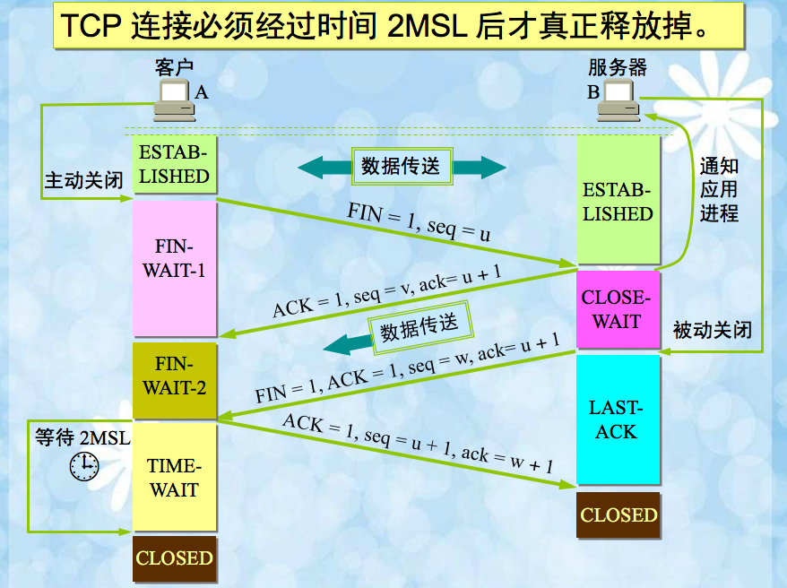
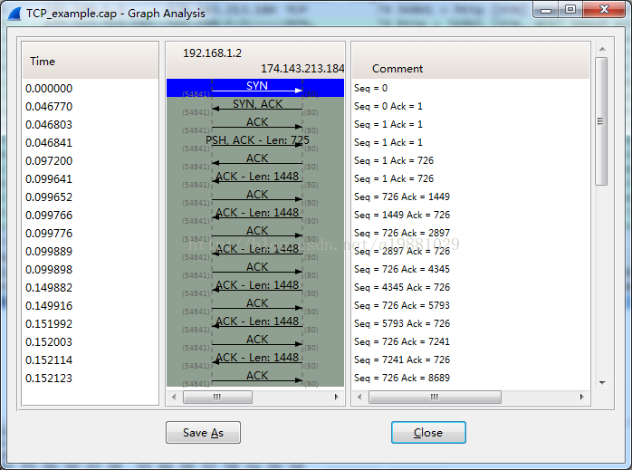

# TCP

TCP（Transmission Control Protocol）是一种面向连接的、可靠的、基于字节流的**传输层**通信协议

## TCP特性

- TCP是对面连接、可靠的字节流服务

- 在一次TCP连接中，仅有两方进行通信。广播和多播不能用TCP

- TCP使用校验和，确认和重传机制来保证可靠传输

- TCP给数据分节进行排序，并使用累积确认保证数据的顺序不变和非重复

- TCP使用滑动窗口机制来实现流量控制，通过动态改变窗口的大小进行拥塞控制

需要注意的是：TPC并不能保证数据一定能百分百传输成功，TCP能做的只是，如果有可能就把数据传递给对方，否则就（通过放弃重传且中断连接的方式）通过用户。因此准备的说TCP不是百分百可靠的协议，它所能提供是数据的可靠传送或故障的通知

## 三次握手与四次挥手

每次主动建立一次TCP连接，客户端和服务端需要共交换三个数据包，即三次握手

每次主动断开一次TCP连接，客户端和服务端需要共交换四个数据包，即四次挥手

TCT报文中有6种标志位：

- SYN：建立连接

- ACK：是对收到的数据包的确认，值是`Acknowledge number`

- PSH：发送

- FIN：结束

- RST：重置

- URG：紧急

- Sequence number：序列号，为了建立连接以后传送数据的位置

- Acknowledge number：表示期望对方（接收方）的下一次`sequence number`是多少

### 三次握手

三次握手的目的是连接服务器的指定端口，建立TCP连接，并同步双方的序列号和确认号交换TCP窗口大小信息,在Socket编程中客户端执行`connect()`时，将触发三次握手。

- 第一次握手: `SYN(同步序列编号)=1`;`seq(序号)=x`

  - `SYN=1`: 告诉服务器，这是一个希望建立连接请求

  - `seq=x`: 一个随机的初始顺列号

  发送完毕后，客户端进入`SYN_SEND`状态。

- 第二次握手: `ACK=1`; `ACKnum=x+1`; `seq=y`; `SYN=1`

  - `ACK=1`：用来确认收到客户端的SYN包

  - `ACKnum=x+1`：准备接收序列号为`x+1`的包

  - `SYN=1`：表明服务端也希望建立TCP连接

  - `seq=y`: 发送自己的初始顺列号

  发送完毕后，服务器端进入`SYN_RCVD`状态

- 第三次握手: `ACK=1`; `ACKnum=y+1`；`seq=x+1`

  - `ACK=1`：用来确认收到服务端的包

  - `seq=x+1`: 此时序列号为`x+1`(对应上一步上的`ACKnum=x+1`)

  - `ACKnum=y+1`：表示客户端准备接收服务端序列号为`y+1`的数据包

  发送完毕后，客户端和服务端都进入`ESTABLISEND`状态，TCP握手结束。

三次握手图示：

## 四次挥手

TCP的连接的解除需要发送四个包，因此称为四次挥手。客户端和服务端均可以主动发起挥手动作，在`socket`编程中，任何一方执行`close()`操作即可产生挥手操作。

- 第一次挥手: `FIN=1`; `seq=x`

  以客户端想要关闭连接为例

  - `FIN_WAIT_1`:表示自己已经没有数据可以发送了(但是仍然可以接受数据)

  - `seq=x`: 序列号

  发送完毕后，客户端`FIN_WAIT_1`状态

- 第二次挥手: `ACK=1`; `ACKnum=x+1`; `seq=y`

  - ACK=1：确认收到包（但还没有准备好关闭连接）

  - ACKnum=x+1：准备接收`x+1`位置的包

  - seq=y： 发送自己的顺列号

发送完毕后，服务器进入`CLOSE_WAIT`状态，客户端接收到这个确认包之后，进入`FIN_WAIT2`状态，等待服务器关闭连接

- 第三次挥手：`FIN=1`; `ACK=1`; `seq=z`; `ACKnumber=x+1`

  - `FIN=1`: 服务器端准备好关闭连接时，向客户端发送结束连接请求

  - `ACK`: 继续之前的确认？

  - `seq=z`：再发一个序咧号？

  - `ACKnumber=x+1`：准备接收`x+1`位置的包

  发送完毕后，服务器进入`LAST_ACK`状态，等待来自客户端的最后一个ACK

- 第四次挥手：`ACK=1`; `seq=x+1`; `ACKnum=z+1`

  - `ACK=1`: 确认收到包

  - `seq=x+1`：包的位置（对应上面的`ACKnumber=x+1`）

  - `ACKnum=z+1`: 准备接收`z+1`的位置的包

客户端接收来自服务器端的关闭请求，发送一个确认包，并进入`TIME_WAIT`状态，等待可能出现的要求重传的`ACK包`

服务器端接收到这个确认包之后，关闭连接，进入`close`状态

客户端等待了某个固定时间之后，没有收到服务器端的`ACK`，认为服务器端已经正常关闭连接，于是自己也关闭连接，进入`CLOSED`状态。

四次挥手的示意图如下：

## Seq和ACKnum

- `seq`:表示当前要传输的数据在包中的位置

- `ACKnum`: 表示希望下次对方传数据过来时，数据在包中的位置

拿下完整的TCP连接-HTTP请求-TCP断开列子来理解一下

**ACK仅仅表示确认的意思，下面图中的ACK表示的是 ACKnum**

1. =》包1：TCP会话的任何一端开始的序列号可能是随机也有可能是上一个该端口的序列号+1，这里假设从 0 开始（`seq=0,SYN=1`）

2. 《= 包2：服务端收到客户端的请求，并在响应中标记`ACK_N=0+1`告诉客户端下次数据从`1`位置开始传输，同时标记`seq=0`表示自己当前序列位置

3. =》包3：收到服务端的响应后，客户端继续做出回应，此时标记`seq=1`（对应包2中的`ACK_N=0+1`），同时标记`ACK_N=1`(对应包2的`seq=0+1`)，表示希望服务端下次传数据从`1`位置开始

  此时TCP握手成功

4. =》包4：客户端开始发送HTTP请求，此时请求包标记`seq=1`，之所以仍为 1 是因为目前还没发送过数据，位置不需要改变，同时也对应包2的`ACK_N=1`；`ACK_N`也还是`1`（因为没收到服务端任何数据，维持包3的位置），除了这些标记还传送了 725 字节长度的数据

5. 《= 包5：服务端收到请求了，当前标记`seq=1`（因为目前服务端没传送过任何数据，不需要改变位置，同时对应包4中的`ACK_N=1`），`ACK_N=725+1`(因为客户端发送了`725`字节的数据)，那么下次希望客户端从`726`位置开始传送数据

6. 《= 包6：紧接着服务端发送`1448`字节长度的数据，此时标记`seq=1`（因为在这之前没传送过任何数据，不需要改变位置，同时也对应包4的`ACK_N=1`），`ACK_N=725+1`(同包5，因为客户端发送了`725`字节的数据)，那么下次希望客户端从`726`位置开始传送数据

7. =》包7：此时客户端`seq=726`（对应包6中的`ACK_N=725+1`），`ACK_N`是`1448+1`（因为目前包6中服务端发送了`1448`字节长度的数据），告诉服端希望下次从`1449`位置开始传输数据

8. 《= 包8：服务端再次发送`1448`字节长度的数据，此时标记`seq=1449`（对应客户端的`ACK_N=1449`），`ACK_N=726`(因为目前为客户端共发送了`725`字节的数据)，那么下次希望客户端从`726`位置开始传送数据

9. =》包9：客户端`seq=726`(对应包8中的`ACK_N=726`)，`ACK_N=1448+1448+1=2896`(服务传过的两次数据的长度+1)，表示下次服端应从`2896`位置开始传输数据

10. 《= 包10：`seq=2896`(对应包9中的`ACK_N=2896`)，`ACK_N=726`（因为目前为客户端共发送了`725`字节的数据），同时发送`1448`字节的数据

11. =》包11：`seq=726`(对应包10中的`ACK_N=726`),`ACK_N=1448+1448+1448+1=4345`(共发送了4344的字节长度+1)

以此类推

接下来断开连接

12. =》 包12： `seq=627`（还是之前的值），`ACK_N=4345`(还是之前的值,即使要断开也要通知一下，如果万一你还有数据过来，请放在这个位置),`FIN=1`表示要断开连接了

13. 《= 包13：`seq=4345`（对应包12的`ACK_N=4345`）`ACK_N=627+1=628`

14. 《= 包13：`seq=4345`（保持之前包13的）`ACK_N=628`（保持之前包13的）,`FIN=1`表示要断开连接了

15. => 包14：客户端发送`ACK=1`,`seq=628`,`ACK_N=4345`，结束

## SYN攻击

什么是 SYN 攻击（SYN Flood）？

在三次握手过程中，服务器发送 SYN-ACK 之后，收到客户端的 ACK 之前的 TCP 连接称为半连接(half-open connect)。此时服务器处于 SYN_RCVD 状态。当收到 ACK 后，服务器才能转入 ESTABLISHED 状态.

SYN 攻击指的是，攻击客户端在短时间内伪造大量不存在的IP地址，向服务器不断地发送SYN包，服务器回复确认包，并等待客户的确认。由于源地址是不存在的，服务器需要不断的重发直至超时，这些伪造的SYN包将长时间占用未连接队列，正常的SYN请求被丢弃，导致目标系统运行缓慢，严重者会引起网络堵塞甚至系统瘫痪。

SYN 攻击是一种典型的 DoS/DDoS 攻击

**如何检测 SYN 攻击？**

检测 SYN 攻击非常的方便，当你在服务器上看到大量的半连接状态时，特别是源IP地址是随机的，基本上可以断定这是一次SYN攻击。在 Linux/Unix 上可以使用系统自带的 netstats 命令来检测 SYN 攻击

**如何防御 SYN 攻击？**

SYN攻击不能完全被阻止，除非将TCP协议重新设计。我们所做的是尽可能的减轻SYN攻击的危害，常见的防御 SYN 攻击的方法有如下几种：

- 缩短超时（SYN Timeout）时间

- 增加最大半连接数

- 过滤网关防护

- SYN cookies技术

## TCP KeepAlive

TCP 的连接，实际上是一种纯软件层面的概念，在物理层面并没有“连接”这种概念。TCP 通信双方建立交互的连接，但是并不是一直存在数据交互，有些连接会在数据交互完毕后，主动释放连接，而有些不会。在长时间无数据交互的时间段内，交互双方都有可能出现掉电、死机、异常重启等各种意外，当这些意外发生之后，这些 TCP 连接并未来得及正常释放，在软件层面上，连接的另一方并不知道对端的情况，它会一直维护这个连接，长时间的积累会导致非常多的半打开连接，造成端系统资源的消耗和浪费，为了解决这个问题，在传输层可以利用 TCP 的 KeepAlive 机制实现来实现。主流的操作系统基本都在内核里支持了这个特性。

TCP KeepAlive 的基本原理是，隔一段时间给连接对端发送一个探测包，如果收到对方回应的 ACK，则认为连接还是存活的，在超过一定重试次数之后还是没有收到对方的回应，则丢弃该 TCP 连接。

TCP-Keepalive-HOWTO 有对 TCP KeepAlive 特性的详细介绍，有兴趣的同学可以参考。这里主要说一下，TCP KeepAlive 的局限。首先 TCP KeepAlive 监测的方式是发送一个 probe 包，会给网络带来额外的流量，另外 TCP KeepAlive 只能在内核层级监测连接的存活与否，而连接的存活不一定代表服务的可用。例如当一个服务器 CPU 进程服务器占用达到 100%，已经卡死不能响应请求了，此时 TCP KeepAlive 依然会认为连接是存活的。因此 TCP KeepAlive 对于应用层程序的价值是相对较小的。需要做连接保活的应用层程序，例如 QQ，往往会在应用层实现自己的心跳功能。

> TCP KeepAlive和HTTP KeepAlive是两个东西！

## Q&A

**为什么建立连接需要三次握手，关闭连接需要四次握手**

因为关闭连接时，在收到对方的`FIN报文`通知时，仅仅表示没有数据要发送给你了，但未必你所有的数据都全部发送给对方了，也就是说你可能还会发送一份数据给对方之后，再发`·FIN报文`对对方表示同意关闭连接，所以它这里的`ACK报文`和`FIN报文`是分开发送

**为什么需要三次握手，而非两次**

为了防止已经失效的连接请求报文段突然又传到服务端，因而产生错误。

这种情况是：一端(client)A发出去的第一个连接请求报文并没有丢失，而是因为某些未知的原因在某个网络节点上发生滞留，
导致延迟到连接释放以后的某个时间才到达另一端(server)B。本来这是一个早已失效的报文段，但是B收到此失效的报文之后，
会误认为是A再次发出的一个新的连接请求，于是B端就向A又发出确认报文，表示同意建立连接。如果不采用“三次握手”，
那么只要B端发出确认报文就会认为新的连接已经建立了，但是A端并没有发出建立连接的请求，因此不会去向B端发送数据，
B端没有收到数据就会一直等待，这样B端就会白白浪费掉很多资源。如果采用“三次握手”的话就不会出现这种情况，B端收到一个过时失效的报文段之后，向A端发出确认，此时A并没有要求建立连接，所以就不会向B端发送确认，这个时候B端也能够知道连接没有建立。

TPC的连接是交互序号的过程，A向B通信，B向A回传，这两次只能确认对A的序列号答成一致，并不能对B的序列号还没确认

- A向B说，我是A

- B回A，我知道你是A了，我是B

此时结束的话，B会想，这A到底知道不知道我是B

**TCP第四次挥手为什么要等待2MSL**

最主要是因为两个理由:

1. 为了保证客户端发送的最后一个`ACK报文段`能够到达服务器。因为这个`ACK`有可能丢失，从而导致处在`LAST-ACK`状态的服务器收不到对`FIN-ACK`的确认报文。服务器会超时重传这个`FIN-ACK`，接着客户端再重传一次确认，重新启动时间等待计时器。最后客户端和服务器都能正常的关闭。假设客户端不等待`2MSL`，而是在发送完`ACK`之后直接释放关闭，一但这个`ACK`丢失的话，服务器就无法正常的进入关闭连接状态

2. 客户端在发送`ACK`后，再等待`2MSL`时间，可以使本次连接所产生的数据段从网络中消失，从而保证下次建立连接后不会产生数据冲突

**为什么seq是随机的**

`seq`一般是基于时间，利用散列函数（这个函数一定时间也会轮换）计算而成的，目的是防止被猜测序列号从而被伪造攻击。同时因为是基于时间的，所以几乎不会与最近断开的或正在等待中的序列号相同

>[理解TCP序列号（Sequence Number）和确认号（Acknowledgment Number)](https://blog.csdn.net/a19881029/article/details/38091243)

> [TCP特性](https://hit-alibaba.github.io/interview/basic/network/TCP.html)