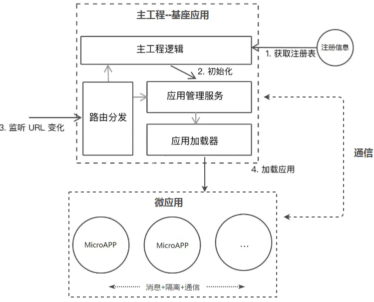
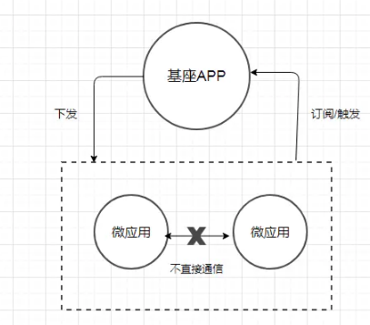

# 微前端

## 方案

微前端的重要思想就是将应用进行拆解和整合，通常是一个父应用加上一些子应用，那么使用类似Nginx配置不同应用的转发，或是采用iframe来将多个应用整合到一起等等这些其实都属于微前端的实现方案，下面是收集到的方案

### Nginx路由转发mount

通过Nginx配置反向代理来实现不同路径映射到不同应用，例如www.abc.com/app1对应app1，www.abc.com/app2对应app2，这种方案本身并不属于前端层面的改造，更多的是运维的配置

**优点**

简单，快速，易配置

**缺点**

在切换应用时会触发浏览器刷新，影响体验

### iframe嵌套

父应用单独是一个页面，每个子应用嵌套一个iframe，父子通信可采用 `postMessage` 或者 `contentWindow` 方式

**优点**

实现简单，子应用之间自带沙箱，天然隔离，互不影响

**缺点**

iframe的样式显示、兼容性等都具有局限性；太过简单而显得low

### Web Components

每个子应用需要采用纯Web Components技术编写组件，是一套全新的开发模式

**优点**

每个子应用拥有独立的script和css，也可单独部署

**缺点**

对于历史系统改造成本高，子应用通信较为复杂易踩坑

### 组合式应用路由分发

每个子应用独立构建和部署，运行时由父应用来进行路由管理，应用加载，启动，卸载，以及通信机制

**优点**

纯前端改造，体验良好，可无感知切换，子应用相互隔离

**缺点**

需要设计和开发，由于父子应用处于同一页面运行，需要解决子应用的样式冲突，变量对象污染，通信机制等技术点

目前已有的微前端框架

- Mooa：基于Angular的微前端服务框架

- Single-Spa：最早的微前端框架，兼容多种前端技术栈。

- Qiankun：基于Single-Spa，阿里系开源微前端框架。

- Icestark：阿里飞冰微前端框架，兼容多种前端技术栈。

- Ara Framework：由服务端渲染延伸出的微前端框架。


## 架构

当下微前端主要采用的是组合式应用路由方案，该方案的核心是“主从”思想，即包括一个基座（MainApp）应用和若干个微（MicroApp）应用，基座应用大多数是一个前端SPA项目，主要负责应用注册，路由映射，消息下发等，而微应用是独立前端项目，这些项目不限于采用React，Vue，Angular或者JQuery开发，每个微应用注册到基座应用中，由基座进行管理，但是如果脱离基座也是可以单独访问，基本的流程如下图所示：


	
**基座**

基座是应用中有一些菜单项，点击每个菜单项可以展示对应的微应用，这些应用的切换是纯前端无感知的，所以，基于目前的方案来说，一个微前端的基座框架需要解决以下问题：

- 路由切换的分发问题。

- 主微应用的隔离问题。

- 通信问题
	
	
### 微前端的路由分发

作为微前端的基座应用，是整个应用的入口，负责承载当前微应用的展示和对其他路由微应用的转发，对于当前微应用的展示，一般是由以下几步构成：

1. 作为一个SPA的基座应用，本身是一套纯前端项目，要想展示微应用的页面除了采用iframe之外，要能先拉取到微应用的页面内容， 这就需要远程拉取机制

2. 远程拉取机制通常会采用fetch API来首先获取到微应用的HTML内容，然后通过解析将微应用的JavaScript和CSS进行抽离，采用eval方法来运行JavaScript，并将CSS和HTML内容append到基座应用中留给微应用的展示区域，当微应用切换走时，同步卸载这些内容，这就构成的当前应用的展示流程
   
3. 当然这个流程里会涉及到CSS样式的污染以及JavaScript对全局对象的污染，这个涉及到隔离问题会在后面讨论，而目前针对远程拉取机制这套流程，已有现成的库来实现，可以参考 `import-html-entry` 和 `system.js`

对于路由分发而言，以采用vue-router开发的基座SPA应用来举例，主要是下面这个流程：

1. 当浏览器的路径变化后，vue-router会监听hashchange或者popstate事件，从而获取到路由切换的时机

2. 最先接收到这个变化的是基座的router，通过查询注册信息可以获取到转发到那个微应用，经过一些逻辑处理后，采用修改hash方法或者pushState方法来路由信息推送给微应用的路由，微应用可以是手动监听 `hashchange` 或者 `popstate` 事件接收，或者采用 React-router，vue-router 接管路由，后面的逻辑就由微应用自己控制

### 微前端的应用隔离

应用隔离问题主要分为主应用和微应用，微应用和微应用之间的JavaScript执行环境隔离，CSS样式隔离，我们先来说下CSS的隔离

**CSS隔离：**

当主应用和微应用同屏渲染时，就可能会有一些样式会相互污染，如果要彻底隔离CSS污染，可以采用CSS Module 或者命名空间的方式，给每个微应用模块以特定前缀，即可保证不会互相干扰，可以采用webpack的postcss插件，在打包时添加特定的前缀

而对于微应用与微应用之间的CSS隔离就非常简单，在每次应用加载时，将该应用所有的link和style 内容进行标记。在应用卸载后，同步卸载页面上对应的link和style即可

**JavaScript隔离:**

每当微应用的JavaScript被加载并运行时，它的核心实际上是对全局对象Window的修改以及一些全局事件的改变，例如jQuery这个js运行后，会在Window上挂载一个window.$对象，对于其他库React，Vue也不例外。为此，需要在加载和卸载每个微应用的同时，尽可能消除这种冲突和影响，最普遍的做法是采用沙箱机制（SandBox）

沙箱机制的核心是让局部的JavaScript运行时，对外部对象的访问和修改处在可控的范围内，即无论内部怎么运行，都不会影响外部的对象。通常在Node.js端可以采用vm模块，而对于浏览器，则需要结合with关键字和window.Proxy对象来实现浏览器端的沙箱

### 微前端的消息通信

应用间通信有很多种方式，当然，要让多个分离的微应用之间要做到通信，本质上仍离不开中间媒介或者说全局对象。所以对于消息订阅（pub/sub）模式的通信机制是非常适用的，在基座应用中会定义事件中心Event，每个微应用分别来注册事件，当被触发事件时再有事件中心统一分发，这就构成了基本的通信机制，流程如下图：



## qiankun

通过[qiankun](https://qiankun.umijs.org/zh)的使用，先来实现一个微服务demo

## 实战

这里使用 `vue` 项目作为基座应用

### 创建基座应用

创建基座应用需要进行三步操作：

1. 创建微应用容器 - 用于承载微应用，渲染显示微应用；

2. 注册微应用 - 设置微应用激活条件，微应用地址等等；

3. 启动 qiankun；

**注册微应用**

```js
// micro/index.js
import NProgress from "nprogress";
import "nprogress/nprogress.css";
import {
  registerMicroApps,
  addGlobalUncaughtErrorHandler,
  start,
} from "qiankun";

// 微应用注册信息
import apps from "./apps";

/**
 * 注册微应用
 * 第一个参数 - 微应用的注册信息
 * 第二个参数 - 全局生命周期钩子
 */
registerMicroApps(apps, {
  // qiankun 生命周期钩子 - 微应用加载前
  beforeLoad: (app) => {
    // 加载微应用前，加载进度条
    NProgress.start();
    console.log("before load", app.name);
    return Promise.resolve();
  },
  // qiankun 生命周期钩子 - 微应用挂载后
  afterMount: (app) => {
    // 加载微应用前，进度条加载完成
    NProgress.done();
    console.log("after mount", app.name);
    return Promise.resolve();
  },
});

/**
 * 添加全局的未捕获异常处理器
 */
addGlobalUncaughtErrorHandler((event) => {
  console.error(event);
  const { msg } = event
  // 加载失败时提示
  if (msg && msg.includes("died in status LOADING_SOURCE_CODE")) {
    this.$message.error('微应用加载失败，请检查应用是否可运行');
  }
});

// 导出 qiankun 的启动函数
export default start;


// micro/app.js
注意微应用的路由
const apps = [
  {
    name: "VueMicroApp",
    entry: "//localhost:8081",
    container: "#frame",
    activeRule: "/home/vue",
  },
];

export default apps;
```

上面通过 `registerMicroApps` 和 `addGlobalUncaughtErrorHandler` 两个方法注册微应用和错误捕获器

然后在入口文件中启动

```js
// 入口文件添加 微应用配置
import startQiankun from "./micro/index";
startQiankun()
``` 

### 基座路由配置

```js
const routes = [
   {
        path: '/',
        redirect: '/home'
    },

    home,
    { path: '/login', component: Login },
    { name: '/404', path: '/:catchAll(.*)', component: NoPage },
]
// home.js
export default {
  path: '/home',
  name: '首页',
  component: Home,
  children: [
    {
      path: '',
      name: '欢迎页',
      component: Welcome
    },
   {
      path: 'overview',
      name: '概览',
      component: Wverview // 这个页面是基座中的页面
    },
    {
      path: ':microApp(.*)',// 匹配微项目
      component: { template: '<div id="frame"></div>' }
    },
  ]
}
```

在后台系统中，首页、登录页、404等放在一级路由，因为首页中的具体模块也是在首页中展示的所以本人习惯将这些模块也放在首页的二级路由中，微应用模块也属性首页模块中，因此这里我也将微应用的路由匹配也放在二级目录中，以上纯属个人偏好的配置习惯

当匹配 `/home/vue` 时，将加载 `<div id="frame"></div>`，当加载微应用时将挂载在 `#frame` 中

### 子应用改造

子应用需要改造的地方有以下几点：

- 封装启动应用的方式

- 导出相应的生命周期钩子

- 配置微应用的打包工具

**封装启动应用的方式**

之前独立运行时浏览器在加载入口文件后，就直接执行创建 Vue 应用的方法了，如下：

```js
const app = createApp(App)
app.use(ElementPlus, {locale})
app.use(router)
app.use(store)
app.use(hllView)
app.mount('#app')
```

如果是要当做微应用启动的话，创建应用的触发时机就要由基座来控制，所以需要将创建应用的代码封装在一个函数中，即支持自执行也支持供基座调用，那么第一个问题来了怎么判断当前是自执行 `render` 方法呢(怎么判断是独立运行时)？ 又怎么被基座调用呢？直接上代码

```js
let app = null;
function render(){
  app = createApp(App)
  app.use(ElementPlus, {locale})
  app.use(router)
  app.use(store)
  app.use(hllView)
  app.mount('#app2')
}
// 独立运行时，直接挂载应用
if (!window.__POWERED_BY_QIANKUN__) {
  render();
}
export async function mount(props){
  console.log("VueMicroApp mount", props);
  render(props);
}
```

使用 `qiankun` 框架时，如果是在以微应用启动的会在全局环境中注入 `window.__POWERED_BY_QIANKUN__` 属性，通过这个属性来判断当前应用是以微前端形式启动的，还是独立运行的

然后导出一个 `mount` 生命周期方法，`mount` 方法是使用 `qiankun` 使用的，当 `qiankun` 调用这个 `mount` 方法时再去执行 `redner` 方法

**导出相应的生命周期钩子**

微应用需要在自己的入口 js 导出 `bootstrap`、 `mount` 、 `unmount`  三个生命周期钩子，以供主应用在适当的时机调用

`mount` 方法上面已经提到了，除了 `mount` 外，`qiankun` 还需要子应用提供 `bootstrap`和 `unmount` 方法，这三个生命钩子是必需的，还有一个不怎么用到的 `update` 钩子，他们的具体作用解释如下：

- `bootstrap`： `bootstrap` 只会在微应用初始化的时候调用一次，下次微应用重新进入时会直接调用 `mount` 钩子，不会再重复触发 `bootstrap`,通常我们可以在这里做一些全局变量的初始化，比如不会在 `unmount` 阶段被销毁的应用级别的缓存

- `mount`: 应用每次进入都会调用 `mount` 方法，通常我们在这里触发应用的渲染方法

- `unmount`：应用每次 切出/卸载 会调用的方法，通常在这里我们会卸载微应用的应用实例

- `update`: 可选生命周期钩子，仅使用 `loadMicroApp` 方式加载微应用时生效

**配置微应用的打包工具**

上文提到在微应用中需要导出相应的生命周期钩子，但是默认情况下打包出来这些方法是没有暴露出去的，为了让主应用能正确识别微应用暴露出来的一些信息，微应用需要以库的形式打包

因此 webpack 需要增加如下配置：

```js
const packageName = require('./package.json').name;

module.exports = {
    output: {
      library: "VueMicroApp",  // 微应用的包名，这里与主应用中注册的微应用名称一致
      libraryTarget: "umd",  // 将你的 library 暴露为所有的模块定义下都可运行的方式
      jsonpFunction: "webpackJsonp_VueMicroApp",  // 用于按需加载(load on-demand) chunk 的 JSONP 函数
    }``
};

```

**注意上面的 `output.library` 就是为打包的库名，主应用将使用这个名字来加载微应用**

**允许跨域**

主应用加载子应用时，也是通过请求的方法获取的，当不同域时会被出现跨域问题，所以需要在 `webpack` 中做下跨域配置

```js
  // vue.config.js
  devServer: {
    // 关闭主机检查，使微应用可以被 fetch
    disableHostCheck: true,
    // 配置跨域请求头，解决开发环境的跨域问题
    headers: {
      "Access-Control-Allow-Origin": "*",
    },
  },
```

完整的配置如下：

```js
// vue.config.js
module.exports = {
  lintOnSave: false,
  devServer: {
    // 关闭主机检查，使微应用可以被 fetch
    disableHostCheck: true,
    // 配置跨域请求头，解决开发环境的跨域问题
    headers: {
      "Access-Control-Allow-Origin": "*",
    },
  },
  configureWebpack: {
    output: {
      // 微应用的包名，这里与主应用中注册的微应用名称一致
      library: "VueMicroApp",
      // 将你的 library 暴露为所有的模块定义下都可运行的方式
      libraryTarget: "umd",
      // 按需加载相关，设置为 webpackJsonp_VueMicroApp 即可
      jsonpFunction: `webpackJsonp_VueMicroApp`,
    },
  },
};
```


```js
// src/main.js
import { createApp } from 'vue/dist/vue.esm-bundler.js'
import ElementPlus from 'element-plus';
import locale from 'element-plus/lib/locale/lang/zh-cn'
import App from './App.vue'
import router from './router'
import store from './store'
import hllView from './components/hllView/index'
import './assets/scss/element-variables.scss'
import './assets/scss/app.scss'

let app = null;
function render(){
  app = createApp(App)
  app.use(ElementPlus, {locale})
  app.use(router)
  app.use(store)
  app.use(hllView)
  app.mount('#app2')
}
// 独立运行时，直接挂载应用
if (!window.__POWERED_BY_QIANKUN__) {
  render();
}
export async function mount(props){
  console.log("VueMicroApp mount", props);
  render(props);
}
export async function bootstrap(){
  console.log("VueMicroApp bootstraped");
}
export async function unmount(){
  console.log("VueMicroApp unmount");
  app.$destroy();
  app = null;
}
```

### 应用之间的通信

qinkun 提供了 [initGlobalState](https://qiankun.umijs.org/zh/api#initglobalstatestate) 方法来定义全局数据和通信方式，当前我的基座是使用 `vue` 开发的，所以这里我通过 `initGlobalState` 和 vuex 结合使用实现应用之间的通信，思路如下：

- 基座使用 Vuex 管理状态

- 将基座的 store 中的 `state`、`commit`、 `dispatch` 通过 `initGlobalState` API 传给子应用，子应用修改基座的 `state` 只能通过 `commit` 或者 `dispatch`

- 基座应用监听 `store` 变化，当发生变化时，通过 `setGlobalState` 方法进行 `state` 修改

- 子应用通过 `onGlobalStateChange` 监听变化，赋值新的 `state`

基座相关代码：

```js
import { initGlobalState } from "qiankun";
import store from '../store'
// 设置通信
const state = {
  baseStore: store.state,
  commit: store.commit,
  dispatch: store.dispatch
}
export const actions = initGlobalState(state);
actions.onGlobalStateChange((state, prev) => {
  // state: 变更后的状态; prev 变更前的状态
  console.log('主应用onGlobalStateChange', state, prev);
});
actions.offGlobalStateChange();
store.subscribe((mutation, state) => {
  console.log('state', state)
  actions.setGlobalState({
    ...state,
    baseStore: store.state,
  });
})
```

#### 子应用是Vue

如果当前子应用也是使用 Vue 的话，获取基座的 `state` 时，通过 `Vue.observable` (2.x) 或 `reactive` (3.x)，使其变成响应式的，方便在组件中使用

```js
function render(props = {}){
  app = createApp(App)
  app.use(ElementPlus, {locale})
  app.use(router)
  app.use(store)
  app.use(hllView)
  backgroundAction(app, props)
  app.mount('#app2')
}
export async function mount(props){
  render(props);
}
function backgroundAction(app, props){
  if (window.__POWERED_BY_QIANKUN__) {
    props.onGlobalStateChange((state, prev) => {
      if(app.config.globalProperties.$baseStore){
        app.config.globalProperties.$baseStore.state = state.baseStore
      } else {
        app.config.globalProperties.$baseStore = reactive({state: state.baseStore })
      }
    }, true)
  }
}
```

主要是函数 `backgroundAction`, `onGlobalStateChange` 的第二个参数设为 `true`，首次加载就执行一次回调，在回调中将 `state.baseStore` 存到全局变量中，并且通过 `reactive` 让其变成可响应的，注意更改 `$baseStore` 时不能全量覆盖，要不然跟之前值失去了的关系，所以这里额外添加一个 `state` 属性来保存 `baseStore` 的值

#### 子应用是React

如果是子应用是 React 的话可以借助 `context` API 来存在基座的 store

```js
import React from 'react';
import ReactDOM from 'react-dom';
import App from './App';
import reportWebVitals from './reportWebVitals';
import './static/less/index.less';

function render(props = {}){
	ReactDOM.render(
		<App baseActions={props} />,
		document.getElementById('root')
	);
}
// 独立运行时，直接挂载应用
if (!window.__POWERED_BY_QIANKUN__) {
	render();
}
export async function mount(props){
	render(props);
}
export async function bootstrap(){
	console.log("VueMicroApp bootstraped");
}
export async function unmount(){
	console.log("VueMicroApp unmount");
	// app.$destroy();
	// app = null;
	// router = null;
}

// If you want to start measuring performance in your app, pass a function
// to log results (for example: reportWebVitals(console.log))
// or send to an analytics endpoint. Learn more: https://bit.ly/CRA-vitals
reportWebVitals();


```

创建一个`context`

```js
//creatContext.js
import React from "react";

export const BaseContext = React.createContext({});
```

根应用添加 `BaseContext`

```js
// app.js
import React, {useEffect,  useState} from 'react'
import { BrowserRouter } from 'react-router-dom'
import { renderRoutes } from 'react-router-config';
import { routes } from './route/index'
import {ConfigProvider} from "antd";
import zhCN from "antd/lib/locale/zh_CN";
import { BaseContext } from './creatContext'


function App(props) {
  let test = {}
  let [baseState, setBaseState] = useState(test)
  useEffect(() => {
    if (window.__POWERED_BY_QIANKUN__) {
      props.baseActions.onGlobalStateChange((state, prev) => {
        setBaseState(state.baseStore)
      }, true)
    }
  }, []);
  return (
    <BaseContext.Provider value={baseState}>
      <BrowserRouter>
        <ConfigProvider locale={zhCN}>
          {renderRoutes(routes)}
        </ConfigProvider>
      </BrowserRouter>
    </BaseContext.Provider>
  );
}

export default App;

```

子页面使用 `context`

```js
import { useContext } from 'react'
import { BaseContext } from '../../creatContext'

export default function Login(){
  const value = useContext(BaseContext)
  return (
    <div className="title">{JSON.stringify(value)}小码快运登录系统</div>
  )
}
```

同样也是使用 `commit`， `dispatch` 方法来更改基座中的 `store`

### 样式隔离

qinkun 在调用 `start` 方法的时候提供了样式隔离的配置方法 

```js
start({
	sandbox: {
		experimentalStyleIsolation: true
	}
})
```

### Q&A

**如果在 `unmount` 没有销毁应用会怎样?**

### 注意点

注意微项目的挂载节点不要与主容器的挂载节点相同。假如在主容器应该中我们的挂在 `#app` 节点中，那么微项目的挂载的节点不能也是 `#app`，要不然会被覆盖 


> [qiankun](https://qiankun.umijs.org/zh/guide)

> [single-spa](https://zh-hans.single-spa.js.org/docs/api#triggerappchange)

> [微前端-最容易看懂的微前端知识](https://juejin.cn/post/6844904162509979662)

> [基于 qiankun 的微前端最佳实践（万字长文） - 从 0 到 1 篇](https://segmentfault.com/a/1190000022631614)
