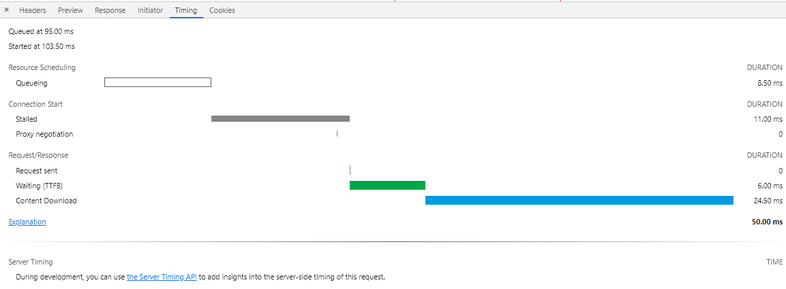
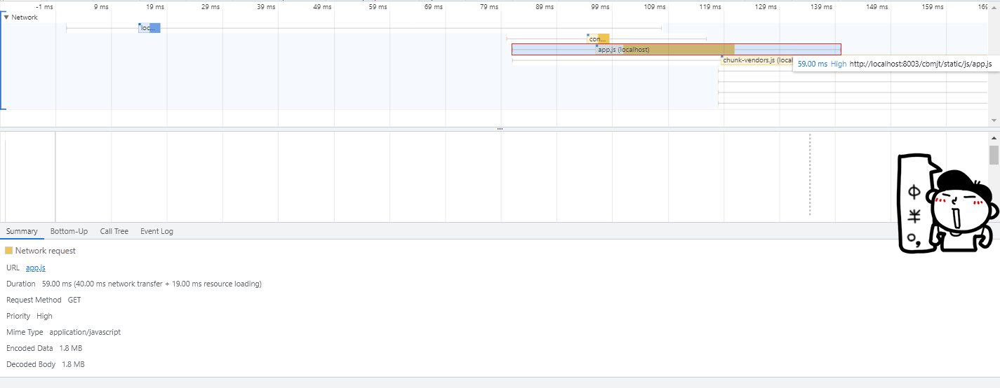
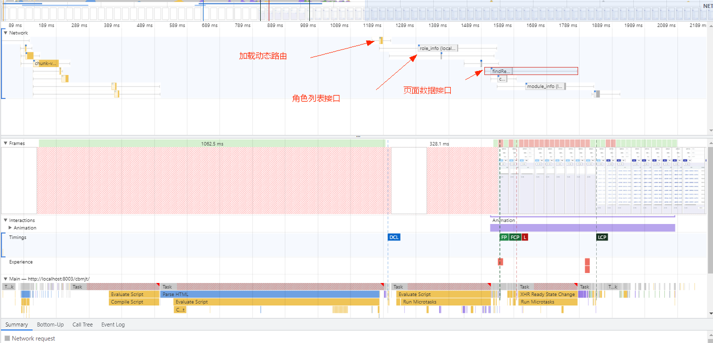

# 性能检测工具

## Network-Timeline

- Queueing: 等待队列时间

- Stalled: 是浏览器得到要发出这个请求的指令到请求可以发出的等待时间，一般是代理协商、以及等待可复用的TCP连接释放的时间，不包括DNS查询、建立TCP连接等时间等

- DNS Lookup：DNS查询的时间，当本地DNS缓存没有的时候，这个时间可能是有一段长度的，但是比如你一旦在Host 中设置了 DNS，或者第二次访问，由于浏览器的DNS缓存还在，这个时间就为0了

- Initial connection：建立TCP连接的时间，就相当于客户端从发请求开始到 TCP 握手结束这一段，包括 `DNS查询+Proxy时间+TCP握手时间`

- Request sent： 请求第一个字节发出前到最后一个字节发出后的时间，也就是上传时间

- Waiting(TTFB)：请求发出后，到收到响应的第一个字节所花费的时间(Time To First Byte),发送请求完毕到接收请求开始的时间;这个时间段就代表服务器处理和返回数据网络延时时间了。服务器优化的目的就是要让这个时间段尽可能短。

- Content Download：收到响应的第一个字节，到接受完最后一个字节的时间，就是下载时间

## Performance-Network面板

### 颜色说明

不同的资源将以不同的颜色进行划分：

- HTML 文件为蓝色

- 脚本为黄色

- 样式表为紫色

- 媒体文件为绿色

- 其他资源为灰色

### 时间轴

时间轴的组成说明：

- 左边的线：request send前

- 浅色块： request send 和 waiting 时间

- 深色块： content download 时间

- 右边线： 等待主线程时间，不在Timing中显示

### Summary

我们点击 `app.js` 资源，下面的 `Summary` 将会出现对应的概览信息

