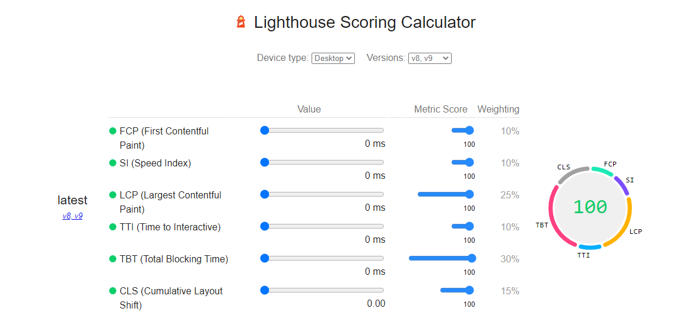
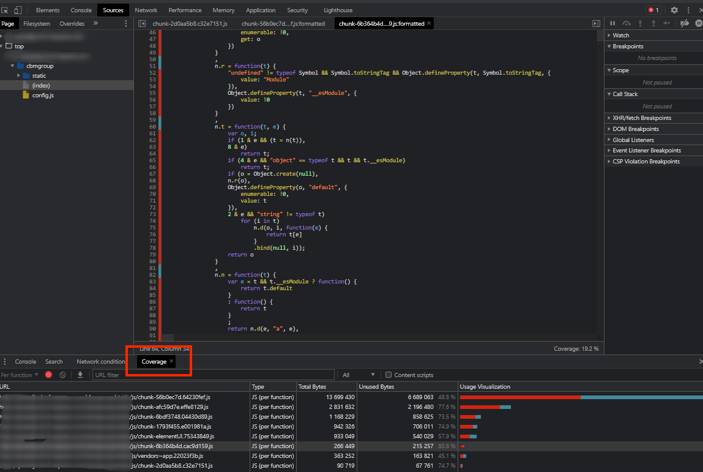

# Lighthouse

lighthouse 是 Google Chrome 推出的一款开源自动化工具，它可以搜集多个现代网页性能指标，分析 Web 应用的性能并生成报告，为开发人员进行性能优化的提供了参考方向

## 指标权重

从 [Lighthouse Scoring Calculator](https://googlechrome.github.io/lighthouse/scorecalc/#FCP=0&SI=0&FMP=0&TTI=0&FCI=0&LCP=0&TBT=0&CLS=0&device=desktop&version=8) 可以看到 lighthouse  提供的几个性能评估指标：

Lighthouse 最新版的提供了 6 个性能指标：FCP、SI、LCP、TTI、TBT 和 CLS；权重分别是 15%，15%，25%，15%，25% 和 5%。Lighthouse 会根据权重计算得到一个分数值

## 整体概览

### 第一部分：概览

这里最主要是整体的界面渲染的时候，每个时间段执行的事件顺序，通过上图我们就能知道我们每个时间段大概做了什么，鼠标放上去可以看到我们每个时间段的界面渲染情况

### 第二部分：性能面板

性能面板主要包括以下几部分：

1. Network 这里我们可以直观的看到资源加载的顺序与时长

2. Interactions 用来记录用户交互操作，比如点击鼠标、输入文字、动画等

3. Timings 用来记录一些关键的时间节点在何时产生的数据信息，诸如 FP、FCP、LCP 等

4. Main 是Performance工具中比较重要的部分，记录了渲染进程中主线程的执行记录，点击main可以看到某个任务执行的具体情况

5. Compositor 合成线程的执行记录，用来记录html绘制阶段 (Paint)结束后的图层合成操作

6. Raster 光栅化线程池，用来让 GPU 执行光栅化的任务

7. GPU GPU进程主线程的执行过程记录，如 可以直观看到何时启动GPU加速

**Memory 选项**

在勾选后，就会显示该折线图，通过该图可以看出我们在不同的时间段的执行情况。我们可以看到页面中的内存使用的情况，比如 JS Heap(堆)，如果曲线一直在增长，则说明存在内存泄露，如果相当长的一段时间，内存曲线都是没有下降的，这里是有发生内存泄露的可能的

如果Nodes和Listeners不断增加说明可能存在重复添加节点或者事件的情况。

最下方就是页面的一个整体耗时概况，如果 Scripting 时间过长，则说明 js执行的逻辑太多，可以考虑优化js，如果渲染时间过长，则考虑优化渲染过程，如果空闲时间过多，则可以考虑充分利用起来，比如把一些上报操作放到页面空闲时间再上报等

### 第三部分：Summary（性能摘要）

它是一个用来统计在我们检测性能的时间范围内，都做了哪些事情：

- Loading ：加载时间

- Scripting ：js计算时间

- Rendering ：渲染时间

- Painting ：绘制时间

- Other ：其他时间

- Idle ：浏览器闲置时间

## Performance 面板

从上往下看下各面板代表什么

### 整体概览

如上图顶部区域所示，这部分展示了五个信息： FPS、CPU、NET、屏幕快照、HEAP，并且鼠标移上去也会展示出当前时刻的屏幕快照

#### FPS-刷新率

FPS(frames per second) 是页面每秒的刷新频率.  FPS 好坏衡量标准：

- fps = 60: 性能极佳

- fps < 24: 会让用户感觉到明显卡顿，因为人眼的识别主要是24帧

**所以为了让帧率尽可能保持在 60 帧率，意味着每次执行的 JS 任务时间需要控制在 `16ms` 之内**

:::tip
浏览器每帧要做的完整事情是：`JS -> Style -> Layout -> Paint -> Composite`
:::

[浏览器的 16ms 渲染帧
DOM JavaScript 异步 性能 重绘 浏览器渲染](https://harttle.land/2017/08/15/browser-render-frame.html)

如上图所示 FPS 图表页面运行期间期间帧率的概览。 由两部分组成：

- 红色条： 当出现红色条时说明帧数已经下降到影响用户体验的程度，颜色越深说明帧数越差

- 绿色的柱体：绿色条越高，帧率越好

#### CPU

上图中 FPS 下面的位置，即是 CPU 图表，可以看 CPU 图表被一些颜色填满，表示 CPU 正在处理某一类的任务，这些颜色对应于 “性能”工具底部摘要面板中的颜色

- 紫色：渲染

- 黄色：JS

- 蓝色：加载

- 绿色：绘制

- 灰色：其它

- 浅灰色：空闲

**如果你看到了某个处理占用了大量的时间，那么这很可能就是一个性能瓶颈的线索**

#### NET

每条横杆代表一种请求资源. 横杆越长，检索资源所需要的事件越长。每个横杆的浅色部分表示等待时间（请求资源到第一个字节下载完成时间）。

HTML文件是蓝色、脚本是黄色、样式是紫色、媒体文件是绿色、其它资源是灰色

这个地方只能看个大概，详细的还是直接看下面的 network 面板比较清楚

#### HEAP

这里展示的内容使用情况，如果反复切换同一页面，图表不断上升，说明可能存在内存泄漏问题

`HEAP 图表` 提供的信息与 `memory 表` 中的 `JS Heap` 相同

### Network面板

在 NetWork 部分，可以查看录制期间发生的网络请求情况. 如图所示面板出现了几个类似时间轴的线条，每条时间轴表示一个网络请求

**颜色划分说明**

不同的资源将以不同的颜色进行划分：

- HTML 文件为蓝色

- 脚本为黄色

- 样式表为紫色

- 媒体文件为绿色

- 其他资源为灰色

**时间轴的组成说明：**

- 左边的线：request send 前

- 浅色块： request send 和 waiting 时间

- 深色块： content download 时间

- 右边线： 等待主线程时间，不在 Timing 中显示

**左上角的深蓝色方形意味着它是一个优先级较高的请求。 浅蓝色的方块表示优先级较低**

#### Net-Summary

我们点击某个时间轴下面的 `Summary` 将会出现对应的概览信息

// todo

#### Network-Timeline

结合 Network 里的  Timeline，可以得某个请求更多的信息

- Queueing: 等待队列时间

- Stalled: 是浏览器得到要发出这个请求的指令到请求可以发出的等待时间，一般是代理协商、以及等待可复用的TCP连接释放的时间，不包括DNS查询、建立TCP连接等时间等

- DNS Lookup：DNS查询的时间，当本地DNS缓存没有的时候，这个时间可能是有一段长度的，但是比如你一旦在Host 中设置了 DNS，或者第二次访问，由于浏览器的DNS缓存还在，这个时间就为0了

- Initial connection：建立TCP连接的时间，就相当于客户端从发请求开始到 TCP 握手结束这一段，包括 `DNS查询+Proxy时间+TCP握手时间`

- Request sent： 请求第一个字节发出前到最后一个字节发出后的时间，也就是上传时间

- Waiting(TTFB)：请求发出后，到收到响应的第一个字节所花费的时间(Time To First Byte),发送请求完毕到接收请求开始的时间;这个时间段就代表服务器处理和返回数据网络延时时间了。服务器优化的目的就是要让这个时间段尽可能短。

- Content Download：收到响应的第一个字节，到接受完最后一个字节的时间，就是下载时间

### Frame 面板

Frames 面板可以更准确地告诉你一个特定的帧花费了多长时间，将鼠标移到某一个帧上面可以看到具体时间

点击某一帧下面 Summary 面板也可以呈现出一些信息

悬浮框出现的信息 `69.0ms ~ 14 fps Frame`，解读为：

- 当前帧的持续时间为 `69.0ms`,即页面两次刷新之间间隔了 `69.0ms`

- `1000ms/69.0ms = 64.10 约等于 14 `

Frame 面板不同的颜色意思为：

- 白色：空白帧，当前页面没有变化

- 绿色： 按预期及时渲染

- 黄色： 渲染了部分视图。例如在滚动的时候可能会出现

- 红色：不能在合理的时间内渲染框架

### Timings 面板

Timings 面板标注了性能指标相关的的完成节点，点击各个节点下面 Summary 也会显示具体的信息. 接下说明一个这些节点各自表示什么：

- DCL(DOMContentLoaded)： 加载完成即触发，不用等页面资源加载

  DCL 测量浏览器准备好执行任何客户端脚本的时间点。用更专业的术语来说，DCL 是在网页加载过程中，浏览器已组装 DOM（文档对象模型）且没有样式表阻止执行 JavaScript 的时间

- FP（First Paint）：表示渲染出第一个像素点。FP一般在HTML解析完成或者解析一部分时候触发

- FCP (First Contentful Paint)：首次内容绘制

  浏览器首次绘制来自DOM的内容的时间，内容必须包括文本，图片，非白色的canvas或svg，也包括带有正在加载中的web字体文本。这是用户第一次看到的内容

    | FCP时间(秒) | 颜色编码     | FPC分数     |
    | ---------- | -----------| ---------- |
    | 0 - 2      | 绿色(快)    | 75 - 100   | 
    | 2 - 4      | 橙色(中等)   | 50 - 74   | 
    | 超过4       | 红色(慢)    |  0 - 49    |

  如果想达到 60帧 的刷新率，就意味着 javascript 线程中每个任务的耗时，必须少于 16ms ，一个解决办法就是使用 Web Worker，主线程只用于UI渲染，然后跟UI渲染不相干的任务，都放在 Worker 线程

- LCP（largest contentful Paint）：最大内容渲染时间

- L（Onload Event）: 加载事件

### Experience 面板

这部分目测是根 CLS 相关，面板会告诉我们什么时候是否有发生 `布局偏移`.

图中的红色方块就表示发生了布局偏移，点击色块下面的 Summary 面板会显示具体的偏移信息

:::tip
[累积布局偏移 (CLS)](https://web.dev/cls/?utm_source=devtools) 是测量视觉稳定性的一个以用户为中心的重要指标，因为该项指标有助于量化用户经历意外布局偏移的频率，较低的 CLS 有助于确保一个页面是令人愉悦的。
:::

### Main 面板

这部分就是火焰图了，这里展示了一段时间内主线程上活动的任务信息

-  x 轴表示一段时间内的记录。 每个条形表示一个事件

- 宽条表示该事件花费了更长的时间

- Y 轴表示调用堆叠。 当事件堆叠在一起时，这意味着上面的事件调用了下面的事件，也就是执行栈

- 面板中会有很多的 Task，如果是耗时长的 Task，其右上角会标红

- 我们可以选中标红的 Task，然后放大，看其具体的耗时点

- 放大后，这里可以看到都在做哪些操作，哪些函数耗时了多少 
  
里面显示的代码是压缩后的，所以看到的也是压缩后的函数名。然后我们点击一下某个函数，在面板最下面，就会出现代码的信息，是哪个函数，耗时多少，在哪个文件上的第几行等。这样我们就很方便地定位到耗时函数了

同时也可以查看 Main 指标分析代码里面是否存在强制同步布局等操作，分析出来这些原因之后，我们可以有针对性地去优化我们的程序

**活动颜色**

- 紫色事件代表渲染活动

- 深黄色代表脚本活动

- 请求来自脚本的函数请求染成为浅绿色 ？

- 来自另一个脚本的请求以米色表示 ？ 

在 Flame Chart 面板上你可能看到三根垂直的线，蓝线代表 DOMContentLoaded 事件，绿线代表渲染开始的时间( time to first paint)，红线代表 load 事件 ? 

[性能功能参考](https://docs.microsoft.com/zh-cn/microsoft-edge/devtools-guide-chromium/evaluate-performance/reference)

#### Main 概览

这里一般来说，需要着重关注的有两个：一是黄色的区域，代表脚本执行时间，另一个是紫色的渲染时间

**Bottom-Up**

在"Summary"的右侧，有一个"Bottom-Up"的页签，它的里面可以按照排序查看各个阶段占用的时间

这里有两列时间数据，一是"Self Time"代表任务自身执行所消耗的时间，二是"Total Time"代表此任务及其调用的附属子任务一共消耗的时间。这两列数据各有不同的用处，可以按自己的需求决定按哪列数据作为排序字段。

在Activity的右侧，部分还带有Source Map链接，点击之后可以定位到相应操作对应的代码。使用它可以比较方便地定位到具体的代码。

推荐使用development版本的前端资源，如webpack-dev-server构建出来的版本，因为一般它的source map更准确一些。使用production模式带source-map的版本也行

**Call Tree**

"Call Tree"中的内容，在"Bottom-Up"中也能看到，无明显的区别。

**Event Log**

"Event Log"中的内容，是按顺序记录的事件日志，数据比较多。常见的优化级别中一般用不到它。如果是比较大型的应用，打开它可能会直接导致Chrome卡死

// todo

### Raster 面板

// todo

### 内存面板

// todo

### Summary

统计面板选择因点击选择不同的目标统计的内容不同

**未选择任何目标时**

如图选取一个 FPS 飘红比较多地方，然后得到一个信息在  `3.03 s – 4.09 s` 期间，各类事件的活动占比，可以看到主要是在执行 JS

**Bottom-Up**

可以看到各个事件消耗时间排序

- self-time 指除去子事件这个事件本身消耗的时间

- total-time 这个事件从开始到结束消耗的时间（包含子事件）

- Group面板可以很清晰明了得分析按照活动、目录、域、子域、URL和Frame进行分组的前端性能。

**Call Tree**

调用栈：Main选择一个事件，可以看到整个事件的调用栈（从最顶层到最底层，而不是只有当前事件）

可以通过调用树来查看各个文件调用运行的时间及占比

**Event Log：事件日志**

展示所有阶段包括loading、javascripting、rendering、painting中各事件的耗时情况，并提供了filter输入框和按钮供你快速过滤

- 多了个start time，指事件在多少毫秒开始触发的

- 右边有事件描述信息

[网页性能工具——performance](https://zhangjiali0627.github.io/js/2020-06-20/WebPerformance.html)

## 查看代码覆盖率

我们可以打开 Chrome Devtool Coverage 面板，查看当前使用资源的代码覆盖率，红色表示未使用到的代码

[使用 Lighthouse 分析前端性能](https://zhuanlan.zhihu.com/p/376925215)

[Chrome运行时性能瓶颈分析](https://juejin.cn/post/6844903839863144461#heading-8)

[chrome-performance页面性能分析使用教程](https://codeantenna.com/a/t5fFJzavR3)

## 查找瓶颈

### 查看 Summary

如果未选择任何事件， Summary 面板将显示当前所选范围期间活动的事项

如图选取一个 FPS 飘红比较多地方，然后得到一个信息在  `3.03 s – 4.09 s` 期间，各类事件的活动占比，可以看到主要是在执行 JS

### 查看 Main

接着上面的步骤，展开 Main 面板，就可以看 `3.03 s – 4.09 s` 期间具体做了哪些事情

重点关注动画帧触发事件右上角的红色三角形。 每当显示红色三角形时，都会显示一个警告，指出可能存在与事件相关的问题

单击某个具体的事件。 Summary 面板现在将显示有关该事件的信息。 同时将显示源代码中的相关行，点击源码路径就可以具体查看对应在代码了

## 如果规避问题

[分析运行时性能](https://docs.microsoft.com/zh-cn/microsoft-edge/devtools-guide-chromium/rendering-tools/)

[Chrome 调试面板](https://zhaoluting.gitbooks.io/chrome/content/panel/application.html)