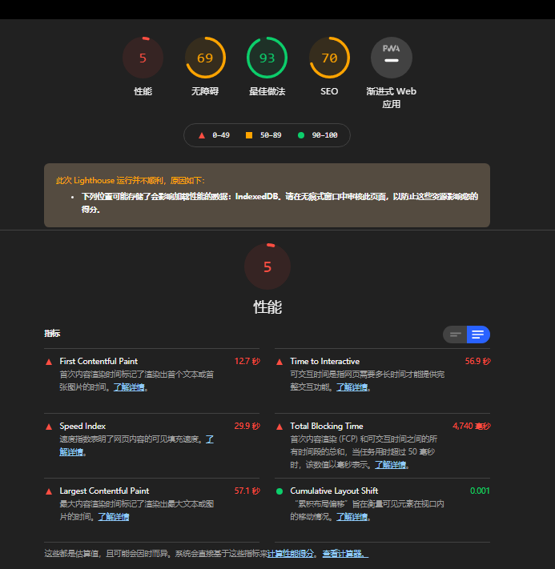

# SpreadJS

initSpreadJs 到页面展示出来期间

- defineReactive$$1: 3.51s ~ 4.12s

- initReportData: 15.7s

  - initSheetData: 3s
    
     - setArray: .3s 
    
     - batchSetFomular(0.12s) + readOnlyFormSheetOfStyle: 这个组合执行 n多次
    
  - setDefaultForSheet: 12s
    
- readOnlyFormSheetOfStyle: 执行了多次？ 大概8次  0.2s - 2.4s 