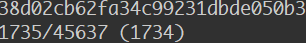

# 公共模块管理

## git subtree

使用 Git Subtree 来维护的子项目代码，对于父项目来说是透明的，所有的开发人员看到的就是一个普通的目录，原来怎么做现在依旧那么做，只需要维护这个 Subtree 的人在合适的时候去做同步代码的操作。

### 使用

1. 在项目中添加 subtree 

`git subtree add --prefix=<S项目的相对路径> <S项目git地址> <分支> --squash`

如：

`git subtree add --prefix=subtree http://*******/front_end/hll-pos-subtree.git master`

:::tips
解释：--squash 意思是把 subtree 的改动合并成一次commit，这样就不用拉取子项目完整的历史记录。--prefix之后的=等号也可以用空格。
:::

添加时要注意以下几点（避坑）：

- 注意要保证当前仓库是没任何修改的状态，如果有的话先 `commit` 后执行上面代码，否则将执行不成功

- 远程的 subtree 创建不能是个空仓库

- 上面的路径 `--prefix=subtree` 不能写成 `--prefix=./subtree` 要不然会提示 `error: invalid path '******'`，这个太操蛋了~（本人是在公司 window 电脑上会出现这个错误）

成功后将提示 `Added dir 'subtree'

2. 对当前项目的影响（无感）

添加相同的 subtree 的项目像往常一样工作就可以了，包括也可以更改 subtree 的内容, 此时正常的 `commit` `push` 等操作也是将更新的内容提交到当前仓库，并不会影响到远程到的 subtree 仓库

3. 提交 subtree 修改到远程仓库

假如当前有对 subtree 做了修改，并且希望提交到远程, 执行以下命令：

`git subtree push --prefix=S项目的路径 S项目git地址 分支`

`git subtree push --prefix=subtree http://*******/front_end/hll-pos-subtree.git master`

执行成功后本地的修改将更新到远程

4. 更新 subtree 到本地项目

在当前项目更新最新 subtree 代码，执行以下命令：

`git subtree pull --prefix=S项目的路径 S项目git地址 分支`

`git subtree pull --prefix=subtree http://*******/front_end/hll-pos-subtree.git master --squash`

如果没加 `--squash` 可能会提示错误： `fatal: refusing to merge unrelated histories` 则添加后缀

### subtree split

在使用 subtree 时会发现一些问题：

1. 每次 `push` 的时候很慢，而且会有一个进度显示器

  
  
2. 一旦发生了冲突，即在当前项目解决并提交了，另个项目再 `pull` 时仍然会冲突，一直循环

**原因**

每次执行 subtree 的 `push` 命令的时候，subtree push实际上是遍历本工程每一次提交，把提交文件涉及到 subtree 目录的挑出来，同步到 subtree 工程。然而这造成了一些很麻烦的问题：

- 每个提交都需要重新计算，因此每次推送都需要把主仓库所有的提交计算一遍，非常耗时

- 每次 push 都是重新计算的，因此本地和远端新仓库的提交总是不一样的，关键还没有共同的父级，这导致 git 无法自动为我们解决冲突

**解决**

git subtree 提供了 `split` 命令, 当使用了 `split` 命令后，git subtree 将确保对于相同历史的分割始终是相同的提交号。意思就是当需要 `push` 的时候，git 将只计算 `split` 之后的新提交

`git subtree split --rejoin --prefix=subtree HEAD`
