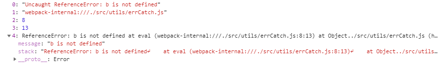
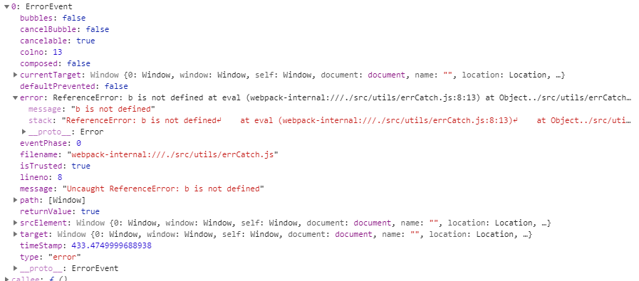
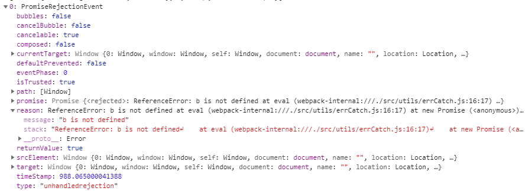

# 关于前端错误处理

今天来捋下如何捕获前端出现的异常信息，首先整理了一下前端的错误类型：

- js运行时错误

- 资源加载错误

- 未处理的promise错误

- 异步请求错误（fetch与xhr）

目前没有一个 `api` 就能把上面几种错误类型都捕获到，所以针对不同类型的错误需要使用不同的捕获方式

## js运行时错误

运行时错误例子： `let a = 1 + b`

js运行时错误可以使用 `window.onerror` 和 `window.addEventListener('error')`，看下区别

**window.onerror**

- 只能捕获到运行时错误

- 可以捕获同步代码和异步代码的异常

- 捕获不到静态资源加载异常

**window.addEventListener('error')**

- 可以捕获同步代码和异步代码的异常

- 可以捕获到运行时错误

- 可以捕获到静态资源加载异常

这么一看好像是 `window.addEventListener('error')` 更厉害一点，但是网上大多都是推荐使用 `window.onerror` 来捕获 js 运行时错误，为啥？

**因为 `window.onerror` 是标准错误捕获接口，`window.addEventListener('error')` 不那么标准，各个浏览器的实现不统一，拿到的数据也不统一**

所以才用以 `window.onerror` 为主， `window.addEventListener('error')` 为辅的监听方式

### window.onerror

回到正题，js运行时错误使用 `window.onerror = function(message, source, lineno, colno, error) { ... }`，参数表示如下：

- message：错误信息（字符串）

- source：发生错误的脚本URL（字符串）

- lineno：发生错误的行号（数字）

- colno：发生错误的列号（数字）

- error：Error对象（对象）



若该函数返回 `true`，则阻止异常继续向上抛出，否则最终控制台还是会显示 `Uncaught Error: xxxxx`

**Script error.**

当加载自不同域的脚本中发生语法错误时，为避免信息泄露，语法错误的细节将不会报告，而代之简单的"Script error."

处理方式：

- 通过在 `<script>` 使用 `crossorigin` 属性并要求服务器发送适当的 CORS HTTP 响应头
 
  ```
  // 前端添加 crossorigin
  <script src="http://another-domain.com/app.js" crossorigin="anonymous"></script>
  // 后端添加跨域 HTTP 响应头：
  Access-Control-Allow-Origin: * 或  Access-Control-Allow-Origin: http://test.com
  ```
  

- 单独处理"Script error."，告知错误详情仅能通过浏览器控制台查看，无法通过JavaScript访问

## 资源加载错误

上文咱们使用 `window.onerror` 来捕获运行时的错误，但是 `window.onerror` 是捕获不到资源加载错误的，捕获资源加载错误需要使用 `window.addEventListener('error')`

### window.addEventListener('error')

用法 `window.addEventListener('error', function(event) { ... })`， ErrorEvent 类型的 `event` 包含有关事件和错误的所有信息

ErrorEvent 包含错误发生时的信息：

- `ErrorEvent.prototype.message`: 字符串，包含了所发生错误的描述信息

- `ErrorEvent.prototype.filename`: 字符串，包含了发生错误的脚本文件的文件名

- `ErrorEvent.prototype.lineno`: 数字，包含了错误发生时所在的行号

- `ErrorEvent.prototype.colno`: 数字，包含了错误发生时所在的列号

- `ErrorEvent.prototype.error`: 发生错误时所抛出的 Error 对象



注意 `window.addEventListener('error')` 虽然可以捕捉到网络请求的异常，但是无法判断 HTTP 的状态是 404 还是其他比如 500 等等，所以还需要配合服务端日志才进行排查分析才可以

注意 `window.onerror` 捕获的错误 `window.addEventListener('error')` 也能捕获到，所以为了避免重复上报，需要添加资源错误类型的判断

```js
window.addEventListener('error', event => { 
  // 过滤js error
  let target = event.target || event.srcElement;
  let isElementTarget = target instanceof HTMLScriptElement || target instanceof HTMLLinkElement || target instanceof HTMLImageElement;
  if (!isElementTarget) return false;
  // 上报资源地址
  let url = target.src || target.href;
  console.log(url);
}, true);
```

## 未处理的promise错误处理方式

当 `promise` 被 `reject` 并且错误信息没有被处理的时候，会抛出一个 `unhandledrejection`

这个错误不会被 `window.onerror` 以及 `window.addEventListener('error')` 捕获，但是有专门的 `window.addEventListener('unhandledrejection')` 方法进行捕获处理


```js
window.addEventListener('rejectionhandled', event => {
  // reason字段包含错误的详细信息
  console.log(event.reason);
});

function pro(){
  return new Promise(resolve => {
    let a = 1 + b
  })
}
pro()
```


## 请求异常

如果使用第三方的请求库如 `axios`，包含了捕获错误的信息，可以直接使用

对于原生的请求 api 如 `fetch` 和 `xhr`，我们需要通过改写它们的原生方法，在触发错误时进行自动化的捕获和上报

**fetch:**

```js
// fetch的处理
function _errorFetchInit () {
    if(!window.fetch) return;
    let _oldFetch = window.fetch;
    window.fetch = function () {
        return _oldFetch.apply(this, arguments)
        .then(res => {
            if (!res.ok) { // 当status不为2XX的时候，上报错误
            }
            return res;
        })
        // 当fetch方法错误时上报
        .catch(error => {
            // error.message,
            // error.stack
            // 抛出错误并且上报
            throw error; 
        })
    }
}
```

**xhr:**

```js
// xhr的处理
function _errorAjaxInit () {
    let protocol = window.location.protocol;
    if (protocol === 'file:') return;
    // 处理XMLHttpRequest
    if (!window.XMLHttpRequest) {
        return;  
    }
    let xmlhttp = window.XMLHttpRequest;    
    // 保存原生send方法
    let _oldSend = xmlhttp.prototype.send;
    let _handleEvent = function (event) {
        try {
            if (event && event.currentTarget && event.currentTarget.status !== 200) {
                    // event.currentTarget 即为构建的xhr实例
                    // event.currentTarget.response
                    // event.currentTarget.responseURL || event.currentTarget.ajaxUrl
                    // event.currentTarget.status
                    // event.currentTarget.statusText
                });
            }
        } catch (e) {va
            console.log('Tool\'s error: ' + e);
        }
    }
    xmlhttp.prototype.send = function () {
        this.addEventListener('error', _handleEvent); // 失败
        this.addEventListener('load', _handleEvent);  // 完成
        this.addEventListener('abort', _handleEvent); // 取消
        return _oldSend.apply(this, arguments);
    }
}
```

## Vue 错误 

vue内部发生的错误会被Vue拦截，因此vue提供方法给我们处理vue组件内部发生的错误

```js
Vue.config.errorHandler = function (err, vm, info) {}
```

## React 异常捕获

React 16 提供了一个内置函数 `componentDidCatch`，使用它可以非常简单的获取到 react 下的错误信息

```js
componentDidCatch(error, info) {
    console.log(error, info);
}
```

## 崩溃和卡顿

卡顿也就是网页暂时响应比较慢， JS 可能无法及时执行。崩溃就更严重了，有什么办法可以监控网页的崩溃

利用 window 对象的 load 和 beforeunload 事件实现了网页崩溃的监控

```js
window.addEventListener('load', function () {
    sessionStorage.setItem('good_exit', 'pending');
    setInterval(function () {
        sessionStorage.setItem('time_before_crash', new Date().toString());
    }, 1000);
  });

  window.addEventListener('beforeunload', function () {
    sessionStorage.setItem('good_exit', 'true');
  });

  if(sessionStorage.getItem('good_exit') &&
    sessionStorage.getItem('good_exit') !== 'true') {
    /*
        insert crash logging code here
    */
    alert('Hey, welcome back from your crash, looks like you crashed on: ' + sessionStorage.getItem('time_before_crash'));
  }
```

基于以下原因，我们可以使用 Service Worker 来实现网页崩溃的监控

- Service Worker 有自己独立的工作线程，与网页区分开，网页崩溃了，Service Worker 一般情况下不会崩溃

- Service Worker 生命周期一般要比网页还要长，可以用来监控网页的状态

- 网页可以通过 navigator.serviceWorker.controller.postMessage API 向掌管自己的 SW 发送消息


## 错误上报

通过 Ajax 发送数据可能会引发跨域问题，一般情况下更推荐使用 JSONP 形式进行上报

```js
function report(error) {
  let reportUrl = 'http://jartto.wang/report';
  new Image().src = `${reportUrl}?logs=${error}`;
}
```

收集异常信息量太多，怎么办？实际中，我们不得不考虑这样一种情况：如果你的网站访问量很大，那么一个必然的错误发送的信息就有很多条，这时候，我们需要设置采集率，从而减缓服务器的压力：

```js
Reporter.send = function(data) {
  // 只采集 30%
  if(Math.random() < 0.3) {
    send(data)      // 上报错误信息
  }
}
```

> [前端开发中的Error以及异常捕获](https://juejin.im/post/5c2d60616fb9a049dc025c39)

> [一道不一样的前端架构师最终面试题](https://mp.weixin.qq.com/s/BX0kb9HgPABi9LD9Q27Bbw)

先看一段代码：

```javascript
<body>
<h1>前端错误处理</h1>
</body>
<script>
    xxxx
    window.onerror = function () {
        console.error('生成了错误')
	}
</script>
</html>

//Uncaught ReferenceError: xxxx is not defined
```

因为在捕获错误之前就报错了,所以没有捕获到错误


第二段代码：

```javascript
 window.onerror = function () {
        console.log('生成了错误')
	}
	try{
    	console.log('try')
    } catch (e) {
    	console.log('e', e)
    } finally {
    	throw new Error('抛出错误')
        console.log('finally')
    }
    
// try
// 生成了错误
// 抛出错误
```

- 先执行`try`里的代码`console.log('try')`，

- 然后执行`finally`抛出错误先被`window.onerror`捕获执行`console.log('生成了错误')`,

- 最后输出`Uncaught Error: 抛出错误`

抛出错误后，后面的代码将不会执行

第三段代码：

```javascript
window.onerror = function () {
    console.log('生成了错误')
}
 try{
      console.log('try')
      throw new Error('try里抛出错误')
  } catch (e) {
      console.log('e', e)
  } finally {
      throw new Error('抛出错误')
      console.log('finally')
  }
  console.log(1)
  // try
  // e Error: try里抛出错误
  // 生成了错误
  // 错误处理问题.html?_ijt=evigh55v5vvrmi1gq000pg8ilj:20 Uncaught Error: 抛出错误
```

- 首先执行`try`里的代码`console.log('try')`

- `try`抛出错误后被`catch`捕获，执行`console.log('e', e)`

- 最后执行`finally`中的代码抛出错误，这个错误先被`window.onerror`捕获执行` console.log('生成了错误')`

- 最后打印`抛出错误`

第四段代码：

```javascript
window.onerror = function () {
    console.log('生成了错误')
}
  try{
      console.log('try')
      throw new Error('try里抛出错误')
  } catch (e) {
	  throw new Error('catch里抛出错误')
      console.log('e', e)
  } finally {
  	  console.log('进入finally')
      throw new Error('抛出错误')
      console.log('finally')
  }
  console.log(1)
  // try
  // 进入finally
  // 生成了错误
  // Uncaught Error: 抛出错误
```

- 首先执行`try`里的代码`console.log('try')`,抛出错误`throw new Error('try里抛出错误')`

- `try`抛出的错误后被`catch`捕获，然后又抛出错误`throw new Error('catch里抛出错误')`

- 然后直接执行`finally`,输出`console.log('进入finally')`,抛出错误`throw new Error('抛出错误')`

- `finally`抛出的错误被`window.onerror`捕获执行`console.log('生成了错误')`，然后打印`//Uncaught Error: 抛出错误`

从上面再做代码可以得出几个信息：

- 无论是`try`和`catch`正常执行还是抛出错误,`finally`总会被执行

- 在try抛出的错误会被`catch`捕获，`window.onerror`捕获不到

这里有点困惑`catch`抛出的错误呢，我们再来一个例子：

```javascript
	window.onerror = function () {
		console.log('生成了错误')
	}
	try{
		console.log('try')
		throw new Error('try里抛出错误')
	} catch (e) {
		throw new Error('catch里抛出错误')
		console.log('e', e)
	} finally {
		console.log('进入finally')
		console.log('finally')
	}
	console.log(1)
	// try
	// 进入finally
	// finally
	// 生成了错误
	// Error: catch里抛出错误
```

此时catch中的错误将被抛出，这是咋回事呢，是时候回顾一下`try..catch()`的用法了

## try...catch()

`catch`子句包含`try`块中抛出异常时要执行的语句。也就是，你想让`try`语句中的内容成功， 如果没成功，你想控制接下来发生的事情，
- 这时你可以在`catch`语句中实现。 如果在`try`块中有任何一个语句（或者从`try`块中调用的函数）抛出异常，
控制立即转向`catch`子句。如果在`try`块中没有异常抛出，会跳过`catch`子句。

- `finally`子句在`try`块和`catch`块之后执行但是在下一个`try`声明之前执行。无论是否有异常抛出或捕获它总是执行。

- 你可以嵌套一个或者更多的`try`语句。如果内部的`try`语句没有`catch`子句，那么将会进入包裹它的`try`语句的`catch`子句。

我是这么理解第四段代码`catch`中的代码为什么没被抛出的：因为`try`和`catch`无论有没有成功，都会执行`finally`，执行`finally`后抛出的错误把
`catch`中的错误覆盖了，所以导致`catch`中的错误没被抛出


> [一篇文章教你如何捕获前端错误](https://cloud.tencent.com/developer/article/1460542)