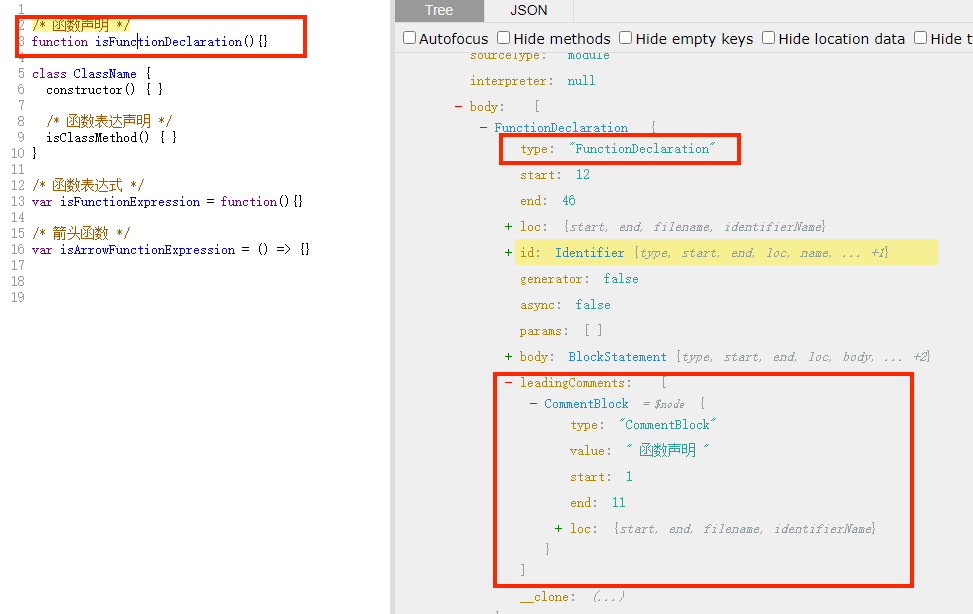
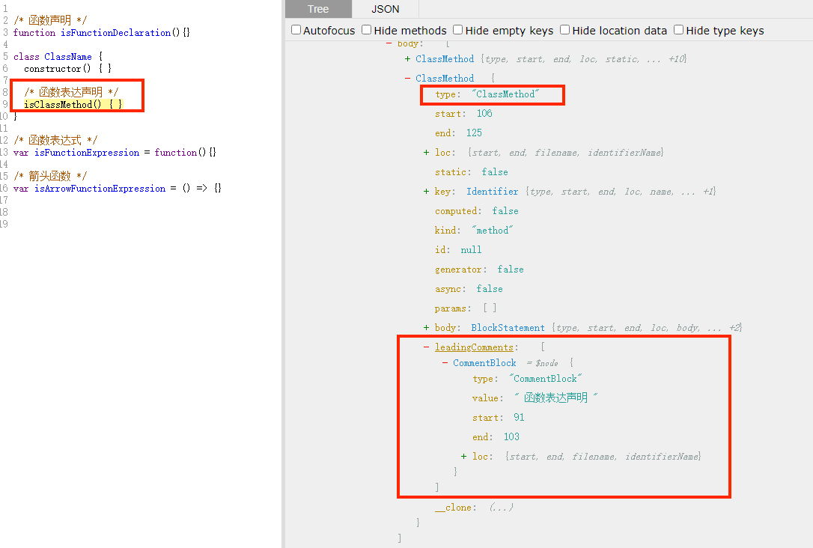
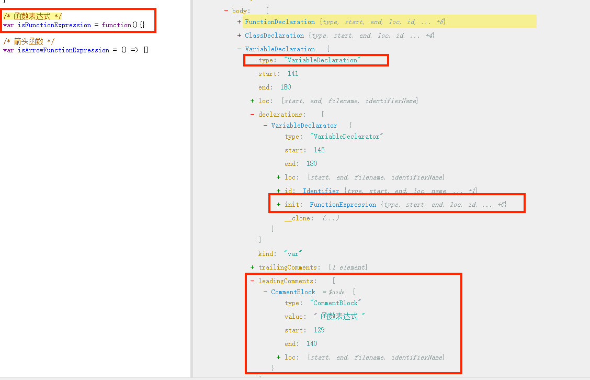
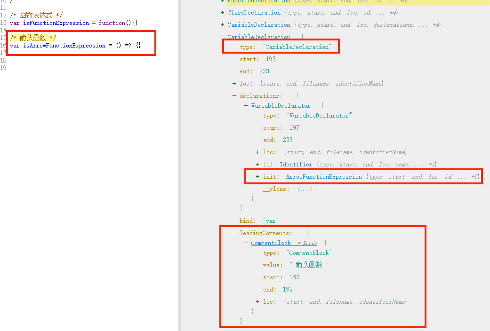

# 埋点方案

## Babel 埋点

[Babel-Loader](/Node/Webpack/Babel-Loader.md) 之前有大致的了解过，现在实现可以帮我们注册埋点方法的 Babel 插件

确定思路：

1. 根据函数块级注释判断是否需要自动埋点

2. 引入埋点函数文件

3. 函数插装：将埋点方法插入需要埋点的函数

一个Babel插件的架子:

```js
function autoTracker({types: t, template}) {
    return {
        visitor: { 
            
        }
    };
}

module.exports = autoTracker;
```

可以发现 Babel 插件其实也就是一个函数，它会将 api 通过参数的形式传回来  
它会返回一个对象，对象中有一个 `visitor` 属性，这个属性中声明的函数会在 `transform` 的过程中被调用  

既然我们需要根据函数的注释来判断是否需要自动埋点，那么首先我们得先确认，函数有哪些形式：

```js
// 函数声明
function tracker() {}

// 函数表达式
const tracker = function () {}

// 箭头函数
const tracker = () => {}

// 类方法
class Test {
    tracker() {}
}

```

它们在AST中所对应的类型：

```js
函数声明 = FunctionDeclaration

函数表达式 = FunctionExpression

箭头函数 = ArrowFunctionExpression

类方法 = ClassMethod
```

我们的插件只需处理这些类型：

```js
// 多个类型我们使用|来分隔
function autoTracker({types: t, template}) {
    return {
        visitor: { 
            'FunctionDeclaration|ArrowFunctionExpression|FunctionExpression|ClassMethod'(path, state) {
            }
        }
    };
}

module.exports = autoTracker;
```

可以看到方法中有两个参数：

- path：path 对象中维护了相邻节点的关系，可以通过 path 属性拿到父级和兄弟节点，path 属性中还提供了增删改 AST 的方法。

- state：多个AST节点间需要进行数据传递，则通过 state

### 根据函数块级注释判断是否需要自动埋点

我们通过 [astexplorer](https://astexplorer.net/) 来查看，上面四种函数注释的AST节点类型是什么：









从上面的例子可以看到块注释的 AST 类型是 `leadingComments`，而且函数类型的不同的  `leadingComments` 位置也不同

- 函数声明和类函数的 `leadingComments` 就在函数的 AST 节点下，可以使用path直接获取

- 函数表达式和箭头函数的 `leadingComments` 属性在它们的父级节点，因为他们是通过变量声明的方式赋值函数的，也就是我们的注释其实是在 `VariableDeclarator` 节点下

  因此对于 函数表达式和箭头函数 我们需要通过父级节点去查找

查找块节点的代码为：

```js
function autoTracker({template}) {
  // 思路：
  // 1.根据注释标题判断是否是需要自动埋点的函数，函数类型：函数声明，箭头函数，函数表达式，类方法
  // 2. 这一步先获取函数注释
  return {
    visitor: {
      'FunctionDeclaration|ClassMethod|ObjectMethod|ArrowFunctionExpression|FunctionExpression'(path, state) {
        const comment = path.get("leadingComments");
        if(comment.length){
          setAutoTracker(path, state, template, comment.map(item => item.node))
        } else {
          // export Fn(){}、函数表达式等
          path.findParent((parentPath) => {
            if(parentPath.node.type === 'Program' || parentPath.node.type === 'BlockStatement'){
              return false
            }
            const findComment = parentPath.node.leadingComments
            if(findComment&&findComment[0]) {
              setAutoTracker(path, state, template, findComment)
              return true;
            }else{
              return false
            }
          });
        }
      },
    }
  };
}
```
### 判断注释并引入埋点

```js
function setAutoTracker(path, state, template, commentNode = []) {
    // 遍历注释
    for(let comment of commentNode){
        // 提取注释
        const { value = '' } =  comment
       // 判断注释是否包含 autoTracker
        if(new RegExp('\\s*'+AUTOTRACKER+'\\s*').test(value)){
            // 引入埋点函数文件并获获取埋点函数名
            const trackerImportName  = trackerImportDeclaration(path, state);
            // 判断是否已经添加了埋点函数，防止重复添加
            const fistNode = path.get("body").node.body[0]
                if(!(
                    fistNode
                    && fistNode.type === 'ExpressionStatement'
                    && (
                        (fistNode.expression.callee.type === 'Identifier' && fistNode.expression.callee.name === trackerImportName)
                        || (fistNode.expression.callee.type === 'MemberExpression' && fistNode.expression.callee.object.name === trackerImportName)
                    )
                )){
                // 添加埋点函数
                path.get("body").node.body.unshift(template(`${trackerImportName}.call(this)`)());
            }
            break
        }
    }
}
```

- 遍历 commentNode，判断注释是否包含 autoTracker

- 然后判断是否已经添加了埋点函数，防止重复添加

  - `fistNode.type === 'ExpressionStatement'`: 表示首行的语句是否是函数类型（即调用函数）
  
  - `istNode.expression.callee.type === 'Identifier'`：如果是直接调用了函数类型为 `Identifier`，如 `tracker()`，此时通过 `fistNode.expression.callee.name` 获取该函数名
    
  - `fistNode.expression.callee.type === 'MemberExpression'`：如果是带有修饰符调用的函数类型为 `MemberExpression`，如 `tracker.call()`，此地通过 `fistNode.expression.callee.object.name` 获取函数名
  
- 往 body 中添加埋点方法

### 引入埋点函数文件

```js
const importModule = require('@babel/helper-module-imports');

// 引用埋点函数
function trackerImportDeclaration(path, state) {
  // state.trackerImportName 为了孩子重复添加
  if(!state.trackerImportName){
    const pathName = state.opts.pathName; // 获取埋点函数的文件路径，pathName 是配置插件时的参数
    state.trackerImportName  = importModule.addDefault(path, pathName, {
      // If 'hintedName' exists in scope, the name will be '_tracker2', '_tracker3', ...
      nameHint: path.scope.generateUid('tracker')
    }).name;
  }

  return state.trackerImportName;
}

```

- 通过 `state.opts.pathName` 拿到埋点方法所在文件的路径（ `pathName` 是我们在配置 babel 插件时需要传入的参数） 

- 通过 `@babel/helper-module-imports` 包将埋点方法引入进来，调用引入方法后会返回一个 `name`，表达导出的名称，该名称也就是我们后面需要插入埋点函数时所用到的函数名。

- 为了防止重复添加所以将获取到的埋点函数名缓存到 `state` 中

### 使用

`babel.config.js` 引入插件

```js
const path = require('path')
module.exports = {
  plugins: [
      [
        './babel-auto-tracker',
        {
          'pathName': path.resolve(__dirname, './src/utils/tracker'), // 配置埋点函数的路径
        }
      ]
  ]
}
```

添加埋点函数

```js
export default function tracker() {
    console.log('上传埋点数据：', this);
}
```

**效果**

```js
/*autoTracker*/
function select(){
  
}

// 打包后
/*autoTracker*/
function select(){
  tracker.call(this)
}
```
