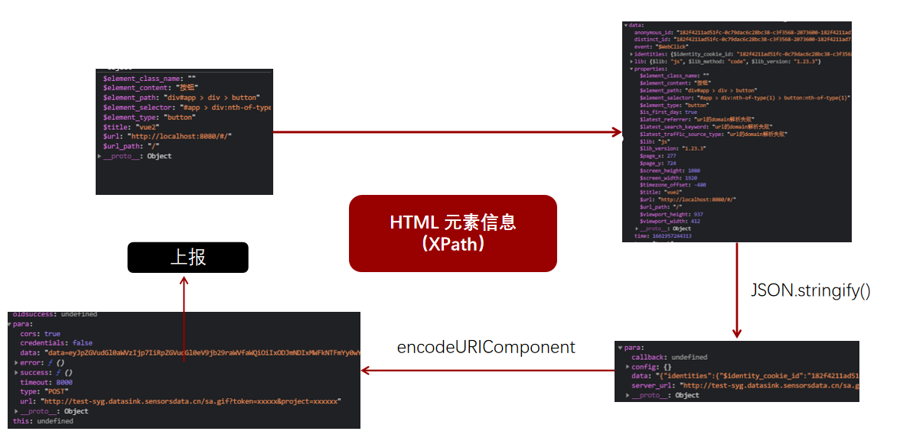
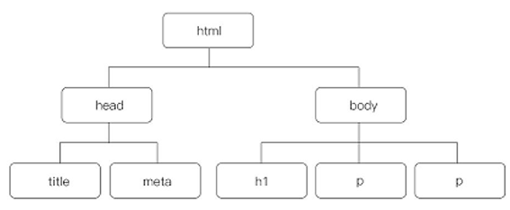
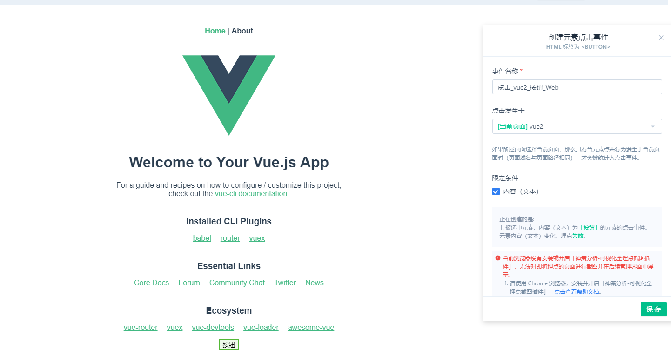

# 埋点方案

## 曝光埋点

曝光埋点一般是用来统计页面某个模块、区域能被“看到”的次数

比如：为了配合运营活动，需要在首页的中部的位置放置一个活动入口的banner图，给这次活动引流。

对于首页的产品经理来说，需要衡量流量的分发效率，因为资源有限，同样的楼层可以给到更好活动，这样可以提升每一个流量的价值；对于运营来说，需要衡量活动的对用户吸引力，有多少用户会点击进来，参与活动促成转化

### 点击率

一般点击率的计算公式如下所示：CTR=点击数/曝光数

如下图，页面滑动过程中A、B、C、D模块出现在视口内采集SDK会自动上报埋点日志：


实现关键点：

- 一般而言产品上会要求页面上某个模块一定面积连续一段时间出现在视口才是有效曝光（如30%、500ms）

- 性能，几乎所有的第三方采集平台都会在曝光埋点的说明文档里注明：“请不要配置过多的曝光埋点，这会严重影响你的页面性能”

### 实现思路

1. 使用  [Intersection Observer API](https://developer.mozilla.org/zh-CN/docs/Web/API/Intersection_Observer_API) 实例化一个全局 `observer`，将需要收集曝光埋点的元素收集到 `observer` 观察列表中， （这里会用Vue的指令来实现）

2. 如果元素曝光了，则缓存到容器队列中，如果在 500ms 内曝光消失，则视为无效曝光元素，此时将这个元素移除
   
3. 当容器队列存在元素时，执行一次定时器，每 2s 上报一次数据
   
4. 为了防止上报前页面关闭，所以需要将 Observer  里的数据也缓存到 `localStorage` 中
   
5. 下次进入页面先检查 `localStorage` 是否有值，有的话直接上报。（这一步的数据是存在丢失、不准确等情况）


**封装Exposure类**

```js
// polyfill
import 'intersection-observer';

// 可以把节流的时间调大一点，默认是100ms
// IntersectionObserver.prototype['THROTTLE_TIMEOUT'] = 300;

export default class Exposure {
    constructor(validTime = 500) {
        this.temStore = new Map()
        this.timerOut = false;
        this.validTime = validTime
        this.localStorageKey = 'exp-data'
        // 全局只会实例化一次Exposure类，init方法也只会执行一次
        this.init();
    }

    init() {
        const self = this;
        // 检查 localStorage 中是否存在数据
        this.dotFromLocalStorage();
        this._observer = new IntersectionObserver(function (entries, observer) {
            let curTime = new Date().getTime()
            entries.forEach(entry => {
                console.log(entry.isIntersecting, entry.target.getAttribute('data-des'))
                if (entry.isIntersecting) {
                    if(self.temStore.has(curTime)){
                        self.temStore.get(curTime).push(entry.target)
                    } else {
                        self.temStore.set(curTime, [entry.target])
                    }
                    if(!self.timerOut){
                        self.timerOut = true
                        window.setTimeout(function () {
                            self.timerOut = false
                            self.uploadDot();
                        }, 5000)
                    }

                } else {
                    for(let [key, value] of (self.temStore.entries())){
                        if(curTime - key < self.validTime){
                            for(let i = 0; i<value.length; i++){
                                if(value[i] === entry.target){
                                    value.splice(i, 1)
                                    break
                                }
                            }
                        } else {
                            break
                        }
                    }
                }
                self.storeIntoLocalstorage()
            })
        }, {
            root: null,
            rootMargin: "0px",
            threshold: 0.3 // 元素暴躁出来的阈值
        });

    }
    uploadDot(){
        let data = []
        let curTime = new Date().getTime()
        for(let [key, value] of (this.temStore.entries())){
            if(curTime - key >= this.validTime){
                value.forEach(item => {
                    data.push({
                        des: item.getAttribute['data-des'],
                        time: key
                    })
                })
                this.temStore.delete(key)
            }
        }
        this.fetch(data)
        this.storeIntoLocalstorage()
    }
    fetch(data){
        if(!data.length) return
        console.log('fetch', data)
        // 上传
    }
    add(entry) {
        this._observer && this._observer.observe(entry.el)
    }
    storeIntoLocalstorage() {
        let  data = []
        for(let [key, value] of (this.temStore.entries())){
            value.forEach(item => {
                data.push({
                    des: item.getAttribute['data-des'],
                    time: key
                })
            })
        }
        localStorage.setItem(this.localStorageKey, JSON.stringify(data))
    }

    dotFromLocalStorage() {
        const ctmsStr = window.localStorage.getItem(this.localStorageKey);
        if (ctmsStr) {
            this.fetch(JSON.parse(ctmsStr))
        }
        localStorage.removeItem(this.localStorageKey)
    }
}
```

**添加 Vue 指令**

```js
// 入口JS文件 main.js
// 引入Exposure类
// exp就是那个全局唯一的实例
const exp = new Exposure();

Vue.directive('exp-dot', {
    bind(el, binding, vnode) {
        exp.add({el: el, val: binding.value})
    }
})
```

> [前端曝光数据埋点——IntersectionObserver+vue指令](https://github.com/amandakelake/blog/issues/71)

> [大厂经验（一）：一套 Web 自动曝光埋点技术方案](https://www.sohu.com/a/406045702_612370)

**添加指令**

```vue
<div v-exp-dot data-des="我是谁?"></div>
```

## 页面访问埋点

页面埋点即记录页面的访问量，涉及到的指标有PV（页面浏览量或点击量）、UV（统计1天内访问某站点的用户数）、IP（是指1天内多少个独立的IP浏览了页面）

### 实现

单页面收集页面访问的思路：

- 使用 `onpopstate ` 监听 history 变化

- 监听 `onhashchange ` hash 变化

但是 history 模式下，调用  `pushState` 和 `replaceState` 是无法触发 `onpopstate`，思路需要对默认的 `pushState` 和 `replaceState` 进行改造

核心代码为：

```js
let historyPushState = window.history.pushState;
let historyReplaceState = window.history.replaceState;
// 重写 pushState
window.history.pushState = function() {
    // 执行原本的 pushState
    historyPushState.apply(window.history, arguments);
    // do something
};

// 重写 replaceState
window.history.replaceState = function() {
    // 执行原本的 replaceState
    historyReplaceState.apply(window.history, arguments);
    // do something
};
```

:::tip
对 hash 的改变也是可以直接触发 `onpopstate` 事件的
:::

**神策的实现源码**

```js
function addSinglePageEvent(callback) {
    var current_url = location.href;
    var historyPushState = window.history.pushState;
    var historyReplaceState = window.history.replaceState;

    if (isFunction(window.history.pushState)) {
        // 重写 pushState
        window.history.pushState = function() {
            // 执行原本的 pushState
            historyPushState.apply(window.history, arguments);
            // 执行回调
            callback(current_url);
            current_url = location.href;
        };
    }

    if (isFunction(window.history.replaceState)) {
        // 重写 replaceState
        window.history.replaceState = function() {
            // 执行原本的 replaceState
            historyReplaceState.apply(window.history, arguments);
            // 执行回调
            callback(current_url);
            current_url = location.href;
        };
    }

    var singlePageEvent;
    if (window.document.documentMode) {
        singlePageEvent = 'hashchange';
    } else {
        singlePageEvent = historyPushState ? 'popstate' : 'hashchange';
    }

    // 添加 hashchange/hashchange监听事件
    addEvent(window, singlePageEvent, function() {
        callback(current_url);
        current_url = location.href;
    });
}

```

### 没使用路由的项目如果处理

有的项目没有配置路由，而是直接通过组件的显示和隐藏来控制页面的切换，那么正常的埋点方式就不能用了，这个时候只能手动进行页面访问的收集。实现方式有两种

**在切换页面的函数进行一次埋点**

```js
    selected(name, moduleId, code) {
      var pageName = code + "_" + moduleId;

    /*对tab的切换进行埋点 当做是页面的跳转进行处理*/
    sensors.quick("autoTrackSinglePage",{ platForm: pageName} )
    
      var content = this.menuComponent[code];
      this.tabs.push({
        title: name,
        name: name,
        code: code,
    },
```

**缺点**

- 这种方式只适用于页面切换的方式是在一个统一的入口

- 如果先收集了埋点，然后在页面切换前就报错了，那么就会产生误报

**使用 Minxin**

```js
const minxin = {
    mounted(){
        if(this.moduleId && !this.$parent.moduleId){
            sensors.quick("autoTrackSinglePage",{ platForm: pageName} ) 
        }
    }
}
```

使用 `Minxin` 的关键点是在于如果区分当前组件是页面级别的组件还是普通的组件


## 代码埋点

代码埋点又称为自定义埋点。具体含义是：在 SDK 初始化之后，对于每一个关注的事件，调用 `track()` 等相关接口，将采集的数据保存到发送队列中，然后按照一定的发送策略将数据发送到指定的服务端。例如：某个 `li` 元素被点击，如果想采集这个 `li` 元素的点击事件，就需要在 `li` 元素的 `click` 事件代码中采集数据

### 优缺点

代码埋点有很多优点：

1. 精准控制埋点位置
   
2. 灵活的自定义事件和属性，方便采集丰富的业务相关数据
   
3. 可以满足精细化的分析需求
   
代码埋点也有相应的缺点：

1. 埋点代价比较大，每一个控件的埋点都需要添加相应的代码，不仅工作量大，而且需要技术人员参与。
   
2. 更新的代价比较大，每一次更新埋点方案，都必须修改代码
   
3. 对代码的侵入太强，严重污染代码
  
3. 所有前端埋点方案都会面临的数据传输时效性和可靠性的问题，这个问题只能通过在后端采集数据来解决了。
   
**因此，可以知道代码埋点适用于需要精准控制埋点位置、灵活的自定义事件和属性等精细化需求的场景**

## 无痕埋点

**无痕埋点 = 无埋点 = 全埋点 = 无代码埋点**

神策的全埋点说明：Web JS SDK 全埋点包括三种事件：Web 页面浏览、Web 元素点击、Web 视区停留  
所以无埋点不是只用于解决元素事件埋点，之所以放在这里只是强调  全埋点方案也是实现元素点击埋点的方案之一

所以无代码不是真的没有代码，而是SDK 集成一些埋点方法足以收集大部分场景下埋点信息，缩减了我们手工埋点的工作

比如前面我们说的 页面埋点方案，它的实现跟业务完全没什么相系，就是一个通用的解决方案，所以 SDK 集成这个方案后，我们项目就不需要额外实现页面埋点的收集了，所以就无埋点了

### 收集元素



上图是神策开启全埋点配置后，看了下点击元素时的处理过程，可以发现收集数据就是 元素相关的信息. 比如标签名，属性，以及元素在整个 DOM 树的中位置等，也就是收集的东西完成是基于 **DOM 元素**

那么问题来了，收集到 元素如何与用户的点击行为建立关系？ 此时就需要给元素建议唯一标识，通过这个唯一标识建立关系。 **这个唯一标识就是 XPath**

```
HTML元素 <- 唯一标识 -> 点击行为
```

### XPath



DOM 其实是个树形结构，XPath 根元素开始到当前元素的路径集合，同一个页面下，这个路径基本上是唯一的，所以通过这个集合来做一个元素标识

```
XPath：/html/body/div/div/div/ul[1]/li[3]/a
```

有了身份标识之后，之后如果想要知道某个元素的点击量，那么可以根据这个元素的 XPath 从收集的数据中进行过滤和筛选，然后得到埋点结果

**获取 XPath**

1. event.composedPath

2. 遍历 parentNode 生成一个 XPath

### DOM 收集

直接收集页面所有的点击元素，实现思路则是给 `document` 统一注册一个点击事件，收集所有元素点击事件

```js

document.addEventListener('click', function() { }, true);


```

关键代码在于设置事件的传播方式  `useCapture: true`（捕获方式），防止点击事件被内部元素冒泡阻止

无痕埋点功能的实现思路就介绍完了

:::tip
所以可以发现无痕埋点的实现关键不在如果收集元素，而后期的数据清理、筛选才是无痕埋点的关键步骤
:::

### 优缺点

**优点：**

1. 自动采集数据，无需开发人员代码埋点
   
2. 收集用户的所有端上行为，很全面
   
3. 可以回溯，也就是后期运营空想想到哪一处的点击量，也是可以拿到的，不用重新收集
   
**缺点：**

1. 不可见行为数据无法采集
   
2. 和业务强相关的属性信息采集困难
   
3. 数据量可能会很大，占用存储空间，所以一般来说会做下收集限制
   
4. 依赖 DOM 结构，所以并不是很可靠
   
**因此，可以知道全埋点适用于以较小的埋点代价采集尽可能多的用户行为数据的场景**

## 可视化全埋点

可视化全埋点为埋点工作提供了一个可视化的操作工具和界面，让埋点变得更加显而易见和易于操作，只需要简单的选择关注的按钮，并设置相应的采集属性，即可完成埋点工作



这是神策可视化埋点界面，其实就是在埋点平台，加载我们要设置埋点的项目，然后点击元素的时候通过 埋点平台，对当前元素进行基本设置，然后保存到后台

可视化埋点其实就是对无痕埋点的一种优化， 前面说到无痕埋点需要后期通过 XPath 对数据进行清洗和过滤，可视化圈选其实就是通过圈选功能给元素设置埋点，也包含了XPath，这样结合无痕埋点，就可以过滤出圈选的数据了

所以可视化埋点的这块主要看下圈选这部分的功能实现

1. 埋点管理页使用 iframe 加载需要埋点的页面

2. 加载的页面包含 SDK的功能 ，所以埋管理页会和页面建立通信规则，使用 postMessage

3. 当子页面在接收到 圈选 的消息时，在 dom 中插入一段 style 标签，用于圈选时添加选中样式

4. 点击元素时添加高亮样式同时将当前 dom 的 xpath 等元素信息发送给父页面并存储

5. 结合无痕埋点数据拿这些 xpath 去清洗、过滤就能拿到我们想要的数据了

**优缺点**

可视化埋点和无痕埋点其实挺像，优缺点也是大同小异

优点：

1. 自动采集数据，无需开发人员代码埋点
   
2. 可以做到按需配置，不会像全埋点那样产生大量的无用数据

3. 后期数据分析成本低
   
4. 运营人员自己就可以进行埋点设置

缺点

1. 不可见行为数据无法采集
   
2. 和业务强相关的属性信息采集困难
   
3. 也是依赖 DOM 结构，如果页面结构发生变化的时候，可能就需要进行部分重新配置

### Babel 埋点

[Babel-Loader](/Node/Webpack/Babel-Loader.md) 之前有大致的了解过，现在实现可以帮我们注册埋点方法的 Babel 插件

确定思路：

1. 根据函数块级注释判断是否需要自动埋点

2. 引入埋点函数文件

3. 函数插装：将埋点方法插入需要埋点的函数

一个Babel插件的架子:

```js
function autoTracker({types: t, template}) {
    return {
        visitor: { 
            
        }
    };
}

module.exports = autoTracker;
```

可以发现 Babel 插件其实也就是一个函数，它会将 api 通过参数的形式传回来  
它会返回一个对象，对象中有一个 `visitor` 属性，这个属性中声明的函数会在 `transform` 的过程中被调用  

既然我们需要根据函数的注释来判断是否需要自动埋点，那么首先我们得先确认，函数有哪些形式：

```js
// 函数声明
function tracker() {}

// 函数表达式
const tracker = function () {}

// 箭头函数
const tracker = () => {}

// 类方法
class Test {
    tracker() {}
}

```

它们在AST中所对应的类型：

```js
函数声明 = FunctionDeclaration

函数表达式 = FunctionExpression

箭头函数 = ArrowFunctionExpression

类方法 = ClassMethod
```

我们的插件只需处理这些类型：

```js
// 多个类型我们使用|来分隔
function autoTracker({types: t, template}) {
    return {
        visitor: { 
            'FunctionDeclaration|ArrowFunctionExpression|FunctionExpression|ClassMethod'(path, state) {
            }
        }
    };
}

module.exports = autoTracker;
```

可以看到方法中有两个参数：

- path：path 对象中维护了相邻节点的关系，可以通过 path 属性拿到父级和兄弟节点，path 属性中还提供了增删改 AST 的方法。

- state：多个AST节点间需要进行数据传递，则通过 state

### 根据函数块级注释判断是否需要自动埋点

我们通过 [astexplorer](https://astexplorer.net/) 来查看，上面四种函数注释的AST节点类型是什么：


从上面的例子可以看到块注释的 AST 类型是 `leadingComments`，而且函数类型的不同的  `leadingComments` 位置也不同

- 函数声明和类函数的 `leadingComments` 就在函数的 AST 节点下，可以使用path直接获取

- 函数表达式和箭头函数的 `leadingComments` 属性在它们的父级节点，因为他们是通过变量声明的方式赋值函数的，也就是我们的注释其实是在 `VariableDeclarator` 节点下

  因此对于 函数表达式和箭头函数 我们需要通过父级节点去查找

查找块节点的代码为：

```js
function autoTracker({template}) {
  // 思路：
  // 1.根据注释标题判断是否是需要自动埋点的函数，函数类型：函数声明，箭头函数，函数表达式，类方法
  // 2. 这一步先获取函数注释
  return {
    visitor: {
      'FunctionDeclaration|ClassMethod|ObjectMethod|ArrowFunctionExpression|FunctionExpression'(path, state) {
        const comment = path.get("leadingComments");
        if(comment.length){
          setAutoTracker(path, state, template, comment.map(item => item.node))
        } else {
          // export Fn(){}、函数表达式等
          path.findParent((parentPath) => {
            if(parentPath.node.type === 'Program' || parentPath.node.type === 'BlockStatement'){
              return false
            }
            const findComment = parentPath.node.leadingComments
            if(findComment&&findComment[0]) {
              setAutoTracker(path, state, template, findComment)
              return true;
            }else{
              return false
            }
          });
        }
      },
    }
  };
}
```
### 判断注释并引入埋点

```js
function setAutoTracker(path, state, template, commentNode = []) {
    // 遍历注释
    for(let comment of commentNode){
        // 提取注释
        const { value = '' } =  comment
       // 判断注释是否包含 autoTracker
        if(new RegExp('\\s*'+AUTOTRACKER+'\\s*').test(value)){
            // 引入埋点函数文件并获获取埋点函数名
            const trackerImportName  = trackerImportDeclaration(path, state);
            // 判断是否已经添加了埋点函数，防止重复添加
            const fistNode = path.get("body").node.body[0]
                if(!(
                    fistNode
                    && fistNode.type === 'ExpressionStatement'
                    && (
                        (fistNode.expression.callee.type === 'Identifier' && fistNode.expression.callee.name === trackerImportName)
                        || (fistNode.expression.callee.type === 'MemberExpression' && fistNode.expression.callee.object.name === trackerImportName)
                    )
                )){
                // 添加埋点函数
                path.get("body").node.body.unshift(template(`${trackerImportName}.call(this)`)());
            }
            break
        }
    }
}
```

- 遍历 commentNode，判断注释是否包含 autoTracker

- 然后判断是否已经添加了埋点函数，防止重复添加

  - `fistNode.type === 'ExpressionStatement'`: 表示首行的语句是否是函数类型（即调用函数）
  
  - `istNode.expression.callee.type === 'Identifier'`：如果是直接调用了函数类型为 `Identifier`，如 `tracker()`，此时通过 `fistNode.expression.callee.name` 获取该函数名
    
  - `fistNode.expression.callee.type === 'MemberExpression'`：如果是带有修饰符调用的函数类型为 `MemberExpression`，如 `tracker.call()`，此地通过 `fistNode.expression.callee.object.name` 获取函数名
  
- 往 body 中添加埋点方法

### 引入埋点函数文件

```js
const importModule = require('@babel/helper-module-imports');

// 引用埋点函数
function trackerImportDeclaration(path, state) {
  // state.trackerImportName 为了防止重复添加
  if(!state.trackerImportName){
    const pathName = state.opts.pathName; // 获取埋点函数的文件路径，pathName 是配置插件时的参数
    state.trackerImportName  = importModule.addDefault(path, pathName, {
      // If 'hintedName' exists in scope, the name will be '_tracker2', '_tracker3', ...
      nameHint: path.scope.generateUid('tracker')
    }).name;
  }

  return state.trackerImportName;
}

```

- 通过 `state.opts.pathName` 拿到埋点方法所在文件的路径（ `pathName` 是我们在配置 babel 插件时需要传入的参数） 

- 通过 `@babel/helper-module-imports` 包将埋点方法引入进来，调用引入方法后会返回一个 `name`，表达导出的名称，该名称也就是我们后面需要插入埋点函数时所用到的函数名。

- 为了防止重复添加所以将获取到的埋点函数名缓存到 `state` 中

### 使用

`babel.config.js` 引入插件

```js
const path = require('path')
module.exports = {
  plugins: [
      [
        './babel-auto-tracker',
        {
          'pathName': path.resolve(__dirname, './src/utils/tracker'), // 配置埋点函数的路径
        }
      ]
  ]
}
```

添加埋点函数

```js
export default function tracker() {
    console.log('上传埋点数据：', this);
}
```

**效果**

```js
/*autoTracker*/
function select(){
  
}

// 打包后
/*autoTracker*/
function select(){
  tracker.call(this)
}
```

[Babel 插件手册](https://github.com/jamiebuilds/babel-handbook/blob/master/translations/zh-Hans/plugin-handbook.md#toc-check-if-an-identifier-is-referenced)

[手撸一个babel自动埋点插件](https://juejin.cn/post/7026994278664503304#heading-0)

[babel-plugin-code-inject](https://www.npmjs.com/package/babel-plugin-code-inject/v/1.3.0)

### 完整代码

```js
const importModule = require('@babel/helper-module-imports');

const AUTOTRACKER = 'autoTracker';

// 引用埋点函数
function trackerImportDeclaration(path, state) {
    if(!state.trackerImportName){
        const pathName = state.opts.pathName; // 获取埋点函数的文件路径，pathName 是配置插件时的参数
        state.trackerImportName  = importModule.addDefault(path, pathName, {
            // If 'hintedName' exists in scope, the name will be '_tracker2', '_tracker3', ...
            nameHint: path.scope.generateUid('tracker')
        }).name;
    }

    return state.trackerImportName;
}


function setAutoTracker(path, state, template, commentNode = []) {
    for(let comment of commentNode){
        // 提取注释
        const { value = '' } =  comment
        if(new RegExp('\\s*'+AUTOTRACKER+'\\s*').test(value)){
            // 引入埋点函数
            const trackerImportName  = trackerImportDeclaration(path, state);

            // 函数插装：将埋点函数插入
            const fistNode = path.get("body").node.body[0]
                if(!(
                    fistNode
                    && fistNode.type === 'ExpressionStatement'
                    && (
                        (fistNode.expression.callee.type === 'Identifier' && fistNode.expression.callee.name === trackerImportName)
                        || (fistNode.expression.callee.type === 'MemberExpression' && fistNode.expression.callee.object.name === trackerImportName)
                    )
                )){
                path.get("body").node.body.unshift(template(`${trackerImportName}.call(this)`)());
            }
            break
        }
    }
}


function autoTracker({template}) {
    // 思路：
    // 1.根据注释标题判断是否是需要自动埋点的函数，函数类型：函数声明，箭头函数，函数表达式，类方法
    // 2.引入埋点函数文件
    return {
        visitor: {
            'FunctionDeclaration|ClassMethod|ObjectMethod|ArrowFunctionExpression|FunctionExpression'(path, state) {
                const comment = path.get("leadingComments");
                if(comment.length){
                    setAutoTracker(path, state, template, comment.map(item => item.node))
                } else {
                    path.findParent((parentPath) => {
                        if(parentPath.node.type === 'Program' || parentPath.node.type === 'BlockStatement'){
                            return false
                        }
                        const findComment = parentPath.node.leadingComments
                        if(findComment&&findComment[0]) {
                            setAutoTracker(path, state, template, findComment)
                            return true;
                        }else{
                            return false
                        }
                    });
                }
            },
        }
    };
}

module.exports = autoTracker;

```

## 数据缓存

大部分 Web JS 数据采集使用的是即时采集、即时发送的策略，没有使用本地缓存。这样减少了复杂的缓存、读取和发送的控制流程。但是，无法避免的是当网络情况不佳时，数据发送失败的问题。数据一旦发送失败，由于没有缓存的逻辑，就会造成数据丢失。  

另外，一个常见的场景是：关闭页面时，有发送数据的需求。例如：点击了某个按钮，跳转到另外一个页面。此时，由于发送数据的同时切换页面引起浏览器环境的破坏和中断，导致发送数据的请求有未发送出去的风险，从而导致了数据的丢失。  

基于以上原因，SDK 增加了缓存模式。数据产生后，首先缓存在浏览器的 `localStorage` 中。对于存储的数据可以配置发送策略：默认是每 6 秒发送一次数据，或者当存储数据达到 6 条时发送一次数据。如果数据发送不成功，会默认重新发送。直到发送成功后，才会从 `localStorage` 中移除。这样，可以有效的降低一些数据发送过程中的丢失问题。  

不过，由于 `localStorage` 的存储空间有限制，默认只能存储 200 条数据，超过的数据会按照默认的即时 img 请求发送数据。由于浏览器本身不具有固定设备内存可以使用，`localStorage` 也有存储数据的限制，所以无法大规模缓存数据，只能限定缓存部分数据

**数据存储的形式不止一种，为什么 SDK 选择 localStorage ？**

- cookie：因为存储的数据量不能超过 4K，数据量较小，且 cookie 会被带在 http header 中
  
- sessionStorage：只可以存储 session 内的数据
  
- IndexedDB：NoSQL 数据库，本地可以存储 250M 以上的数据。数据量很大，但是性能一般，在 500 ms 内，且操作相对麻烦
  
- localStorage：可以理解为是一个文件存储，可以大约存储 5M 的数据，不同浏览器实现不一致，这个数据量比较合适
  
综合考虑后，针对用户行为这样的数据，localStorage 相对合适。同步的 API 可以确保数据的一致，同时性能好，频繁写入几乎感觉不到延时。

## 数据发送

### 发送的方式

常见的数据发送方式有 img 发送、ajax 发送和 beacon 发送，下面对这几种发送方式进行简要的介绍

**img 发送**

默认使用 img 发送数据。对于跨域的兼容比较好，发送的形式就是创建一个 `img` 元素，`src` 带上所有要发送的数据。执行过程无阻塞，不会影响用户体验，而且相对与 XMLHttpRequest 对象发送 GET 请求，性能上更好。局限性是 `get` 请求所携带的数据大小是有限的

**ajax 发送**

常见的一种请求方式，为了不影响业务流程，默认是异步发送数据。采用的是 post 形式发送数据，数据较为安全，且发送数据的大小基本不受限制

**beacon 发送**

当关闭页面发送数据的时候，经常受到页面容器 destroy 的影响，会导致数据来不及发送，进而产生丢失的问题。beacon 是浏览器的新发送策略，可以避免页面容器 destroy 时数据发送丢失的问题。不过，目前该功能还未普及

:::tip
批量发送是采用 ajax post 异步形式发送数据的。批量发送，是建立在上面提到的缓存数据的基础上。SDK 默认是选择立即发送的 img 方式
:::

当通过配置项，将发送修改为批量发送模式时，会将数据先进行 localstorage 缓存，然后一次性将多条数据整合到一起，通过一个请求发送到指定的服务端。由于数据体相对来说比较大，默认使用的是 ajax post 异步发送的方式

|       场景       |     img     |    Ajax     | sendBeacon |
| :---            |     :---:   |      ---:   |      ---:   |
| https 下使用请求  |    部分支持   |   不支持     |   不支持    |
|        跨域      |    完全支持   |  部分支持    |     支持    |
|  关闭页面发送数据  |     效果差    |  效果很差    |     效果好  |
|window.onload 问题|   部分支持    |      支持    |     支持    |
|      请求方式     |   仅 GET     |      多     |     仅POST  |
|   浏览器兼容性     |   完成支持    |   基本支持   |   小部分支持  |
|   Cookie 携带    |   同域名携带   |     可配置   |   同域名携带  |

### 发送的顺序

SDK 采集的是网页端的数据，用户的行为数据通过网络请求发送到指定的服务端。但是，网络请求是有波动的。如果是先后连在一起触发的数据，可能会出现先发后到的情况。  
比如：点击按钮跳转页面，会先发送的一个点击事件，紧接着跳入新页面，会发送一个页面浏览事件。事实上，经常会出现用户的行为序列中点击事件和页面浏览事件颠倒的问题。  
直观来看，用户行为会非常不合理：先触发了后一个页面的页面浏览事件，接下来的行为却是前一个页面的某个按钮的点击事件

那如何解决这个问题呢？答案是构建发送队列。发送队列有两个优点：

1. 为了不影响用户的业务流程，SDK 一般采用的是异步加载的方式插入页面。因此，会有一些页面一打开就需要触发的事件，在触发时 SDK 还未正常引入核心源码并完成初始化。此时，SDK 就会将触发的事件存入发送队列中。等待 SDK 源码加载完毕并初始化成功后，立即执行发送队列。这样保证了数据不会丢失，解决了异步加载 SDK 的问题

2. 保证用户行为数据按照正确的顺序入库，形成正确的行为序列。这是如何做到的呢？SDK 在发送队列中的数据时，默认会按照顺序发送，当前一条数据返回发送成功的状态后，依次发送下一条数据，这保证了大部分正常流程的数据发送正确。但是，万一前面的数据发送卡住了，一直没有状态返回怎么办？SDK 的解决方案是设置超时时间：

  - queue_timeout: 队列发送超时时间，默认值 300 毫秒，如果数据发送时间超过 queue_timeout 还未返回结果，会强制发送下一条数据

  - datasend_timeout: 数据发送超时时间，默认值 3000 毫秒，如果数据发送超过 datasend_timeout 还未返回结果，会强制取消该请求

  **构建发送队列可以解决 Web 端行为数据发送顺序错乱的问题**

[神策分析 Web JS SDK 功能介绍](https://juejin.cn/post/6844904152095522824#heading-1)

[神策技术社区](https://juejin.cn/user/2893570337413384/posts)