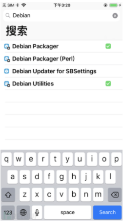
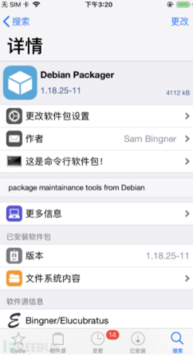
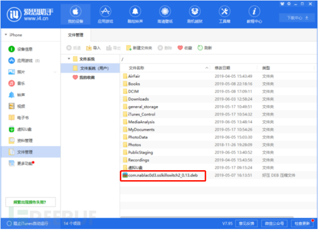
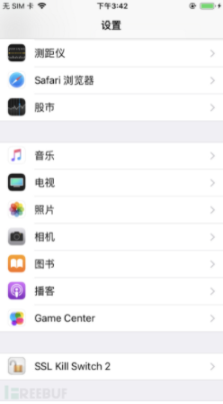
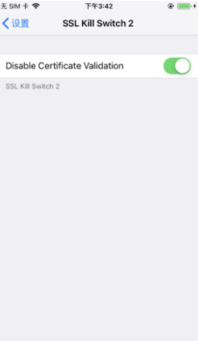

# 开发与调试总结

## H5应用添加控制台

`charles` 抓到手机访问的 `html` 页面，添加插件

```js
<script src="https://cdn.jsdelivr.net/npm/eruda@1.10.3/eruda.min.js"></script><script>
 eruda.init()
</script>
```

或

```js
<script src="//cdn.jsdelivr.net/npm/eruda"></script>
<script>
eruda.init();
</script>
```


## charles激活

1. `Help => Register` 输入：

  - Registered Name: `https://zhile.io`
  - License Key: `48891cf209c6d32bf4`

2. [Charles 在线破解工具](https://www.zzzmode.com/mytools/charles/)

## 抓包突破Pinning

:::warning
亲测失败~ , 先记录一下
:::

使用 Charles 可以抓到大部分的 HTTP/HTTPS 的请求，但有的 APP 应用使用 `SSL Pinning` 进行了双向认证，所以使用  Charles 抓不到这些请求

解决方案：以 IOS 为例，给手机安装 ssl-kill-switch2

ssl-kill-switch2 使用了Cydia Substrate的钩子技术，这个钩子Hook了IOS的验证证书函数，使得他们接受任何证书。下载地址 [SSL Kill Switch 2](https://github.com/nabla-c0d3/ssl-kill-switch2/releases)

### 安装方法

**1.手机越狱**

手机越狱后，界面会添加一个叫 Cydia 的APP

**2. 通过 Cydia 安装三个软件 `Debian Packager`、 `Cydia Substrate`、 `PreferenceLoader`**

以安装 `Debian Packager` 为例：

- 打开cydia应用，选择“搜索”，输入“Debian Packager”插件



- 然后进入详情，选择“安装”，按提示安装完成



`Cydia Substrate`、 `PreferenceLoader` 安装方法同理

:::tip
安装了 Cydia 后出现过一次搜索不到应用的情况，应该是没成功连接到 Cydia 服务器，我是因为手机已经设置网络代理导致的，关掉就行了
::: 

**3. 安装 ssl-kill-switch2**

- 首先将 `ssl-kill-switch2` 下载下来后，通过爱思助手将文件导入到手机文件系统中

   

- SSH 连接手机

   通过 SSH 命令进入手机，**这一步的前提是 Cydia 安装了 openSSH**，如果没有的话，还是上面的方法进行安装

   连接命令 `root@192.168.2.2`，这个IP地址是手机 IP地址，通过 `设置` -> `网络` -> `wifi的侧的感叹号查看`

   之后会提示需要密码，默认密码为： `alpine`

   然后就是进入手机终端了

- 安装

   进入到刚上传 ssl-kill-switch2 目录位置

   ```
   cd /User/Media

   ls  
   ```

   执行安装命令 `dpkg -i com.nablac0d3.SSLKillSwitch2_0.11.deb`，执行后 Cydia 中能看这个 ssl-kill-switch2 软件，同时进入手机设置也能看到 ssl-kill-switch2 选项

   

**4. 打开 ssl-kill-switch2**

按网上的说法，点击 `ssl-kill-switch2` ， 勾选 `Disable Certificate Validation` 选项就能成功抓包了，但是自己试却没效果~



- [移动端检测常见问题](https://www.freebuf.com/column/207103.html)

- [ssh连接iPhone](https://www.jianshu.com/p/f834e06e99c0)


## Chrome 在打包后的文件中查找源文件

**通过路径查找**

如果知道要调试的文件名和路径，点击控制台的 `source`，再按下 `ctrl+p` ，在出现的搜索框中输入文件名或者路径

**通过内容查找**

控制台显示显示 `console` 标题的左侧有个 `三个点的符号`，点击它，出现的选项中选择 `search`

## 直接使用import

所需条件

- Chrome

- 使用 `<script type="module">`

  ```javascript
  <script type="module">
      import { test } from './test/test1.js'
      test()
  </script>
  ```

- 必须在服务器环境下才运行页面

  全局安装模块 `http-server`: `npm install http-server -g`

**启动**

`http-server -c-1`（只输入 `http-server` 的话，更新了代码后，页面不会同步更新）

## redux-devtools

> [使用redux-devtools工具](https://www.cnblogs.com/zhuzhenwei918/p/7249357.html)

1.  在谷歌应用商店下载 `redux-devtools`

2. `npm install  redux-devtools-extension --save-dev`

3. 在使用的store的地方引入 `composeWithDevTools`

  ```js
  import { createStore, compose, applyMiddleware } from 'redux'
  import thunkmiddleware from 'redux-thunk'
  import { composeWithDevTools } from 'redux-devtools-extension'
  import reducer from './reducers/index'
  const devTools = require('remote-redux-devtools').default
  let store
  if (process.env.NODE_ENV === 'development') {
    store = createStore(
      reducer,
      compose(
        applyMiddleware(thunkmiddleware),
        composeWithDevTools(),
      )
    )
  } else {
    store = createStore(reducer, applyMiddleware(thunkmiddleware))
  }
  export default store
  ```

## Babel

Babel 官网提供了[在线转换的工具](https://www.babeljs.cn/repl)，方便查看 ES6 到 ES5 的转换结果